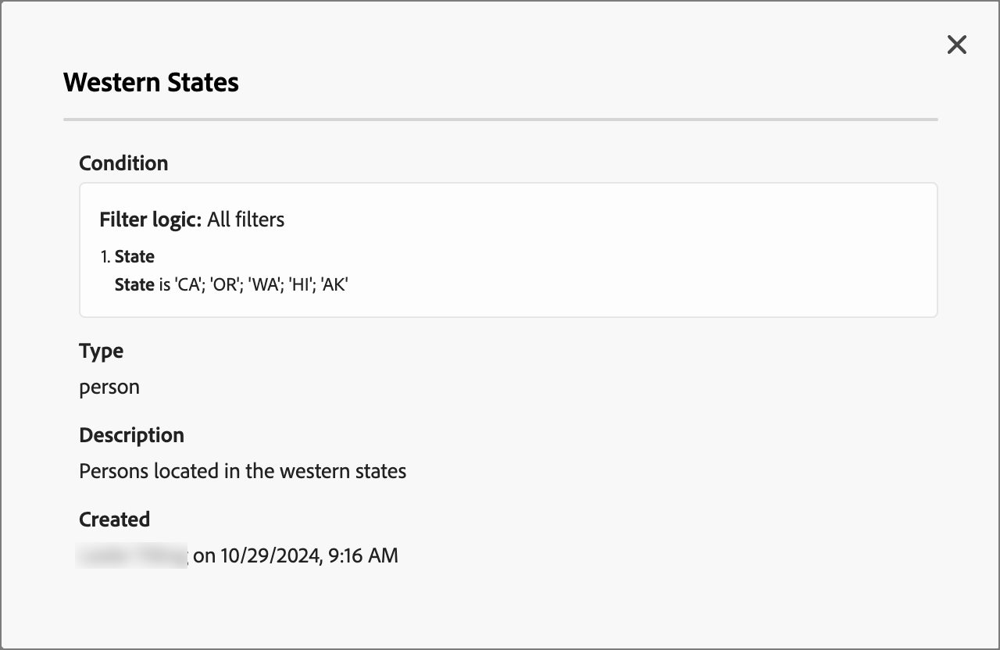

# Contenu conditionnel

Le contenu conditionnel permet d&#39;adapter le contenu d&#39;un email selon des règles conditionnelles. Ces règles sont définies à l’aide d’attributs de profil ou d’événements contextuels. Vous pouvez créer des règles conditionnelles dans le créateur de règles et les stocker pour réutilisation dans les parcours de votre compte.

Pour ajouter du contenu conditionnel à vos emails, Adobe Journey Optimizer vous permet d’appliquer des règles conditionnelles stockées dans la bibliothèque _Conditions_ . Appliquez des règles conditionnelles dans le concepteur d&#39;email lorsque vous [créez un email dans un parcours de compte](./email-authoring.md).

## Ajouter du contenu conditionnel aux e-mails {#email-content}

>[!CONTEXTUALHELP]
>id="ajo-b2b_conditional_content"
>title="Contenu conditionnel"
>abstract="Utilisez des règles conditionnelles pour créer plusieurs variantes d’un composant de contenu. Si aucune des conditions n’est remplie lors de l’envoi du message, le contenu de la variante par défaut s’affiche."

>[!CONTEXTUALHELP]
>id="ajo-b2b_conditional_rule_select"
>title="Contenu conditionnel"
>abstract="Utilisez une règle conditionnelle enregistrée dans la bibliothèque ou créez-en une."

Lorsque vous créez un email pour votre parcours de compte dans le concepteur d’email, utilisez des règles conditionnelles pour définir plusieurs variantes d’un composant de contenu.

1. Sélectionnez un composant de contenu et cliquez sur l’icône **[!UICONTROL Activer le contenu conditionnel]** dans la barre d’outils du composant.

   Le composant est indiqué en orange pour indiquer qu’il est activé en tant que composant conditionnel. Le volet **[!UICONTROL Contenu conditionnel]** s’affiche à gauche avec la _Variante par défaut_ et _Variant - 1.

   {width="700" zoomable="yes"}

   Le contenu d’origine que vous avez sélectionné et activé est le contenu par défaut et s’applique lorsqu’aucune des règles conditionnelles n’est satisfaite pour les variantes que vous définissez.

   Dans ce volet, vous pouvez définir plusieurs variantes pour le composant de contenu sélectionné à l’aide de règles conditionnelles.

1. Passez la souris sur la première variante (_Variante - 1_) et cliquez sur l’icône _Sélectionner la condition_ (  ).

   {width="700" zoomable="yes"}

   La boîte de dialogue _[!UICONTROL Sélectionner une condition]_ s’ouvre et affiche la bibliothèque des conditions.

   Si vous souhaitez afficher les détails d’une condition pour vous assurer qu’elle est ce que vous souhaitez, cliquez sur l’icône _Plus de menu_ (**...**) et sélectionnez **[!UICONTROL Afficher les informations]**.

   {width="600" zoomable="yes"}

   Si la condition dont vous avez besoin n’existe pas, [créez une règle conditionnelle](#create-a-conditional-rule) en cliquant sur **[!UICONTROL Créer]**.

1. Sélectionnez la règle conditionnelle et cliquez sur **[!UICONTROL Sélectionner]** pour l&#39;associer à la variante.

   Vous pouvez vérifier la condition associée en cliquant sur l’icône _Plus de menu_ (**...**) pour la variante et en choisissant **[!UICONTROL Condition d’affichage]**.

   {width="600" zoomable="yes"}

   Cliquez sur X en haut à droite pour fermer la fenêtre contextuelle.

   {width="500"}

1. Pour une meilleure lisibilité, renommez la variante en cliquant sur l’icône _Plus de menu_ (**...**) pour la variante et sélectionnez **[!UICONTROL Renommer]**.

   Saisissez un nom significatif pour la variante qui vous aide à identifier la variante et son intention.

   {width="600" zoomable="yes"}

1. Lorsque la variante est sélectionnée dans le volet de gauche, modifiez le composant afin de modifier son aspect dans le message électronique lorsque la condition est vraie.

   Dans cet exemple, la variante du composant de texte utilise une description différente en fonction de la région du destinataire.

   {width="600" zoomable="yes"}

1. Si nécessaire, définissez une autre variante en cliquant sur **[!UICONTROL Ajouter une variante]**.

   Répétez les étapes 2 à 5 pour sélectionner une condition, renommer la variante et modifier le composant de la variante.

   Vous pouvez ajouter autant de variantes que nécessaire pour le composant de contenu. Modifiez à tout moment la variante sélectionnée dans le volet de gauche pour vérifier l’affichage du composant de contenu pour la condition.

   >[!IMPORTANT]
   >
   >Le contenu conditionnel est évalué par rapport aux règles associées dans l’ordre dans lequel les variantes sont répertoriées. La première variante avec une condition qui s’avère vraie est utilisée pour le composant.
   >
   >Si aucune des conditions de variante définies n&#39;est évaluée comme vraie lors de l&#39;envoi de l&#39;email, le composant de contenu s&#39;affiche selon la **[!UICONTROL Variante par défaut]**.

1. Pour supprimer une variante, cliquez sur l&#39;icône _Plus de menu_ (**...**) correspondant à la variante et choisissez **[!UICONTROL Supprimer]**.

   Cliquez sur **[!UICONTROL Supprimer]** dans la boîte de dialogue de confirmation.

## Règles conditionnelles

Les règles conditionnelles sont un ensemble d’expressions conditionnelles qui peuvent être évaluées comme vraies ou fausses. Vous pouvez utiliser ces règles pour déterminer la variante de contenu à afficher dans un email selon différents critères, tels que les attributs de profil ou les événements contextuels.

Les règles conditionnelles sont stockées dans la bibliothèque de conditions, où elles peuvent être réutilisées dans le contenu parcours de votre organisation.
<!-- 

>[!NOTE]
>
>You need the [Manage Library Items](../administration/ootb-product-profiles.md) permission to save or delete conditional rules. Saved conditions are available for use by all users within an organization. -->

### Créer une règle conditionnelle {#create-condition}

>[!CONTEXTUALHELP]
>id="ajo-b2b_conditions_rule_editor"
>title="Créer une condition"
>abstract="Combinez des attributs et des événements contextuels pour créer des règles qui déterminent la variante de contenu à afficher dans les e-mails."

Vous pouvez accéder au créateur de règles conditionnelles à partir du concepteur d’email lorsque vous sélectionnez une condition pour une variante de composant.

1. Dans la boîte de dialogue _[!UICONTROL Select condition]_, cliquez sur **[!UICONTROL Create new]** et sélectionnez le type de condition :

   * **[!UICONTROL Condition de personne]** - Choisissez ce type pour créer la règle conditionnelle à l’aide des attributs de personne et des événements contextuels.
   * **[!UICONTROL Condition du compte]** - Choisissez ce type pour créer la règle conditionnelle à l’aide d’attributs de compte.

   {width="600" zoomable="yes"}

1. Créez la règle conditionnelle en fonction de vos besoins.

   Pour chaque attribut ou événement à inclure dans la règle, faites glisser l’élément sur le canevas de règle. Développez le filtre et complétez l’expression.

   {width="600" zoomable="yes"}

   Si vous incluez plusieurs filtres, définissez la **[!UICONTROL logique de filtre]** :

   * **[!UICONTROL Appliquer tous les filtres]** - La règle est évaluée comme true si **tous** les filtres sont vrais.
   * **[!UICONTROL Appliquer tous les filtres]** - La règle est évaluée comme true si **any** des filtres est vrai.

1. À droite, saisissez le **[!UICONTROL Nom]** et une **[!UICONTROL Description]** (facultatif) pour la règle.

   Utilisez un nom significatif et une description utile pour aider les autres membres de votre organisation à le réutiliser au lieu de créer une autre condition en double.

   {width="600" zoomable="yes"}

1. Une fois la règle conditionnelle terminée, cliquez sur **[!UICONTROL Enregistrer]**.

   La règle conditionnelle est enregistrée dans la bibliothèque et vous pouvez la sélectionner pour la variante actuelle. Elle est également incluse dans la bibliothèque pour être utilisée par toute autre variante de contenu dynamique sur plusieurs parcours de compte.

### Dupliquer une règle

Les règles conditionnelles enregistrées dans la bibliothèque ne peuvent pas être modifiées. Vous pouvez toutefois dupliquer une règle existante et la modifier pour en créer une nouvelle.

1. Cliquez sur l&#39;icône _Plus de menu_ (**...**) pour la variante et sélectionnez **[!UICONTROL Dupliquer]**.

   Un doublon de la règle s’ouvre dans le créateur de règles. Utilisez le doublon comme point de départ pour la règle que vous souhaitez créer.

   {width="600" zoomable="yes"}

1. Dans le créateur de règles, modifiez, ajoutez ou supprimez des conditions en fonction de vos besoins.

1. Modifiez le nom et la description pour qu’ils correspondent à l’objectif ou aux éléments de la règle.

1. Une fois la règle conditionnelle terminée, cliquez sur **[!UICONTROL Enregistrer]**.
