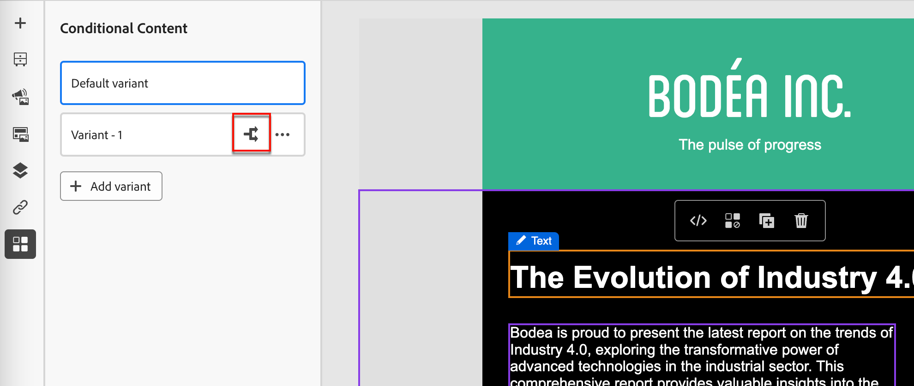
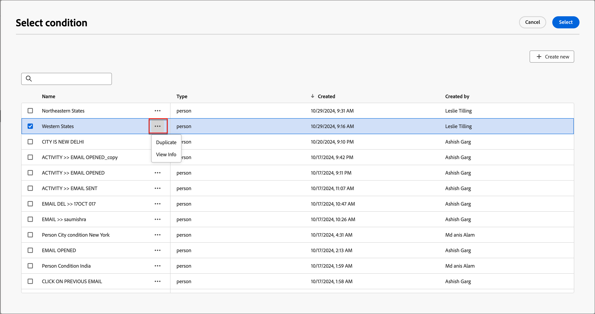

# Contenu conditionnel

Le contenu conditionnel vous permet d’adapter le contenu de l’e-mail et du fragment en fonction de règles conditionnelles. Ces règles sont définies à l’aide d’attributs de profil ou d’événements contextuels. Vous pouvez créer des règles conditionnelles dans le créateur de règles et les stocker pour les réutiliser dans vos parcours de compte.

Pour ajouter du contenu conditionnel à vos fragments et messages e-mail, Adobe Journey Optimizer vous permet d’appliquer des règles conditionnelles stockées dans la bibliothèque _Conditions_. Appliquez des règles conditionnelles dans l’espace de conception visuelle lorsque vous créez [du contenu d’e-mail pour un parcours de compte](./email-authoring.md) ou un [fragment visuel](./fragment-authoring.md).

## Ajouter du contenu conditionnel {#email-fragment-content}

>[!CONTEXTUALHELP]
>id="ajo-b2b_conditional_content"
>title="Contenu conditionnel"
>abstract="Utilisez des règles conditionnelles pour créer plusieurs variantes d’un composant de contenu. Si aucune des conditions n’est remplie lors de l’envoi du message, le contenu de la variante par défaut s’affiche."

>[!CONTEXTUALHELP]
>id="ajo-b2b_conditional_rule_select"
>title="Contenu conditionnel"
>abstract="Utilisez une règle conditionnelle enregistrée dans la bibliothèque ou créez-en une."

Lorsque vous créez un fragment ou un e-mail dans l’espace de conception visuelle, utilisez des règles conditionnelles pour définir plusieurs variantes pour un composant de contenu.

1. Sélectionnez un composant de contenu et cliquez sur l’icône **[!UICONTROL Activer le contenu conditionnel]** dans la barre d’outils du composant.

   Le composant est indiqué en orange pour indiquer qu’il est activé en tant que composant conditionnel. Le volet **[!UICONTROL Contenu conditionnel]** s’affiche à gauche avec la _Variante par défaut_ et la _Variante - 1_.

   {width="700" zoomable="yes"}

   Le contenu d’origine que vous avez sélectionné et activé est le contenu par défaut et s’applique lorsqu’aucune des règles conditionnelles n’est remplie pour les variantes que vous définissez.

   Dans ce volet, vous pouvez définir plusieurs variantes pour le composant de contenu sélectionné à l’aide de règles conditionnelles.

1. Passez la souris sur la première variante (_Variante - 1_) et cliquez sur l’icône _Sélectionner la condition_ (  ).

   {width="700" zoomable="yes"}

   La boîte de dialogue _[!UICONTROL Sélectionner une condition]_ s’ouvre et affiche la bibliothèque de conditions.

   Si vous souhaitez afficher les détails d&#39;une condition pour vous assurer qu&#39;elle correspond à vos besoins, cliquez sur l&#39;icône _Plus de menu_ (**...**) et choisissez **[!UICONTROL Afficher les informations]**.

   {width="600" zoomable="yes"}

   Si la condition dont vous avez besoin n’existe pas, [créez une règle conditionnelle](#create-condition) en cliquant sur **[!UICONTROL Créer]**.

1. Sélectionnez la règle conditionnelle et cliquez sur **[!UICONTROL Sélectionner]** pour l’associer à la variante.

   Vous pouvez consulter la condition associée en cliquant sur l’icône _Plus_ (**...**) de la variante et en choisissant **[!UICONTROL Afficher la condition]**.

   {width="600" zoomable="yes"}

   Cliquez sur X en haut à droite pour fermer la fenêtre contextuelle.

   {width="500"}

1. Pour une meilleure lisibilité, renommez la variante en cliquant sur l’icône _Plus de menu_ (**...**) de la variante et en choisissant **[!UICONTROL Renommer]**.

   Saisissez un nom significatif pour la variante qui vous aide à identifier la variante et son intention.

   {width="600" zoomable="yes"}

1. Avec la variante sélectionnée dans le volet de gauche, modifiez le composant pour modifier la manière dont il apparaît dans l’e-mail lorsque la condition est remplie.

   Dans cet exemple, la variante du composant de texte utilise une description différente en fonction de la région du destinataire.

   {width="600" zoomable="yes"}

1. Si nécessaire, définissez une autre variante en cliquant sur **[!UICONTROL Ajouter une variante]**.

   Répétez les étapes 2 à 5 pour sélectionner une condition, renommer la variante et modifier le composant pour la variante.

   Vous pouvez ajouter autant de variantes que nécessaire pour le composant de contenu. Modifiez à tout moment la variante sélectionnée dans le volet de gauche pour vérifier comment le composant de contenu s’affiche pour la condition.

   >[!IMPORTANT]
   >
   >Le contenu conditionnel est évalué par rapport aux règles associées dans l’ordre dans lequel les variantes sont répertoriées. La première variante avec une condition qui est évaluée comme vraie est utilisée pour le composant.
   >
   >Si aucune des conditions de variante définies n’est vraie lors de l’envoi de l’e-mail, le composant de contenu s’affiche selon la **[!UICONTROL Variante par défaut]**.

1. Pour supprimer une variante, cliquez sur l’icône _Plus_ (**...**) de la variante et choisissez **[!UICONTROL Supprimer]**.

   Cliquez sur **[!UICONTROL Supprimer]** dans la boîte de dialogue de confirmation.

## Règles conditionnelles

Les règles conditionnelles sont un ensemble d’expressions conditionnelles qui peuvent être évaluées comme « true » ou « false ». Vous pouvez utiliser ces règles pour déterminer la variante de contenu à afficher dans un e-mail en fonction de divers filtres, tels que des attributs de profil ou des événements contextuels.
Les règles sont stockées dans la bibliothèque de conditions, où elles peuvent être réutilisées dans les e-mails et les fragments de contenu pour votre organisation.
<!--
>[!NOTE]
>
>You need the [Manage Library Items](../administration/ootb-product-profiles.md) permission to save or delete conditional rules. Saved conditions are available for use by all users within an organization.-->

### Filtres de statut {#condition-filters}

| Type de condition | Filtres | Description |
| -------------- | ------- | ----------- |
| **Compte** | Attributs du compte | Attributs du profil de compte, notamment : <li>Chiffre d’affaires annuel</li><li>Ville</li><li>Pays</li><li>Nombre d’employés</li><li>Secteur industriel</li><li>Nom</li><li>Code SIC</li><li>État</li> |
| | [!UICONTROL Filtres spéciaux] > [!UICONTROL A un groupe d&#39;achat] | Le compte a ou n&#39;a pas de membres de groupes d&#39;achat. Le filtre peut également être évalué par rapport à un ou plusieurs des critères suivants : <li>Intérêt de la solution</li><li>Statut du groupe d&#39;achat</li><li>Score d&#39;exhaustivité</li><li>Score d’engagement</li> |
| **Personne** | [!UICONTROL Historique des activités] > [!UICONTROL E-mail] | Activités e-mail associées au parcours : <li>[!UICONTROL Lien cliqué dans l’e-mail]</li><li>E-mail ouvert</li><li>A reçu l’e-mail</li><li>A reçu un e-mail</li> Ces conditions sont évaluées à l’aide d’un e-mail sélectionné plus tôt dans le parcours. |
|  | [!UICONTROL Attributs de personne] | Attributs du profil de la personne, notamment : <li>Ville</li><li>Pays</li><li>Date de naissance</li><li>Adresse e-mail</li><li>E-mail non valide</li><li>E-mail interrompu</li><li>Prénom</li><li>Région déduite</li><li>Titre du traitement</li><li>Nom</li><li>Numéro téléphone mobile</li><li>Numéro de téléphone</li><li>Code postal</li><li>État</li><li>Désabonné ou désabonnée</li><li>Raison désabonnement</li> |
| | [!UICONTROL Filtres spéciaux] > [!UICONTROL Membre du groupe d&#39;achat] | La personne est ou n&#39;est pas un membre du groupe d&#39;achats évalué par rapport à un ou plusieurs des critères suivants : <li>Intérêt de la solution</li><li>Statut du groupe d&#39;achat</li><li>Score d&#39;exhaustivité</li><li>Score d’engagement</li><li>Est Supprimé</li><li>Rôle</li> |

### Créer une règle conditionnelle {#create-condition}

>[!CONTEXTUALHELP]
>id="ajo-b2b_conditions_rule_editor"
>title="Créer une condition"
>abstract="Combinez des attributs et des événements contextuels pour créer des règles qui déterminent la variante de contenu à afficher dans les e-mails."

Vous pouvez accéder au créateur de règles conditionnelles à partir de l’espace de conception des e-mails lorsque vous sélectionnez une condition pour une variante de composant.

1. Dans la boîte de dialogue _[!UICONTROL Sélectionner une condition]_, cliquez sur **[!UICONTROL Créer]** et choisissez le type de condition :

   * **[!UICONTROL Condition de personne]** - Choisissez ce type pour créer la règle conditionnelle à l’aide d’attributs de personne et d’événements contextuels.
   * **[!UICONTROL Condition de compte]** - Choisissez ce type pour créer la règle conditionnelle à l’aide d’attributs de compte.

   {width="600" zoomable="yes"}

1. Créez la règle conditionnelle en fonction de vos besoins.

   Pour chaque attribut ou événement que vous souhaitez inclure dans la règle, faites glisser l’élément et déposez-le sur la zone de travail de la règle. Développez le filtre et terminez l’expression.

   {width="600" zoomable="yes"}

   Si vous incluez plusieurs filtres, définissez la **[!UICONTROL logique des filtres]** :

   * **[!UICONTROL Appliquer tous les filtres]** - La règle est évaluée comme vraie si **tous** les filtres sont vrais.
   * **[!UICONTROL Appliquer n’importe quel filtre]** - La règle est évaluée comme vraie si **l’un** des filtres est vrai.

1. À droite, saisissez le **[!UICONTROL Nom]** et un **[!UICONTROL Description]** (facultatif) pour la règle.

   Utilisez un nom significatif et une description utile pour aider les autres membres de votre organisation à le réutiliser au lieu de créer une autre condition en double.

   {width="600" zoomable="yes"}

1. Une fois votre règle conditionnelle terminée, cliquez sur **[!UICONTROL Enregistrer]**.

   La règle conditionnelle est enregistrée dans la bibliothèque et vous pouvez la sélectionner pour la variante actuelle. Elle est également incluse dans la bibliothèque pour être utilisée par toute autre variante de contenu dynamique sur les parcours de compte.

### Dupliquer une règle

Les règles conditionnelles enregistrées dans la bibliothèque ne peuvent pas être modifiées. Cependant, vous pouvez dupliquer une règle existante et la modifier pour créer une nouvelle règle.

1. Cliquez sur l’icône _Plus de menu_ (**...**) de la variante et choisissez **[!UICONTROL Dupliquer]**.

   Un doublon de la règle s’ouvre dans le créateur de règles. Utilisez le doublon comme point de départ pour la règle que vous souhaitez créer.

   {width="600" zoomable="yes"}

1. Dans le créateur de règles, modifiez, ajoutez ou supprimez des conditions en fonction de vos besoins.

1. Modifiez le nom et la description pour qu’ils correspondent à l’objectif ou aux éléments de la règle.

1. Une fois votre règle conditionnelle terminée, cliquez sur **[!UICONTROL Enregistrer]**.
