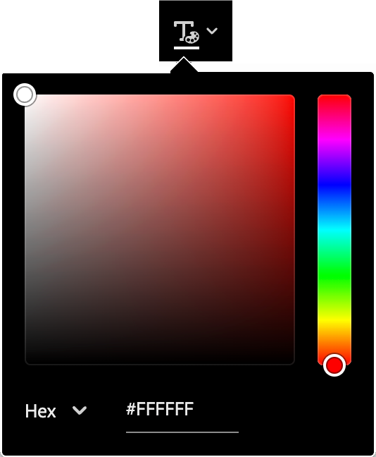
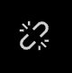
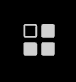
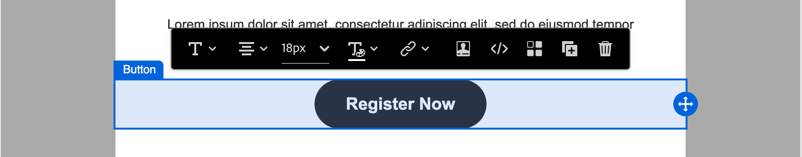
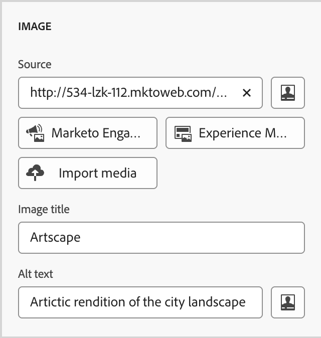

# Composants de contenu {#content-components}

>[!CONTEXTUALHELP]
>id="ajo-b2b_content_components_email"
>title="À propos des composants de contenu"
>abstract="Les composants de contenu sont des espaces réservés de contenu vides que vous pouvez utiliser pour concevoir un e-mail."

>[!CONTEXTUALHELP]
>id="ajo-b2b_content_components_landing_page"
>title="À propos des composants de contenu"
>abstract="Les composants de contenu sont des espaces réservés de contenu vides que vous pouvez utiliser pour concevoir une page de destination."

>[!CONTEXTUALHELP]
>id="ajo-b2b_content_components_fragment"
>title="À propos des composants de contenu"
>abstract="Les composants de contenu sont des espaces réservés de contenu vides que vous pouvez utiliser pour concevoir un fragment."

>[!CONTEXTUALHELP]
>id="ajo-b2b_content_components_template"
>title="À propos des composants de contenu"
>abstract="Les composants de contenu sont des espaces réservés de contenu vides que vous pouvez utiliser pour concevoir un modèle."

Lorsque vous concevez du contenu pour des e-mails, des pages de destination, des modèles et des fragments visuels, utilisez les [!UICONTROL composants de contenu] pour ajouter des éléments de conception visuelle. Vous pouvez ajouter autant de composants de contenu que nécessaire dans un ou plusieurs composants de structure, ce qui permet de définir la disposition.

## Bibliothèque de contenus

La section **[!UICONTROL Contenu]** située au bas de la bibliothèque de composants affiche les composants de contenu disponibles :

| Icône | Composant | Description |
| --------- | ---- | ----------- |
|  | [Conteneur](#container) | Ajoutez ce composant à votre conception afin d’inclure un conteneur rectangulaire que vous pouvez utiliser pour regrouper les composants ou appliquer un style d’arrière-plan ou de bordure à une zone. |
|  | [Bouton](#button) | Ajoutez ce composant à votre conception pour inclure un élément bouton cliquable. |
|  | [Texte](#text) | Ajoutez ce composant à votre conception pour inclure un corps de texte. |
|  | [Diviseur](#divider) | Ajoutez ce composant à votre conception afin d’inclure une ligne horizontale pour séparer les zones de votre contenu. |
|  | [HTML](#html) | Ajoutez ce composant à votre conception pour copier-coller les différentes parties de votre HTML existante. Utilisez ce composant pour créer un bloc HTML modulaire libre afin de réutiliser du contenu externe. |
|  | [Image](#image) | Ajoutez ce composant à votre conception pour insérer un fichier image. |
|  | [Social](#social) | Ajoutez ce composant à votre conception pour insérer des liens vers des pages de réseaux sociaux. |
|  | [Form](#form) (Formulaire) | **_Disponible uniquement pour les pages de destination._** Ajoutez ce composant à votre conception pour insérer un formulaire créé. |

## Barres d’outils des composants de contenu

Chaque type de composant de contenu affiche une barre d’outils lorsque vous le sélectionnez dans la zone de travail. Les outils disponibles, qui varient selon le type de composant, permettent d’utiliser facilement le composant directement dans le contenu rendu. Elle comprend des fonctionnalités de formatage et fonctionnelles qui s’appliquent au type de composant.

{width="450"}

### Outils de formatage

+++Modifier le style de texte

<table>
    <tr>
        <th style="width: 30%;">Outil</th>
        <th style="width: 50%;">Utilisation</th>
        <th style="width: 20%;">Composants</th>
    </tr>
    <tr>
        <td></td>
        <td>Appliquez le gras, l’italique, le soulignement, le trait barré, l’exposant ou l’indice à la chaîne de texte sélectionnée.</td>
        <td><li>Bouton <li>Texte</td>
    </tr>
</table>

+++

+++Alignement horizontal

<table>
    <tr>
        <th style="width: 30%;">Outil</th>
        <th style="width: 50%;">Utilisation</th>
        <th style="width: 20%;">Composants</th>
    </tr>
    <tr>
        <td></td>
        <td>Appliquez un type d’alignement horizontal au contenu du composant. Choisissez gauche, centré, droite ou justifié. </td>
        <td><li>Bouton <li>Texte</td>
    </tr>
</table>

+++

+++Créer une liste

<table>
    <tr>
        <th style="width: 30%;">Outil</th>
        <th style="width: 50%;">Utilisation</th>
        <th style="width: 20%;">Composants</th>
    </tr>
    <tr>
        <td></td>
        <td>Appliquez une mise en forme de liste ordonnée ou non au texte du composant.</td>
        <td><li>Texte</td>
    </tr>
</table>

+++

+++Définir le titre

<table>
    <tr>
        <th style="width: 20%;">Outil</th>
        <th style="width: 60%;">Utilisation</th>
        <th style="width: 20%;">Composants</th>
    </tr>
    <tr>
        <td></td>
        <td>Appliquez une mise en forme au niveau du titre au paragraphe pour l'emplacement du curseur.</td>
        <td><li>Bouton <li>Texte</td>
    </tr>
</table>

+++

+++Taille de la police

<table>
    <tr>
        <th style="width: 20%;">Outil</th>
        <th style="width: 60%;">Utilisation</th>
        <th style="width: 20%;">Composants</th>
    </tr>
    <tr>
        <td></td>
        <td>Appliquer la taille de police à un texte sélectionné. Cliquez sur l’outil et choisissez la taille ou saisissez la valeur px.</td>
        <td><li>Bouton <li>Texte</td>
    </tr>
</table>

+++

+++Couleur de police

<table>
    <tr>
        <th style="width: 40%;">Outil</th>
        <th style="width: 40%;">Utilisation</th>
        <th style="width: 20%;">Composants</th>
    </tr>
    <tr>
        <td></td>
        <td>Appliquer une couleur de police au texte sélectionné. Sélectionnez une couleur dans le sélecteur et utilisez le curseur de couleur et le champ de couleur pour sélectionner la couleur. Vous pouvez également saisir une valeur RGB, HSL, HSB ou hexadécimale connue. </td>
        <td><li>Bouton <li>Texte</td>
    </tr>
</table>

+++

+++Insérer un lien

<table>
    <tr>
        <th style="width: 40%;">Outil</th>
        <th style="width: 40%;">Utilisation</th>
        <th style="width: 20%;">Composants</th>
    </tr>
    <tr>
        <td></td>
        <td>Créez un lien cliquable (URL externe ou page de destination) pour le texte ou l’élément sélectionné.</td>
        <td><li>Bouton <li>Texte <li>Image </td>
    </tr>
</table>

+++

+++Supprimer le lien

<table>
    <tr>
        <th style="width: 15%;">Outil</th>
        <th style="width: 60%;">Utilisation</th>
        <th style="width: 25%;">Composants</th>
    </tr>
    <tr>
        <td></td>
        <td> Supprimez le lien cliquable (URL externe ou page de destination) du texte ou de l’élément sélectionné.</td>
        <td><li>Bouton <li>Texte <li>Image </td>
    </tr>
</table>

+++

### Outils fonctionnels

| Outil | Nom | Utilisation |
| ---- | ---- | ----- |
| {width="40"} | Ajouter une personnalisation | Utilisez l’éditeur de personnalisation pour insérer des jetons de personnalisation dans le contenu du composant. [En savoir plus](./email-authoring.md#personalize-content) |
| {width="40"} | Afficher le code source | Affichez le code source HTML du composant dans une fenêtre contextuelle en lecture seule.  {width="200"} |
| {width="40"} | Activer le contenu conditionnel | (E-mails et fragments) Activez les variantes conditionnelles pour le composant. [En savoir plus](./conditional-content.md) |
| {width="40"} | Dupliquer | Créez une copie du composant et ajoutez-la directement sous . |
| {width="40"} | Supprimer | Supprimez le composant . |

## Ajouter un composant de contenu à votre conception

1. Dans l’espace de conception visuelle, utilisez un modèle existant ou ajoutez les composants de structure nécessaires dans une zone de travail vide pour définir la disposition.

1. Dans la bibliothèque **[!UICONTROL Composants]**, saisissez la _Poignée de glisser_  pour le composant de contenu de votre choix, puis faites-la glisser et déposez-la sur les composants de structure.

   Vous pouvez ajouter plusieurs composants dans un seul composant de structure et dans chaque colonne d’un composant de structure.

   {width="600" zoomable="yes"}

1. Ajustez l’affichage du composant à l’aide des onglets **[!UICONTROL Paramètres]** et **[!UICONTROL Style]** à droite, ou de la barre d’outils contextuelle affichée dans la zone de travail.

   Par exemple, vous pouvez modifier le style de texte, la marge intérieure ou la marge du composant.

   {width="600" zoomable="yes"}

Lorsque vous travaillez sur votre conception, vous pouvez également [supprimer](#remove-a-content-component) ou [dupliquer](#duplicate-a-content-component) un composant.

## Paramètres et styles des composants de contenu

Après avoir ajouté un composant, il est sélectionné dans l’espace de conception visuelle et ses propriétés s’affichent dans le panneau de droite. Vous pouvez également sélectionner un composant à tout moment pour modifier les paramètres et les styles. De nombreux paramètres et styles sont spécifiques au composant, mais vous pouvez appliquer certains paramètres et styles standard aux composants de contenu sélectionnés.

### Options d’affichage

Si vous souhaitez exclure le composant de l’affichage du bureau ou de l’appareil mobile, modifiez le paramètre **[!UICONTROL Options d’affichage]**. La valeur par défaut, _[!UICONTROL Afficher sur tous les appareils]_, active l’affichage sur tous les appareils. Choisissez un autre paramètre pour rendre le composant exclusif par type d’appareil :

* _[!UICONTROL Afficher uniquement sur les appareils de bureau]_ - Sélectionnez ce paramètre lorsque vous souhaitez afficher le composant sur les appareils de bureau et l’exclure pour les appareils mobiles.
* _[!UICONTROL Afficher uniquement sur les appareils mobiles]_ - Sélectionnez ce paramètre lorsque vous souhaitez afficher le composant sur les appareils mobiles, tels que les téléphones et les tablettes, et l’exclure pour les ordinateurs de bureau.

{width="400" zoomable="yes"}

### Conteneur

Utilisez un conteneur pour appliquer un style spécifique à un groupe de composants de contenu. Ajoutez un composant [!UICONTROL Conteneur], puis ajoutez d’autres composants de contenu à l’intérieur. Ce composant est similaire à la manière dont vous pouvez utiliser un élément `div` dans HTML. Vous pouvez appliquer au conteneur un style distinct qui diffère du style appliqué aux composants de contenu qu’il contient.

Par exemple, ajoutez un composant _[!UICONTROL Conteneur]_, puis ajoutez un composant _[!UICONTROL Bouton]_ à l’intérieur de ce conteneur. Vous pouvez utiliser un style de zone spécifique pour le conteneur et appliquer un style au bouton et à son arrière-plan selon vos besoins.

{width="600" zoomable="yes"}

+++Contexte

{{styles-background}}

+++

+++Bord

{{styles-border}}

+++

+++Taille

{{styles-size}}

+++

+++Marge

{{styles-margin}}

+++

+++Remplissage

{{styles-padding}}

+++

### Bouton

Utilisez le composant [!UICONTROL Button] pour insérer un ou plusieurs boutons cliquables dans votre contenu. Utilisez des boutons pour rediriger les visiteurs de pages ou les destinataires d’e-mails vers le contenu complémentaire (page de destination publiée ou lien externe).

#### Ajouter le texte du bouton

Lorsque le composant Bouton s’affiche dans la zone de travail, la barre d’outils comprend des options de mise en forme de texte, ainsi que des options de personnalisation et des variantes conditionnelles. Pour plus d&#39;informations sur les options de la barre d&#39;outils de l&#39;éditeur, voir #.

Lorsque vous saisissez le texte du libellé du bouton et définissez la mise en forme, le bouton se redimensionne pour s’adapter au contenu.

{width="500" zoomable="yes"}

#### Définir les options de lien

Dans l’onglet _[!UICONTROL Paramètres]_, utilisez les options **[!UICONTROL Lien]** pour définir le texte du bouton, la destination du lien et le comportement du navigateur pour charger la page cible.

1. Définissez le **[!UICONTROL Type]** pour le lien :

   * **[!UICONTROL Lien externe]** - Choisissez ce type pour utiliser une URL standard comme destination du lien.

     Dans **[!UICONTROL Url]**, saisissez l’URL de destination du lien. Cliquez sur l’icône _Personnaliser_ (  ) pour utiliser un jeton de personnalisation en tant que paramètre dans l’URL.

     {width="200"}

   * **Page de destination** - Choisissez ce type pour sélectionner une page de destination publiée dans <!-- Journey Optimizer B2B Edition (_Beta_) or -->l’instance Marketo Engage connectée.

     Pour l’option **[!UICONTROL Page de destination]**, sélectionnez la page de destination publiée. Cliquez sur l’icône _Sélectionner une page_ (  ) et [sélectionnez la page de destination publiée](./landing-pages.md#link-to-a-landing-page).

     {width="200"}

1. Pour **[!UICONTROL Libellé]**, saisissez le texte à afficher dans le bouton.

   Le dimensionnement du bouton s’ajuste en fonction du texte et de la mise en forme définis.

1. Pour **[!UICONTROL Target**], choisissez comment la destination liée est redirigée à partir de l’e-mail ou de la page :

   * _[!UICONTROL Aucune]_ - Ouvre le lien à l’aide du navigateur par défaut ou du comportement du client (par défaut).
   * _[!UICONTROL Vide]_ - Ouvre le lien dans une nouvelle fenêtre ou un nouvel onglet.
   * _[!UICONTROL Self]_ - Ouvre le lien dans le même cadre.
   * _[!UICONTROL Parent]_ - Ouvre le lien dans le cadre parent.
   * _[!UICONTROL Haut]_ - Ouvre le lien dans le corps complet de la fenêtre.

#### Définition des styles

Personnalisez le style du bouton dans l’onglet **[!UICONTROL Styles]**.

+++Contexte

{{styles-background}}

+++

+++Texte

{{styles-text}}

+++

+++Bord

{{styles-border}}

+++

+++Taille

{{styles-size}}

+++

+++Alignement

+++

+++Marge du bouton

+++

+++Marge du conteneur

{{styles-margin}}

+++

+++Remplissage

{{styles-padding}}

+++

+++Advanced

{{styles-advanced}}

+++

### Texte

Utilisez le composant Texte pour insérer un bloc de texte dans votre contenu. Lorsque le composant de texte est sélectionné dans la zone de travail, saisissez le texte et utilisez les options de la barre d’outils pour ajouter une mise en forme et des options intégrées, y compris des jetons de personnalisation et des variantes conditionnelles. Pour plus d’informations sur la création de texte, y compris le style et les options intégrés, dans l’espace de conception, consultez la section Création de texte .

Personnalisez le style du composant de texte dans l’onglet **[!UICONTROL Styles]**.

+++Contexte

{{styles-background}}

+++

+++Texte

Ces styles sont appliqués à l’ensemble du bloc de texte. Vous pouvez appliquer un style intégré à une chaîne de texte sélectionnée.

{{styles-text}}

+++

+++Bord

{{styles-border}}

+++

+++Taille

{{styles-size}}

+++

+++Marge

{{styles-margin}}

+++

+++Remplissage

{{styles-padding}}

+++

+++Advanced

{{styles-advanced}}

+++

### Diviseur

Ajoutez un composant _Diviseur_ pour incorporer une division linéaire entre les sections de votre contenu.

+++Contexte

{{styles-background}}

+++

+++Ligne

+++

+++Taille

{{styles-size}}

+++

+++Alignement

{{styles-alignment-h}}

+++

+++Marge

{{styles-margin}}

+++

+++Remplissage

{{styles-padding}}

+++

+++Advanced

{{styles-advanced}}

+++

### HTML

Utilisez le composant HTML pour ajouter des parties de votre HTML existant. Ce composant permet de créer facilement des éléments modulaires d’HTML qui réutilisent votre contenu externe.

1. Sélectionnez le composant sur la zone de travail et cliquez sur l’icône _Afficher le code source_ dans la barre d’outils.

   [Ouvrez l’éditeur de code pour ajouter HTML](./assets/content-components-html-show-code.png){width="450"}

1. Collez l’HTML dans la zone de texte, puis cliquez sur **[!UICONTROL Enregistrer]**.

   [&#x200B; Boîte de dialogue Modifier HTML &#x200B;](./assets/content-components-html-edit-dialog.png){width="600" zoomable="yes"}

   Si l’HTML est valide, elle effectue le rendu de l’élément sur la zone de travail. S’il s’agit d’un élément qui correspond à l’un des autres composants de contenu, vous pouvez modifier les paramètres et les styles dans le panneau de droite en fonction du type de composant. Dans le cas contraire, il reste en tant que composant HTML.

Pour un composant HTML, vous pouvez définir les styles suivants pour l’ensemble du composant HTML dans le panneau de droite :

+++Contexte

{{styles-background}}

+++

+++Bord

{{styles-border}}

+++

+++Taille

{{styles-size}}

+++

+++Alignement

{{styles-alignment-h-v}}

+++

+++Marge

{{styles-margin}}

+++

+++Remplissage

{{styles-padding}}

+++

+++Advanced

{{styles-advanced}}

+++

### Image

Utilisez le composant [!UICONTROL Image] pour insérer une ressource image dans votre contenu. Lorsque le composant _Image_ est sélectionné dans la zone de travail, vous pouvez ajouter ou modifier le fichier de ressource image affiché.

{width="400" zoomable="yes"}

#### Ajout de la ressource image

Sélectionnez le [type de source de ressource](./assets-overview.md) puis sélectionnez un fichier image :

* **[!UICONTROL Marketo Engage Assets]** - Choisissez ce type pour parcourir et sélectionner une ressource image dans la bibliothèque Journey Optimizer B2B edition ou dans l’instance Market Engage connectée.

  {width="700" zoomable="yes"}

  Dans la boîte de dialogue, vous pouvez choisir une image dans le référentiel sélectionné. Cliquez sur **[!UICONTROL Sélectionner]** pour ajouter la ressource.

  Plusieurs outils sont disponibles pour vous aider à localiser la ressource dont vous avez besoin :

   * Cliquez sur l’icône _Filtrer_ en haut à gauche pour filtrer les éléments affichés en fonction de vos critères.

   * Saisissez du texte dans le champ _Rechercher_ pour filtrer les éléments affichés afin qu’ils correspondent au nom de la ressource.

     {width="700" zoomable="yes"}

* **[!UICONTROL Experience Manager Assets]** - Choisissez ce type pour parcourir et sélectionner une ressource image dans un [référentiel Experience Manager Assets configuré](../admin/configure-aem-repositories.md).

  Dans la boîte de dialogue _[!UICONTROL Sélectionner Assets]_, choisissez une image à l’aide des outils disponibles pour localiser la ressource dont vous avez besoin, puis cliquez sur **[!UICONTROL Sélectionner]**. :

   * Modifiez le **[!UICONTROL Référentiel]** en haut à droite.

   * Cliquez sur **[!UICONTROL Gérer les ressources]** en haut à droite pour ouvrir le référentiel Assets dans un autre onglet du navigateur et utiliser les outils de gestion d’AEM Assets.

   * Cliquez sur le sélecteur _Type de vue_ en haut à droite pour remplacer l’affichage par **[!UICONTROL Vue Liste]**, **[!UICONTROL Vue Grille]**, **[!UICONTROL Vue Galerie]** ou **[!UICONTROL Vue Cascade]**.

   * Cliquez sur l’icône _Ordre de tri_ pour modifier l’ordre de tri entre croissant et décroissant.

     {width="700" zoomable="yes"}

   * Cliquez sur la flèche du menu **[!UICONTROL Trier par]** pour remplacer les critères de tri par **[!UICONTROL Nom]**, **[!UICONTROL Taille]** ou **[!UICONTROL Modifié]**.

   * Cliquez sur l’icône _Filtrer_ en haut à gauche pour filtrer les éléments affichés en fonction de vos critères.

   * Saisissez du texte dans le champ _Rechercher_ pour filtrer les éléments affichés afin qu’ils correspondent au nom de la ressource.

  {width="700" zoomable="yes"}

* **[!UICONTROL Importer un média]** - Sélectionnez ce type pour sélectionner un fichier dans votre système et l’importer dans la bibliothèque de ressources Journey Optimizer B2B edition.

  Dans la boîte de dialogue _[!UICONTROL Télécharger l’image]_, effectuez un glisser-déposer d’un fichier de votre système dans la zone de fichier. La taille de fichier maximale est de 100 Mo.

  {width="450"}

  Les noms de fichier des images sélectionnées s’affichent dans la boîte de dialogue. Les noms de fichiers de ressources doivent être uniques (dans plusieurs dossiers) et, si un fichier portant ce nom existe déjà, un message s’affiche. Les noms peuvent contenir au maximum 100 caractères et ne peuvent pas contenir de caractères spéciaux (par exemple `;`, `:`, `\` et `|`).

  Cliquez sur **[!UICONTROL Importer]**.

Vous pouvez ajouter un titre d’image et un texte secondaire pour l’image dans le panneau de droite.

{width="250"}

#### Définir les options de lien

Dans l’onglet _[!UICONTROL Paramètres]_, utilisez les options **[!UICONTROL Lien]** pour lier l’image à une destination et le comportement du navigateur pour charger la page cible.

1. Définissez le **[!UICONTROL Type]** pour le lien :

   * **[!UICONTROL Lien externe]** - Choisissez ce type pour utiliser une URL standard comme destination du lien.

     Dans **[!UICONTROL Url]**, saisissez l’URL de destination du lien. Cliquez sur l’icône _Personnaliser_ (  ) pour utiliser un jeton de personnalisation en tant que paramètre dans l’URL.

     {width="250"}

   * **Page de destination** - Choisissez ce type pour sélectionner une page de destination publiée dans <!-- Journey Optimizer B2B Edition (_Beta_) or -->l’instance Marketo Engage connectée.

     Pour l’option **[!UICONTROL Page de destination]**, sélectionnez la page de destination publiée. Cliquez sur l’icône _Sélectionner une page_ (  ) et [sélectionnez la page de destination publiée](./landing-pages.md#link-to-a-landing-page).

     {width="250"}

1. Pour **[!UICONTROL Libellé]**, saisissez le texte à afficher dans le bouton.

   Le dimensionnement du bouton s’ajuste en fonction du texte et de la mise en forme définis.

1. Pour **[!UICONTROL Target**], choisissez comment la destination liée est redirigée à partir de l’e-mail ou de la page :

   * _[!UICONTROL Aucune]_ - Ouvre le lien à l’aide du navigateur par défaut ou du comportement du client (par défaut).
   * _[!UICONTROL Vide]_ - Ouvre le lien dans une nouvelle fenêtre ou un nouvel onglet.
   * _[!UICONTROL Self]_ - Ouvre le lien dans le même cadre.
   * _[!UICONTROL Parent]_ - Ouvre le lien dans le cadre parent.
   * _[!UICONTROL Haut]_ - Ouvre le lien dans le corps complet de la fenêtre.

#### Définition des styles

Définissez les styles du composant d’image dans le panneau de droite.

+++Contexte

{{styles-background}}

+++

+++Bord

{{styles-border}}

+++

+++Taille

{{styles-size}}

+++

+++Alignement

{{styles-alignment-h}}

+++

+++Marge

{{styles-margin}}

+++

+++Remplissage

{{styles-padding}}

+++

+++Advanced

{{styles-advanced}}

+++

### Social

Utilisez le composant _Social_ pour insérer des liens vers des pages de réseaux sociaux dans votre contenu. Il comprend trois types de médias sociaux par défaut, mais vous pouvez les ajouter ou les supprimer en fonction de vos besoins.

{width="600" zoomable="yes"}

* Pour ajouter un type de réseau social, cliquez sur l’icône _Ajouter_ ( **+** ) et choisissez un type de réseau social à ajouter.

  {width="250"}

* Pour supprimer un type de réseau social, cliquez sur le **X** en regard de l’icône de réseau social.

Une fois le type de réseau social sélectionné, définissez les options pour ce type :

* **[!UICONTROL URL]** - Saisissez l’URL du réseau social que vous souhaitez lier au graphique ou à l’icône du réseau social.
* **[!UICONTROL Source]** - Si vous souhaitez utiliser votre propre image au lieu de la valeur par défaut, choisissez et ressource d’image. Vous pouvez sélectionner une image à partir du référentiel de ressources Marketo Engage connecté ou d’un référentiel Experience Manager Assets (s’il est configuré), ou importer un fichier image de votre système. Pour plus d’informations sur la sélection et l’importation de ressources d’image[&#x200B; consultez les informations sur les composants d’image &#x200B;](#add-the-image-asset).
* **[!UICONTROL Texte secondaire]** - Saisissez le texte secondaire de l’image affichée.

  {width="250"}

Pour définir une taille d’affichage cohérente pour tous les graphiques des réseaux sociaux, définissez la **[!UICONTROL Taille des images]**.

Vous pouvez définir les options de style suivantes pour le composant _Social_ :

+++Contexte

{{styles-background}}

+++

+++Bord

{{styles-border}}

+++

+++Taille

{{styles-size}}

+++

+++Alignement

{{styles-alignment-h}}

+++

+++Marge

{{styles-margin}}

+++

+++Remplissage

{{styles-padding}}

+++

+++Advanced

{{styles-advanced}}

+++

### Formulaire (landing pages)

[!BADGE Beta]{type=Informative url="/help/user/content/forms.md" tooltip="Fonctionnalité Beta"}

Utilisez le composant _Formulaire_ pour ajouter un formulaire publié à une page de destination ou à un modèle de page de destination. Pour plus d&#39;informations sur la création et la publication de formulaires, voir [Forms](./forms.md).

1. Cliquez sur l’outil _Formulaire_ dans la barre d’outils du composant, ou utilisez les propriétés **[!UICONTROL Incorporer le formulaire]** à droite pour sélectionner le formulaire publié.

   {width="600"}

1. Si vous souhaitez remplacer le **[!UICONTROL type de suivi]** par défaut pour le formulaire, modifiez le paramètre en fonction des exigences de la page ou du modèle.

   Cette page est également appelée _page de remerciement_ pour le formulaire. Ce paramètre détermine ce qui se passe lorsqu’un visiteur envoie le formulaire :

   * **[!UICONTROL Rester sur la page]** - Sélectionnez cette option pour que le visiteur reste sur la même page lors de l’envoi du formulaire.

   * **[!UICONTROL Page de destination]** - Sélectionnez cette option pour sélectionner n’importe quelle page de destination Journey Optimizer B2B edition ou Marketo Engage comme suite.

   * **[!UICONTROL URL externe]** - Sélectionnez cette option pour spécifier n’importe quelle URL comme page de suivi. Une fois que le visiteur a envoyé le formulaire, le navigateur charge l’URL désignée.

     >[!TIP]
     >
     >Si vous souhaitez utiliser le formulaire pour télécharger un fichier, vous pouvez spécifier une URL pour le fichier hébergé. Avec cette configuration, le bouton d’envoi fonctionne comme un bouton de téléchargement.

     {width="280"}

Si nécessaire, sélectionnez l’onglet **[!UICONTROL Styles]** dans le panneau de droite pour définir les marges du formulaire dans le composant de structure.

{{styles-margin}}
