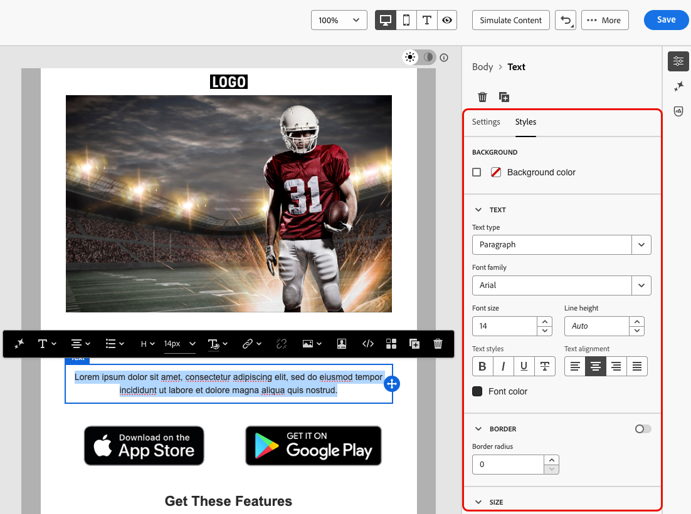

# Concevoir du contenu accessible {#accessible-content}

L’[Acte législatif européen sur l’accessibilité](https://eur-lex.europa.eu/legal-content/EN/TXT/?uri=CELEX%3A32019L0882){target="_blank"} est une directive visant à renforcer le marché intérieur des produits et services accessibles en éliminant les obstacles dus aux divergences entre les règles nationales des États membres.

Cette directive stipule que toutes les communications numériques, y compris les e-mails, les bulletins d’information, les fichiers PDF et le contenu téléchargeable, doivent être accessibles. Lors de la création de contenu pour vos destinataires, vous devez donc respecter des consignes précises, telles que l’utilisation de polices accessibles, de formats lisibles et d’un texte secondaire pour les images.

Les outils de conception de [!DNL Journey Optimizer B2B Edition] permettent aux marketeurs de créer du contenu pour les **e-mails** et **landing pages**. Utilisez ces outils pour vous conformer à cette directive, basée sur le document Web Content Accessibility Guidelines (WCAG) 2.1, niveau AA.

Les sections suivantes décrivent les bonnes pratiques pour concevoir du contenu accessible avec [!DNL Journey Optimizer B2B Edition]. Ces informations se concentrent sur la conception de contenu accessible à tous vos destinataires, de sorte que les personnes en situation de handicap puissent lire, comprendre et interagir avec vos e-mails et landing pages.
 
## Garantir la lisibilité du texte {#text-readability}

Utilisez l’onglet **[!UICONTROL Styles]** du composant **[!UICONTROL Texte]** pour vous assurer que votre texte est lisible, par exemple en utilisant un contraste de couleur approprié et des polices simples. Pour plus d’informations sur le style des composants de texte, voir [Composants de contenu](content-components.md#text)

{width="700" zoomable="yes"}

Pour les polices et le texte, respectez les consignes suivantes :

### Sélection de polices

* Utilisez des polices sans-serif, telles qu’Arial, Verdana, Tahoma, Helvetica ou Open Sans.
* Évitez les polices avec empattement, cursives ou décoratives dans le contenu du corps.
* Utilisez un petit nombre de polices pour garantir la cohérence et disposer d’une solution de remplacement (par exemple : `font-family: Arial, Helvetica, sans-serif;`).

### Dimensionnement de police

* Veillez à ce que la taille de police minimale du corps du texte soit de 16 pixels.
* Utilisez une hiérarchie appropriée pour les en-têtes.

### Contraste des couleurs

* Utilisez un rapport de contraste d’au moins 4,5:1 entre le texte et l’arrière-plan.
* Pour les grands textes (≥24 px ou 18 px en gras), assurez-vous d’utiliser un contraste d’au moins 3:1.
* Évitez le texte gris clair ou pastel sur fond blanc.
* Ne vous reposez pas uniquement sur la couleur pour transmettre un message, mais utilisez plutôt des soulignements, des icônes, etc.

### Accessibilité du texte

* Évitez le texte dans les images.
* N’utilisez pas de majuscules dans le corps du texte.
* Assurez-vous que le texte peut être zoomé à 200 % sans interrompre la mise en page.

## Garantir l’accessibilité visuelle {#visual-accessibility}

Pour vous assurer que votre contenu est accessible visuellement, suivez les bonnes pratiques ci-dessous :

* Évitez d’utiliser des indicateurs de couleur uniquement pour les informations importantes.
* Utilisez des libellés ou des icônes de texte pour garantir la clarté.
* Optimisez votre conception pour les mises en page mobiles et réactives en vous assurant que les boutons sont grands et suffisamment espacés.
* Effectuez des tests réguliers sur différents appareils et tailles d’écran pour garantir l’accessibilité.

En [!DNL Journey Optimizer B2B Edition], la taille et l’espacement des différents éléments de votre contenu peuvent être affinés à l’aide des paramètres et attributs de style du volet Designer d’e-mail **[!UICONTROL Styles]**.

Par exemple, vous pouvez mettre à jour l’arrière-plan ou modifier les marges, la marge intérieure et l’alignement pour améliorer l’accessibilité visuelle de votre contenu.

{width="700" zoomable="yes"}

De plus, le Concepteur d’e-mail [!DNL Journey Optimizer B2B Edition] vous permet de prévisualiser et d’optimiser la conception pour différents appareils et tailles d’écran. Vous pouvez à tout moment **[!UICONTROL Basculer vers la vue en direct]** pour vérifier comment le rendu de votre contenu peut être effectué sur différentes tailles d’appareil.

{width="700" zoomable="yes"}

>[!CAUTION]
>
>Le mode en direct est une prévisualisation générique conçue pour comparer l’aspect du rendu sur différentes tailles d’appareils. Le rendu final peut varier en fonction du client de messagerie de la personne destinataire.

## Utiliser un texte secondaire pour les images {#alt-text}

Utilisez le composant **[!UICONTROL Image]** pour fournir un texte secondaire pour les images. Pour plus d’informations sur les paramètres des composants d’image, voir [ Composants de contenu ](content-components.md#image)

{width="700" zoomable="yes"}

Pour un texte secondaire efficace dans les produits numériques, respectez les consignes suivantes :

* Décrivez l’objectif de l’image de manière concise et contextuelle.
* Évitez les expressions redondantes telles que « Image de... » et utilisez un texte secondaire vide pour les images décoratives.
* Pour les icônes significatives, fournissez des libellés significatifs. Pour les images complexes, utilisez un bref texte secondaire ainsi qu’une description plus détaillée ailleurs.

## Utiliser un format lisible {#readable-format}

Utilisez la structure et les [composants de contenu](content-components.md) pertinents du Concepteur d’e-mail ainsi que les options du volet **[!UICONTROL Styles]** pour organiser votre contenu de manière claire, logique, concise et accessible à l’ensemble des utilisateurs et utilisatrices.

{width="800" zoomable="yes"}

* Utilisez du code HTML sémantique structuré avec des en-têtes, des paragraphes, des listes et des tableaux appropriés.
* Assurez-vous que le contenu suit un flux logique de gauche à droite, de haut en bas.
* Utilisez un langage clair et concis.
* Proposez des formats alternatifs pour les PDF et les infographies.
* Autorisez le redimensionnement et la redistribution du texte et assurez-vous que la typographie est lisible avec un contraste des couleurs adéquat dans tous les formats.

## Garantir la lisibilité du contenu {#readability}

Pour être lisible, votre contenu doit être clair, bien structuré et utilisable par tout le monde, y compris les personnes ayant des difficultés visuelles, cognitives ou de lecture et celles qui utilisent des technologies d’assistance. Voici quelques points à prendre en compte lors de la création de contenu accessible :

* Limitez les phrases à une vingtaine de mots ou moins.
* Rédigez du texte direct et concis.
* Utilisez la voix active pour simplifier la structure de la phrase.
* Évitez l’argot, le jargon ou les expressions régionales que certaines personnes ne connaissent pas.

Pour évaluer la lisibilité de vos e-mails, utilisez le test populaire [Flesch Reading Ease](https://support.microsoft.com/fr-fr/office/get-your-document-s-readability-and-level-statistics-85b4969e-e80a-4777-8dd3-f7fc3c8b3fd2){target="_blank"} dans Microsoft Word. Il calcule la facilité de lecture de votre contenu sur une échelle de 0 à 100.

## Tester votre contenu {#test}

Pour vérifier l’accessibilité de votre contenu, vous pouvez utiliser les fonctionnalités de test fournies par [!DNL Journey Optimizer B2B Edition]. Elles ne sont pas spécialement conçues pour vérifier si le contenu est entièrement accessible, mais elles peuvent fournir un premier niveau de vérification.

* Prévisualisez votre contenu à l’aide de profils de test.

* Utilisez l’option [Rendu d’e-mail](email-test-rendering.md) qui tire parti de Litmus pour simuler vos conceptions sur les principaux clients de messagerie (Apple Mail, Gmail, Outlook) et vérifier si le texte, les couleurs et les images rendent votre contenu accessible. <!--Litmus includes accessibility testing-->

* Envoyez des BAT pour tester le rendu de votre contenu avant de l’envoyer à votre audience réelle.

{width="800" zoomable="yes"}

Pour vérifier de manière plus fiable si votre contenu est accessible, recherchez des outils externes spécifiques tels que :

* Le [vérificateur de contraste WebAim](https://webaim.org/resources/contrastchecker/){target="_blank"} et l’[outil d’évaluation de l’accessibilité web WAVE](https://wave.webaim.org/){target="_blank"} pour évaluer le contraste et la conformité ;

* Les technologies d’assistance comme les lecteurs d’écran (par exemple : [NVDA](https://www.nvaccess.org/download/){target="_blank"} ou [VoiceOver](https://support.apple.com/fr-fr/guide/iphone/iph3e2e415f/ios){target="_blank"} sur iPhone) pour consulter les e-mails du point de vue des personnes souffrant de déficience visuelle.

## Utiliser le mode sombre {#dark-mode}


Le mode sombre améliore l’accessibilité visuelle pour les personnes sensibles à la lumière ou ayant une déficience visuelle, ainsi que leur expérience de visionnage.

{width="800" zoomable="yes"}

Lors de la conception pour le mode sombre, utilisez des images PNG ou SVG transparentes et définissez les balises meta et CSS appropriées. Fournissez un style de secours accessible si le mode sombre n’est pas pris en charge. Enfin, testez tout le contenu des e-mails et les éléments de l’interface utilisateur en modes clair et sombre.

## Utiliser des attributs spécifiques pour l’accessibilité {#attributes}

### Attributs de langue {#language}

Lors de la création de conceptions, incluez les attributs `lang` (langue) et `dir` (sens d’écriture) dans le corps du contenu. Ces attributs permettent aux technologies d’assistance telles que les lecteurs d’écran d’interpréter et de présenter votre contenu de manière appropriée.

* L’attribut `lang` indique la langue de l’e-mail aux technologies d’assistance, afin que les mots soient prononcés correctement.

  +++Exemples

  Exemple pour l’anglais :

  ```
  <body lang="en">
  ```

  Exemple pour le français :

  ```
  <body lang="fr">
  ```

  +++

* L’attribut `dir` spécifie le sens de l’écriture. La plupart des langues, y compris l’anglais et le français, se lisent de gauche à droite (ltr), tandis que les langues telles que l’arabe et l’hébreu se lisent de droite à gauche (rtl).

  +++Exemples

  Exemple pour l’anglais (de gauche à droite) :

  ```html
  <body lang="en" dir="ltr">
  ```

  Exemple pour l’arabe (de droite à gauche) :

  ```html
  <body lang="ar" dir="rtl">
  ```

  +++

Les lecteurs d’écran s’appuient sur l’attribut `lang` pour appliquer les règles de prononciation correctes. L’orientation du texte assure naturellement le flux du contenu pour les langues écrites de gauche à droite ou de droite à gauche. Sans ces attributs, l’ordre de lecture peut être confus et des mots peuvent être mal prononcés. Par conséquent, enveloppez toujours le corps de votre e-mail avec les attributs `lang` et `dir` appropriés.

>[!TIP]
>
>Si votre e-mail contient plusieurs langues, attribuez les attributs de langue appropriés à des sections spécifiques (comme des blocs de `<table>` ou de `<td>`) pour vous assurer que chaque partie est lue correctement.

### Tableaux {#tables}

Dans les contenus HTML, des tableaux sont souvent utilisés pour la mise en page. Par défaut, les lecteurs d’écran traitent chaque `<table>` comme un tableau de données, annonçant les lignes, les colonnes et la structure. Cette structure peut prêter à confusion si le tableau n’est utilisé que pour la mise en forme.

Ajoutez `role="presentation"` (ou `role="none"`) aux tableaux de mise en page pour vous assurer que les technologies d’assistance ignorent leur structure et se concentrent uniquement sur le contenu.

+++Exemple - Tableau de mise en page (avec `role="presentation"`)

```html
<table role="presentation" border="0" cellpadding="0" cellspacing="0" width="100%"> 
  <tr> 
    <td align="center"> 
      <h1>Hello World</h1> 
      <p>Welcome to our newsletter</p> 
    </td> 
  </tr> 
</table>
```

Les lecteurs d’écran lisent :
« Bonjour tout le monde. Bienvenue dans cette newsletter. » *(Aucune mention de lignes, colonnes ni tableau)*

+++

+++Exemple - Tableau de données (sans `role="presentation"`)

```html
<table border="1" cellpadding="5" cellspacing="0"> 
  <tr> 
    <th scope="col">Name</th> 
    <th scope="col">Score</th> 
  </tr> 
  <tr> 
    <td>Alice</td> 
    <td>95</td> 
  </tr> 
  <tr> 
    <td>Bob</td> 
    <td>88</td> 
  </tr> 
</table> 
```

Les lecteurs d’écran lisent :
« Tableau avec 2 colonnes et 3 lignes. »

« Nom, Alice. Score, 95. »

« Nom, Bob. Score, 88. »

+++

>[!TIP]
>
>Utilisez `role="presentation"` exclusivement pour les tableaux de mise en page. Pour les tableaux de données, conservez la structure `<table>` sémantique afin que les lecteurs d’écran puissent annoncer correctement les en-têtes et les relations.

### Texte des liens {#links}

Les lecteurs d’écran lisent les liens à l’aide de leur texte. Si un lien est libellé uniquement _Cliquez ici_ ou _En savoir plus_, les utilisateurs et utilisatrices de technologies d’assistance ne connaissent pas la destination. Pour garantir leur accessibilité, ils ont besoin d’un texte descriptif qui indique clairement la cible ou l’action.

Utilisez le Designer d’e-mail pour ajouter un lien à votre contenu et modifier le libellé afin de le rendre perceptible (visible) et descriptif (clarifier l’objectif). Évitez les libellés vagues tels que _ici_ ou _plus_.

{width="600" zoomable="yes"}

+++Exemple - Lien correct (descriptif) : 

```
<p>Learn more in the  
<a href="https://adobe.com/release-notes">August release notes</a>. 
</p>
```

Les lecteurs d’écran lisent :
« Lien, notes de mise à jour d’août. »

+++

+++Exemple - Lien incorrect (non descriptif)

```
<p>Learn more about our new features.  
  <a href="https://adobe.com/release-notes">Click here</a>. 
</p>
```

Les lecteurs d’écran lisent :
« Lien, cliquez ici. » *(Ne fournit aucun contexte en dehors de l’ordre de lecture.)*

+++

## Prévoir la navigation au clavier et la gestion du focus {#keyboard}

<!--for landing pages-->

La prise en charge de la navigation au clavier et du focus permet aux personnes qui ne peuvent pas utiliser de souris d’accéder au contenu et d’interagir avec celui-ci. Elles améliorent également la convivialité globale en offrant à l’ensemble des utilisateurs et utilisatrices un moyen clair et cohérent de parcourir les informations.

* Focus via le clavier
   * Assurez-vous que tous les éléments interactifs (tels que les boutons, cases à cocher, liens) comportent `tabindex="0"` afin qu’ils soient inclus dans l’ordre naturel de tabulation.
   * Permettez la navigation à l’aide de la touche de tabulation et des touches fléchées (↑ ↓ ← →), qui doivent mettre en évidence l’élément sélectionné.
* Style de focus personnalisé
   * Appliquez des styles clairs que l’on puisse distinguer afin de mettre en évidence les éléments interactifs :
     +++Exemple (CSS)

     ```
     [tabindex="0"] : focus { 
     outline: 2px solid #00AEEF;  /* Cyan border */ 
     background-color: #20CEFF;   /* Optional background */ 
     }
     ```

     +++

   * Assurez-vous que les indicateurs de focus respectent les normes d’apparence de focus WCAG 2.2, notamment :
      * Surface minimum : contour de 2 pixels CSS d’épaisseur.
      * Rapport de contraste : ≥ 3 :1 entre l’état sélectionné et non sélectionné.

* Prise en charge de l’activation au clavier
   * Assurez-vous que les cases à cocher et les boutons répondent aux touches Entrée et Espace.
   * Validez l’interaction à l’aide du clavier uniquement :
      * Touches Entrée ou Espace pour cocher/décocher les cases.
      * Appuyez sur Entrée ou Espace pour déclencher les boutons.
