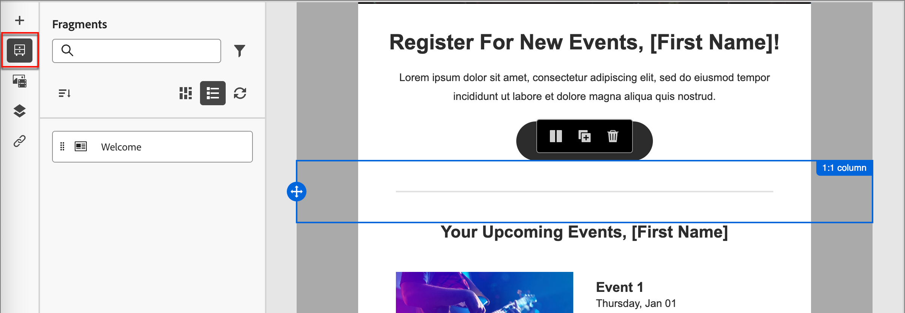

# Création d’emails

Utilisez Adobe Journey Optimizer B2B Edition pour envoyer des messages électroniques à vos clients. Vous pouvez créer, personnaliser et prévisualiser des messages dans le concepteur d’e-mail.

## Ajout d’une action de courrier électronique dans un parcours de compte

Vous pouvez configurer des diffusions email dans un Parcours de compte lorsque vous ajoutez un noeud _[!UICONTROL Take an action]_ et procédez comme suit :

1. Pour la cible _[!UICONTROL Action sur]_, choisissez **[!UICONTROL Personnes]**.
1. Pour l’ _[!UICONTROL action sur les personnes]_, choisissez **[!UICONTROL Envoyer un email]**.
1. Pour la _[!UICONTROL source d&#39;email]_, choisissez **[!UICONTROL Créer un email]**.

   Vous pouvez également sélectionner l’option _[!UICONTROL Sélectionner un email dans Adobe Marketo Engage]_ pour utiliser l’un des emails précréés dans Marketo Engage et l’envoyer dans le cadre du Parcours de compte.

   >[!NOTE]
   >
   >Si vous créez un email pour la première fois, assurez-vous que le canal email est configuré dans Adobe Marketo Engage. Pour en savoir plus, consultez la section [Assurer la délivrabilité des emails](https://experienceleague.adobe.com/en/docs/marketo/using/getting-started/initial-setup/setup-steps#ensure-email-deliverability) dans la documentation du Marketo Engage.

   {width="700" zoomable="yes"}

1. Au bas du panneau _[!UICONTROL Agir sur une action]_, cliquez sur **[!UICONTROL Créer un email]**.

1. Dans la boîte de dialogue, saisissez un **[!UICONTROL nom]** unique pour l’email et une **[!UICONTROL ligne Objet]**.

   {width="400"}

1. Cliquez sur **[!UICONTROL Créer]**.

   Dans la section _[!UICONTROL Propriétés de l&#39;email]_ de la page de contenu de l&#39;email, les champs _[!UICONTROL De l&#39;email]_ et _[!UICONTROL Répondre à l&#39;adresse]_ sont déjà configurés. Vous pouvez saisir des valeurs pour les champs _[!UICONTROL From name]_ et _[!UICONTROL Description]_ (facultatif).

## Créer le contenu d’un e-mail

Cliquez sur **[!UICONTROL Ajouter du contenu d&#39;email]** en haut du panneau d&#39;aperçu _[!UICONTROL Email]_.

{width="700" zoomable="yes"}

Cette action lance le Designer d&#39;email, dans lequel vous pouvez choisir la manière dont vous souhaitez concevoir votre email à partir des options suivantes :

* [Concevez entièrement votre email](#design-your-email-from-scratch) à l’aide de l’interface Designer des emails.

* [Importez du contenu HTML existant](#import-existing-html-content) à partir d’un fichier ou d’un dossier .zip.

* [Sélectionnez un modèle existant](#select-a-template) dans une liste de modèles d’email intégrés ou personnalisés.

Pour configurer et personnaliser la ligne d’objet à l’aide de l’éditeur d’expression, cliquez sur l’icône _Personalization_ et ajoutez les jetons du Marketo Engage.

Après avoir créé et personnalisé le contenu de l’email, vous pouvez l’exporter pour validation ou pour une utilisation ultérieure. Cliquez sur **[!UICONTROL Exporter l’HTML]** pour enregistrer le contenu sous la forme d’un fichier .zip contenant votre HTML et vos ressources.

>[!TIP]
>
>Utilisez l’assistant d’IA dans l’édition B2B de Adobe Journey Optimizer, optimisé par l’IA générative, pour élever le contenu au niveau suivant. L’assistant d’IA peut vous aider à optimiser l’impact de vos diffusions en générant des emails complets, du contenu texte ciblé et en obtenant des recommandations d’assistant d’IA pour les images qui résonnent avec votre audience. [En savoir plus](./ai-assistant-emails.md)

### Concevoir votre e-mail à partir de zéro {#design-from-scratch}

>[!CONTEXTUALHELP]
>id="ajo-b2b_structure_components_landing_page"
>title="Ajout de composants de structure"
>abstract="Les composants de structure définissent la disposition de la page de destination. Faites glisser et déposez un composant de **structure** dans la zone de travail pour commencer à concevoir le contenu de votre page de destination."

>[!CONTEXTUALHELP]
>id="ajo-b2b_content_components_landing_page"
>title="À propos des composants de contenu"
>abstract="Les composants de contenu sont des espaces réservés de contenu vides que vous pouvez utiliser pour créer la disposition d’une page de destination."

Utilisez l&#39;éditeur visuel de contenu pour définir la structure du contenu de l&#39;email. En ajoutant et en déplaçant des composants structurels à l’aide de simples actions de glisser-déposer, vous pouvez concevoir la forme du contenu d’email réutilisable en quelques secondes.

1. Sur la page d&#39;accueil _[!UICONTROL Concevez votre modèle]_ , sélectionnez l&#39;option **[!UICONTROL Concevoir à partir de zéro]** .

1. [Ajoutez la structure et le contenu](#add-structure-and-content) au message électronique.
1. [Ajoutez des ressources image](#add-assets) au message électronique.
1. [Personnalisez le contenu de l&#39;email](#personalize-content).
1. [Liens de révision et de mise à jour](#preview-and-edit-linked-urls).

<!-- If needed, you can further personalize your email by clicking **[!UICONTROL Switch to code editor]** from the advanced menu. The code editor allows you to edit the email source code, such as adding tracking or custom HTML tags.

>[!CAUTION]
>
>You cannot revert back to the visual designer for this email after switching to the code editor. -->

Une fois le contenu terminé, cliquez sur **[!UICONTROL Simuler le contenu]** dans la partie supérieure pour vérifier le rendu. Vous pouvez choisir la vue bureau ou la vue mobile.

Lorsque le contenu vous satisfait, cliquez sur **[!UICONTROL Enregistrer]**.

### Importer du contenu d’HTML existant

{{$include /help/_includes/content-design-import.md}}

{width="500"}

>[!NOTE]
>
>L’utilisation d’une balise `<table>` comme première couche d’un fichier HTML peut entraîner une perte de style, y compris les paramètres d’arrière-plan et de largeur dans la balise de couche supérieure.

Vous pouvez personnaliser le contenu importé selon vos besoins à l’aide des outils visuels de l’éditeur d’email.

### Sélectionner un modèle

{{$include /help/_includes/content-design-select-template.md}}

## Ajouter la structure et le contenu {#structure-content}

>[!CONTEXTUALHELP]
>id="ajo-b2b_structure_components_email"
>title="Ajout de composants de structure"
>abstract="Les composants de structure définissent la disposition de votre e-mail. Faites glisser et déposez un composant de **structure** dans la zone de travail pour commencer à concevoir le contenu de votre e-mail."

>[!CONTEXTUALHELP]
>id="ajo-b2b_content_components_email"
>title="À propos des composants de contenu"
>abstract="Les composants de contenu sont des espaces réservés de contenu vides que vous pouvez utiliser pour créer la disposition d’un e-mail."

{{$include /help/_includes/content-design-components.md}}

### Ajouter des fragments

Dans l’éditeur visuel de contenu, l’icône _Fragments_ s’affiche sur la gauche. L’exemple suivant décrit les étapes à suivre pour ajouter des fragments au contenu du modèle.

1. Pour ouvrir la liste des fragments, cliquez sur l’icône _Fragments_ .

   Vous pouvez effectuer les actions suivantes :

   * Triez la liste.
   * Parcourir, rechercher ou filtrer la liste.
   * Basculez entre les modes Miniature et Liste.
   * Actualisez la liste pour refléter les fragments récemment créés.

   {width="700" zoomable="yes"}

1. Faites glisser et déposez l’un des fragments dans l’espace réservé du composant structurel.

   L’éditeur effectue le rendu du fragment dans la section/l’élément de la structure de l’email.

Le contenu du fragment est mis à jour dynamiquement dans la structure afin d’afficher la manière dont le contenu apparaît dans l’email.

>[!TIP]
>
>Si vous souhaitez ajouter le fragment afin qu&#39;il occupe l&#39;intégralité de la disposition horizontale dans l&#39;email, ajoutez une structure de colonnes 1:1, puis faites glisser et déposez le fragment dans celui-ci.

Une fois l’email enregistré, il apparaît dans la page des détails du fragment lorsque vous sélectionnez l’onglet _[!UICONTROL Utilisé par]_ dans le résumé. Les fragments ajoutés à un modèle de courrier électronique ne sont pas modifiables dans le modèle ; le contenu est défini par le fragment source.

### Ajout de ressources

{{$include /help/_includes/content-design-assets.md}}

### Navigation dans les calques, paramètres et styles

{{$include /help/_includes/content-design-navigation.md}}

### Personnaliser le contenu

{{$include /help/_includes/content-design-personalization.md}}

### Modification du suivi des URL liées

{{$include /help/_includes/content-design-links.md}}

### Options d’affichage

Tirez parti des options de vue et de validation du contenu disponibles dans l’éditeur visuel de courrier électronique.

* Zoom avant/arrière sur le contenu sur les options de zoom prédéfinies.

* Basculez l’affichage du contenu sur Bureau, Mobile ou Texte unique/Texte brut.
   * Cliquez sur l’icône _OEil_ pour afficher l’aperçu du contenu sur tous les appareils.
   * Sélectionnez l’un des appareils prêts à l’emploi ou saisissez des dimensions personnalisées pour prévisualiser le contenu.

## Vérifier les alertes

Lorsque vous concevez le contenu de vos emails, des alertes s’affichent dans l’interface (en haut à droite de la page) lorsque des paramètres clés sont manquants.

Si ce bouton ne s’affiche pas, aucun problème n’est détecté.

Deux types d’alertes peuvent être détectés :

* **_Avertissements_** qui font référence à des recommandations et à des bonnes pratiques, telles que :

   * `The opt-out link is not present in the email body` : l&#39;ajout d&#39;un lien de désinscription dans le corps de votre email est une bonne pratique.

     >[!NOTE]
     >
     >Les messages électroniques de style marketing doivent inclure un lien d’exclusion, qui n’est pas obligatoire pour les messages transactionnels.

   * `Text version of HTML is empty` : n’oubliez pas de définir une version texte du corps de votre email, qui est utilisée lorsque le contenu de l’HTML ne peut pas être affiché.

   * `Empty link is present in email body` : vérifiez que tous les liens de votre email sont corrects.

   * `Email size has exceeded the limit of 100KB` : pour une diffusion optimale, vérifiez que la taille de votre email ne dépasse pas 100 Ko.

* **_Erreurs_** qui vous empêchent de tester ou d’activer le parcours/la campagne tant qu’elles ne sont pas résolues, par exemple :

   * `The subject line is missing` : l’objet de l’email est obligatoire.

   * `The email version of the message is empty` : cette erreur s&#39;affiche lorsque le contenu de l&#39;email n&#39;a pas été configuré.

## Vérifier et tester l’e-mail {#preview-test}

>[!CONTEXTUALHELP]
>id="ajo-b2b_email_preview_simulate"
>title="Vérifier le rendu de votre contenu"
>abstract="Une fois votre contenu défini, vous pouvez le prévisualiser et vérifier si le rendu est correct en fonction du canal que vous utilisez."

Lorsque le contenu de votre message est défini, vous pouvez utiliser des profils de test pour le prévisualiser, envoyer des bons à tirer et contrôler son rendu sur les clients courants de bureau, de mobile et web. Si vous avez inséré du contenu personnalisé, vous pouvez prévisualiser l&#39;affichage de ce contenu dans le message à l&#39;aide des données de profil de test.

Pour prévisualiser le contenu de l&#39;email, cliquez sur **[!UICONTROL Simuler le contenu]**, puis ajoutez un profil de test pour vérifier votre message à l&#39;aide des données de profil de test.

{width="700" zoomable="yes"}
