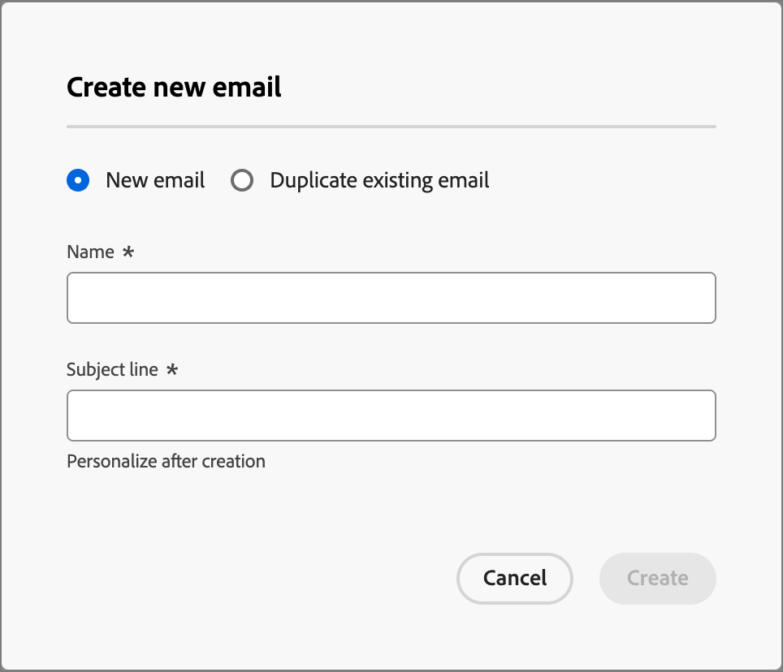

# Création d’e-mails

Utilisez Adobe Journey Optimizer B2B edition pour envoyer des e-mails à vos clients. Vous pouvez créer, personnaliser et prévisualiser des messages dans le concepteur visuel.

## Ajout d’une action e-mail dans un parcours de compte

Vous pouvez configurer des diffusions e-mail dans un Parcours Compte lorsque vous ajoutez un nœud _[!UICONTROL Prendre une action]_ et que vous effectuez les opérations suivantes :

1. Pour la cible _[!UICONTROL Action sur]_, choisissez **[!UICONTROL Personnes]**.
1. Pour l’_[!UICONTROL Action sur les personnes]_, choisissez **[!UICONTROL Envoyer un e-mail]**.
1. Pour le _[!UICONTROL Source d’e-mail]_, choisissez **[!UICONTROL Créer un e-mail]**.

   Vous pouvez également sélectionner l’option _[!UICONTROL Sélectionner un e-mail dans Adobe Marketo Engage]_ pour utiliser l’un des e-mails précréés dans Marketo Engage et l’envoyer dans le cadre du Parcours de compte.

   >[!NOTE]
   >
   >Si vous créez un e-mail pour la première fois, assurez-vous que le canal e-mail est configuré depuis Adobe Marketo Engage. Pour en savoir plus, consultez la section [Garantir la délivrabilité des e-mails](https://experienceleague.adobe.com/en/docs/marketo/using/getting-started/initial-setup/setup-steps#ensure-email-deliverability) dans la documentation de Marketo Engage.

   {width="700" zoomable="yes"}

1. Au bas du panneau _[!UICONTROL Effectuer une action]_, cliquez sur **[!UICONTROL Créer un e-mail]**.

1. Dans la boîte de dialogue, saisissez un **[!UICONTROL Nom]** unique pour l’e-mail et un **[!UICONTROL Objet]**.

   {width="400"}

1. Cliquez sur **[!UICONTROL Créer]**.

   Dans la section _[!UICONTROL Propriétés de l’e-mail]_ de la page de contenu de l’e-mail, les champs _[!UICONTROL De l’e-mail]_ et _[!UICONTROL Répondre à l’adresse]_ sont déjà configurés. Vous pouvez saisir des valeurs pour les champs _[!UICONTROL Nom de l’expéditeur]_ et _[!UICONTROL Description]_ (facultatif).

## Créer le contenu d’un e-mail

Cliquez sur **[!UICONTROL Ajouter du contenu d’e-mail]** en haut du panneau d’aperçu _[!UICONTROL E-mail]_.

{width="700" zoomable="yes"}

Cette action lance le Designer d’e-mail, dans lequel vous pouvez choisir la manière de concevoir votre e-mail à l’aide des options suivantes :

* [Concevez entièrement votre e-mail](#design-your-email-from-scratch) à l’aide de l’interface Email Designer.

* [Importez du contenu HTML existant](#import-existing-html-content) à partir d’un fichier ou d’un dossier .zip.

* [Sélectionnez un modèle existant](#select-a-template) dans une liste de modèles d’e-mail intégrés ou personnalisés.

Pour configurer et personnaliser l’objet avec l’éditeur d’expression, cliquez sur l’icône _Personalization_ et ajoutez l’un des jetons Marketo Engage.

Après avoir créé et personnalisé le contenu de l’e-mail, vous pouvez exporter le contenu pour le valider ou pour l’utiliser ultérieurement. Cliquez sur **[!UICONTROL Exporter HTML]** pour enregistrer le contenu sous la forme d’un fichier .zip contenant votre HTML et vos ressources.

>[!TIP]
>
>Utilisez l’assistant d’IA dans Adobe Journey Optimizer B2B edition, optimisé par l’IA générative pour élever votre contenu au niveau supérieur. L’assistant AI peut vous aider à optimiser l’impact de vos diffusions en générant des e-mails complets, du contenu textuel ciblé et en obtenant des recommandations de l’assistant AI pour les images qui résonnent avec votre audience. [En savoir plus](./ai-assistant-emails.md)

### Concevoir votre e-mail à partir de zéro {#design-from-scratch}

>[!CONTEXTUALHELP]
>id="ajo-b2b_structure_components_landing_page"
>title="Ajout de composants de structure"
>abstract="Les composants de structure définissent la disposition de la page de destination. Faites glisser et déposez un composant de **structure** dans la zone de travail pour commencer à concevoir le contenu de votre page de destination."

>[!CONTEXTUALHELP]
>id="ajo-b2b_content_components_landing_page"
>title="À propos des composants de contenu"
>abstract="Les composants de contenu sont des espaces réservés de contenu vides que vous pouvez utiliser pour créer la disposition d’une page de destination."

Utilisez l’éditeur visuel de contenu pour définir la structure du contenu de l’e-mail. En ajoutant et en déplaçant des composants structurels à l’aide de simples actions de glisser-déposer, vous pouvez concevoir la forme du contenu d’e-mail réutilisable en quelques secondes.

1. Sur la page d’accueil _[!UICONTROL Concevez votre modèle]_, sélectionnez l’option **[!UICONTROL Créer en partant de zéro]**.

1. [Ajoutez la structure et le contenu](#add-structure-and-content) à l’e-mail.
1. [Ajoutez des ressources d’image](#add-assets) à l’e-mail.
1. [Personnaliser le contenu de l’e-mail](#personalize-content).
1. [Vérifier et mettre à jour les liens](#preview-and-edit-linked-urls).

<!-- If needed, you can further personalize your email by clicking **[!UICONTROL Switch to code editor]** from the advanced menu. The code editor allows you to edit the email source code, such as adding tracking or custom HTML tags.

>[!CAUTION]
>
>You cannot revert back to the visual designer for this email after switching to the code editor. -->

Une fois votre contenu terminé, cliquez sur **[!UICONTROL Simuler du contenu]** en haut pour vérifier le rendu. Vous pouvez choisir la vue bureau ou la vue mobile.

Lorsque le contenu vous convient, cliquez sur **[!UICONTROL Enregistrer]**.

### Importer du contenu HTML existant

{{$include /help/_includes/content-design-import.md}}

{width="500"}

>[!NOTE]
>
>L’utilisation d’une balise `<table>` comme première couche d’un fichier HTML peut entraîner une perte de style, y compris les paramètres d’arrière-plan et de largeur dans la balise de couche supérieure.

Vous pouvez personnaliser le contenu importé selon vos besoins à l’aide des outils de l’éditeur visuel d’e-mail.

### Sélectionner un modèle

{{$include /help/_includes/content-design-select-template.md}}

>[!NOTE]
>
> Les modèles enregistrés peuvent avoir des paramètres de gouvernance (verrouillage de contenu) appliqués à un ou plusieurs composants. Le concepteur visuel fournit des instructions sur les composants verrouillés lorsque vous [créez un email à partir d’un modèle régi](./email-authoring-governance.md).

## Ajouter la structure et le contenu {#structure-content}

>[!CONTEXTUALHELP]
>id="ajo-b2b_structure_components_email"
>title="Ajout de composants de structure"
>abstract="Les composants de structure définissent la disposition de votre e-mail. Faites glisser et déposez un composant de **structure** dans la zone de travail pour commencer à concevoir le contenu de votre e-mail."

>[!CONTEXTUALHELP]
>id="ajo-b2b_content_components_email"
>title="À propos des composants de contenu"
>abstract="Les composants de contenu sont des espaces réservés de contenu vides que vous pouvez utiliser pour créer la disposition d’un e-mail."

{{$include /help/_includes/content-design-components.md}}

### Ajouter des fragments

{{$include /help/_includes/content-design-use-fragments.md}}

Une fois l’e-mail enregistré, il s’affiche dans la page des détails du fragment lorsque vous sélectionnez l’onglet _[!UICONTROL Utilisé par]_ dans le résumé.

### Ajout de ressources

{{$include /help/_includes/content-design-assets.md}}

### Parcourir les calques, paramètres et styles

{{$include /help/_includes/content-design-navigation.md}}

### Personnaliser le contenu

{{$include /help/_includes/content-design-personalization.md}}

>[!NOTE]
>
>Si _[!UICONTROL Mes jetons]_ sont définis pour le parcours de compte, vous pouvez également utiliser ces jetons spécifiques au parcours pour le contenu de votre e-mail. Voir [Jetons personnalisés pour la personnalisation des e-mails](./personalization-my-tokens.md) pour plus d’informations.

### Modifier le tracking des URL liées

{{$include /help/_includes/content-design-links.md}}

### Afficher les options

Tirez parti des options d’affichage et de validation du contenu disponibles dans l’éditeur visuel d’e-mail.

* Effectuez un zoom avant/arrière sur le contenu dans les options de zoom prédéfinies.

* Basculez vers l’affichage du contenu sur les ordinateurs de bureau, les appareils mobiles ou en texte seul/texte brut.
   * Cliquez sur l’icône _Affichage_ pour afficher un aperçu du contenu sur tous les appareils.
   * Sélectionnez l’un des appareils prêts à l’emploi ou saisissez des dimensions personnalisées pour prévisualiser le contenu.

### Plus d’options

Dans le menu _[!UICONTROL Plus...]_ situé en haut du Concepteur d’e-mail, vous pouvez effectuer les actions suivantes :

{width="500"}

* **[!UICONTROL Réinitialiser l’e-mail]** - Cliquez sur cette option pour vider la zone de travail du Concepteur d’e-mail visuel et redémarrer la création de votre contenu.
* **[!UICONTROL Enregistrer en tant que fragment]** - Enregistrez l’intégralité ou une partie de l’e-mail en tant que fragment à réutiliser dans plusieurs e-mails ou modèles d’e-mail. Indiquez un nom et une description pour le fragment et enregistrez-le dans la liste des fragments disponibles.
* **[!UICONTROL Modifier votre conception]** - Revenez à la page _Concevoir votre e-mail_. De là, vous pouvez choisir un autre modèle pour redémarrer le processus de conception ou choisir de concevoir le contenu à partir de zéro dans une zone de travail noire.
* **[!UICONTROL Enregistrer en tant que modèle de contenu]** - Enregistrez le corps de l’e-mail en tant que modèle d’e-mail à réutiliser dans plusieurs e-mails ou modèles d’e-mail. Indiquez un nom et une description pour le modèle, puis enregistrez-le dans la liste des modèles d’e-mail enregistrés.
* **[!UICONTROL Exporter HTML]** - Téléchargez le contenu de la zone de travail visuelle sur votre système local au format HTML présenté sous la forme d’un fichier zip.

## Vérifier les alertes

Lorsque vous concevez le contenu de votre e-mail, des alertes s’affichent dans l’interface (en haut à droite de la page) lorsque des paramètres clés sont manquants.

Si ce bouton ne s’affiche pas, aucun problème n’est détecté.

Deux types d’alertes peuvent être détectés :

* **_avertissements_** qui se rapportent aux recommandations et aux bonnes pratiques telles que :

   * `The opt-out link is not present in the email body` : une bonne pratique consiste à ajouter un lien de désinscription dans le corps de votre e-mail.

     >[!NOTE]
     >
     >Les e-mails de style marketing doivent inclure un lien d’opt-out, qui n’est pas obligatoire pour les messages transactionnels.

   * `Text version of HTML is empty` : n’oubliez pas de définir une version texte du corps de votre email, qui est utilisée lorsque le contenu HTML ne peut pas être affiché.

   * `Empty link is present in email body` : vérifiez que tous les liens de votre e-mail sont corrects.

   * `Email size has exceeded the limit of 100KB` : pour une diffusion optimale, veillez à ce que la taille de votre e-mail ne dépasse pas 100KB.

* **_Erreurs_** qui vous empêchent de tester ou d’activer le parcours/la campagne tant qu’elles ne sont pas corrigées, telles que :

   * `The subject line is missing` : l’objet de l’e-mail est obligatoire.

   * `The email version of the message is empty` : cette erreur s’affiche lorsque le contenu de l’e-mail n’a pas été configuré.

## Vérifier et tester l’e-mail {#preview-test}

>[!CONTEXTUALHELP]
>id="ajo-b2b_email_preview_simulate"
>title="Vérifier le rendu de votre contenu"
>abstract="Une fois votre contenu défini, vous pouvez le prévisualiser et vérifier si le rendu est correct en fonction du canal que vous utilisez."

Lorsque le contenu de votre message est défini, vous pouvez utiliser des profils de test pour le prévisualiser, envoyer des BAT et contrôler son rendu sur les clients de bureau, mobiles et web les plus courants. Si vous avez inséré du contenu personnalisé, vous pouvez prévisualiser l’affichage de celui-ci dans le message à l’aide des données de profil de test.

Pour prévisualiser le contenu de l’e-mail, cliquez sur **[!UICONTROL Simuler du contenu]** puis ajoutez un profil de test pour vérifier votre message à l’aide des données de profil de test.

{width="700" zoomable="yes"}
