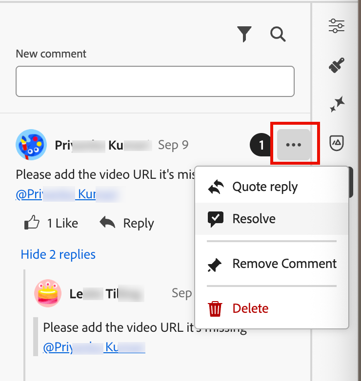

# Outils de collaboration par e-mail

L’[espace de conception d’e-mail](./email-authoring.md) comprend des outils de collaboration pour la formulation de commentaires et la résolution afin que les équipes marketing puissent examiner, discuter et finaliser en toute transparence les ressources d’e-mail directement dans [!DNL Journey Optimizer B2B Edition]. Au lieu de partager des brouillons sur des outils externes (tels que le chat, les threads d’e-mail ou les feuilles de calcul), les utilisateurs et utilisatrices peuvent commenter, suggérer des modifications et résoudre les commentaires dans l’espace de conception d’e-mail. Utilisez ces outils pour rationaliser votre workflow, réduire les erreurs et vous assurer que les parties prenantes sont alignées avant de lancer votre campagne par e-mail dans un parcours de compte :

* **_Retour d’informations centralisé_** - Collectez et suivez tous les retours en un seul endroit.

* **_Révisions plus rapides_** - Les collaborateurs peuvent réviser la copie d’e-mail et les ressources dans l’environnement de création.

* **_Précision améliorée_** - Réduit le risque de mauvaise communication en maintenant toutes les modifications liées à l’e-mail lui-même.

* **_Transparence_** - Tous les commentaires et résolutions restent consignés, ce qui permet de savoir clairement quels changements ont été suggérés et mis en œuvre.

* **_Collaboration en contexte_** - Examinez la copie du corps de l’e-mail, les images et les éléments call-to-action (CTA) dans la mise en page.

<!-- Enable asynchronous collaboration between team members for an email asset
Allow users to attach comments to specific design elements
Provide a unified interface for viewing and managing all comments within a project
Support comment placement, editing, deleting, and navigation
Display visual indicators (badges) for elements with associated comments -->

## Activer les outils de collaboration par e-mail pour les réviseurs

Les administrateurs de produit peuvent autoriser l’accès aux outils de collaboration par e-mail en attribuant l’autorisation **[!UICONTROL Gérer les e-mails B2B]** via l’interface utilisateur _Autorisations_ dans Adobe Experience Cloud.

+++ Activer les autorisations de messagerie

1. Dans l’application Autorisations, accédez à l’onglet **[!UICONTROL Rôles]** et sélectionnez le [rôle](https://experienceleague.adobe.com/fr/docs/experience-platform/access-control/abac/permissions-ui/roles){target="_blank"} souhaité.

1. Cliquez sur **[!UICONTROL Modifier]** pour modifier les autorisations.

1. Ajoutez la ressource **[!UICONTROL Assets B2B]**, puis sélectionnez **[!UICONTROL Gérer les e-mails B2B]**.

   {width="700" zoomable="yes"}

1. Cliquez sur **[!UICONTROL Enregistrer]** pour appliquer les modifications.

   Les autorisations sont automatiquement mises à jour pour tous les utilisateurs et utilisatrices déjà affectés au rôle.

1. Pour attribuer ce rôle à de nouveaux utilisateurs, sélectionnez l’onglet **[!UICONTROL Utilisateurs]** dans le tableau de bord _[!UICONTROL Rôles]_ et cliquez sur **[!UICONTROL Ajouter un utilisateur]**.

   * Saisissez le nom d’utilisateur et l’adresse e-mail, ou choisissez un utilisateur existant dans la liste.

     Si l’utilisateur n’est pas encore créé, consultez la documentation d’[Experience Platform](https://experienceleague.adobe.com/fr/docs/experience-platform/access-control/abac/permissions-ui/users){target="_blank"}.

   * Cliquez sur **[!UICONTROL Enregistrer]** pour appliquer les modifications.

+++

## Affichage des outils et commentaires de collaboration

Lors de la création, de la modification ou de la révision du contenu dans l’espace de conception d’e-mail, vous pouvez accéder au panneau _Collaboration_ pour ajouter ou gérer des commentaires pour le contenu de l’e-mail.

Cliquez sur l’icône _Collaboration_ (  ) dans le volet de navigation de droite.

{width="700" zoomable="yes"}

## Workflow Collaboration

Vous pouvez utiliser les outils de collaboration pour suivre un workflow de contenu standard :

1. [Invitez](#invite-collaborators-and-reviewers) vos collaborateurs et réviseurs.
1. Les réviseurs [ajouter des commentaires](#add-comments).
1. Lisez les commentaires, [ajoutez des réponses](#reply-to-a-comment) pour discuter des commentaires et apporter les modifications nécessaires.
1. Réviseurs ou auteurs [résolvent les commentaires](#resolve-comments).

>[!BEGINSHADEBOX]

**Bonnes pratiques pour utiliser les outils de collaboration**

* Utilisez le balisage `@` pour que les commentaires atteignent rapidement le membre approprié de l’équipe.

* Regroupez les commentaires associés dans un seul fil de commentaires au lieu de plusieurs notes éparpillées.

* Résolvez toujours les commentaires dès qu’ils sont adressés afin de maintenir un workflow propre.

* Enregistrez une version finale approuvée à des fins de conformité/audit.

>[!ENDSHADEBOX]

### Inviter des collaborateurs et des réviseurs

1. Sélectionnez le corps de l’e-mail.

1. Cliquez sur l’icône _Collaboration_ (  ) dans le volet de navigation de droite.

1. Dans la partie supérieure du panneau de droite, saisissez le texte de votre invitation pour que les utilisateurs puissent collaborer et fournir des commentaires.

   Utilisez le symbole `@` pour adresser et avertir les utilisateurs. Ces utilisateurs reçoivent des notifications Push par e-mail et intégrées au produit.

   Lorsque vous saisissez les premières lettres du nom après le symbole, une liste contextuelle affiche les noms d’utilisateur correspondants. Vous pouvez saisir d’autres lettres dans le nom pour améliorer les résultats.

   {width="550"}

   Sélectionnez le nom à ajouter pour la notification.

   Ajoutez autant de collaborateurs ou de réviseurs que vous souhaitez inclure dans l&#39;invitation.

   {width="700" zoomable="yes"}

1. Cliquez sur **[!UICONTROL Envoyer]**.

### Ajouter des commentaires

En tant que collaborateur ou réviseur d’e-mail, ouvrez l’e-mail dans l’espace de conception et ajoutez vos commentaires. Vous pouvez saisir des commentaires généraux dans le panneau _Collaboration_ ou sélectionner des composants dans la zone de travail et ajouter un commentaire spécifique à cet élément de conception. Balisez vos coéquipiers à l’aide de `@`, par exemple _@John Doe Veuillez mettre à jour la copie CTA_.

Chaque nouveau commentaire lance un thread dans lequel les collaborateurs peuvent utiliser _Répondre_ pour poursuivre la discussion. Chaque commentaire/thread associé à un élément de conception est numéroté afin que vous puissiez facilement identifier l’élément auquel il s’applique.

#### Commentaires généraux et commentaires

Dans le panneau _Collaboration_, utilisez le champ de texte en haut pour saisir un commentaire général sur le contenu de l’e-mail. Utilisez le symbole `@` pour adresser et avertir les utilisateurs.

{width="400"}

Cliquez sur **[!UICONTROL Envoyer]** pour consigner le commentaire et envoyer des notifications à tous les utilisateurs identifiés.

#### Commentaires du composant

1. Sélectionnez une structure ou un composant de contenu.

1. Dans la barre d&#39;outils, cliquez sur l&#39;outil _Collaboration_.

   Icône de l’outil Collaboration {width="600"}

1. Saisissez votre commentaire dans le champ de texte.

1. Cliquez sur **[!UICONTROL Envoyer]**.

Les collaborateurs peuvent cliquer sur l’icône d’épingle numérotée dans la zone de travail de l’e-mail pour afficher leurs commentaires.

{width="450"}

#### Répondre à un commentaire

Pour chaque commentaire, vous pouvez utiliser la fonction _[!UICONTROL Répondre]_ pour poursuivre une discussion ou répondre à une question.

Cliquez sur **[!UICONTROL Répondre]** au bas du commentaire et saisissez le texte de votre réponse. Pour inclure une citation du commentaire actuel dans votre réponse, cliquez sur l’icône _Plus_ ( **...** ) et choisissez **[!UICONTROL Citer la réponse]**.

{width="350"}

### Résoudre les commentaires

En tant qu’auteur ou concepteur, évaluez les commentaires des réviseurs et réviseuses et déterminez les modifications que vous souhaitez apporter. Une fois les modifications apportées et la demande satisfaite, cliquez sur l’icône _Plus de menu_ ( **...** ) et choisissez **[!UICONTROL Résoudre]**.

{width="350"}

Dans la boîte de dialogue de confirmation, cliquez sur **[!UICONTROL Résoudre]**.

## Gestion des commentaires

Gérez les commentaires et les threads pour évaluer le statut de votre effort de collaboration.

### Placer un commentaire

Si un commentaire n’est pas associé à un élément de la zone de travail de l’e-mail, vous pouvez _épingler_ le commentaire à un élément, si nécessaire. Cliquez sur l’icône _Plus de menu_ ( **...** ) et choisissez **[!UICONTROL Placer le commentaire]**. Sélectionnez ensuite le composant de conception dans la zone de travail.

{width="350"}

### Supprimer ou supprimer des commentaires

Vous pouvez nettoyer votre journal de commentaires en les supprimant. Cliquez sur l’icône _Plus de menu_ ( **...** ) et choisissez **[!UICONTROL Supprimer le commentaire]** ou **[!UICONTROL Supprimer]**.

{width="350"}

* Lorsque vous supprimez un commentaire, l’action le découple de l’élément de conception (sélectionné lors de la création du commentaire). Le commentaire fait toujours partie de l’enregistrement de commentaire de l’e-mail.

* Lorsque vous supprimez un commentaire, l’action le supprime définitivement de l’enregistrement.

### Commentaires résolus

Par défaut, les commentaires résolus sont masqués dans le panneau _Collaboration_. Vous pouvez afficher les commentaires résolus à tout moment en effaçant le filtre. Cliquez sur l’icône _Filtrer_ (  ) et décochez la case **[!UICONTROL Masquer les commentaires résolus]**.

Panneau {width="350"}

Les commentaires résolus comprennent une icône _Annuler la résolution_ (  ). Si vous déterminez qu’un commentaire/thread n’est pas résolu et que d’autres modifications sont nécessaires, cliquez sur l’icône pour supprimer la désignation _[!UICONTROL Résolu]_.

{width="300"}
