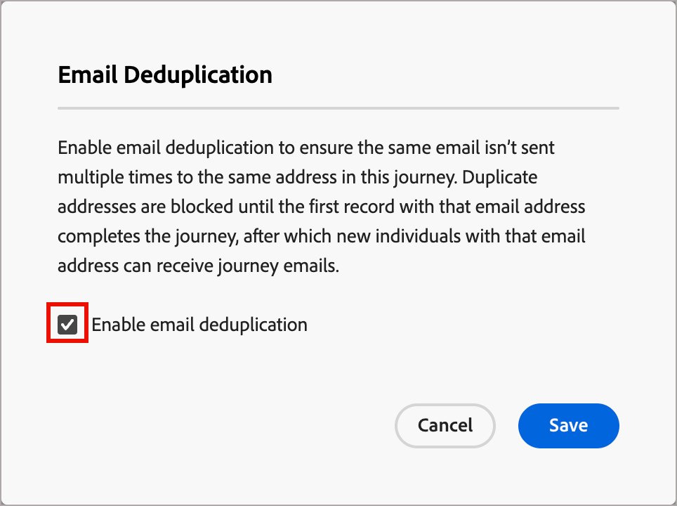

# Déduplication des e-mails

Utilisez la déduplication des e-mails dans les parcours de compte pour vous assurer que le même e-mail n’est pas envoyé plusieurs fois à la même adresse e-mail au sein d’un parcours. Lorsque vous activez cette fonctionnalité, les adresses e-mail en double sont bloquées jusqu’à ce que le premier enregistrement avec cette adresse e-mail termine le parcours. Une fois qu’un compte a terminé un parcours, une personne peut se qualifier pour recevoir à nouveau des e-mails dans le cadre d’un nouveau compte entrant dans le parcours.

## Quand utiliser la déduplication des e-mails

Il existe plusieurs scénarios clés dans lesquels vous devez envisager d’activer la déduplication des e-mails :

* **L’adresse e-mail n’est pas utilisée comme identité dans Real-Time CDP** - La même adresse e-mail peut apparaître dans plusieurs profils de personne. Si ces profils en double remplissent les critères du même parcours et que vous souhaitez empêcher l’envoi de l’e-mail plusieurs fois, activez cette fonctionnalité.

* **Personne unique associée à plusieurs comptes** - Si votre modèle de données Real-Time CDP permet d’associer une seule personne à plusieurs comptes et que vous souhaitez éviter d’envoyer deux fois le même e-mail à cette personne lorsque plusieurs comptes (y compris des profils avec la même adresse e-mail) remplissent les critères pour le même parcours, activez cette fonctionnalité.

>[!NOTE]
>
>La déduplication des e-mails s’applique au niveau du parcours. Si une personne disposant de la même adresse e-mail répond aux critères d’éligibilité pour différents parcours, elle peut toujours recevoir des e-mails de chaque parcours.

## Activer la déduplication des e-mails pour un parcours

Pour activer la déduplication des e-mails pour un parcours de compte :

1. Ouvrez un parcours de compte.

1. Cliquez sur **[!UICONTROL Plus]** (**...**) dans le coin supérieur droit de l’espace de travail du parcours.

   Espace de travail de Parcours {width="450"}

1. Choisissez **[!UICONTROL Déduplication des e-mails]**.

1. Dans la boîte de dialogue, cochez la case **[!UICONTROL Déduplication des e-mails]**.

   {width="400"}

1. Cliquez sur **[!UICONTROL Enregistrer]**

Lorsque la déduplication des e-mails est activée, le parcours vérifie chaque adresse e-mail avant d’envoyer l’e-mail. Si un enregistrement de la même adresse e-mail a déjà été saisi dans ce nœud de parcours, la nouvelle entrée est bloquée jusqu’à ce que le premier enregistrement termine le parcours.
