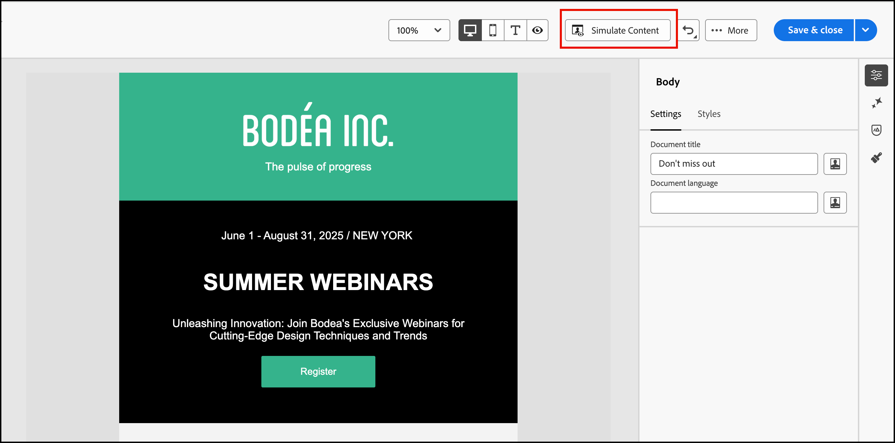

# Prévisualiser et tester le contenu de votre e-mail

Utilisez la fonctionnalité _Simuler du contenu_ pour prévisualiser le contenu de l’e-mail et envoyer des diffusions test à des destinataires spécifiques. Les champs d’e-mail obligatoires doivent être définis, notamment _[!UICONTROL Nom de l’expéditeur]_, _[!UICONTROL Adresse de l’expéditeur]_, _[!UICONTROL Adresse de réponse]_ et _[!UICONTROL Objet]_, pour accéder aux fonctionnalités d’aperçu et de test.

>[!IMPORTANT]
>
>Vous ne pouvez pas prévisualiser l’e-mail en cas d’erreur. Vérifiez le _Alertes_ pour vous assurer qu’aucune erreur ne bloque les fonctions d’aperçu. Les avertissements ne bloquent pas la prévisualisation, mais vous devez y remédier avant de publier le parcours qui déclenche la diffusion par e-mail.

## Affichage de l’aperçu de l’e-mail

1. Dans l’espace de conception d’e-mail<!-- or the email properties --> cliquez sur **[!UICONTROL Simuler du contenu]**.

   {width="800" zoomable="yes"}

   >[!NOTE]
   >
   >Ce bouton n’est pas disponible en cas d’erreur ou si les champs obligatoires ne sont pas définis pour l’e-mail.

1. Sur la page _[!UICONTROL Simuler]_, sélectionnez un profil de personne dans la liste **[!UICONTROL Personnes]** à utiliser pour le rendu de l’e-mail.

   Dans l’aperçu du contenu, les éléments personnalisés sont renseignés en fonction du profil de personne sélectionné.

   {width="800" zoomable="yes"}

   Si la liste _[!UICONTROL Personnes]_ sur la gauche est vide, [ajoutez des personnes](#add-people-to-the-profiles-list) en utilisant des contacts de l’instance Marketo Engage connectée.

   >[!TIP]
   >
   >Vous pouvez également utiliser l’intégration de rendu de test [Litmus](./email-test-rendering.md) pour vérifier le rendu des e-mails sur les clients de bureau, mobiles et web les plus courants.

## Réglage des options d’affichage

Utilisez les outils d’affichage pour modifier l’aperçu en fonction du type d’appareil ou du niveau de zoom :

* Sélectionnez l’icône _Bureau_ (  ) pour afficher l’aperçu à l’aide du style et des proportions du bureau.
* Sélectionnez l’icône _Mobile_ (  ) pour afficher l’aperçu à l’aide du style et des proportions de l’appareil mobile.
* Cliquez sur la flèche _Niveau de zoom_ et sélectionnez un pourcentage de zoom pour examiner la manière dont le contenu change en fonction du niveau de zoom.

{width="600" zoomable="yes"}

## Envoyer des BAT

Un BAT est un message de test diffusé qui vous permet, ainsi qu’aux membres de votre équipe, de vérifier un e-mail avant de l’envoyer aux membres d’une audience. Les destinataires du BAT peuvent vérifier le rendu, le contenu, les paramètres de personnalisation et la configuration du message. Vous pouvez envoyer des BAT à l’aide d’un profil de test sélectionné.

1. Cliquez sur **[!UICONTROL Envoyer un BAT]** en haut à droite.

   {width="500"}

1. Sur la page _Envoyer le BAT_, saisissez l’adresse e-mail du premier destinataire.

1. Pour chaque destinataire supplémentaire à inclure dans la révision, cliquez sur **[!UICONTROL Ajouter un destinataire]** et saisissez son adresse e-mail dans le champ **[!UICONTROL Envoyer à]**.

   Vous pouvez ajouter jusqu’à dix destinataires pour la diffusion de votre BAT.

1. Pour chaque destinataire, définissez le champ **[!UICONTROL Simuler sous]** en sélectionnant un profil de test à utiliser pour personnaliser le contenu du message.

   {width="700" zoomable="yes"}

1. Cliquez sur **[!UICONTROL Envoyer un BAT]**.

## Ajouter des personnes à la liste des profils

1. En haut de la liste _[!UICONTROL Personnes]_, cliquez sur **[!UICONTROL Ajouter des personnes]**.

   {width="500"}

1. Dans la boîte de dialogue _[!UICONTROL Ajouter des personnes à tester]_, saisissez l’adresse e-mail complète du contact.

   Pour ajouter plusieurs contacts, saisissez plusieurs adresses séparées par une virgule.

1. Cochez la case de chaque contact correspondant que vous souhaitez ajouter à la liste des profils de test.

   {width="700" zoomable="yes"}

1. Cliquez sur **[!UICONTROL Ajouter]** en haut à droite.
