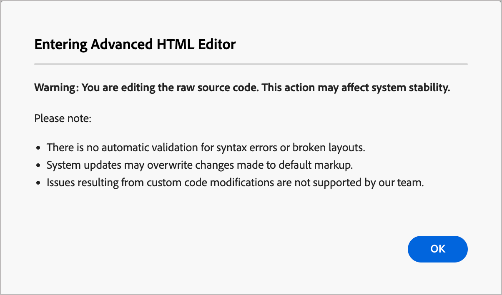

# Mode HTML avancé pour la conception de modèles d’e-mail

Le _mode HTML avancé_ fournit une vue qui permet aux utilisateurs expérimentés d’afficher et de modifier directement le code source brut du contenu du modèle d’e-mail. Ce mode est idéal lorsque vous souhaitez insérer des expressions sophistiquées, telles que la logique conditionnelle, directement dans la source. Il est également utile pour effectuer des ajustements structurels qui vont au-delà de ce que les outils de conception visuelle exposent.

<!-- We don't have the code editor at this point 
>[!NOTE]
>
>_Advanced HTML mode_ is different from the code editor option that is available when you start a new design. The code editor does not allow you to change to the visual design space. With _advanced HTML mode_, you can toggle back and forth between the HTML source view and the visual design view at any time. -->

>[!AVAILABILITY]
>
>Cette fonctionnalité est actuellement en _disponibilité limitée_ et n’est pas disponible pour tous les utilisateurs et utilisatrices.

## Limites importantes

Avant d’utiliser le mode HTML avancé pour la [création de modèles d’e-mail](./email-template-authoring.md), veillez à connaître les restrictions suivantes :

* **Pas de validation** — L’éditeur HTML n’effectue pas de vérification de la syntaxe ou de la mise en page. Examinez attentivement votre code avant d’enregistrer.

* **Mises à jour de contenu** — Les modifications futures du système peuvent affecter ou remplacer les modifications apportées aux balises par défaut en mode HTML avancé. Vérifiez votre contenu après les mises à jour du produit pour vous assurer qu’il s’affiche comme prévu.

* **Prise en charge limitée** — Adobe ne peut pas résoudre les problèmes de rendu ou les erreurs de contenu résultant de modifications de code personnalisé effectuées en mode HTML avancé.

* **Restrictions de prévisualisation** — La simulation de contenu (prévisualisation avec profils) n’est disponible que dans la vue Bureau, et non directement depuis la vue source HTML.

### Accès au mode HTML avancé

Le mode HTML avancé est accessible à partir de la barre d’outils située en haut de l’espace de conception visuelle lorsqu’un modèle d’e-mail est chargé dans la zone de travail.

1. Ouvrez ou [créez un modèle d’e-mail](./email-templates.md#create-an-email-template) et ouvrez l’espace de conception pour modifier le contenu.

1. Dans l’espace de conception, cliquez sur l’icône __ (  ) dans la barre d’outils.

   {width="750" zoomable="yes"}

   Si c’est la première fois que vous ouvrez le mode HTML avancé (ou qu’un mois ou plus s’est écoulé), un message d’avertissement s’affiche. Vérifiez les informations et cliquez sur **[!UICONTROL OK]** pour continuer.

   {width="500"}

   La zone de travail de conception passe à la vue source HTML brute.

1. Vérifiez le code et ajoutez les modifications souhaitées au contenu de l’e-mail.

   En _mode HTML avancé_, vous disposez d’un accès direct à la source HTML complète du contenu de votre modèle d’e-mail :

   * Affichez et modifiez n’importe quelle partie du balisage HTML brut.
   * Insérez des [expressions de personnalisation](./personalization.md) avancées directement dans la source.
   * Ajoutez une logique [contenu conditionnel](./conditional-content.md) à l’aide de la syntaxe d’expression.
   * Ajoutez des attributs HTML personnalisés, des balises de suivi ou d’autres balises qui ne sont pas disponibles via les contrôles de l’éditeur visuel.

   {width="800" zoomable="yes"}

   >[!IMPORTANT]
   >
   >Veillez à saisir le code HTML et CSS correct ; Adobe ne fournit pas de validation de syntaxe ni de prise en charge du code personnalisé.

   La simulation et l’enregistrement de contenu ne sont pas disponibles en mode HTML avancé pour des raisons de compatibilité. Vous pouvez revenir à la vue de bureau pour prévisualiser votre contenu et enregistrer le modèle. Toutes les modifications que vous apportez sont conservées lorsque vous basculez entre la vue source HTML et la vue de conception visuelle.

   Si vous cliquez sur **[!UICONTROL Enregistrer]** ou **[!UICONTROL Enregistrer et fermer]** en haut à droite lorsque vous êtes en mode HTML avancé, une boîte de dialogue d’alerte s’affiche pour vous informer que vous devez quitter le mode HTML avancé avant d’enregistrer le modèle et de quitter l’espace de conception.

   {width="500"}

1. Cliquez sur l’icône _[!UICONTROL Desktop]_ (  ) dans la barre d’outils pour passer du mode HTML avancé (la vue source HTML) à la zone de travail de conception visuelle.

   Vos modifications sont conservées lorsque vous changez de vue.
