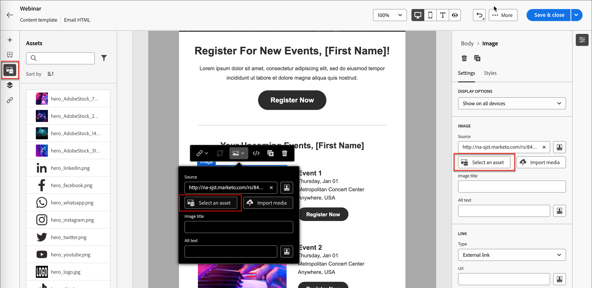

# Modèles d&#39;e-mail

Pour accélérer et améliorer le processus de conception, vous pouvez créer des modèles d’email autonomes pour réutiliser du contenu personnalisé sur les parcours de compte de Adobe Journey Optimizer B2B Edition. Grâce aux modèles, les membres de votre équipe orientés contenu peuvent travailler sur le contenu d’un email en dehors des parcours. Les stratèges marketing peuvent ensuite réutiliser et adapter ces modèles autonomes dans leurs parcours de compte. Par exemple, un membre de l’équipe est responsable du contenu uniquement, sans accès aux parcours du compte. Cependant, ils peuvent créer un modèle de courrier électronique que les marketeurs peuvent sélectionner comme point de départ pour les communications par courrier électronique et le personnaliser en fonction des exigences du parcours.

## Accès et gestion des modèles d’email

Pour accéder aux modèles d’email dans l’édition B2B de Adobe Journey Optimizer, accédez au volet de navigation de gauche et cliquez sur **[!UICONTROL Gestion de contenu]** > **[!UICONTROL Modèles]**. Cette action ouvre une page de liste avec tous les modèles d&#39;email créés dans l&#39;instance répertoriés dans un tableau.

Le tableau est trié par colonne _[!UICONTROL Modifié]_, les modèles mis à jour le plus récemment se trouvant en haut de la liste par défaut. Cliquez sur le titre de la colonne pour passer d’un titre croissant à un titre décroissant.

Pour rechercher un modèle par nom, saisissez une chaîne de texte dans la barre de recherche. Cliquez sur l’icône _Filtrer_ en haut à gauche pour filtrer la liste en fonction des dates de création ou de modification et des modèles que vous avez créés ou modifiés.

{width="700" zoomable="yes"}

Personnalisez les colonnes que vous souhaitez afficher dans le tableau en cliquant sur l’icône _Personnaliser le tableau_ en haut à droite. Sélectionnez les colonnes à afficher et cliquez sur **[!UICONTROL Appliquer]**.

Sur la page de liste, vous pouvez effectuer les actions décrites dans les sections suivantes.

## Créer des modèles de courrier électronique

Vous pouvez créer un modèle d’email à partir de la page de liste des modèles d’email en cliquant sur **[!UICONTROL Créer un modèle]** en haut à droite.

1. Dans la boîte de dialogue, saisissez un **[!UICONTROL Nom]** et une **[!UICONTROL Description]** (facultatif).

   {width="400"}

1. Définissez la **[!UICONTROL source d&#39;image]** initiale.

   Si vous disposez d’un abonnement pour Experience Manager Assets as a Cloud Service ainsi que de Adobe Marketo Engage Design Studio par défaut, vous pouvez sélectionner des ressources d’image à partir de l’une des sources. Pour cela, vous devez sélectionner la source de l&#39;image au moment de la création pour un modèle d&#39;email ou un fragment visuel. Cependant, vous pouvez également sélectionner la source de l’image lorsque vous modifiez le contenu.

   Pour plus d’informations sur les sources d’images, voir [Assets](./assets-overview.md).

1. Cliquez sur **[!UICONTROL Créer]**.

La page _[!UICONTROL Concevez votre modèle]_ s’ouvre et fournit plusieurs options pour créer le modèle : _[!UICONTROL Concevoir à partir de zéro]_, _[!UICONTROL Importer un HTML]_ ou _[!UICONTROL Sélectionner un modèle de conception]_.

{width="800" zoomable="yes"}

### Créer en partant de zéro {#design-from-scratch}

>[!CONTEXTUALHELP]
>id="ajo-b2b_structure_components_template"
>title="Ajout de composants de structure"
>abstract="Les composants de structure définissent la disposition du modèle. Faites glisser et déposez un composant de **structure** dans la zone de travail pour commencer à concevoir le contenu de votre modèle."

>[!CONTEXTUALHELP]
>id="ajo-b2b_content_components_template"
>title="À propos des composants de contenu"
>abstract="Les composants de contenu sont des espaces réservés de contenu vides que vous pouvez utiliser pour créer la disposition d’un modèle."

Utilisez le concepteur d&#39;email pour définir la structure de votre contenu d&#39;email. En ajoutant et en déplaçant des composants structurels à l’aide de simples actions de glisser-déposer, vous pouvez concevoir la forme du contenu d’email réutilisable en quelques secondes.

1. Sur la page d&#39;accueil _[!UICONTROL Concevez votre modèle]_ , sélectionnez l&#39;option **[!UICONTROL Concevoir à partir de zéro]** .

1. Commencez à concevoir votre contenu en faisant glisser des composants dans la zone de travail afin de définir la disposition structurelle de l&#39;email.

   Les outils de conception disponibles sont équivalents aux outils utilisés pour la [création d’email](./email-authoring.md). La différence est que ce contenu est ensuite enregistré comme un modèle qui peut être réutilisé sur plusieurs noeuds d’e-mail d’envoi dans les parcours de compte.

### Importer du contenu HTML

L’édition B2B de Adobe Journey Optimizer vous permet d’importer du contenu d’HTML existant pour concevoir vos modèles d’email. Ce contenu peut être :

* Un fichier d’HTML avec une feuille de style intégrée.
* Fichier .zip contenant un fichier d’HTML, la feuille de style (.css) et les images

  >[!NOTE]
  >
  >Il n’existe aucune contrainte sur la structure des fichiers .zip. Cependant, les références doivent être relatives et s’ajuster à l’arborescence du dossier .zip.

_Pour importer un fichier contenant du contenu HTML :_

1. Sur la page d&#39;accueil _[!UICONTROL Concevez votre modèle]_ , sélectionnez l&#39;option **[!UICONTROL Importer l&#39;HTML]** .

1. Faites glisser et déposez le fichier HTML ou .zip contenant le contenu HTML, puis cliquez sur **[!UICONTROL Importer]**.

   Une fois le contenu de l’HTML téléchargé, votre contenu est en _mode de compatibilité_. Dans ce mode, vous pouvez uniquement personnaliser votre texte, ajouter des liens ou inclure des ressources à votre contenu.

1. Pour utiliser les composants de contenu du Concepteur d&#39;email, cliquez sur l&#39;onglet **[!UICONTROL Convertisseur d&#39;HTMLS]** et cliquez sur **[!UICONTROL Convertir]**.

>[!NOTE]
>
>L’utilisation d’une balise `<table>` comme première couche d’un fichier HTML peut entraîner une perte de style, y compris les paramètres d’arrière-plan et de largeur dans la balise de couche supérieure.

Vous pouvez personnaliser le contenu importé selon vos besoins à l’aide des outils visuels de l’éditeur d’email.

### Sélection d’un modèle de conception

Sur la page d’accueil _[!UICONTROL Concevez votre modèle]_ , utilisez la section Sélectionner un modèle de conception pour commencer à créer votre contenu à partir d’un modèle. Vous pouvez utiliser un exemple de modèle ou un modèle de courrier électronique enregistré à partir de votre instance Journey Optimizer B2B Edition.

>[!BEGINTABS]

>[!TAB Modèles enregistrés]

Sur la page d&#39;accueil _Concevez votre modèle_, l&#39;onglet _Modèles d&#39;exemple_ est sélectionné par défaut. Pour utiliser un modèle personnalisé, sélectionnez l’onglet **[!UICONTROL Modèles enregistrés]** .

La liste de tous les modèles de courrier électronique créés sur l’environnement de test actuel s’affiche. Vous pouvez les trier par _[!UICONTROL Nom]_, _[!UICONTROL Dernière modification]_ et _[!UICONTROL Dernière création]_.

{width="800" zoomable="yes"}

Sélectionnez le modèle de votre choix dans la liste.

Une fois la sélection effectuée, un aperçu du modèle s’affiche. En mode Aperçu, vous pouvez naviguer entre tous les modèles d’une catégorie (échantillon ou enregistré, selon votre sélection) à l’aide des flèches droite et gauche.

{width="800" zoomable="yes"}

Lorsque l’affichage correspond à ce que vous souhaitez utiliser, cliquez sur **[!UICONTROL Utiliser ce modèle]** en haut à droite de la fenêtre d’aperçu.

Cette action copie le contenu dans le concepteur de contenu visuel, où vous pouvez modifier le contenu selon vos besoins.

>[!TAB Exemple de modèle]

L’édition B2B de Adobe Journey Optimizer offre une sélection de modèles d’email _prêts à l’emploi_, qui peuvent être utilisés pour créer des emails et des modèles d’email.

{width="800" zoomable="yes"}

>[!ENDTABS]

## Ajouter la structure et le contenu

Commencez à concevoir votre contenu en faisant glisser des structures du menu **[!UICONTROL Composants]** vers la zone de travail pour définir la mise en page de votre email.

Ajoutez autant de structures que nécessaire et modifiez leurs paramètres dans les propriétés de l’élément sur la droite.

Sélectionnez le composant _[!UICONTROL n:n column]_ pour définir le nombre de colonnes de votre choix (entre trois et dix). Définissez la largeur de chaque colonne en déplaçant les flèches vers le bas.

>[!NOTE]
>
>La taille de chaque colonne ne peut pas être inférieure à 10 % de la largeur totale du composant de structure. Vous pouvez uniquement supprimer les colonnes vides.

Développez la section **[!UICONTROL Contenu]** et ajoutez autant d’éléments que nécessaire dans un ou plusieurs composants de structure.

Chaque composant peut être personnalisé à l’aide des onglets _[!UICONTROL Paramètres]_ ou _[!UICONTROL Style]_ dans le panneau de droite. Par exemple, vous pouvez modifier le style de texte, la marge ou la marge intérieure de chaque composant.

### Navigation dans les calques, les paramètres et le style

L&#39;exemple suivant décrit les étapes à suivre pour ajuster la marge intérieure et l&#39;alignement vertical à l&#39;intérieur d&#39;un composant de structure composé de trois colonnes.

1. Sélectionnez le composant de structure directement dans l&#39;email ou à l&#39;aide de l&#39;arborescence de navigation disponible dans le menu de gauche.

1. Dans la barre d&#39;outils, cliquez sur **[!UICONTROL Sélectionner une colonne]** et choisissez celle que vous souhaitez modifier.

   {width="800" zoomable="yes"}

   Vous pouvez également la sélectionner dans l&#39;arborescence. Les paramètres modifiables de cette colonne sont affichés dans l’onglet _[!UICONTROL Styles]_.

1. Sous **[!UICONTROL Alignement]**, sélectionnez l’icône _Haut_, _Milieu_ ou _Bas_ .

1. Sous **[!UICONTROL Marge intérieure]**, définissez la marge intérieure de tous les côtés.

   Sélectionner **[!UICONTROL Marge intérieure différente pour chaque côté]** si vous souhaitez mieux définir la marge intérieure. Cliquez sur l’icône représentant un verrou pour interrompre la synchronisation.

1. Si nécessaire, ajustez l&#39;alignement et la marge intérieure des autres colonnes.

1. Enregistrez vos modifications.

### Personnaliser le contenu

L’exemple suivant décrit les étapes de personnalisation du contenu du modèle à l’aide des attributs de prospect/compte et des jetons système.

1. Sélectionnez le composant de texte et cliquez sur l’icône _Ajouter la personnalisation_ de la barre d’outils.

   {width="500"}

   Cette action ouvre la boîte de dialogue _Modifier Personalization_.

1. Cliquez sur **+** ou **...** pour ajouter un jeton à l’espace vide.

   {width="700" zoomable="yes"}

1. Cliquez sur **[!UICONTROL Enregistrer]**.

### Ajouter des fragments

Dans l’éditeur visuel de contenu, l’icône _Fragments_ s’affiche sur la gauche. L’exemple suivant décrit les étapes à suivre pour ajouter des fragments au contenu du modèle.

1. Pour ouvrir la liste des fragments, cliquez sur l’icône _Fragments_ .

   Vous pouvez effectuer les actions suivantes :

   * Triez la liste.
   * Parcourir, rechercher ou filtrer la liste.
   * Basculez entre les modes Miniature et Liste.
   * Actualisez la liste pour refléter les fragments récemment créés.

   {width="700" zoomable="yes"}

1. Faites glisser l’un des fragments dans l’espace réservé du composant de structure.

   L’éditeur effectue le rendu du fragment dans la section/l’élément de la structure de l’email.

Le contenu du fragment est mis à jour de manière dynamique dans la structure afin d’afficher un visuel sur l’affichage du contenu dans l’email.

Si vous souhaitez ajouter le fragment afin qu&#39;il occupe l&#39;intégralité de la disposition horizontale dans l&#39;email, ajoutez une structure de colonnes 1:1, puis faites glisser et déposez le fragment dans celui-ci.

Une fois l’email enregistré, il apparaît dans la page des détails du fragment lorsque vous sélectionnez l’onglet _[!UICONTROL Utilisé par]_ dans le résumé. Les fragments ajoutés à un modèle de courrier électronique ne sont pas modifiables dans le modèle ; le contenu est défini par le fragment source.

### Ajout de ressources

Dans l’éditeur visuel de contenu, sélectionnez l’icône _Assets_ qui s’affiche à gauche.

>[!NOTE]
>
>Si vous disposez d’un abonnement pour Experience Manager Assets as a Cloud Service ainsi que pour Adobe Marketo Engage Design Studio par défaut, vous pouvez sélectionner des ressources d’image à partir de la source sélectionnée dans la page de détails du modèle.

L’exemple suivant décrit les étapes à suivre pour ajouter des ressources au contenu du modèle :

1. Pour ouvrir la bibliothèque de ressources, cliquez sur l’icône _Assets_ .

   À partir du sélecteur de ressources, vous pouvez sélectionner directement des ressources stockées dans la bibliothèque source.

1. Ajoutez une nouvelle ressource en la faisant glisser dans un composant de structure.

1. Remplacez une ressource image en la sélectionnant sur la zone de travail, puis en cliquant sur **[!UICONTROL Sélectionner une ressource]** dans les outils de source d’image.

   {width="700" zoomable="yes"}

### Prévisualisation et modification des URL

1. Cliquez sur l&#39;icône _[!UICONTROL Liens]_ à gauche pour afficher toutes les URL de votre contenu à suivre.

1. Si nécessaire, cliquez sur l&#39;icône _Modifier_ (crayon) et modifiez le _Type de suivi_ ou le _Libellé_ et ajoutez _Balises_ pour un lien.

{width="500"}

### Options d’affichage

Tirez parti des options de vue et de validation du contenu disponibles dans l’éditeur visuel de courrier électronique.

* Zoom avant/arrière sur le contenu sur les options de zoom prédéfinies.

* Basculez l’affichage du contenu sur Bureau, Mobile ou Texte unique/Texte brut.
   * Cliquez sur l’icône _OEil_ pour afficher l’aperçu du contenu sur tous les appareils.
   * Sélectionnez l’un des appareils prêts à l’emploi ou saisissez des dimensions personnalisées pour prévisualiser le contenu.

### Plus d’options

À partir du sélecteur _Plus d’options_ de l’éditeur de contenu visuel, vous pouvez effectuer les actions suivantes :

{width="500"}

* **Réinitialiser le modèle** - Cliquez sur cette option pour effacer le canevas visuel du concepteur d’email sur une barre d’outils vide et redémarrer la création de contenu.
* **Enregistrer en tant que fragment** - Enregistrez tout ou partie de ce fragment en tant que fragment à réutiliser dans plusieurs emails ou modèles de courrier électronique. Vous fournissez un nom et une description pour les fragments, puis il s’affiche dans la liste des fragments disponibles.
* **Modifiez votre conception** - Revenez à la page _Concevez votre modèle_. À partir de là, vous pouvez agir comme indiqué dans la section &quot;Créer des modèles d’email&quot;.
* **Exporter l’HTML** - Téléchargez le contenu dans la zone de travail visuelle vers votre système local au format d’HTML présenté sous la forme d’un fichier zip.

## Afficher les détails d’un modèle de courrier électronique

Sur la page de liste Modèles , cliquez sur le nom d’un modèle de courrier électronique pour ouvrir la page de détails du modèle de courrier électronique. À partir de là, vous pouvez afficher les propriétés de base du modèle d’email et accéder à l’éditeur visuel de contenu pour apporter des modifications au contenu du modèle.

{width="700" zoomable="yes"}

* Affichez les détails du modèle de courrier électronique, tels que le nom et la description. Ces paramètres peuvent être modifiés. Cliquez en dehors de la zone de description pour enregistrer automatiquement les modifications.

* Affichez les propriétés du modèle d’email telles que les propriétés créées par, créées le, mises à jour le plus récent et modifiées par .

* Cliquez sur **[!UICONTROL Plus]** en haut à droite pour exécuter des actions rapides sur le modèle de courrier électronique, telles que _Dupliquer_ et _Supprimer_.

* S’il existe des alertes actives (erreurs et avertissement pour le modèle d’email), cliquez sur **[!UICONTROL Alertes]** en haut à droite pour afficher les informations.

  Bien que ces alertes n’interdisent pas l’utilisation du modèle d’email pour la création d’email, ces informations permettent aux marketeurs de se familiariser avec ce qui pourrait ne pas fonctionner et les mises à jour requises avant qu’il ne puisse être utilisé pour la diffusion.

## Affichage des références utilisées par le modèle de courrier électronique

Dans la page des détails des modèles d’email, cliquez sur l’onglet **[!UICONTROL Utilisé par]** pour afficher les détails de l’utilisation de ce modèle d’email dans les emails sur les parcours de compte.

{width="400"}

Les emails de Journey Optimizer B2B Edition sont incorporés et créés dans parcours. Par conséquent, le parcours parent de l’email qui utilise le modèle s’affiche dans les références.

* Cliquez sur le lien pour accéder à l&#39;email de parcours correspondant dans lequel le modèle d&#39;email est utilisé.

* Quittez la vue à tout moment en cliquant sur la flèche Précédent, ce qui vous ramène à la page de liste.

## Modifier des modèles de courrier électronique

Cette action peut être réalisée à partir des éléments suivants :

* La page de détails - Cliquez sur **[!UICONTROL Modifier le modèle d&#39;email]**.
* La page de liste : cliquez sur les points de suspension (**...**) en regard d’un modèle de courrier électronique et choisissez **[!UICONTROL Modifier]**.

Cette action vous conduit à la page _Concevoir votre modèle_ ou à la page de l’éditeur de contenu visuel en fonction du dernier état enregistré du modèle d’email. À partir de là, vous pouvez modifier le contenu de votre modèle d’email selon vos besoins. Pour plus d’informations sur les options de modification, voir [Création de modèles d’email](#create-email-templates) .

## Dupliquer des modèles d&#39;email

Vous pouvez dupliquer un modèle d&#39;email en utilisant l&#39;une des méthodes suivantes :

* Dans les détails du modèle d&#39;email sur la droite, développez **[!UICONTROL Plus]** et cliquez sur **[!UICONTROL Dupliquer]**.

  {width="400"}

* Sur la page de liste _Modèles d&#39;email_, cliquez sur les points de suspension (...) en regard du modèle et sélectionnez **[!UICONTROL Dupliquer]**.

Dans la boîte de dialogue, saisissez un nom (unique) et une description utiles. Cliquez sur **[!UICONTROL Dupliquer]** pour terminer l’action.

Le modèle de courrier électronique dupliqué (nouveau) s’affiche alors dans la liste _Modèles de courrier électronique_.

## Supprimer des modèles de courrier électronique

La suppression d’un modèle de courrier électronique est irréversible. Vérifiez donc avant de lancer une action de suppression. Vous pouvez supprimer un modèle d&#39;email à l&#39;aide de l&#39;une des méthodes suivantes :

* Dans les détails du modèle à droite, développez **[!UICONTROL Plus]** et cliquez sur **[!UICONTROL Supprimer]**.
* Sur la page de liste _Modèles d&#39;email_, cliquez sur les points de suspension (...) en regard du modèle et choisissez **[!UICONTROL Supprimer]**.

  {width="500"}

Cette action ouvre une boîte de dialogue de confirmation. Vous pouvez interrompre le processus en cliquant sur **[!UICONTROL Annuler]** ou sur **[!UICONTROL Supprimer]** pour confirmer la suppression.

## Actions en masse

Dans la page de liste des modèles d’email, sélectionnez plusieurs modèles à la fois en cochant les cases à gauche. Une bannière s’affiche en bas lorsque vous sélectionnez plusieurs modèles.

{width="600"}

**[!UICONTROL Supprimer]** : vous pouvez supprimer jusqu’à 20 modèles à la fois. Une boîte de dialogue de confirmation vous permet d’abandonner l’action ou de confirmer la suppression des modèles.

## Création d’un email à partir d’un modèle enregistré

Depuis l’écran _Créer votre e-mail_, utilisez la section _Sélectionner un modèle de conception_ pour commencer à créer votre contenu à partir d’un modèle.

Pour commencer à créer votre contenu avec l’un des modèles d’email créés, procédez comme suit :

1. Accédez au Designer d&#39;email à partir de la page _Modifier le contenu_ .

   Sur la page _Créer votre email_, l&#39;onglet _Modèles d&#39;exemple_ est sélectionné par défaut.

1. Pour utiliser un modèle de courrier électronique personnalisé, sélectionnez l’onglet **[!UICONTROL Modèles enregistrés]** .

   Cet onglet affiche la liste de tous les modèles de courrier électronique créés dans l’environnement de test. Vous pouvez les trier _Par nom_, _Dernière modification_ et _Dernière création_.

1. Sélectionnez le modèle de votre choix dans la liste.

   Une fois la sélection effectuée, un aperçu du modèle s’affiche. En mode Aperçu, vous pouvez naviguer entre tous les modèles d’une catégorie (échantillon ou enregistré, selon votre sélection) à l’aide des flèches droite et gauche.

1. Cliquez sur **[!UICONTROL Utiliser ce modèle]** en haut à droite.

1. Dans le concepteur de contenu visuel, modifiez votre contenu selon vos besoins.
