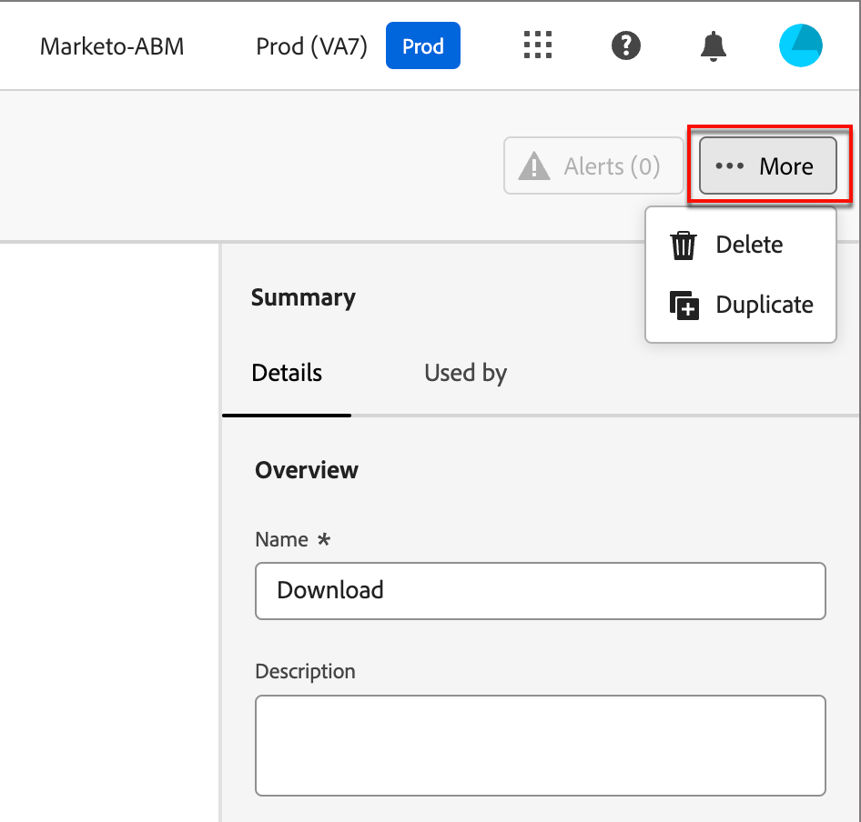

# Modèles d’e-mail

Pour accélérer et améliorer le processus de conception, vous pouvez créer des modèles d’e-mail autonomes pour réutiliser du contenu personnalisé dans les parcours de compte [!DNL Adobe Journey Optimizer B2B Edition]. Grâce aux modèles, les membres de votre équipe orientés contenu peuvent travailler sur le contenu des e-mails en dehors des parcours. Les stratégistes marketing peuvent ensuite réutiliser et adapter ces modèles autonomes dans leurs parcours de compte. Par exemple, un membre de l’équipe est responsable du contenu uniquement, sans accès aux parcours du compte. Cependant, ils peuvent créer un modèle d’e-mail que les marketeurs peuvent sélectionner comme point de départ pour les communications par e-mail et le personnaliser en fonction des exigences du parcours.

## Accéder aux modèles d’e-mail et les gérer

Pour accéder aux modèles d’e-mail dans [!DNL Journey Optimizer B2B Edition], accédez au volet de navigation de gauche et cliquez sur **[!UICONTROL Gestion de contenu]** > **[!UICONTROL Modèles]**. Dans le panneau latéral, sélectionnez **[!UICONTROL Modèles d’e-mail]**.

Cette action ouvre une page de liste avec tous les modèles d’e-mail créés dans l’instance répertoriée au format tableau.

La liste est triée par défaut en fonction de la colonne _[!UICONTROL Modifié]_, les modèles les plus récemment mis à jour étant affichés en haut. Cliquez sur le titre de la colonne pour passer d’un ordre croissant à un ordre décroissant.

Pour rechercher un modèle par nom, saisissez une chaîne de texte dans la barre de recherche. Cliquez sur l’icône _Filtrer_ en haut à gauche pour filtrer la liste en fonction des dates de création ou de modification et des modèles que vous avez créés ou modifiés.

{width="700" zoomable="yes"}

Personnalisez les colonnes à afficher dans le tableau en cliquant sur l’icône _Personnaliser le tableau_ (  ) en haut à droite. Sélectionnez les colonnes à afficher et cliquez sur **[!UICONTROL Appliquer]**.

Dans la liste des modèles affichée, vous pouvez effectuer les actions décrites dans les sections suivantes.

## Création d’un modèle d’e-mail

Vous pouvez créer un modèle d’e-mail à partir de la page de liste des modèles d’e-mail en cliquant sur **[!UICONTROL Créer un modèle]** en haut à droite.

1. Dans la boîte de dialogue, saisissez un **[!UICONTROL Nom]** et un **[!UICONTROL Description]** utiles (facultatif).

   {width="400"}

1. Cliquez sur **[!UICONTROL Créer]**.

La page _[!UICONTROL Concevoir votre modèle]_ s’ouvre et propose plusieurs options pour créer le modèle : _[!UICONTROL Créer en partant de zéro]_, _[!UICONTROL Importer HTML]_ ou _[!UICONTROL Sélectionner un modèle de conception]_.

{width="800" zoomable="yes"}

Après avoir sélectionné la méthode à utiliser pour commencer la conception de votre modèle d’e-mail, utilisez l’espace de conception visuel pour [créer le contenu de votre modèle d’e-mail](./email-template-authoring.md).

### Créer en partant de zéro

Utilisez l’éditeur visuel de contenu pour définir la structure du contenu de l’e-mail. En ajoutant et en déplaçant des composants structurels à l’aide de simples actions de glisser-déposer, vous pouvez concevoir la forme du contenu d’e-mail réutilisable en quelques secondes.

>[!NOTE]
>
>Les outils de conception disponibles sont équivalents à ceux utilisés pour la [ création d’e-mails ](./email-authoring.md). La différence est que ce contenu est ensuite enregistré en tant que modèle pouvant être réutilisé sur plusieurs nœuds _envoyer un e-mail_ dans les parcours de compte.

1. Sur la page d’accueil _[!UICONTROL Concevez votre modèle]_, sélectionnez l’option **[!UICONTROL Créer en partant de zéro]**.

1. Dans la boîte de dialogue _[!UICONTROL Créer un e-mail]_, choisissez le type de contenu d’e-mail à utiliser pour le modèle.

   * **[!UICONTROL Utiliser les thèmes]** - Sélectionnez cette option pour créer le modèle d’e-mail en _mode thème_. Dans ce mode, vous pouvez utiliser un thème de marque défini pour rationaliser le processus de création de contenu et vous assurer que la conception s’aligne sur les normes définies.

   {width="450"}

   * **[!UICONTROL Style manuel]** - Sélectionnez cette option pour créer le modèle d’e-mail en _mode manuel_. Dans ce mode, vous définissez manuellement la mise en forme de tous les composants de structure et de contenu que vous ajoutez à la zone de travail vierge.

1. (_mode Thèmes_ uniquement) Appliquez un thème.

   Dans l’espace de conception d’e-mail, cliquez sur l’icône _Thèmes_ (  ) à droite.

   {width="600" zoomable="yes"}

   Le thème par défaut ou le thème appliqué au modèle s’affiche. Vous pouvez basculer entre les variantes de couleur pour ce thème.

   Cliquez sur la flèche en regard du thème affiché pour afficher la liste des thèmes personnalisés et Adobe disponibles. Sélectionnez **[!UICONTROL Mes thèmes]** pour utiliser un thème personnalisé créé pour votre organisation.

   Lorsque vous cliquez en dehors de la liste, le thème sélectionné applique les styles. Vous pouvez basculer entre les variantes de couleur.

1. [Ajoutez la structure et le contenu](./email-authoring.md#add-structure-and-content) au modèle.

   Si un thème est appliqué, les composants ajoutés héritent automatiquement des styles définis dans le thème.

### Importer du contenu HTML

Adobe Journey Optimizer B2B edition vous permet d’importer du contenu HTML existant afin de concevoir vos modèles d’e-mail.

{{$include /help/_includes/content-design-import.md}}

{width="500"}

>[!NOTE]
>
>L’utilisation d’une balise `<table>` comme première couche d’un fichier HTML peut entraîner une perte de style, y compris les paramètres d’arrière-plan et de largeur dans la balise de couche supérieure.

Vous pouvez personnaliser le contenu importé selon vos besoins dans l’espace de conception visuelle.

### Sélection d’un modèle de conception

{{$include /help/_includes/content-design-select-template.md}}

## Afficher les détails du modèle d’e-mail

Dans la page de liste Modèles , cliquez sur le nom d’un modèle d’e-mail pour ouvrir la page de détails du modèle d’e-mail. À partir de là, vous pouvez afficher les propriétés de base du modèle d’e-mail et accéder à l’éditeur visuel de contenu pour apporter des modifications au contenu du modèle.

{width="700" zoomable="yes"}

* Affichez les détails du modèle d’e-mail, tels que le nom et la description. Ces paramètres peuvent être modifiés. Cliquez en dehors de la zone de description pour enregistrer automatiquement les modifications.

* Affichez les propriétés du modèle d’e-mail, telles que créé par, créé le, Dernière mise à jour le et Modifié par.

* Cliquez sur **[!UICONTROL Plus]** en haut à droite pour agir rapidement sur le modèle d’e-mail, par exemple _Dupliquer_ et _Supprimer_.

* S’il existe des alertes actives (erreurs et avertissement pour le modèle d’e-mail), cliquez sur **[!UICONTROL Alertes]** en haut à droite pour afficher les informations.

  Ces alertes n’interdisent pas l’utilisation du modèle d’e-mail pour la création d’e-mails. Les informations permettent aux spécialistes marketing de votre équipe d’avoir une idée de ce qui peut ne pas fonctionner et des mises à jour requises avant de pouvoir les utiliser pour la diffusion.

## Afficher le modèle d’e-mail utilisé par les références

Dans la page de détails des modèles d’e-mail, cliquez sur l’onglet **[!UICONTROL Utilisé par]** pour afficher les détails sur l’utilisation de ce modèle d’e-mail dans les e-mails des parcours de compte.

{width="400"}

Les e-mails dans Journey Optimizer B2B edition sont incorporés et créés dans des parcours. De ce fait, le parcours parent de l’e-mail qui utilise le modèle est affiché dans les références.

* Cliquez sur le lien pour accéder à l’e-mail de parcours correspondant où le modèle d’e-mail est utilisé.

* Quittez la vue à tout moment en cliquant sur la flèche Précédent, qui vous ramène à la page de liste.

## Modifier les modèles d’e-mail

Cette action peut être effectuée à partir de :

* Page de détails - Cliquez sur **[!UICONTROL Modifier le modèle d’e-mail]**.
* La page de liste : cliquez sur les points de suspension (**...**) à côté d’un modèle d’e-mail et choisissez **[!UICONTROL Modifier]**.

Cette action vous conduit à la page _Concevoir votre modèle_ ou à la page de l’éditeur de contenu visuel (en fonction du dernier statut enregistré du modèle d’e-mail). À partir de là, vous pouvez modifier le contenu de votre modèle d’e-mail selon vos besoins. Voir [Créer des modèles d’e-mail](#create-email-templates) pour plus d’informations sur les options de modification.

## Dupliquer les modèles d’e-mail

Vous pouvez dupliquer un modèle d’e-mail à l’aide de l’une des méthodes suivantes :

* Dans les détails du modèle d’e-mail sur la droite, développez **[!UICONTROL Plus]** et cliquez sur **[!UICONTROL Dupliquer]**.

  {width="400"}

* Sur la page de liste _[!UICONTROL Modèles d’e-mail]_, cliquez sur les points de suspension (...) en regard du modèle et choisissez **[!UICONTROL Dupliquer]**.

Dans la boîte de dialogue, saisissez un nom utile (unique) et une description. Cliquez sur **[!UICONTROL Dupliquer]** pour terminer l’action.

Le modèle d’e-mail (nouveau) dupliqué apparaît alors dans la liste _[!UICONTROL Modèles d’e-mail]_.

## Supprimer les modèles d’e-mail

La suppression d’un modèle d’e-mail ne peut pas être annulée. Vérifiez-la avant de lancer une action de suppression. Vous pouvez supprimer un modèle d’e-mail à l’aide de l’une des méthodes suivantes :

* Dans les détails du modèle sur la droite, développez **[!UICONTROL Plus]** et cliquez sur **[!UICONTROL Supprimer]**.
* Sur la page de liste _[!UICONTROL Modèles d’e-mail]_, cliquez sur les points de suspension (...) en regard du modèle et choisissez **[!UICONTROL Supprimer]**.

  {width="500"}

Cette action ouvre une boîte de dialogue de confirmation. Vous pouvez abandonner le processus en cliquant sur **[!UICONTROL Annuler]** ou sur **[!UICONTROL Supprimer]** pour confirmer la suppression.

## Prendre des actions en bloc

Sur la page de liste des modèles d’e-mail, sélectionnez plusieurs modèles à la fois en cochant les cases situées à gauche. Une bannière s’affiche en bas lorsque vous sélectionnez plusieurs modèles.

{width="600"}

**[!UICONTROL Supprimer]** — Vous pouvez supprimer jusqu&#39;à 20 modèles à la fois. Une boîte de dialogue de confirmation vous permet d’abandonner l’action ou de confirmer la suppression des modèles.

## Créer un e-mail à partir d’un modèle enregistré

Depuis l’écran _Créer votre e-mail_, utilisez la section _Sélectionner un modèle de conception_ pour commencer à créer votre contenu à partir d’un modèle.

Pour commencer à créer votre contenu avec l’un des modèles d’e-mail créés, procédez comme suit :

1. Accédez au Designer d’e-mail à partir de la page _Modifier le contenu_.

   Sur la page _Créer votre e-mail_, l’onglet _Exemples de modèles_ est sélectionné par défaut.

1. Pour utiliser un modèle d’e-mail personnalisé, sélectionnez l’onglet **[!UICONTROL Modèles enregistrés]**.

   Cet onglet affiche la liste de tous les modèles d’e-mail créés sur le sandbox. Vous pouvez les trier _Par nom_, _Dernière modification_ et _Dernière création_.

1. Sélectionnez le modèle de votre choix dans la liste.

   Une fois la sélection effectuée, un aperçu du modèle s’affiche. En mode Aperçu , vous pouvez naviguer entre tous les modèles d’une catégorie (exemple ou modèle enregistré, selon votre sélection) à l’aide des flèches droite et gauche.

1. Cliquez sur **[!UICONTROL Utiliser ce modèle]** en haut à droite.

1. Dans l’espace de conception visuelle, modifiez votre contenu selon vos besoins.
