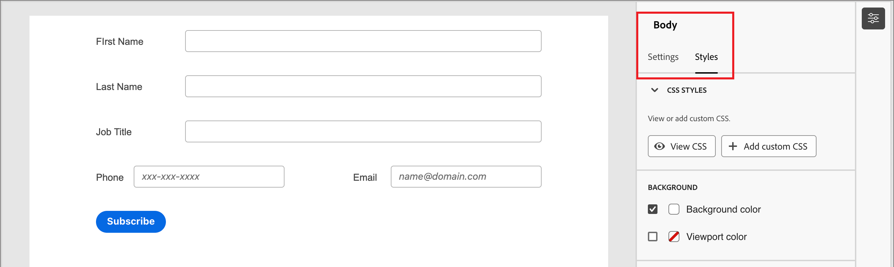

# Conception de formulaire

Après avoir [créé un formulaire](./landing-pages.md#create-a-landing-page), l’espace de conception visuelle ouvre un brouillon avec une définition de formulaire de base par défaut. Dans le panneau _[!UICONTROL Résumé]_ à droite, cliquez sur **[!UICONTROL Modifier le formulaire]** et utilisez l’espace de conception visuelle pour définir le style du formulaire et les composants de champ.

{width="700" zoomable="yes"}

## Champs

Les champs de formulaire sont utilisés pour capturer des données de profil de personne qui peuvent être utilisées pour cibler des personnes et les associer à des comptes et des groupes d’achats. Tous les nouveaux formulaires commencent par les champs suivants dans une seule disposition de colonne :

* Prénom
* Nom
* Adresse e-mail

Utilisez les outils de conception de champs pour construire l’ensemble des champs et la mise en page dont vous avez besoin pour collecter les données dont vous avez besoin pour vos activités marketing basées sur les comptes.

### Ajouter un champ {#add-field}

1. Dans le panneau _[!UICONTROL Composants]_ à gauche, faites glisser le composant de contenu **[!UICONTROL Champ]** et déposez-le sur la zone de travail.

   {width="700" zoomable="yes"}

1. Cliquez sur **[!UICONTROL Sélectionner l’attribut de champ]**.

1. Dans la boîte de dialogue _[!UICONTROL Sélectionner l’attribut de champ]_, cochez la case correspondant à l’attribut de profil de personne à utiliser pour le champ, puis cliquez sur **[!UICONTROL Sélectionner]**.

   Les [schémas métier XDM](../data/field-mapping.md#xdm-business-person-attributes) déterminent les attributs disponibles.  Tous les champs personnalisés définis pour votre instance Journey Optimizer B2B edition sont également disponibles. Utilisez la zone de texte Rechercher pour filtrer la liste par nom ou cliquez sur l’icône Filtrer pour filtrer la liste par schéma/type de données.

   {width="700" zoomable="yes"}

   Sur la zone de travail, le libellé du champ par défaut pour l’attribut sélectionné est renseigné sur la zone de travail. Les **[!UICONTROL Détails du champ]** s’affichent dans le panneau de droite.

1. Si nécessaire, modifiez le texte **[!UICONTROL Libellé]**.

   Ce texte s’affiche en regard du champ du formulaire. Le texte par défaut est renseigné à partir de l’attribut field.

1. Définissez **[!UICONTROL Type de champ]** en fonction du type de données du champ :

   | Type de champ | Utilisation | Exemple |
   | ---------- | ----- | ------- |
   | **[!UICONTROL Case à cocher]** | Utilisez ce type afin que les visiteurs puissent sélectionner une valeur _true_ (cochée) ou _false_ (non cochée). | |
   | **[!UICONTROL Groupe de cases à cocher]** | Utilisez ce type afin que les visiteurs puissent sélectionner une valeur _true_ (cochée) ou _false_ (non cochée) pour plusieurs éléments. | |
   | **[!UICONTROL Devise]** | Utilisez ce type pour autoriser un champ flottant qui représente le type de devise par défaut sélectionné pour l’instance Journey Optimizer B2B edition. | |
   | **[!UICONTROL Date]** | Utilisez ce type pour restreindre la saisie à un format de date et fournir un sélecteur de calendrier dans le champ. | |
   | **[!UICONTROL Double]** |  | |
   | **[!UICONTROL E-mail]** | Utilisez ce type pour restreindre la saisie à un format d’adresse électronique. | |
   | **[!UICONTROL Nombre]** | Utilisez ce type pour restreindre le champ à une valeur numérique. | |
   | **[!UICONTROL Groupe de cases d’option]** | Utilisez ce type pour permettre aux visiteurs de sélectionner l’une des options d’un ensemble. | |
   | **[!UICONTROL Sélectionner]** | Utilisez ce type pour permettre aux visiteurs de sélectionner l’une des options d’un ensemble d’options à l’aide d’une liste déroulante. | |
   | **[!UICONTROL Curseur]** | Utilisez ce type pour permettre aux visiteurs de définir une valeur numérique à l’aide d’un curseur. | |
   | **[!UICONTROL Téléphone]** | Utilisez ce type pour un champ de saisie de numéro de téléphone. | |
   | **[!UICONTROL Texte]** | Utilisez ce type pour un champ de saisie de texte standard (chaîne). | |
   | **[!UICONTROL Zone de texte]** | Utilisez ce type pour prendre en charge une entrée de texte plus longue. | |
   | **[!UICONTROL URL]** | Utilisez ce type pour limiter la saisie de texte à une URL, y compris le protocole d’URL standard. | |

1. Selon le type de champ sélectionné, définissez les autres options pour l’entrée de champ et la validation :

   {width="400" zoomable="yes"}

   * **[!UICONTROL Espace réservé]** - Valeur d’espace réservé pour le champ qui donne au visiteur un exemple de ce qui est attendu pour le champ.

   * **[!UICONTROL Instructions]** - Texte instructif qui aide le visiteur à remplir le champ. Saisissez le texte à afficher en tant que _texte de survol_ pour le champ.

     >[!TIP]
     >
     >_Instructions ou texte d’espace réservé_ 
     >
     >Utilisez ces deux propriétés pour guider les visiteurs et visiteuses à remplir le champ. Le texte d’instruction s’affiche sous forme d’info-bulle ou de texte contextuel lorsque le curseur est placé sur le champ. Le texte d’espace réservé apparaît _grisé_ dans le champ et disparaît lorsque le visiteur saisit son texte dans le champ. Vous pouvez utiliser les deux méthodes ou une seule.

   * **[!UICONTROL Valeur par défaut]** - Utilisez cette option pour spécifier une valeur par défaut pour le champ.

   * **[!UICONTROL Message de validation]** - Utilisez cette option pour spécifier un message de validation pour le champ. Ce message s’affiche si le visiteur saisit une valeur non valide pour le champ. Le message _[!UICONTROL Standard]_ est défini par défaut. Choisissez **[!UICONTROL Personnalisé]** et saisissez votre propre message.

   * **Longueur maximale** - Saisissez le nombre maximal de caractères pouvant être saisis dans le champ.

1. Définissez la variable **[!UICONTROL Comportements de champ]** selon vos besoins :

   * **Obligatoire** - Cochez la case pour que l’entrée de champ soit requise pour l’envoi du formulaire.

   * **Activer le masque de saisie** - Cochez la case pour restreindre la saisie du visiteur à l’aide d’un masque de saisie. Par exemple, vous pouvez souhaiter que les visiteurs et visiteuses saisissent des numéros de téléphone dans un format spécifique. Dans la boîte de dialogue, saisissez le masque en utilisant `9` pour n’importe quel nombre, `a` pour n’importe quelle lettre et `*` pour l’un ou l’autre. Cliquez sur Enregistrer pour activer le masque de saisie spécifié.

     {width="500" zoomable="yes"}

### Modifier le style d’un champ {#field-styling}

Sélectionnez l’onglet **[!UICONTROL Styles]** dans le panneau de droite pour modifier la mise en forme du champ sélectionné.

* **[!UICONTROL Arrière-plan]** - Cochez la case pour appliquer une couleur d’arrière-plan au champ. Le blanc est la couleur par défaut. Cliquez sur le carré **[!UICONTROL Couleur d’arrière-plan]** pour ouvrir le sélecteur de couleurs contextuel et choisir une couleur pour l’arrière-plan du champ.

  {width="600" zoomable="yes"}

* **[!UICONTROL Libellé]** - Le style du libellé contrôle les caractéristiques visuelles du texte affiché à côté du champ. Choisissez un affichage du libellé supérieur ou latéral par rapport au champ. Vous pouvez définir la taille de la police, la hauteur de la ligne, le style du texte et l’alignement du texte. Cliquez sur le carré **[!UICONTROL Couleur de police]** pour ouvrir le sélecteur de couleurs contextuel et choisir une couleur pour le texte du libellé.

  {width="600" zoomable="yes"}

* **[!UICONTROL Bordure]** - Cliquez sur le carré **[!UICONTROL Couleur de bordure]** pour ouvrir le sélecteur de couleurs contextuel et sélectionner une couleur pour la bordure. Vous pouvez définir une bordure pour le champ, y compris la couleur et la largeur de ligne. Décochez la case pour supprimer la bordure du champ affichée. Vous pouvez également modifier la taille de la bordure (largeur en pixels), le style et le rayon des angles.

  {width="600" zoomable="yes"}

* **[!UICONTROL Taille]** - Sélectionnez un paramètre de taille pour déterminer la largeur d’affichage du champ. Choisissez _[!UICONTROL Pleine largeur]_, _[!UICONTROL Demi-largeur]_ ou _[!UICONTROL Auto]_.

* **[!UICONTROL Marge]** - Définissez des marges (en pixels) autour du champ. Vous pouvez définir la même marge sur les quatre côtés ou cocher la case **[!UICONTROL Marge différente pour chaque côté]** pour définir séparément les marges horizontale et verticale.

* **[!UICONTROL Marge intérieure]** - Définissez la marge intérieure (en pixels) autour du champ. Vous pouvez définir la même marge sur les quatre côtés ou cocher la case **[!UICONTROL Marge intérieure différente pour chaque côté]** pour définir les marges horizontales et verticales séparément.

  {width="600" zoomable="yes"}

### Réorganiser les champs {#field-reorder}

Vous pouvez déplacer les champs de formulaire directement dans l’espace de travail visuel. Cliquez sur l’outil _Déplacer_ sur le bord droit du champ sélectionné et faites-le glisser vers un nouvel emplacement.

Ajoutez des composants structurels au formulaire et déplacez les champs dans des colonnes pour les regrouper et modifier la disposition. Cliquez sur l’outil _Déplacer_ sur le bord gauche du composant de colonne sélectionné et faites-le glisser vers un nouvel emplacement dans le formulaire.

{width="500"}

### Supprimer ou dupliquer un champ {#field-delete-duplicate}

Cliquez sur l’icône _Supprimer_ (  ) dans la barre d’outils ou dans le panneau de droite pour supprimer un champ sélectionné. Dans la boîte de dialogue de confirmation, cliquez sur **[!UICONTROL Supprimer]**.

Cliquez sur l’icône _Dupliquer_ (  ) dans la barre d’outils ou le panneau de droite pour dupliquer un champ sélectionné. Le nouveau champ s’affiche juste en dessous du champ d’origine. Cliquez sur **[!UICONTROL Sélectionner l’attribut de champ]** pour définir l’attribut du champ. Définissez le type de champ, les détails et les styles selon vos besoins.

{width="600" zoomable="yes"}

## Bouton Envoyer

Le bouton d’envoi (champ de pied de page) fait partie du formulaire par défaut et ne peut pas être supprimé. Sélectionnez le composant Bouton/Pied de page dans le formulaire pour modifier le texte et le style du bouton.

### Modifier le contenu du bouton {#button-content}

Avec l’onglet _[!UICONTROL Contenu]_ affiché dans le panneau de droite, modifiez le texte dans le champ **[!UICONTROL Texte du bouton]**. Le dimensionnement du bouton s’ajuste en fonction de la longueur du texte.

{width="600" zoomable="yes"}

### Donner un style au bouton d’envoi {#button-styles}

Sélectionnez l’onglet **[!UICONTROL Styles]** dans le panneau de droite pour modifier la mise en forme du composant de bouton/pied de page sélectionné.

* **[!UICONTROL Arrière-plan]** - Cochez la case pour appliquer une couleur d’arrière-plan au bouton. Le bleu est la couleur par défaut. Cliquez sur le carré **[!UICONTROL Couleur d’arrière-plan]** pour ouvrir le sélecteur de couleurs de la fenêtre contextuelle et choisir une couleur pour l’arrière-plan du bouton.

  {width="600" zoomable="yes"}

* **[!UICONTROL Libellé]** - Le style du libellé contrôle les caractéristiques visuelles du texte à l’intérieur du bouton. Vous pouvez définir la taille de la police, la hauteur de la ligne, le style du texte et l’alignement du texte. Cliquez sur le carré **[!UICONTROL Couleur de police]** pour ouvrir le sélecteur de couleurs contextuel et choisir une couleur pour le texte du libellé.

* **[!UICONTROL Bordure]** - Cliquez sur le carré **[!UICONTROL Couleur de bordure]** pour ouvrir le sélecteur de couleurs contextuel et sélectionner une couleur pour la bordure. Vous pouvez définir une bordure pour le bouton, y compris la couleur et la largeur de ligne. Décochez la case pour supprimer la bordure du bouton affichée. Vous pouvez également modifier la taille de la bordure (largeur en pixels), le style et le rayon des angles arrondis.

* **[!UICONTROL Taille]** - Sélectionnez un paramètre de taille pour déterminer la largeur d’affichage du bouton. Choisissez _[!UICONTROL Pleine largeur]_, _[!UICONTROL Demi-largeur]_ ou _[!UICONTROL Auto]_. La marge intérieure s’ajuste en fonction de la taille et des paramètres d’alignement.

  {width="600" zoomable="yes"}

* **[!UICONTROL Alignement des boutons]** - Lorsque vous choisissez une taille _Demi-largeur_ ou _Auto_ pour le bouton, définissez l’alignement à gauche, à droite ou au centre. La marge intérieure s’ajuste en fonction de la taille et des paramètres d’alignement.

* **[!UICONTROL Marge]** - Définissez des marges (en pixels) autour du champ. Vous pouvez définir la même marge sur les quatre côtés ou cocher la case **[!UICONTROL Marge différente pour chaque côté]** pour définir séparément les marges horizontale et verticale.

* **[!UICONTROL Marge intérieure]** - Définissez la marge intérieure (en pixels) autour du champ. Vous pouvez définir la même marge sur les quatre côtés ou cocher la case **[!UICONTROL Marge intérieure différente pour chaque côté]** pour définir les marges horizontales et verticales séparément. La marge intérieure s’ajuste si vous modifiez la taille et les paramètres d’alignement.

  {width="600" zoomable="yes"}

## Style du formulaire {#form-styling}

Vous pouvez modifier les styles de la zone de formulaire lorsque vous cliquez en dehors des composants de structure ou de formulaire. Les composants de formulaire (champs et bouton) héritent des styles _Body_ définis au niveau supérieur, sauf si d’autres styles sont définis au niveau du champ ou du bouton/pied de page.

{width="600" zoomable="yes"}

### Styles CSS

Les nouveaux formulaires utilisent le CSS par défaut pour le style. Si vous souhaitez modifier les styles en modifiant le CSS, vous pouvez le copier, puis l’utiliser pour définir un CSS personnalisé pour le formulaire.

_Pour définir un CSS personnalisé pour le formulaire :_

1. Cliquez sur **[!UICONTROL Affichage CSS]** dans le panneau de droite pour passer en revue le code CSS.

   {width="450" zoomable="yes"}

1. Sélectionnez le code CSS dans la fenêtre de défilement et copiez-le dans le presse-papiers.

1. Cliquez sur **[!UICONTROL Fermer]**.

1. (Facultatif) Collez le code copié dans votre outil CSS préféré et modifiez le CSS pour refléter le style que vous souhaitez.

1. Cliquez sur **[!UICONTROL Ajouter un CSS personnalisé]** dans le panneau de droite.

1. Collez le code CSS dans la fenêtre.

   {width="450" zoomable="yes"}

   Vous pouvez modifier le texte collé dans cette fenêtre.

1. Cliquez sur **[!UICONTROL Enregistrer]**.

### Style manuel

Modifiez les paramètres du panneau de droite pour définir l’affichage de l’ensemble du formulaire.

* **[!UICONTROL Couleur d’arrière-plan]** - Cochez la case pour appliquer une couleur d’arrière-plan autour de la zone de formulaire. Le blanc est la couleur par défaut. Cliquez sur le carré de couleurs pour ouvrir le sélecteur de couleurs contextuel et choisissez une couleur pour l’arrière-plan du formulaire.

* **[!UICONTROL Arrière-plan de la fenêtre d’affichage]** - Cochez la case pour appliquer une couleur d’arrière-plan à tous les composants de formulaire. La valeur par défaut est aucune couleur (héritée de l’arrière-plan extérieur). Cliquez sur le carré de couleurs pour ouvrir le sélecteur de couleurs contextuel et choisissez une couleur pour les composants structurels de formulaire.

  {width="600" zoomable="yes"}

* **[!UICONTROL Texte]** - Sélectionnez une **[!UICONTROL famille de polices]** pour le formulaire, ce qui affecte les libellés, l’indice et le texte d’espace réservé des champs de formulaire. Cela affecte également le texte du bouton d’envoi par défaut.

* **[!UICONTROL Taille]** - Modifiez la taille (largeur) du formulaire en pixels.

* **[!UICONTROL Marge]** - Définissez des marges (en pixels) autour des composants de formulaire. Vous pouvez définir la même marge sur les quatre côtés ou cocher la case **[!UICONTROL Marge différente pour chaque côté]** pour définir séparément les marges horizontale et verticale.

  {width="600" zoomable="yes"}
