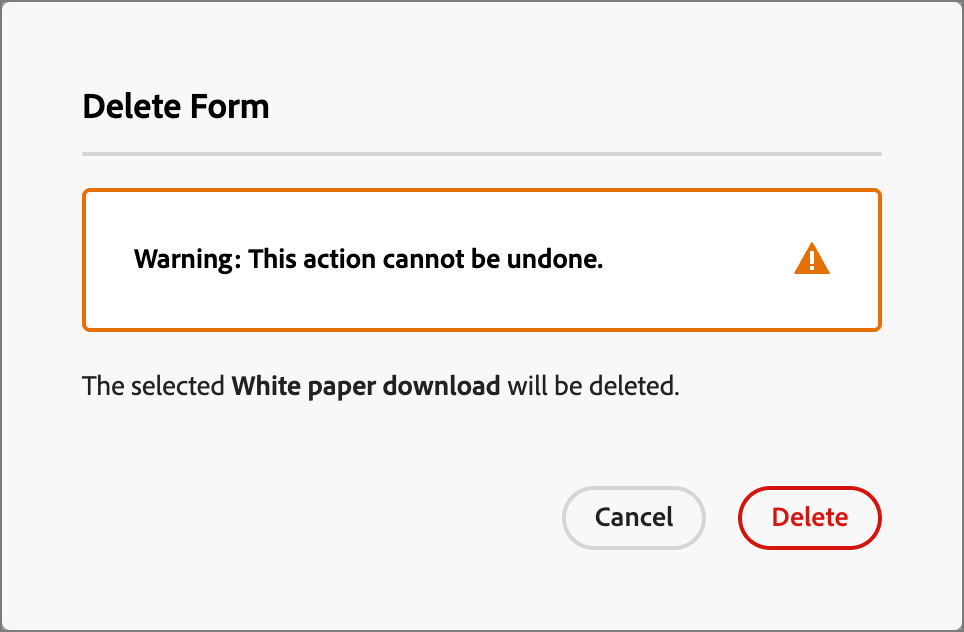
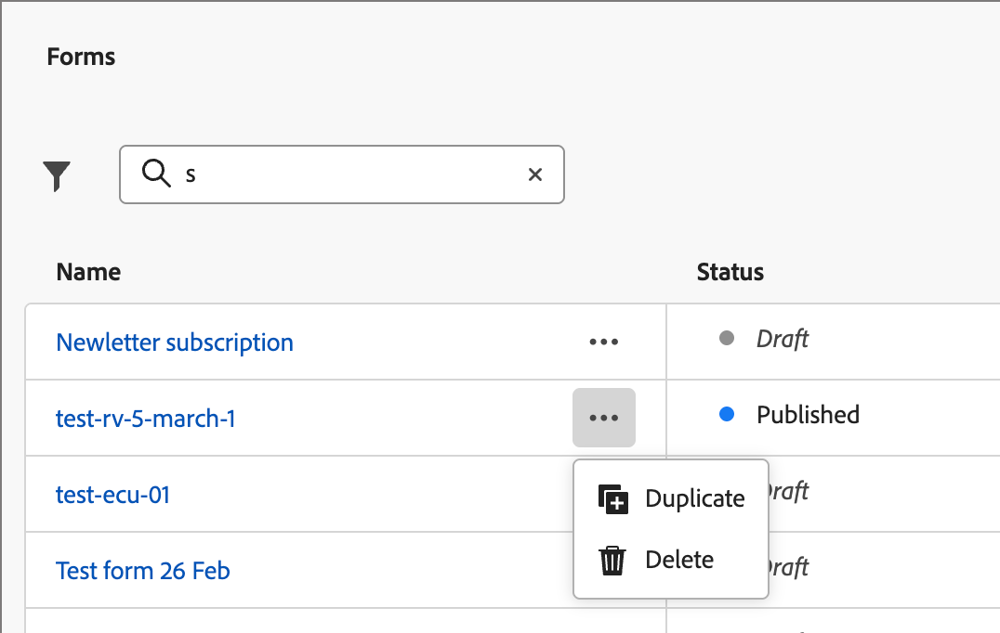

# Formulaires

Pour capturer des informations auprès des visiteurs et visiteuses de pages web, créez des formulaires et ajoutez-les à vos pages de destination. Un formulaire est un ensemble de champs que les visiteurs de la page remplissent et envoient pour obtenir un type de contenu ou d’offre, tel qu’un article technique, un webinaire à la demande ou une version d’essai gratuite.

La quantité d’informations que le formulaire doit capturer dépend de la valeur du contenu ou de l’offre. Si vous proposez quelque chose de simple, comme un livre blanc, vous ne devez recueillir que des informations minimales, telles que leur nom, leur adresse e-mail et leur société. Si l’offre a une valeur supérieure, comme une démonstration ou une version d’essai gratuite, vous pouvez collecter davantage d’informations. L’exigence d’un formulaire envoyé pour permettre l’affichage du contenu est appelée _contenu contrôlé_. Votre entreprise décide du contenu à contrôler et de celui qui ne l’est pas (_libre_). La bonne pratique consiste à autoriser gratuitement certains contenus et à ne réserver qu’à votre contenu premium ou à forte demande.

## Accéder aux formulaires et les gérer

Pour accéder aux formulaires dans Journey Optimizer B2B edition, accédez au volet de navigation de gauche et cliquez sur **[!UICONTROL Gestion de contenu]** > **[!UICONTROL Forms]**. Cette action ouvre une page de liste répertoriant tous les formulaires créés dans l’instance répertoriée dans un tableau.

{width="700" zoomable="yes"}

Le tableau est trié selon la colonne _[!UICONTROL Modifié]_, les formulaires les plus récemment mis à jour étant en haut par défaut. Cliquez sur le titre de la colonne pour passer d’un ordre croissant à un ordre décroissant.

### Statut et cycle de vie du formulaire

Le statut du formulaire détermine sa disponibilité pour une utilisation dans une page de destination ou un modèle de page de destination, ainsi que les modifications que vous pouvez y apporter.

| Statut | Description |
| -------------------- | ----------- |
| Brouillon | Lorsque vous créez un formulaire, il a le statut de brouillon. Il reste dans ce statut lorsque vous définissez ou modifiez les champs jusqu’à ce que vous le publiiez pour l’utiliser dans une page de destination ou un modèle de page de destination. Actions disponibles : <ul><li>Modifier tous les détails<li>Modification dans l’espace de conception visuelle<li>Publier<li>Dupliquer<li>Supprimer |
| Publié | Lorsque vous publiez un formulaire, il peut être utilisé dans une page de destination ou un modèle de page de destination. Le contenu du formulaire publié ne peut pas être modifié dans l’espace de conception visuelle. Actions disponibles : <ul><li>Modifier le nom, la description ou la page de remerciement<li>Ajouter à une page de destination ou à un modèle de page de destination<li>Créer une version brouillon<li>Dupliquer<li>Supprimer (si non utilisé)<li>Code incorporé |
| Publié avec le brouillon | Lorsque vous créez un brouillon à partir d’un formulaire publié, la version publiée reste disponible pour une utilisation dans une page de destination ou un modèle de page de destination, et le contenu du brouillon peut être modifié dans l’espace de conception visuelle. Si vous publiez le brouillon, il remplace la version publiée actuelle et le contenu est mis à jour dans les pages de destination ou les modèles de page de destination où il est utilisé. Actions disponibles : <ul><li>Modifier le nom, la description ou les pages de remerciement<li>Ajouter à une page de destination ou à un modèle de page de destination<li>Modifier le brouillon dans l’espace de conception visuelle<li>Publier le brouillon<li>Dupliquer<li>Supprimer (si non utilisé)<li>Code incorporé |

{zoomable="yes"}

### Filtrer la liste des formulaires

Pour rechercher une correspondance dans un formulaire par nom, saisissez une chaîne de texte dans la barre de recherche. Cliquez sur l’icône _Filtrer_ (  ) pour afficher les options de filtre disponibles et modifier les paramètres afin de filtrer les éléments affichés en fonction de vos critères spécifiés.

{width="700" zoomable="yes"}

### Personnalisation de l’affichage des colonnes

Personnalisez les colonnes à afficher dans le tableau en cliquant sur l’icône _Personnaliser le tableau_ (  ) en haut à droite.

Dans la boîte de dialogue, sélectionnez les colonnes à afficher et cliquez sur **[!UICONTROL Appliquer]**.

{width="300"}

## Création de formulaires

Avant de commencer à créer des formulaires réutilisables dans Journey Optimizer B2B edition, tenez compte des points suivants :

* Déterminez les formulaires dont vous avez besoin.

  Il est possible de n&#39;utiliser que quatre formulaires types. Une pour accéder au contenu téléchargeable, une pour accéder aux pages web premium, une pour visionner des vidéos et une pour s’inscrire à des webinaires, par exemple. Si vous devez modifier un champ d’un formulaire, il est plus facile de mettre à jour quatre formulaires standard utilisés globalement au lieu de modifier plusieurs formulaires répartis dans tous vos programmes marketing. <!-- Global forms also make progressive profiling much easier to implement. -->

* Pour chaque formulaire standard, déterminez les champs à utiliser et comment les présenter.

  Envisagez d’utiliser des formulaires plus courts, car ils se sont avérés meilleurs pour les conversions. Lorsque vous réfléchissez à chaque formulaire, décidez quels champs sont raisonnables et nécessaires pour son objectif.

  Indiquez s’il faut préremplir les champs du formulaire, de sorte que les informations de base, telles que le nom et l’adresse électronique, soient préremplies. Mais d’autres informations, telles que l’intitulé du poste et la taille de l’organisation, ne le sont pas. Ainsi, le visiteur n’a besoin de remplir que deux champs et d’envoyer le formulaire. Vous pouvez également utiliser un formulaire de réseau social rempli de données provenant de Facebook ou de Twitter.

* Planifiez la page de relance qui s’affiche après l’envoi d’un formulaire par un visiteur (page _merci_).

  Est-ce que tout le monde a la même page ou est-elle dynamique et basée sur ses données ? Par exemple, un professionnel de la santé peut voir un contenu de page différent de celui d’un professionnel de la technologie.

* Pensez à contourner entièrement un formulaire si vous disposez déjà des informations dont vous avez besoin.

  Lorsque vous autorisez un contournement de formulaire pour une personne connue qui visite votre page de destination, elle peut simplement accéder directement au contenu. Le fait de contourner le formulaire offre une expérience du visiteur plus rationalisée.

### Ajouter un nouveau formulaire

Vous pouvez créer un formulaire dans Journey Optimizer B2B edition en cliquant sur **[!UICONTROL Créer un formulaire]** en haut à droite de la page de liste _[!UICONTROL Forms]_.

1. Dans la boîte de dialogue _[!UICONTROL Créer un formulaire]_, saisissez un **[!UICONTROL Nom]** utile (obligatoire) et un **[!UICONTROL Description]** (facultatif).

   Exigences de formulaire :

   * Nom : 100 caractères maximum, doit être unique et ne pas respecter la casse.

   * Description - 300 caractères maximum

   * Les caractères Alpha, numériques et spéciaux sont autorisés

   * Les caractères réservés ne sont **_pas autorisés_** : `\ / : * ? " < > |`

   {width="400"}

1. Cliquez sur **[!UICONTROL Créer]**.

   La page de détails du formulaire s’ouvre avec une définition de formulaire de base par défaut.

   {width="700" zoomable="yes"}

### Modifier la conception de formulaire par défaut

Utilisez les outils de conception visuelle pour modifier le contenu du formulaire selon vos besoins :

* [Ajouter des champs](./form-design.md#add-a-field)
* [Modifier le style d’un champ](./form-design.md#change-field-styling)
* [Réorganiser les champs](./form-design.md#reorder-fields)
* [Modifier le texte et le style du bouton Envoyer](./form-design.md#edit-and-style-the-submit-button)
* [Modifier le style du formulaire](./form-design.md#change-form-styling)

Cliquez sur **[!UICONTROL Enregistrer et fermer]** pour enregistrer les modifications apportées à la conception du contenu du formulaire et accédez aux détails du formulaire.

### Définir la page de remerciement

Dans le panneau _[!UICONTROL Résumé]_ à droite, faites défiler l’écran jusqu’à la section **[!UICONTROL Page de remerciement]** et utilisez le paramètre **[!UICONTROL Suivre avec]** pour définir ce qui se passe lorsqu’un visiteur envoie le formulaire :

* **[!UICONTROL Rester sur la page]** - Sélectionnez cette option pour que le visiteur reste sur la même page lors de l’envoi du formulaire.

* **[!UICONTROL Page de destination]** - Sélectionnez cette option pour sélectionner n’importe quelle page de destination Journey Optimizer B2B edition ou Marketo Engage comme suite.

* **[!UICONTROL URL externe]** - Sélectionnez cette option pour spécifier n’importe quelle URL comme page de suivi. Une fois que le visiteur a envoyé le formulaire, le navigateur charge l’URL désignée.

  >[!TIP]
  >
  >Si vous souhaitez utiliser le formulaire pour télécharger un fichier, vous pouvez spécifier une URL pour le fichier hébergé. Avec cette configuration, le bouton d’envoi fonctionne comme un bouton de téléchargement.

### Publier le brouillon de formulaire

Lorsque vous êtes prêt à rendre le formulaire disponible pour une utilisation dans une page de destination ou un modèle de page de destination, cliquez sur **[!UICONTROL Publier]**.

{width="400"}

Cette action ouvre une boîte de dialogue de confirmation. Vous pouvez abandonner le processus de publication en cliquant sur **[!UICONTROL Annuler]** ou sur **[!UICONTROL Publier]** pour confirmer.

## Afficher les détails du formulaire

Cliquez sur le nom d’un formulaire dans la page de liste pour ouvrir la page des détails du fragment. Vous pouvez choisir de modifier le formulaire, de le renommer ou de mettre à jour sa description. Effectuez des mises à jour et cliquez en dehors du champ de nom ou de description pour enregistrer automatiquement les modifications.

>[!NOTE]
>
>Si un formulaire publié est utilisé par une page de destination ou un modèle de page de destination, vous ne pouvez pas modifier le contenu ni la page de remerciement. Vous pouvez créer un brouillon si vous souhaitez apporter des modifications aux formulaires.

{width="600" zoomable="yes"}

Cliquez sur **[!UICONTROL Modifier le formulaire]** pour ouvrir le fragment dans l’espace de conception visuelle.

Quittez la vue à tout moment en cliquant sur la flèche _Précédent_ en haut à gauche, qui vous renvoie à la page de liste _[!UICONTROL Forms]_.

## Afficher les références du formulaire utilisé par

Dans le panneau _[!UICONTROL Résumé]_ à droite, cliquez sur l’onglet **[!UICONTROL Utilisé par]** pour afficher les détails de l’emplacement où le formulaire est actuellement utilisé dans Journey Optimizer B2B edition, sur les pages de destination et les modèles de page de destination.

>[!IMPORTANT]
>
>Les formulaires actuellement utilisés par une page de destination ou un modèle de page de destination ne peuvent pas être supprimés.

{width="600" zoomable="yes"}

Les références sont affichées selon la catégorie : _Page de destination_ ou _Modèle de page de destination_. Cliquez sur le lien pour ouvrir la page ou le modèle correspondant dans lequel le formulaire est utilisé.

## Supprimer des formulaires

Les formulaires actuellement utilisés par une page de destination ou un modèle de page de destination ne peuvent pas être supprimés. Vous pouvez vérifier les références _utilisé par_ avant de lancer la suppression d’un formulaire. En outre, une suppression ne peut pas être annulée. Vérifiez-la avant de lancer une action de suppression.

Vous pouvez supprimer un formulaire à l’aide de l’une des méthodes suivantes :

* En haut à droite, cliquez sur **[!UICONTROL ... Plus]** puis choisissez **[!UICONTROL Supprimer]**.
* Dans la page de liste _[!UICONTROL Forms]_, cliquez sur les points de suspension en regard du nom du formulaire et choisissez **[!UICONTROL Supprimer]**.

Cette action ouvre une boîte de dialogue de confirmation. Vous pouvez abandonner le processus en cliquant sur **[!UICONTROL Annuler]** ou sur **[!UICONTROL Supprimer]** pour confirmer la suppression.

{width="400"}

Si le formulaire est en cours d’utilisation, l’action ouvre une boîte de dialogue d’information qui vous avertit qu’il ne peut pas être supprimé. Cliquez sur **[!UICONTROL OK]** pour annuler la suppression.

{width="400"}

## Dupliquer les formulaires

Dupliquez un formulaire comme moyen simple et rapide de créer un formulaire à partir d’un formulaire existant comme point de départ pour votre conception de formulaire.

Vous pouvez dupliquer un formulaire à l’aide de l’une des méthodes suivantes :

* En haut à droite de la page des détails du formulaire, cliquez sur **[!UICONTROL ... En plus]** et choisissez **[!UICONTROL Dupliquer]**.
* Dans la page de liste _[!UICONTROL Forms]_, cliquez sur les points de suspension en regard du nom du formulaire et choisissez **[!UICONTROL Dupliquer]**.

{width="450"}

Dans la boîte de dialogue, saisissez un nom utile (unique) et une description. Cliquez sur **[!UICONTROL Dupliquer]** pour terminer l’action.

{width="400"}

Modifiez le duplicata de formulaire pour changer le nom si nécessaire et modifier le formulaire pour son utilisation prévue.

## Modification de formulaires

Les modifications apportées à un formulaire dépendent de son statut actuel :

* Lorsqu’un formulaire a le statut _Brouillon_, vous pouvez modifier n’importe quel détail et contenu (champs, bouton et style).
* Lorsqu’un formulaire a le statut _Publié_, vous pouvez modifier son nom ou sa description. Vous ne pouvez pas modifier le contenu.
* Lorsqu’un formulaire est à l’état _Publié avec le statut Brouillon_, vous pouvez modifier le nom ou la description du formulaire. Dans le brouillon, vous pouvez également modifier le contenu et la ou les pages de remerciement

>[!BEGINTABS]

>[!TAB Brouillon]

1. Dans la page de liste _[!UICONTROL Forms]_, cliquez sur le nom du formulaire pour l&#39;ouvrir.

   Un aperçu du contenu du formulaire s’affiche avec les détails du formulaire à droite.

1. Modifiez l’un des détails, tels que le nom et la description.

   {width="600" zoomable="yes"}

1. Pour apporter des modifications au formulaire dans l’espace de conception visuelle, cliquez sur **[!UICONTROL Modifier le formulaire]**.

   Utilisez les outils de conception visuelle selon vos besoins :

   * [Ajouter des champs](./form-design.md#add-a-field)
   * [Modifier le style d’un champ](./form-design.md#change-field-styling)
   * [Réorganiser les champs](./form-design.md#reorder-fields)
   * [Modifier le texte et le style du bouton Envoyer](./form-design.md#submit-button)
   * [Modifier le style du formulaire](./form-design.md#change-form-styling)

   Cliquez sur **[!UICONTROL Enregistrer et fermer]** pour revenir aux détails du formulaire.

1. Lorsque le formulaire répond à vos critères et que vous souhaitez le rendre disponible pour une utilisation dans une page de destination ou un modèle de page de destination, cliquez sur **[!UICONTROL Publier]**.

>[!TAB Publié]

1. Dans la page de liste _[!UICONTROL Forms]_, cliquez sur le nom du formulaire pour l&#39;ouvrir.

   Un aperçu du contenu du formulaire s’affiche avec les détails du formulaire à droite.

1. Pour créer un brouillon afin de modifier le formulaire, cliquez sur **[!UICONTROL Modifier le formulaire]** dans le panneau _[!UICONTROL Résumé]_ à droite.

1. Cliquez sur **[!UICONTROL Créer un brouillon]** dans la boîte de dialogue pour ouvrir le brouillon dans l’espace de conception visuelle.

   {width="400"}

1. Utilisez les outils de conception visuelle nécessaires pour mettre à jour le contenu du formulaire :

   * [Ajouter des champs](./form-design.md#add-a-field)
   * [Modifier le style d’un champ](./form-design.md#change-field-styling)
   * [Réorganiser les champs](./form-design.md#reorder-fields)
   * [Modifier le texte et le style du bouton Envoyer](./form-design.md#submit-button)
   * [Modifier le style du formulaire](./form-design.md#change-form-styling)

   Cliquez sur **[!UICONTROL Enregistrer et fermer]** pour revenir aux détails du formulaire.

1. Lorsque le brouillon de formulaire répond à vos critères et que vous souhaitez rendre les modifications disponibles pour une utilisation dans une page de destination ou un modèle de page de destination, cliquez sur **[!UICONTROL Publier]**.

   Lorsque vous publiez le brouillon, il remplace la version publiée actuelle et le contenu du formulaire est mis à jour dans les pages de destination ou les modèles de page de destination où il est déjà utilisé.

>[!TAB Publié avec le brouillon]

1. Cliquez sur le nom du formulaire pour l’ouvrir.

1. Sélectionnez l’onglet **[!UICONTROL Brouillon]**.

   Un aperçu du contenu du formulaire de version préliminaire s’affiche, avec les détails du formulaire à droite.

   {width="700" zoomable="yes"}

1. Cliquez sur **[!UICONTROL Modifier le formulaire]** dans le volet _[!UICONTROL Résumé]_ à droite et utilisez les outils de conception visuelle nécessaires :

   * [Ajouter des champs](./form-design.md#add-a-field)
   * [Modifier le style d’un champ](./form-design.md#change-field-styling)
   * [Réorganiser les champs](./form-design.md#reorder-fields)
   * [Modifier le texte et le style du bouton Envoyer](./form-design.md#submit-button)
   * [Modifier le style du formulaire](./form-design.md#change-form-styling)

   Cliquez sur **[!UICONTROL Enregistrer et fermer]** pour revenir aux détails du formulaire.

1. Lorsque le brouillon de formulaire répond à vos critères et que vous souhaitez rendre les modifications disponibles pour une utilisation dans les pages de destination et les modèles de page de destination, cliquez sur **[!UICONTROL Publier]**.

   Lorsque vous publiez le brouillon, il remplace la version publiée actuelle et le formulaire est mis à jour dans les pages de destination et les modèles où il est déjà utilisé.

>[!ENDTABS]

## Ajouter des formulaires à une page de destination ou à un modèle

Les Forms sont conçues pour être réutilisées et peuvent être insérées lorsque vous concevez un [modèle de page de destination](./landing-page-design.md) ou de [page de destination](./landing-page-templates.md).

{{$include /help/_includes/content-design-add-forms.md}}

## Actions de formulaire pour la création de pages et de modèles

Lorsqu’un formulaire est inclus dans une page de destination ou un modèle de page de destination, le contenu du formulaire ne peut pas être modifié dans la page ou le modèle. Vous pouvez toutefois appliquer les actions suivantes :

* **[!UICONTROL Supprimer]** - Cette action supprime le formulaire de la page ou du contenu du modèle en cours (la source du fragment n’est pas affectée).
* **[!UICONTROL Dupliquer]** - Cette action duplique le formulaire dans la même page ou le même modèle au sein de l’éditeur, avec les mêmes dimensions et ajouté juste en dessous.
* **[!UICONTROL Afficher HTML]** - Cette action ouvre une fenêtre contextuelle contenant l’HTML du formulaire. Vous pouvez modifier l’HTML ou la copier pour l’utiliser dans d’autres contenus web.
* **[!UICONTROL Modifier le formulaire]** - Cette action ouvre un nouvel onglet du navigateur avec la page de l’éditeur de formulaire et les détails.

Lorsque vous sélectionnez le formulaire dans l’espace de conception de la page de destination, ces actions sont disponibles dans la barre d’outils contextuelle et le panneau des propriétés à droite.

{width="600" zoomable="yes"}
