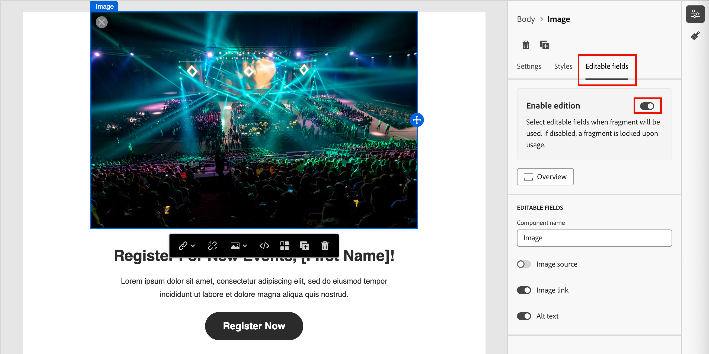

# Création de fragments

Après avoir [créé un fragment](./fragments.md#create-fragments), utilisez l’éditeur visuel pour créer les composants de structure et de contenu dans votre fragment.

## Ajouter la structure et le contenu {#design-fragment}

{{$include /help/_includes/content-design-components.md}}

## Ajout de ressources

{{$include /help/_includes/content-design-assets.md}}

## Parcourir les calques, paramètres et styles

{{$include /help/_includes/content-design-navigation.md}}

## Personnaliser le contenu

{{$include /help/_includes/content-design-personalization.md}}

## Activer la personnalisation des fragments

Lorsqu’un auteur ajoute un fragment à un [e-mail](./email-authoring.md#content-authoring---use-visual-fragments) ou [modèle d’e-mail](./email-template-authoring.md#content-authoring---use-visual-fragments), le contenu du fragment est verrouillé par défaut. Toutes les modifications apportées au fragment publié sont automatiquement propagées à toutes les ressources de contenu dans lesquelles le fragment est utilisé. Lorsque vous désignez un paramètre pour un composant du fragment comme modifiable, l’auteur de l’e-mail ou du modèle peut spécifier une valeur de champ personnalisé spécifique à ses besoins. Cette option de personnalisation est limitée aux composants visuels d’image, de texte et de bouton.

Par exemple, si vous concevez une bannière réutilisable qui comprend un bouton cliquable, vous pouvez désigner le paramètre d’URL du bouton comme étant modifiable. Les auteurs d’e-mails peuvent ensuite utiliser une URL plus spécifique à leur campagne par e-mail. Grâce à ces champs personnalisables, les marketeurs peuvent gérer et personnaliser du contenu réutilisable sans avoir à créer des blocs de contenu entièrement nouveaux ou à interrompre les mises à jour héritées du fragment d’origine.

1. Dans l’éditeur de contenu visuel, sélectionnez l’image, le texte ou l’élément de bouton sur lequel vous souhaitez activer la personnalisation.

1. Dans les détails du composant sur la droite, sélectionnez l’onglet **[!UICONTROL Champs modifiables]**.

1. Cliquez sur le bouton (bascule) de l’option **[!UICONTROL Activer l’édition]** et définissez les champs modifiables.

   {width="700" zoomable="yes"}

   Vous pouvez activer la personnalisation des champs affichés, selon le type de composant et les paramètres définis dans le fragment.

   Définissez le bouton (bascule) sur Activé pour chaque champ où vous souhaitez autoriser la personnalisation.

1. Cliquez sur **[!UICONTROL Aperçu]** pour consulter tous les champs modifiables et leurs valeurs par défaut.

   {width="700" zoomable="yes"}

1. Enregistrez vos modifications.

## Modifier le tracking des URL liées

{{$include /help/_includes/content-design-links.md}}
