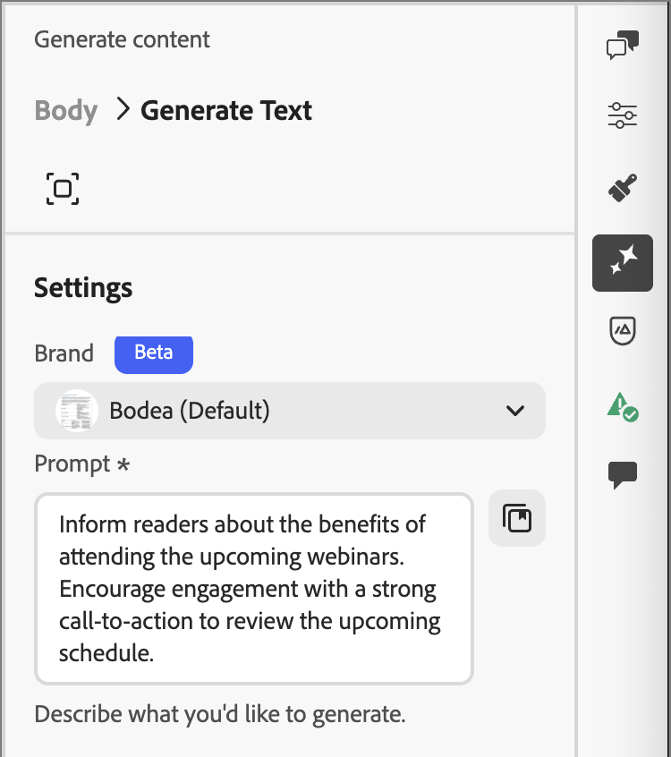
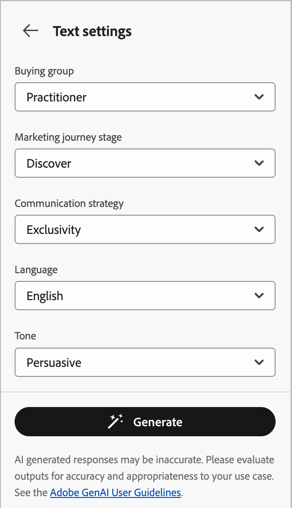
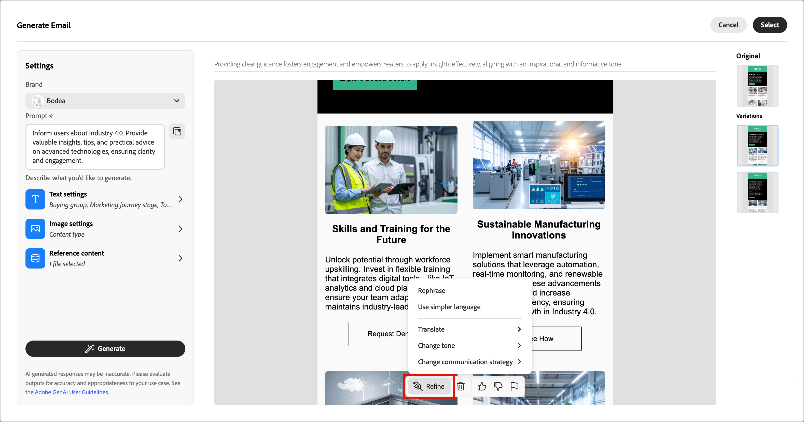

# Générer le contenu d’un e-mail

Alors que le secteur du marketing devient plus compétitif, les marques cherchent des moyens efficaces de générer du contenu percutant. [!DNL Adobe Journey Optimizer B2B Edition] inclut une génération de contenu optimisée par l’IA qui aide les spécialistes marketing à créer du contenu d’e-mail professionnel et cohérent. Grâce à des modèles d’IA génératifs avancés et à une compréhension approfondie des directives de la marque, il génère automatiquement du contenu personnalisé, attrayant et efficace. Il utilise votre objectif marketing et optimise le contenu pour les styles de contour de la marque, les mises en page, le ton, etc. L’utilisation de ces outils rend la création et l’exécution de campagnes marketing par e-mail intuitives, simples et efficaces. L’ajout de cette fonctionnalité à vos workflows peut vous faire gagner du temps, améliorer l’efficacité et générer de meilleurs résultats.

Cette nouvelle fonctionnalité fournit une génération de contenu basée sur les invites pour une génération complète d&#39;email ou ciblée dans les composants structurels d&#39;email. Pour les images, vous pouvez générer de nouvelles ressources d’image ou des recommandations à partir du catalogue d’images dans la ressource de marque d’entrée. Vous pouvez également utiliser cette fonctionnalité pour générer des lignes d’objet et des pré-titres optimaux afin d’affecter le taux d’ouverture des e-mails.

>[!PREREQUISITES]
>
>Pour accéder à ces fonctionnalités dans Adobe Journey Optimizer B2B edition, vous devez disposer de l’autorisation _[!UICONTROL Assistant IA]_ > _[!UICONTROL Générer du contenu]_. Pour plus d’informations sur la manière dont un administrateur de produit peut accorder des autorisations de fonctionnalité, voir [Modifier les rôles pour les autorisations de produit](../admin/user-management.md#edit-roles-for-product-permissions).

## Instructions et restrictions

Avant de commencer à utiliser cette fonctionnalité, passez en revue les [instructions et limites](./generative-ai-content.md#general-guidelines-and-limitations). [Accord utilisateur](https://www.adobe.com/fr/legal/licenses-terms/adobe-gen-ai-user-guidelines.html){target="_blank"} l’acceptation est également requise avant de pouvoir utiliser les fonctionnalités d’IA dans [!DNL Journey Optimizer B2B Edition]. Pour en savoir plus, contactez votre représentant Adobe.

Adobe applique les [informations d’identification de contenu](https://helpx.adobe.com/firefly/web/get-started/learn-the-basics/content-credentials-overview.html){target="_blank"} aux ressources générées par Firefly lors du téléchargement ou de l’exportation afin de promouvoir la transparence.

Les restrictions et instructions suivantes s’appliquent à la génération de contenu d’e-mail dans [!DNL Journey Optimizer B2B Edition] :

* L’anglais est la seule langue prise en charge.
* Le contenu généré peut ne pas être précis. Partagez vos commentaires afin que les ingénieurs Adobe puissent affiner les modèles.
* Vous pouvez charger plusieurs ressources de référence de contenu, mais vous ne pouvez en exploiter qu’une seule pour une génération spécifique.
* Utilisez un modèle personnalisé ou spécifique à la marque pour générer du contenu pour un e-mail complet. Il est recommandé d’utiliser des modèles d’e-mail contenant entre 8 et 10 images.
* Veillez à signaler les sorties problématiques à l&#39;aide des icônes de pouces vers le haut, vers le bas ou d&#39;indicateurs lors de la sélection des variantes générées.

## Entrée et paramètres pour la génération de contenu

Vous pouvez générer du contenu complet pour un e-mail ou pour des composants sélectionnés dans l’e-mail. Lorsque vous utilisez les outils de génération de contenu, vous fournissez des invites, du contenu de référence et des paramètres pour le texte et les images.

### Prompts

Utilisez des invites bien définies pour que le modèle d’IA générative l’interprète avec précision. L’objectif/invite marketing que vous fournissez a une incidence sur la qualité du contenu généré.

{width="320"}

Pour plus d&#39;informations sur la création d&#39;invites efficaces, voir _[Bonnes pratiques relatives aux invites](./generative-ai-content.md#generative-ai-prompting-guide)_.

>[!BEGINSHADEBOX]

#### Bibliothèque d&#39;invites

Une invite efficace est essentielle pour générer le meilleur contenu possible. Si vous souhaitez obtenir de l&#39;aide pour concevoir votre invite, cliquez sur l&#39;icône _Bibliothèque d&#39;invites_  pour accéder à une bibliothèque d&#39;idées d&#39;invites organisées en fonction des objectifs. Saisissez du texte dans le champ de recherche pour trouver une invite basée sur une chaîne de mot-clé.

{width="600" zoomable="no"}

Sélectionnez l’invite qui reflète le mieux vos objectifs prévus et cliquez sur **[!UICONTROL Essayer cette invite]**. Dans le champ _[!UICONTROL Invite]_, remplacez les espaces réservés (tels que `[Key Feature/Information]`) par les détails de votre marque, de votre offre, de votre campagne et du cas d’utilisation.

>[!ENDSHADEBOX]

### Paramètres de texte

Développez le **[!UICONTROL Paramètres de texte]** dans le panneau de droite, puis définissez les options du texte généré.

* **[!UICONTROL Groupe d’achat]** - Choisissez le [rôle du groupe d’achat](../buying-groups/buying-groups-role-templates.md) à utiliser pour le ciblage de vos messages. [!DNL Journey Optimizer B2B Edition] offre cinq rôles de groupe d’achat B2B standard préconfigurés. Chaque rôle de groupe d&#39;achat a un objectif de messagerie distinct :

  | Rôle | Thème de la messagerie |
  | ---- | --------------- |
  | Comité directeur exécutif | Informations sur le produit  Tarification  Informations sur l’intégration technique  Fonctionnalités du produit |
  | Personne influente | Preuve de la qualité  Facilité de mise en œuvre  Expertise en la matière  Avantages concurrentiels |
  | Décideur | Retour sur investissement  Valeur financière (RoI)  Témoignages clients |
  | Spécialiste | Facilité d’utilisation  Fonctionnalités du produit  Compatibilité du produit  Facilité d’intégration du produit |
  | Champion | Contenu pédagogique  Contenu de leadership éclairé  Témoignages de clients |

* **[!UICONTROL Étape du parcours marketing]** - Choisissez l’étape [étape du groupe d’achat](../buying-groups/buying-group-stages.md) à utiliser pour le ciblage du message.
* **[!UICONTROL Stratégie de communication]** - Choisissez le style de communication le plus adapté à votre texte généré.
* **[!UICONTROL Langue]** - Sélectionnez la langue du contenu généré.
* **[!UICONTROL Ton]** - Le ton qui résonne avec votre audience. Par exemple, vous pouvez ajuster le message pour qu’il ait un son informatif, ludique ou persuasif.

{width="350" zoomable="yes"}

Cliquez sur la flèche de gauche pour revenir à la _[!UICONTROL Paramètres]_ principale.

### Paramètres d’image

Pour inclure des images dans le contenu généré, développez le **[!UICONTROL Paramètres d’image]** dans le panneau de droite, puis définissez les options.

Le système désactive par défaut l’option **[!UICONTROL Générer des images à l’aide de l’IA]**. Activez cette fonctionnalité et définissez les options suivantes pour inclure les images générées dans les variations de contenu proposées :

* **[!UICONTROL Modèle génératif]** : faites votre choix parmi le modèle prêt à l’emploi fourni par Adobe, le modèle de partenaire pour les fonctionnalités spécialisées ou les modèles personnalisés configurés, entraînés sur vos ressources de marque. Pour plus d’informations sur les modèles génératifs, voir _[Modèles IA génératifs pour l’alignement des marques](generative-ai-models.md)_.
* **[!UICONTROL Format]** : lorsqu’un composant d’image est sélectionné, ce paramètre détermine la largeur et la hauteur de la ressource. Choisissez parmi les ratios courants tels que 16:9, 4:3, 3:2 ou 1:1, ou saisissez un ratio personnalisé.
* **[!UICONTROL Type de contenu]** : le type classe la nature de l’élément visuel, en distinguant différentes formes de représentation visuelle, telles que des photos, des graphiques ou des illustrations.
* **[!UICONTROL Intensité visuelle]** : contrôlez l’impact de l’image en ajustant son intensité. Un paramètre inférieur (2, par exemple) donne un aspect plus doux et plus sobre, tandis qu’un paramètre supérieur (10, par exemple) donne à l’image une plus grande intensité et une plus grande puissance visuelle.
* **[!UICONTROL Couleur et ton]** : l’aspect général des couleurs dans une image et l’ambiance ou l’atmosphère qu’elle véhicule.
* **[!UICONTROL Éclairage]** : style d’éclairage utilisé pour l’image, qui façonne son atmosphère et met en évidence des éléments spécifiques.
* **[!UICONTROL Composition]** : disposition des éléments dans le cadre d’une image.

{width="350" zoomable="yes"}

Cliquez sur la flèche de gauche pour revenir à la _[!UICONTROL Paramètres]_ principale.

### Contenu de référence

Chargez des ressources de contenu de référence pour générer du contenu précis et intégré à la marque. Dans le cas contraire, le contenu généré est basé sur des informations disponibles publiquement. Le contenu de référence sert de source pour la génération de contenu et les recommandations d’images. Pour obtenir des instructions et connaître les bonnes pratiques, voir _[Contenu de référence optimisé](./generative-ai-content.md#reference-content)_.

Dans les paramètres **[!UICONTROL Contenu de référence]**, cliquez sur **[!UICONTROL Télécharger le fichier]** pour ajouter toute ressource contenant du contenu que vous souhaitez utiliser pour un contexte supplémentaire.

{width="350" zoomable="yes"}

Le fichier à charger peut être dans les formats suivants : PDF, JPEG, PNG ou fichiers ZIP (contenant les formats de fichiers pris en charge). La taille maximale d’une ressource de marque chargée est de 50 Mo. Des fichiers plus volumineux ou un grand nombre d’images peuvent fonctionner, mais cela augmente le temps de traitement.

Si vous souhaitez sélectionner un fichier précédemment chargé, développez la liste **[!UICONTROL Contenu de référence chargé]** et activez la ressource que vous souhaitez utiliser pour la génération de contenu.

{width="350" zoomable="yes"}

## Générer les propriétés de l’e-mail

Lorsque vous [ajoutez une action E-mail](./add-email.md#add-an-email-action-node-in-a-journey) à un parcours de compte, vous définissez un ensemble de propriétés d’e-mail utilisées pour envoyer l’e-mail. Les outils d’IA génératifs peuvent permettre un meilleur engagement des e-mails en générant du contenu recommandé pour l’e-mail **_objet_** et **_pré-titre_**.

Lorsque vous créez un e-mail à partir d’un parcours ou que vous ouvrez un e-mail existant à partir d’un nœud de parcours, la page de prévisualisation de l’e-mail s’affiche avec l’_[!UICONTROL Propriétés de l’e-mail]_ à droite. Dans l’onglet _[!UICONTROL Résumé]_, vous pouvez utiliser les outils de génération de contenu pour générer une ligne d’objet, un pré-titre, ou les deux.

>[!BEGINTABS]

>[!TAB Génération de l’objet]

Les étapes suivantes décrivent la séquence de tâches pour générer une ligne d’objet optimisée pour votre e-mail :

1. Dans le panneau _Résumé_ avec l’onglet _Détails_ sélectionné, faites défiler l’écran jusqu’au champ **[!UICONTROL Objet]**.

1. Cliquez sur l’icône _Générer le contenu_ ( {width="30"} ) à droite du champ.

   {width="600" zoomable="yes"}

   La boîte de dialogue _[!UICONTROL Générer l’objet]_ s’ouvre avec les paramètres de génération de l’objet de l’e-mail.

1. (Obligatoire) Dans le champ **[!UICONTROL Invite]**, saisissez une description de ce que vous souhaitez générer.

   Utilisez la [bibliothèque d&#39;invites](#prompt-library) si vous avez besoin d&#39;aide pour concevoir une invite efficace.

1. (Facultatif) Pour fournir une entrée supplémentaire pour générer le pré-titre, complétez les paramètres de guidage de contenu :

   * [**[!UICONTROL Paramètres de texte]**](#text-settings) - Fournissez des conseils pour le contenu de texte généré.
   * [**[!UICONTROL Contenu de référence]**](#reference-content) - Indiquez la ressource de contenu qui sert de source pour la génération de contenu.

1. Lorsque l’invite et les paramètres sont prêts, cliquez sur **[!UICONTROL Générer]**.

   Les variantes générées s’affichent dans la boîte de dialogue.

   {width="600" zoomable="yes"}

1. Faites défiler le panneau _Générer du contenu_ et parcourez les variations générées pour déterminer celle qui convient le mieux.

   Vous pouvez [envoyer des commentaires](#submit-variation-feedback) pour une variante générée en cliquant sur l’icône _Pouces vers le haut_, _Pouces vers le bas_ ou _Indicateur_ et en choisissant la raison qui résume le mieux vos commentaires.

1. Cliquez sur l’option **[!UICONTROL Affiner]** pour accéder à des fonctions de personnalisation supplémentaires :

   * **[!UICONTROL Reformuler]** - Réécrivez le message tout en préservant sa signification. Cette option vous permet de générer un autre libellé ou d’ajuster la formulation sans modifier le message de base.

   * **[!UICONTROL Utiliser un langage plus simple]** - Simplifiez le langage, en assurant la clarté et l’accessibilité pour une audience plus large.

   * **[!UICONTROL Traduire]** - Traduisez le texte dans une autre langue. (Actuellement, l’anglais est la seule langue prise en charge. D’autres langues sont prévues pour les prochaines versions.)

   * **[!UICONTROL Modifier le ton]** - Ajustez le ton du message pour l’aligner sur votre style de communication, par exemple en le rendant plus convivial, professionnel, urgent ou inspirant.

   * **[!UICONTROL Modifier la stratégie de communication]** - Modifiez l’approche de messagerie en fonction de vos objectifs, tels que la création d’une urgence ou l’accentuation d’un appel attrayant.

   {width="600" zoomable="yes"}

1. Cliquez sur **[!UICONTROL Sélectionner]** pour remplacer le texte de l’objet par la variante sélectionnée et revenir aux propriétés de l’e-mail.

>[!TAB Génération du pré-titre]

Un pré-titre d’e-mail est le texte de résumé court qui suit l’objet d’un e-mail lorsqu’il est affiché dans la boîte de réception. Il s’agit d’un élément facultatif pour un e-mail, mais c’est une occasion efficace d’améliorer l’engagement. Les étapes suivantes décrivent la séquence de tâches pour générer un pré-titre optimisé pour votre e-mail :

1. Dans le panneau _Résumé_ avec l’onglet _Détails_ sélectionné, faites défiler l’écran vers le bas et cochez la case **[!UICONTROL Pré-titre]**.

   {width="600" zoomable="yes"}

   La boîte de dialogue _[!UICONTROL Générer le pré-titre]_ s’ouvre avec les paramètres de génération du pré-titre de l’e-mail.

1. (Obligatoire) Dans le champ **[!UICONTROL Invite]**, saisissez une description de ce que vous souhaitez générer.

   Utilisez la [bibliothèque d&#39;invites](#prompt-library) si vous avez besoin d&#39;aide pour concevoir une invite efficace.

1. (Facultatif) Pour fournir une entrée supplémentaire pour générer le pré-titre, complétez les paramètres de guidage de contenu :

   * [**[!UICONTROL Paramètres de texte]**](#text-settings) - Fournissez des conseils pour le contenu de texte généré.
   * [**[!UICONTROL Contenu de référence]**](#reference-content) - Indiquez la ressource de contenu qui sert de source pour la génération de contenu.

1. Lorsque l’invite et les paramètres sont prêts, cliquez sur **[!UICONTROL Générer]**.

   Les variantes générées s’affichent dans la boîte de dialogue.

   {width="600" zoomable="yes"}

1. Faites défiler le panneau _Générer du contenu_ et parcourez les variations générées pour déterminer celle qui convient le mieux.

   Vous pouvez [envoyer des commentaires](#submit-variation-feedback) pour une variante générée en cliquant sur l’icône _Pouces vers le haut_, _Pouces vers le bas_ ou _Indicateur_ et en choisissant la raison qui résume le mieux vos commentaires.

1. Cliquez sur l’option **[!UICONTROL Affiner]** pour accéder à des fonctions de personnalisation supplémentaires :

   * **[!UICONTROL Reformuler]** - Réécrivez le message tout en préservant sa signification. Cette option vous permet de générer un autre libellé ou d’ajuster la formulation sans modifier le message de base.

   * **[!UICONTROL Utiliser un langage plus simple]** - Simplifiez le langage, en assurant la clarté et l’accessibilité pour une audience plus large.

   * **[!UICONTROL Traduire]** - Traduisez le texte dans une autre langue. (Actuellement, l’anglais est la seule langue prise en charge. D’autres langues sont prévues pour les prochaines versions.)

   * **[!UICONTROL Modifier le ton]** - Ajustez le ton du message pour l’aligner sur votre style de communication, par exemple en le rendant plus convivial, professionnel, urgent ou inspirant.

   * **[!UICONTROL Modifier la stratégie de communication]** - Modifiez l’approche de messagerie en fonction de vos objectifs, tels que la création d’une urgence ou l’accentuation d’un appel passionnant.

   {width="500" zoomable="yes"}

1. Cliquez sur **[!UICONTROL Sélectionner]** pour remplacer le pré-titre par la variante sélectionnée et revenir aux propriétés de l’e-mail.

>[!ENDTABS]

## Générer le contenu du corps de l’e-mail {#generative-ai-email-design}

Après avoir [créé et personnalisé votre e-mail](./email-authoring.md), utilisez les outils d’IA générative d’Adobe pour améliorer le contenu du corps de votre e-mail.

Dans l’espace de conception d’e-mail, les outils d’IA génératifs peuvent vous aider à optimiser l’impact de vos diffusions en générant le corps complet de l’e-mail, le contenu de texte ciblé et les images qui résonnent avec votre audience. Cette optimisation de vos campagnes par e-mail est conçue pour produire un meilleur engagement. Sélectionnez l’option _Générer le contenu_ ( {width="25" zoomable="no"} ) pour afficher les outils de génération de contenu disponibles pour la sélection de contenu actuelle.

{width="600" zoomable="yes"}

Procédez comme suit en fonction du type de génération de contenu d’e-mail que vous souhaitez utiliser :

>[!BEGINTABS]

>[!TAB Génération d’e-mail complet]

Pour générer un e-mail complet en affinant un modèle d’e-mail existant, procédez comme suit :

1. Après avoir [créé l’e-mail](./add-email.md), cliquez sur **[!UICONTROL Modifier le contenu de l’e-mail]**.

1. Sélectionnez un modèle.

   La génération complète du contenu nécessite un modèle. Il peut s’agir d’un modèle standard fourni par Adobe ou d’un modèle enregistré. Vous pouvez également utiliser l&#39;option _[!UICONTROL Importer HTML]_ pour importer un modèle.

   Pour plus d’informations sur l’utilisation d’un modèle d’e-mail, voir _[Sélectionner un modèle](./email-authoring.md#select-a-template)_.

1. Dans l’espace de conception d’e-mail, cliquez sur l’icône _Générer le contenu_ {width="25"} ) à droite.

   Les paramètres à droite indiquent _Générer un e-mail_.

   {width="600" zoomable="yes"}

1. Sélectionnez votre **[!UICONTROL Marque]** pour vous assurer que le contenu généré par l’IA correspond aux spécifications de votre marque.

   S’il n’existe aucune marque publiée, cliquez sur **[!UICONTROL Créer une marque]** pour définir vos [directives de marque réutilisables](./brands-overview.md).

1. Dans le champ **[!UICONTROL Invite]**, saisissez une description de ce que vous souhaitez générer.

   Utilisez la [bibliothèque d&#39;invites](#prompt-library) si vous avez besoin d&#39;aide pour concevoir une invite efficace.

   >[!TIP]
   >
   >Si vous n’êtes pas familier avec l’invite de contenu généré, consultez la _[Bonnes pratiques relatives à l’invite](./generative-ai-content.md#generative-ai-prompting-guide)_.

1. Pour personnaliser le contenu généré, définissez les paramètres de guidage de contenu :

   * [**[!UICONTROL Paramètres de texte]**](#text-settings) - Fournissez des conseils pour le contenu de texte généré.
   * [**[!UICONTROL Paramètres d’image]**](#image-settings) - Si vous souhaitez inclure des images dans le contenu généré, activez la génération d’images et fournissez des conseils.
   * [**[!UICONTROL Contenu de référence]**](#reference-content) - Indiquez la ressource de contenu qui sert de source pour la génération de contenu.

1. Lorsque l’invite et les paramètres sont prêts, cliquez sur **[!UICONTROL Générer]**.

   Les variations générées s’affichent dans le panneau de droite.

1. Parcourez les variations générées ou cliquez sur l’icône _Plein écran_ (  ) pour ouvrir la boîte de dialogue _[!UICONTROL Générer un e-mail]_.

   La boîte de dialogue offre un espace supplémentaire pour comparer les variations, ajuster votre texte et les paramètres de contenu de référence (si nécessaire), puis générer de nouveau les variations.

   Vous pouvez également affiner une variation en appliquant des actions d’affinement et envoyer des commentaires pour les variations générées. Consultez _[Prévisualisation et amélioration du contenu](#refine-finalize)_ pour plus d’informations sur l’amélioration des variations et les commentaires.

   {width="700" zoomable="yes"}

1. Cliquez sur **[!UICONTROL Sélectionner]** pour remplacer le contenu du modèle par la variante sélectionnée et revenir à l’espace de conception d’e-mail.

   Vous pouvez utiliser les outils d’édition et de mise en forme de la zone de travail pour modifier le contenu généré, ainsi que les options _[!UICONTROL Paramètres]_ et _[!UICONTROL Style]_ sur la droite.

>[!TAB Texte uniquement]

Pour affiner ou améliorer le contenu textuel d’un e-mail existant, procédez comme suit :

1. Dans l’espace de conception d’e-mail, sélectionnez un composant _Texte_ pour cibler le contenu spécifique.

1. Sur le rail extérieur du panneau de droite, sélectionnez l’icône _Générer le contenu_ ( {width="25"} ).

   Les paramètres de droite reflètent les paramètres de génération de contenu du composant de texte.

1. Sélectionnez votre **[!UICONTROL Marque]** pour vous assurer que le contenu généré par l’IA correspond aux spécifications de votre marque.

   S’il n’existe aucune marque publiée, cliquez sur **[!UICONTROL Créer une marque]** pour [définir vos directives de marque réutilisables](./brands-overview.md).

1. Dans le champ **[!UICONTROL Invite]**, saisissez une description de ce que vous souhaitez générer.

   {width="600" zoomable="yes"}

   Utilisez la [bibliothèque d&#39;invites](#prompt-library) si vous avez besoin d&#39;aide pour concevoir une invite efficace.

1. Pour personnaliser le contenu généré, définissez les paramètres de guidage de contenu :

   * [**[!UICONTROL Paramètres de texte]**](#text-settings) - Fournissez des conseils pour le contenu de texte généré.

   * [**[!UICONTROL Contenu de référence]**](#reference-content) - Indiquez les ressources de contenu qui servent de source pour la génération de contenu.

1. Lorsque l’invite et les paramètres sont prêts, cliquez sur **[!UICONTROL Générer]**.

1. Parcourez les variations générées ou cliquez sur l’icône _Plein écran_ (  ) pour ouvrir la boîte de dialogue _[!UICONTROL Générer du texte]_.

   La boîte de dialogue offre un espace supplémentaire pour comparer les variations, ajuster votre texte et les paramètres de contenu de référence (si nécessaire), et régénérer les variations.

   Vous pouvez également affiner une variation en appliquant des actions d’affinement et envoyer des commentaires pour les variations générées. Consultez _[Prévisualisation et amélioration du contenu](#preview-and-refine-the-content)_ pour plus d’informations sur l’amélioration des variations et les commentaires.

   {width="700" zoomable="yes"}

1. Lorsque vous disposez du contenu souhaité, cliquez sur **[!UICONTROL Sélectionner]** pour remplacer le texte par la variante sélectionnée et revenir à l’espace de conception d’e-mail.

   Vous pouvez utiliser les outils d’édition et de mise en forme de la zone de travail pour modifier le texte, ainsi que les options _[!UICONTROL Paramètres]_ et _[!UICONTROL Style]_ sur la droite.

>[!TAB Image uniquement]

Pour affiner ou améliorer le contenu d’image d’un e-mail existant, procédez comme suit :

1. Dans l’espace de conception d’e-mail, sélectionnez un composant _Image_ pour cibler le contenu spécifique.

1. Sur le rail extérieur du panneau de droite, sélectionnez l’icône _Générer le contenu_ ( {width="25"} ).

   Les paramètres de droite reflètent les paramètres de génération du composant d’image.

1. Sélectionnez votre **[!UICONTROL Marque]** pour vous assurer que le contenu généré par l’IA correspond aux spécifications de votre marque.

   S’il n’existe aucune marque publiée, cliquez sur **[!UICONTROL Créer une marque]** pour [définir vos directives de marque réutilisables](./brands-overview.md).

1. Saisissez une description de votre choix dans le champ **[!UICONTROL Invite]**.

   {width="600" zoomable="yes"}

   Utilisez la [bibliothèque d&#39;invites](#prompt-library) si vous avez besoin d&#39;aide pour concevoir une invite efficace.

1. Pour personnaliser le contenu généré, définissez les paramètres de guidage de contenu :

   * [**[!UICONTROL Paramètres d’image]**](#image-settings) - Si vous souhaitez inclure des images dans le contenu généré, activez la génération d’images et utilisez les paramètres de guidage.

   * [**[!UICONTROL Contenu de référence]**](#reference-content) - Indiquez les ressources de contenu qui servent de source pour la génération de contenu.

1. Une fois l’invite et les paramètres définis, cliquez sur **[!UICONTROL Générer]**.

   Le système traite la demande et génère les images les mieux adaptées en fonction de l’invite et d’autres entrées.

   >[!IMPORTANT]
   >
   >Si le contenu de référence ne contient aucune image ou s’il n’existe aucune image relative à l’invite d’entrée, la sortie est vide.

1. Parcourez les variations générées ou cliquez sur l’icône _Plein écran_ (  ) pour ouvrir la boîte de dialogue _[!UICONTROL Générer une image]_.

   La boîte de dialogue offre un espace supplémentaire pour comparer les variations, ajuster les paramètres d’image et de contenu de référence (si nécessaire) et régénérer les variations.

   Vous pouvez sélectionner une variation et cliquer sur **[!UICONTROL Générer un similaire]** pour générer des images supplémentaires similaires à la variante sélectionnée. Ou cliquez sur **[!UICONTROL Modifier dans Adobe Express]** pour apporter vos propres modifications à l’image. Voir [Actions rapides dans Adobe Express](./image-edit-adobe-express.md#quick-actions-in-adobe-express) pour plus d’informations sur l’utilisation d’Adobe Express afin d’affiner vos images.

   {width="700" zoomable="yes"}

   Vous pouvez également [soumettre des commentaires](#submit-variation-feedback) pour les variations générées.

1. Mettez en surbrillance l’image souhaitée et cliquez sur **[!UICONTROL Sélectionner]** pour remplacer l’image ou l’espace réservé par l’élément sélectionné et revenir à l’espace de conception d’e-mail.

   Vous pouvez utiliser les outils de modification et de mise en forme de la zone de travail pour modifier l’image, ainsi que les options _[!UICONTROL Paramètres]_ et _[!UICONTROL Style]_ sur la droite.

>[!ENDTABS]

## Prévisualiser et affiner le contenu {#refine-finalize}

Après avoir généré des variations de contenu, vous pouvez affiner les résultats pour vous assurer qu’ils répondent exactement à vos besoins. Examinez l’alignement de la marque, ajustez le ton et la langue, puis préparez le contenu pour un brouillon révisable. Vous pouvez également envoyer des commentaires pour une variation afin de former les outils d’IA génératifs et d’améliorer les résultats futurs.

### Ouvrir l’affichage plein écran

1. Après la génération initiale du contenu, parcourez les **[!UICONTROL Variations]**.

1. Identifiez la variation qui correspond le mieux à vos objectifs et cliquez sur l’icône _Plein écran_ (  ) pour afficher la variation sélectionnée plus en profondeur.

   {width="700" zoomable="yes"}

1. Lorsque vous êtes satisfait(e) de la variation sélectionnée, cliquez sur **[!UICONTROL Sélectionner]** pour l’appliquer à la zone de travail.

### Affiner une variation

Cliquez sur l’option **[!UICONTROL Affiner]** pour accéder à des fonctionnalités de personnalisation supplémentaires pour les variations d’e-mail et de texte :

* **[!UICONTROL Développer]** - Développez des sujets spécifiques, en fournissant des détails supplémentaires pour une meilleure compréhension et un meilleur engagement.

* **[!UICONTROL Résumer]** - La longueur des informations peut submerger les lecteurs. Utilisez cette option pour condenser les points clés en résumés clairs et concis qui attirent l&#39;attention et encouragent les lecteurs à lire davantage.

* **[!UICONTROL Reformuler]** - Réécrivez le message tout en préservant sa signification. Cette option vous permet de générer d’autres formulations, d’améliorer la fluidité du texte ou d’ajuster la formulation sans modifier le message principal.

* **[!UICONTROL Utiliser un langage plus simple]** - Simplifiez le langage, en assurant la clarté et l’accessibilité pour une audience plus large.

* **[!UICONTROL Traduire]** - Traduisez le texte dans une autre langue. (Actuellement, l’anglais est la seule langue prise en charge. D’autres langues sont prévues pour les prochaines versions.)

* **[!UICONTROL Modifier le ton]** - Ajustez le ton du message pour l’aligner sur votre style de communication, par exemple en le rendant plus convivial, professionnel, urgent ou inspirant.

* **[!UICONTROL Modifier la stratégie de communication]** - Modifiez l’approche de messagerie en fonction de vos objectifs, tels que la création d’une urgence ou l’accentuation d’un appel passionnant.

<!-- is this option coming back? * **[!UICONTROL Use as reference content]** - Select this option to use the variant as the reference content for generating other results. -->

{width="700" zoomable="yes"}

### Envoyer le retour d’informations sur la variation

Faites des commentaires sur les variantes générées en cliquant sur l’icône _Pouces vers le haut_, _Pouces vers le bas_ ou _Indicateur_ et choisissez la raison qui résume le mieux vos commentaires.

{width="700" zoomable="yes"}

### Vérifier l’alignement de votre marque (Beta)

<!-- Are we surfacing scoring here in the future, or will it be a separate post-creation task? 1. Click the percentage icon to view your **[!UICONTROL Brand Alignment Score]** and identify any misalignments with your brand. -->

L’évaluation et la notation de l’alignement de la marque vous permettent d’assurer la cohérence du ton, du message et de l’identité visuelle de vos campagnes par e-mail, tout en servant de contrôle qualité avant la mise en ligne de votre contenu. Une fois le contenu de l’e-mail terminé, cliquez sur l’icône _Alignement des marques_ (  ) à droite pour ouvrir le panneau de droite _Alignement des marques_ dans l’espace de conception d’e-mail.

{width="600" zoomable="yes"}

Pour plus d’informations, voir [_Score d’alignement des marques_](./content-evaluation.md#brand-alignment-score)
