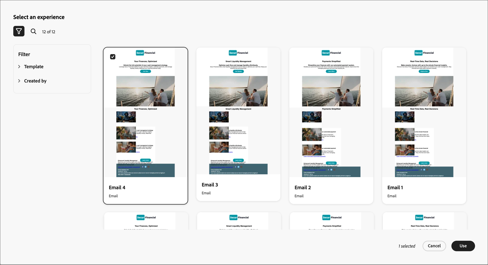

# Création de contenu d’e-mail avec GenStudio for Performance Marketing {#genstudio-workflow}

>[!CONTEXTUALHELP]
>id="ajo-b2b_genstudio_button"
>title="Utiliser un modèle créé avec GenStudio"
>abstract="Utilisez l’intégration à Adobe GenStudio for Performance Marketing pour importer un modèle GenStudio amélioré par la technologie Adobe AI."

>[!AVAILABILITY]
>
>L’intégration de GenStudio dans [!DNL Adobe Journey Optimizer B2B Edition] n’est actuellement pas disponible pour une utilisation avec les offres complémentaires **Healthcare Shield** ou **Privacy and Security Shield**.
>
>Cette intégration est disponible uniquement pour le canal e-mail.

Pour améliorer l’efficacité des workflows et maintenir la cohérence de la marque, vous pouvez combiner des expériences GenStudio for Performance Marketing avec l’orchestration des e-mails de Adobe Journey Optimizer B2B edition. Ce workflow étendu vous permet de tirer parti des outils de création de contenu optimisés par l’IA dans GenStudio pour étendre et optimiser les communications par e-mail via les parcours de compte.

Par exemple, un spécialiste du marketing technique qui utilise Journey Optimizer B2B edition pour développer et automatiser les communications par e-mail vers des comptes clés peut collaborer avec un spécialiste du marketing de performance qui crée du contenu à l’aide de GenStudio. Grâce à ce workflow, les deux peuvent travailler ensemble pour combiner du contenu de marque de GenStudio vers l’automatisation du marketing basé sur les comptes de Journey Optimizer B2B edition, en fournissant des e-mails attrayants qui ciblent des groupes d’achats spécifiques et stimulent les ventes.

>[!BEGINSHADEBOX]

## Fonctionnalités de génération de contenu GenStudio

[Adobe GenStudio for Performance Marketing](https://business.adobe.com/fr/products/genstudio-for-performance-marketing.html){target="_blank"} est une application IA-first générative qui permet aux équipes marketing de créer des annonces et des e-mails personnalisés et percutants, conformes aux normes de la marque et aux politiques de l&#39;entreprise. En tirant parti de la technologie d’IA d’Adobe, elle offre une suite complète d’outils qui simplifient la création et la gestion de contenu, ce qui permet aux créatifs de se concentrer sur l’innovation.

{width="30"} [Créer des e-mails marketing sur la marque](https://experienceleague.adobe.com/fr/docs/genstudio-for-performance-marketing-learn/tutorials/creating-experiences/creating-on-brand-emails){target="_blank"}

En savoir plus sur les fonctionnalités de GenStudio for Performance Marketing dans la [documentation](https://experienceleague.adobe.com/fr/docs/genstudio-for-performance-marketing/user-guide/home){target="_blank"}

>[!ENDSHADEBOX]

## Exporter HTML depuis Journey Optimizer B2B edition

Tout d’abord, dans Journey Optimizer B2B edition, exportez HTML à partir d’un e-mail qui inclut les directives de votre marque.

1. Dans Journey Optimizer B2B edition, accédez au contenu de votre e-mail dans l’espace de conception visuelle.

1. Dans le menu _[!UICONTROL Plus...]_ situé en haut de l’espace de conception des e-mails, choisissez **[!UICONTROL Exporter HTML]**.

   {width="600"}

   Cette action génère un fichier .zip téléchargé contenant les fichiers HTML et image.

## Utiliser l’HTML exportée dans GenStudio for Performance Marketing

GenStudio for Performance Marketing reconnaît certains éléments dans l’HTML d’e-mail importée lorsqu’ils sont identifiés par un nom de champ reconnu. Ajoutez des noms de champ dans l’HTML exporté à l’aide de la syntaxe Handlebars dans laquelle vous avez besoin de GenStudio for Performance Marketing pour générer un certain type de contenu.

| Champ | Type de contenu |
| ----------------- | ------------------------- |
| `{{pre_header}}` | En-tête |
| `{{headline}}` | Titre |
| `{{sub_headline}}` | Sous-Titre |
| `{{body}}` | Corps de texte |
| `{{cta}}` | Call to action (bouton) |
| `{{image}}` | Image |
| `{{link}}` | Call to action sur l’image |

### Création du modèle

Utilisez le fichier HTML pour créer un modèle dans GenStudio for Performance Marketing.

Pour plus d’informations sur le téléchargement d’un modèle HTML dans GenStudio dans Adobe GenStudio for Performance Marketing, reportez-vous à la section [ Ajouter un modèle ](https://experienceleague.adobe.com/fr/docs/genstudio-for-performance-marketing/user-guide/content/templates/use-templates#add-a-template) dans la documentation de GenStudio for Performance Marketing.

Lorsque vous chargez l’HTML exporté en tant que modèle, GenStudio for Performance Marketing analyse le fichier HTML à la recherche de champs reconnus. Utilisez l’aperçu pour passer en revue vos éléments de modèle et confirmer que vous les avez correctement identifiés avec les noms de champ reconnus.

### Générer des expériences e-mail

Dans GenStudio for Performance Marketing, utilisez le modèle pour créer plusieurs variations d’expérience d’e-mail et les enregistrer.

Pour plus d’informations sur la génération d’expériences d’e-mail de marque, consultez la section [Créer une expérience d’e-mail](https://experienceleague.adobe.com/fr/docs/genstudio-for-performance-marketing/user-guide/create/create-email-experience) dans la documentation de GenStudio for Performance Marketing.

## Ajout d’expériences d’e-mail générées à Journey Optimizer B2B edition

>[!NOTE]
>
>L’intégration de GenStudio for Performance Marketing est disponible uniquement pour la création d’e-mails et non pour la création d’un modèle d’e-mail.

Pour utiliser les variations d’e-mail GenStudio créées à partir du fichier d’HTML d’e-mail Journey Optimizer B2B edition exporté, procédez comme suit :

1. Dans Journey Optimizer B2B edition, [ajoutez un e-mail](./add-email.md) à un parcours de compte à l’aide d’un nœud _[!UICONTROL Agir]_.

   * Pour la cible _[!UICONTROL Action sur]_, choisissez **[!UICONTROL Personnes]**.

   * Pour l’_[!UICONTROL Action sur les personnes]_, choisissez **[!UICONTROL Envoyer un e-mail]**.

     {width="700" zoomable="yes"}

   * Pour l’option _[!UICONTROL Source d’e-mail]_, choisissez **[!UICONTROL Créer un e-mail]** pour créer l’e-mail en mode natif dans Journey Optimizer B2B edition.

1. Sur la page _Créer votre e-mail_, sélectionnez **[!UICONTROL Importer HTML]**.

1. Dans la boîte de dialogue _[!UICONTROL Importer votre e-mail]_, cliquez sur **[!UICONTROL Adobe GenStudio for Performance Marketing]**.

   {width="500" zoomable="yes"}

1. Parcourez les expériences publiées.

   Vous pouvez filtrer les expériences selon plusieurs critères, tels que _Modèle_ et _Créé par_.

   {width="600" zoomable="yes"}

1. Sélectionnez une expérience et cliquez sur **[!UICONTROL Utiliser]** pour commencer à créer le contenu de votre e-mail.

   >[!NOTE]
   >
   >Les expériences GenStudio créées à partir d’un modèle Journey Optimizer B2B edition ou Marketo Engage sont importées directement dans l’espace de conception d’e-mail. Les expériences créées sans modèle Journey Optimizer B2B edition sont importées en mode de compatibilité.

1. Utilisez le [contenu d’e-mail et outils de personnalisation](./email-authoring.md) pour modifier votre e-mail selon vos besoins et l’enregistrer.

   {width="800" zoomable="yes"}
