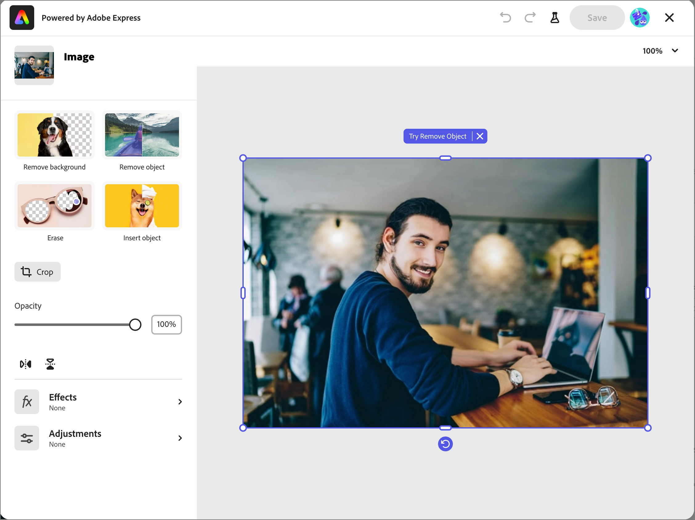
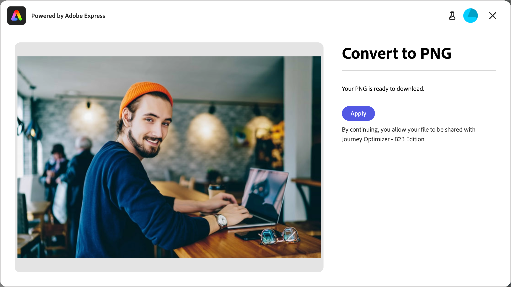

# Modifier des images à l’aide d’Adobe Express {#edit-images-adobe-express}

>[!CONTEXTUALHELP]
>id="ajo-b2b_assets_edit_adobe_express"
>title="Modifier des images dans Adobe Express"
>abstract="Des outils d’édition d’images simples et intuitifs, optimisés par Adobe Express, sont disponibles directement dans Adobe Journey Optimizer B2B Edition pour augmenter la vitesse du contenu."

Adobe Journey Optimizer B2B edition s’intègre de manière native à Adobe Express et vous permet d’accéder à un ensemble d’outils d’édition d’images d’Adobe Express. Vous pouvez utiliser ces outils pour modifier les images stockées dans le référentiel de ressources Journey Optimizer B2B edition. L’intégration offre les principaux avantages suivants :

* Réutilisation accrue du contenu en modifiant et en enregistrant de nouvelles ressources d’image dans Journey Optimizer B2B edition.

* Réduction du temps et des efforts nécessaires pour mettre à jour les ressources d’images ou créer de nouvelles versions de ressources d’images existantes.

>[!NOTE]
>
>Les droits relatifs aux fonctionnalités d’édition d’Adobe Express sont inclus dans tous les abonnements Journey Optimizer B2B edition.

Les fonctions Adobe Express prennent en charge les formats de fichiers image PNG et JPEG.

_Pour modifier une image :_

1. Accédez au volet de navigation de gauche et cliquez sur **[!UICONTROL Gestion de contenu]** > **[!UICONTROL Assets]**.

Cette action ouvre une page de liste contenant toutes les ressources répertoriées.

1. Recherchez l’image à modifier ou à utiliser comme original pour créer une ressource.

   * Pour afficher les ressources par dossier, ouvrez la structure en cliquant sur l’icône _Afficher les dossiers_ en haut à gauche.

   * Pour trier le tableau en fonction de l’une des colonnes, cliquez sur le titre de la colonne. La flèche située dans la ligne de titre indique la colonne de tri et l’ordre actuels.

   * Pour rechercher une ressource image dans le dossier sélectionné, saisissez une chaîne de texte dans la barre de recherche.

   {width="800" zoomable="yes"}

1. Cliquez sur le nom de la ressource image pour l’ouvrir et afficher ses détails.

   >[!TIP]
   >
   >Il est recommandé de sélectionner [l’onglet _[!UICONTROL Utilisé par]_](./internal-image-assets.md#view-asset-used-by-references) dans les détails de l’image et de passer en revue le contenu où l’image est actuellement utilisée avant de procéder aux modifications du fichier image.

1. Dans l’image _[!UICONTROL Détails]_ à droite, cliquez sur **[!UICONTROL Modifier avec Adobe Express]**.

   {width="600" zoomable="yes"}

   Si l’image est en cours d’utilisation, une boîte de dialogue d’alerte s’affiche pour vous informer que vos modifications affectent ce contenu. Cliquez sur **[!UICONTROL Continuer]** pour accéder à l’éditeur d’Adobe Express.

   {width="300"}

## Licence Adobe Express Enterprise

Si vous disposez d’une licence Enterprise pour Adobe Express, vous pouvez accéder à l’éditeur Express et l’utiliser. Ces fonctionnalités de modification incluent des opérations pour le réglage des images, comme la couleur, la luminosité, la netteté, les contrastes et le recadrage. Elles incluent également des opérations _magie de l’IA_ telles que la suppression d’arrière-plans, l’insertion et la suppression d’objets, ainsi que l’effacement de parties de l’image.

>[!NOTE]
>
>Votre licence Adobe Express Enterprise doit être achetée sous la même organisation IMS pour accéder à ces fonctionnalités d’éditeur complètes à partir de Journey Optimizer B2B edition. En tant que membre individuel de l’organisation IMS, vous avez besoin d’une licence attribuée dans l’instance Adobe Express. Sinon, votre accès à Adobe Express est limité aux [actions rapides sur Adobe Express](#quick-actions-in-adobe-express) de Journey Optimizer B2B edition.

{width="600" zoomable="yes"}

Le [Guide de l’utilisateur d’Adobe Express](https://helpx.adobe.com/express/web.html){target="_blank"} fournit des informations détaillées sur les fonctionnalités de modification disponibles.

## Actions rapides dans Adobe Express

Si vous ne disposez pas d’une licence Adobe Express Enterprise, vous avez accès à l’éditeur d’actions rapides d’Adobe Express.

1. Dans l’éditeur d’actions rapides d’Adobe Express, sélectionnez l’une des fonctions de modification d’image pour modifier l’image.

   * [**[!UICONTROL Redimensionner l’image]**](#resize-image)
   * [**[!UICONTROL Supprimer l’arrière-plan]**](#remove-background)
   * [**[!UICONTROL Recadrer l’image]**](#crop-image)
   * [**[!UICONTROL Convertir au format PNG]**](#convert-file-format) (lorsqu’une image JPEG est chargée)
   * [**[!UICONTROL Convertir en JPEG]**](#convert-file-format) (lorsqu’une image PNG est chargée)

   {width="600" zoomable="yes"}

1. Lorsque vous revenez à l’éditeur d’actions rapides Adobe Express principal, cliquez sur **[!UICONTROL Enregistrer]** pour enregistrer le fichier image modifié dans le référentiel de ressources de Journey Optimizer B2B edition avec le même nom de fichier.

## Redimensionner l’image

1. Utilisez les paramètres de redimensionnement pour réduire ou développer l’image :

   * Sélectionnez une option **[!UICONTROL Format]**. Utilisez une taille standard pour le contenu numérique ou choisissez **[!UICONTROL Personnalisé]** si vous souhaitez saisir des valeurs pour **[!UICONTROL Largeur]** et **[!UICONTROL Hauteur]** pour répondre à vos besoins.

   * Les options _[!UICONTROL Taille d’origine]_ et _[!UICONTROL Taille compressée]_ affichées affichent les modifications de taille qui en résultent si vous appliquez les modifications. L’outil **[!UICONTROL Zoom et recadrage]** permet d’examiner plus précisément des parties de l’image affichée.

   * Pour rétablir l’image à son état d’origine, cliquez sur **[!UICONTROL Réinitialiser]**.

   {width="600" zoomable="yes"}

1. Lorsque le résultat vous convient, cliquez sur **[!UICONTROL Appliquer]**.

## Supprimer l’arrière-plan

{width="600" zoomable="yes"}

Adobe Express effectue une suppression automatique de l’arrière-plan pour isoler l’objet principal dans l’image. Si le résultat vous convient, cliquez sur **[!UICONTROL Appliquer]**.

## Recadrer l’image

1. Faites glisser les poignées situées dans les coins de l’image pour supprimer les zones externes que vous ne souhaitez pas inclure dans la ressource d’image.

   {width="600" zoomable="yes"}

1. Lorsque le résultat vous convient, cliquez sur **[!UICONTROL Appliquer]**.

## Convertir le format de fichier

* **[!UICONTROL Convertir en JPEG]** - Pour une image PNG, vous pouvez convertir l’image en fichier image JPEG et l’enregistrer en tant que nouvelle ressource.
* **[!UICONTROL Convertir en PNG]** - Pour une image JPEG, vous pouvez convertir l’image en fichier image PNG et l’enregistrer en tant que nouvelle ressource.

{width="600" zoomable="yes"}

1. Cliquez sur **[!UICONTROL Appliquer]**.
