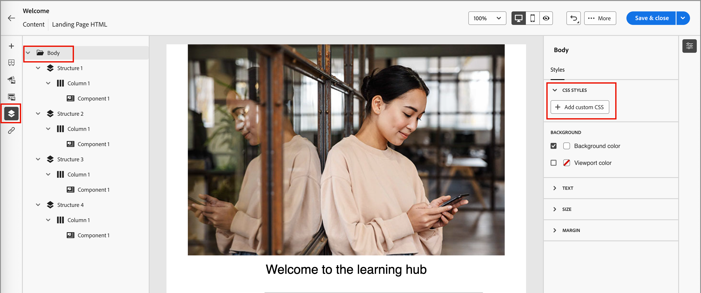

# Conception de modèle de page de destination

Après avoir [créé un modèle de page de destination](./landing-page-templates.md#create-a-landing-page-template), utilisez l’espace de conception visuelle pour créer les composants de structure et de contenu dans votre modèle de page.

## Ajouter la structure et le contenu {#structure-content-landing-page}

>[!CONTEXTUALHELP]
>id="ajo-b2b_landing_page_template_structure"
>title="Ajouter des composants de structure à la page de destination"
>abstract="Les composants de structure définissent la disposition de la page de destination. Faites glisser et déposez un composant **Structure** dans la zone de travail pour commencer à concevoir le contenu de votre modèle de page."

>[!CONTEXTUALHELP]
>id="ajo-b2b_landing_page_template_content_components"
>title="À propos des composants de contenu pour les pages de destination"
>abstract="Les composants de contenu sont des espaces réservés de contenu vides que vous pouvez utiliser pour créer la disposition d’un modèle de page de destination."

{{$include /help/_includes/content-design-components.md}}

### Ajouter un CSS personnalisé

Vous pouvez ajouter votre propre CSS personnalisé directement dans l’espace de conception de la page de destination. Utilisez le CSS personnalisé pour appliquer un style avancé et spécifique, pour une plus grande flexibilité et un meilleur contrôle de l’aspect de votre contenu. Il est recommandé d’ajouter ce style de niveau supérieur avant d’inclure des composants tels que des images, des boutons et du texte.

Avec au moins un composant de contenu dans la zone de travail, sélectionnez le composant **[!UICONTROL Corps]** dans l’arborescence de navigation de gauche pour accéder à l’éditeur CSS personnalisé.

{width="800" zoomable="yes"}

{{$include /help/_includes/content-design-custom-css.md}}

### Ajout de ressources

{{$include /help/_includes/content-design-assets.md}}

### Ajouter des formulaires

{{$include /help/_includes/content-design-add-forms.md}}

### Parcourir les calques, paramètres et styles

{{$include /help/_includes/content-design-navigation.md}}

### Personnaliser le contenu

{{$include /help/_includes/content-design-personalization.md}}

### Modifier le tracking des URL liées

{{$include /help/_includes/content-design-links.md}}

### Enregistrer votre travail

Cliquez sur **[!UICONTROL Enregistrer]** à tout moment pour enregistrer le modèle de page de destination.
<!--
You can continue to make edits to the draft page template. When you are ready to make it available for using in page creation, you can [publish the template](./landing-page-templates.md#). -->

### Afficher les options

Tirez parti des options d’affichage et de validation du contenu disponibles dans l’espace de conception visuelle.

* Effectuez un zoom avant/arrière sur le contenu dans les options de zoom prédéfinies.

* Basculez vers l’affichage du contenu sur les ordinateurs de bureau, les appareils mobiles ou en texte seul/texte brut.
   * Cliquez sur l’icône _Affichage_ pour afficher un aperçu du contenu sur tous les appareils.
   * Sélectionnez l’un des appareils prêts à l’emploi ou saisissez des dimensions personnalisées pour prévisualiser le contenu.

### Plus d’options

Dans le menu _[!UICONTROL Plus...]_ situé en haut de l’espace de conception visuelle, vous pouvez effectuer les actions suivantes :

{width="500"}

* **[!UICONTROL Réinitialiser la page de destination]** - Cliquez sur cette option pour vider la zone de travail de conception visuelle de son contenu et redémarrer la création de votre contenu de page.
* **[!UICONTROL Modifier votre conception]** - Revenez à la page d’accueil _[!UICONTROL Créer votre page de destination principale]_. À partir de là, vous pouvez choisir un autre modèle pour redémarrer le processus de conception ou choisir de concevoir la page à partir de zéro dans une zone de travail vierge.
<!--- * **[!UICONTROL Save as content template]** - Save the page body as a landing page template to be reused across multiple landing pages. You provide a name and description for the template and save it to the list of saved  landing page templates. -->
* **[!UICONTROL Exporter HTML]** - Téléchargez le contenu de la zone de travail visuelle sur votre système local au format HTML présenté sous la forme d’un fichier zip.
