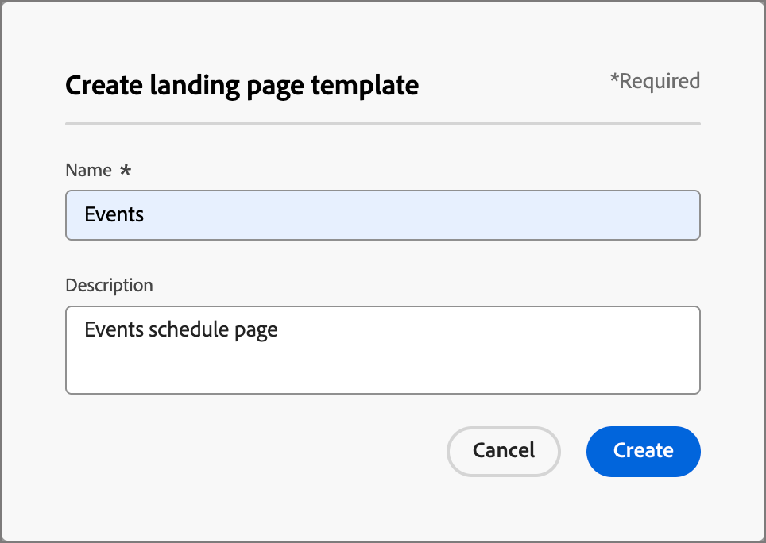

# Modèles de page de destination

Pour accélérer et améliorer le processus de conception, vous pouvez créer des modèles de page de destination autonomes pour normaliser la conception et le contenu de vos pages. Les stratégistes marketing peuvent réutiliser les pages et les adapter pour les utiliser dans des campagnes et des parcours.

## Accès et gestion des modèles de landing page

Pour accéder aux modèles de landing page dans Adobe Journey Optimizer B2B edition, accédez à **[!UICONTROL Gestion de contenu]** > **[!UICONTROL Modèles]**. Sous _[!UICONTROL WEB]_ dans le panneau de navigation, sélectionnez **[!UICONTROL Modèles de landing page]**.

La page de liste affichée comprend tous les modèles de page de destination créés dans l’instance répertoriée au format tableau. Le tableau est trié par défaut en fonction de la colonne _[!UICONTROL Modifié]_, les modèles les plus récemment mis à jour étant affichés en haut. Cliquez sur le titre de la colonne pour passer d’un ordre croissant à un ordre décroissant.

Pour rechercher un modèle par nom, saisissez une chaîne de texte dans la barre de recherche.

{width="700" zoomable="yes"}

Cliquez sur l’icône _Filtrer_ (  ) en haut à gauche pour filtrer la liste en fonction des dates de création ou de modification et des modèles que vous avez créés ou modifiés.

Personnalisez les colonnes à afficher dans le tableau en cliquant sur l’icône _Personnaliser le tableau_ (  ) en haut à droite. Sélectionnez les colonnes à afficher et cliquez sur **[!UICONTROL Appliquer]**.

Dans la liste des modèles affichée, vous pouvez effectuer les actions décrites dans les sections suivantes.

## Création d’un modèle de landing page

Vous pouvez créer un modèle de page de destination à partir de la page de liste des modèles de page de destination en cliquant sur **[!UICONTROL Créer un modèle]** en haut à droite.

1. Dans la boîte de dialogue, saisissez un **[!UICONTROL Nom]** unique (obligatoire) et un **[!UICONTROL Description]** utile (facultatif).

   {width="400"}

1. Cliquez sur **[!UICONTROL Créer]**.

La page _[!UICONTROL Créer votre page de destination principale]_ s’ouvre et propose des options pour créer le modèle : _[!UICONTROL Créer en partant de zéro]_, _[!UICONTROL Importer HTML]_ ou sélectionner l’un des _[!UICONTROL Modèles enregistrés]_.

{width="800" zoomable="yes"}

Après avoir sélectionné la méthode à utiliser pour commencer la conception de votre modèle, utilisez l’espace de conception visuelle pour [concevoir le contenu de votre modèle de page de destination](./landing-page-design.md).

### Créer en partant de zéro

Utilisez l’espace de conception visuelle pour définir la structure du contenu de la page de destination. En ajoutant et en déplaçant des composants structurels à l’aide de simples actions de glisser-déposer, vous pouvez concevoir la forme du contenu de page réutilisable en quelques secondes.

>[!NOTE]
>
>Les outils de conception disponibles sont équivalents à ceux utilisés pour la conception de pages de destination. La différence est que ce contenu est enregistré en tant que modèle pouvant être réutilisé sur plusieurs pages de destination.

1. Sur la page d’accueil _[!UICONTROL Concevez votre modèle]_, sélectionnez l’option **[!UICONTROL Créer en partant de zéro]**.

1. [Ajoutez la structure et le contenu](./landing-page-design.md#add-structure-and-content) au modèle.

### Importer du contenu HTML

Adobe Journey Optimizer B2B edition vous permet d’importer du contenu HTML existant afin de concevoir des modèles de landing page.

{{$include /help/_includes/content-design-import.md}}

{width="500"}

>[!NOTE]
>
>L’utilisation d’une balise `<table>` comme première couche d’un fichier HTML peut entraîner une perte de style, y compris les paramètres d’arrière-plan et de largeur dans la balise de couche supérieure.

Vous pouvez personnaliser le contenu importé selon vos besoins à l’aide de l’espace de conception visuelle.

### Sélection d’un modèle de conception

{{$include /help/_includes/content-design-select-template.md}}

## Afficher les détails du modèle de page

Dans la page de liste _Modèles de landing page_, cliquez sur le nom d’un modèle de landing page pour ouvrir la page de détails. À partir de là, vous pouvez afficher les propriétés de base du modèle de page de destination et accéder à l’espace de conception visuelle pour apporter des modifications au contenu du modèle.

{width="700" zoomable="yes"}

* Affichez les détails du modèle, tels que le nom et la description. Ces paramètres peuvent être modifiés. Cliquez en dehors de la zone de description pour enregistrer automatiquement les modifications.

* Affichez les propriétés du modèle telles que créé par, créé le, Dernière mise à jour le et Modifié par.

* Cliquez sur **[!UICONTROL Plus]** en haut à droite pour effectuer des actions rapides sur le modèle de page de destination, telles que _Dupliquer_ et _Supprimer_.

* S’il existe des alertes actives (erreurs et avertissement pour le modèle de page de destination), cliquez sur **[!UICONTROL Alertes]** en haut à droite pour afficher les informations.

  Ces alertes n’interdisent pas l’utilisation du modèle de page de destination pour la création de pages de destination. Les informations permettent aux spécialistes marketing de votre équipe d’avoir une idée de ce qui peut ne pas fonctionner et des mises à jour nécessaires avant de pouvoir les utiliser pour la diffusion.

## Afficher les références du modèle utilisé par

Dans la page de détails des modèles, cliquez sur l’onglet **[!UICONTROL Utilisé par]** pour afficher les détails de l’utilisation de ce modèle dans une page de destination.

{width="400"}

* Cliquez sur le lien pour accéder à la page de destination correspondante où le modèle est utilisé.

* Quittez la vue à tout moment en cliquant sur la flèche vers l’arrière, qui vous ramène à la page de liste.

## Modifier les modèles de landing page

Cette action peut être effectuée à partir de :

* La page de détails - Cliquez sur **[!UICONTROL Modifier le modèle de page de destination]**.
* La page de liste : cliquez sur les points de suspension (**...**) à côté d’un modèle et choisissez **[!UICONTROL Modifier]**.

Cette action vous conduit à la page _Concevoir votre modèle_ ou à la page de l’éditeur de contenu visuel (en fonction du dernier statut enregistré du modèle de page de destination). À partir de là, vous pouvez modifier le contenu de votre modèle de page de destination selon vos besoins. Voir [Création d’un modèle de page de destination](#create-a-landing-page-template) pour plus d’informations sur les options de modification.

## Dupliquer les modèles de landing page

Vous pouvez dupliquer un modèle de landing page à l&#39;aide de l&#39;une des méthodes suivantes :

* Dans les détails du modèle sur la droite, développez **[!UICONTROL Plus]** et cliquez sur **[!UICONTROL Dupliquer]**.

  {width="400"}

* Dans la page de liste _[!UICONTROL Modèles de landing page]_, cliquez sur les points de suspension (...) en regard du modèle et choisissez **[!UICONTROL Dupliquer]**.

Dans la boîte de dialogue, saisissez un nom utile (unique) et une description. Cliquez sur **[!UICONTROL Dupliquer]** pour terminer l’action.

Le modèle de page de destination dupliqué (nouveau) apparaît alors dans la liste _Modèles de page de destination_.

## Supprimer les modèles de page de destination

La suppression d’un modèle de page de destination est irréversible. Vérifiez-le avant de lancer une action de suppression. Vous pouvez supprimer un modèle de page de destination à l’aide de l’une des méthodes suivantes :

* Dans les détails du modèle sur la droite, développez **[!UICONTROL Plus]** et cliquez sur **[!UICONTROL Supprimer]**.
* Dans la page de liste _Modèles de page de destination_, cliquez sur les points de suspension (...) en regard du modèle et choisissez **[!UICONTROL Supprimer]**.

  {width="500"}

Cette action ouvre une boîte de dialogue de confirmation. Vous pouvez abandonner le processus en cliquant sur **[!UICONTROL Annuler]** ou sur **[!UICONTROL Supprimer]** pour confirmer la suppression.

## Prendre des actions en bloc

Dans la page de liste des modèles de page de destination, sélectionnez plusieurs modèles à la fois en cochant les cases situées à gauche. Une bannière s’affiche en bas lorsque vous sélectionnez plusieurs modèles.

{width="600"}

**[!UICONTROL Supprimer]** — Vous pouvez supprimer jusqu&#39;à 20 modèles à la fois. Une boîte de dialogue de confirmation vous permet d’abandonner l’action ou de confirmer la suppression des modèles.

## Créer une page de destination à partir d’un modèle enregistré

Sur la page _Créer votre page de destination_, accédez à la section _Sélectionner un modèle de conception_ pour commencer à créer votre contenu à partir d’un modèle.

Pour commencer à créer votre contenu avec l’un des modèles de page de destination créés, procédez comme suit :

1. Accédez à l’espace de conception visuelle à partir de la page _Modifier le contenu_.

   Sur la page _Créer votre page de destination_, l’onglet _Exemples de modèles_ est sélectionné par défaut.

1. Pour utiliser un modèle de landing page personnalisé, sélectionnez l’onglet **[!UICONTROL Modèles enregistrés]** .

   Cet onglet affiche la liste de tous les modèles de page de destination créés sur le sandbox. Vous pouvez les trier _Par nom_, _Dernière modification_ et _Dernière création_.

1. Sélectionnez le modèle de votre choix dans la liste.

   Une fois la sélection effectuée, un aperçu du modèle s’affiche. En mode Aperçu , vous pouvez naviguer entre tous les modèles d’une catégorie (exemple ou modèle enregistré, selon votre sélection) à l’aide des flèches droite et gauche.

1. Cliquez sur **[!UICONTROL Utiliser ce modèle]** en haut à droite.

1. Dans le concepteur de contenu visuel, modifiez votre contenu selon vos besoins.
