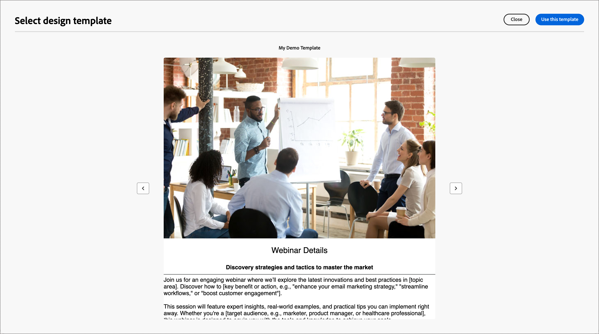
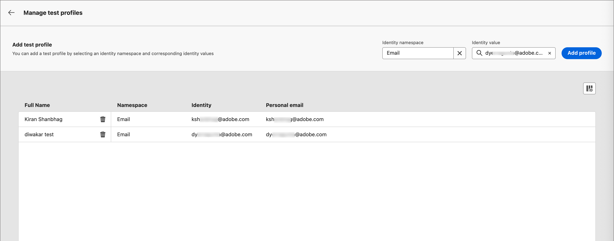

# Créer et publier des pages de destination

En tant que spécialiste marketing, vous pouvez définir et publier des pages que vous souhaitez incorporer dans vos parcours de compte et de personne. Lorsque vous ajoutez une nouvelle page de destination, vous configurez la page principale et les sous-pages, vous concevez le contenu, vous le testez et vous le publiez.

>[!BEGINSHADEBOX]

## Conditions préalables relatives aux pages de destination {#landing-page-prerequisites}

Avant que les marketeurs puissent créer des pages de destination pour prendre en charge leurs parcours et campagnes, les configurations et ressources suivantes doivent être en place :

* [Sous-domaine de page de destination](../admin/configure-channels-landing-pages.md#lp-subdomains) - Configurez un sous-domaine dédié à l’hébergement de vos pages de destination.
* [Préréglage de la page de destination](../admin/configure-channels-landing-pages.md#lp-presets) - Un préréglage définit le sous-domaine et les autres paramètres appliqués à vos pages de destination.
* [Formulaire](./forms.md) (pour les cas d’utilisation de capture de données) - Obligatoire lorsque vous souhaitez incorporer un formulaire sur une page de destination et envoyer des données à Experience Platform.
  <!-- * Subscription list (for subscription use cases) - Required if you want customers to subscribe to or unsubscribe from a specific service. This is in AJO B2C-->

>[!ENDSHADEBOX]

## Créer une page de destination {#create-landing-page}

>[!CONTEXTUALHELP]
>id="ajo-b2b_lp_create"
>title="Définissez et configurez votre page de destination."
>abstract="Pour créer une page de destination, vous devez sélectionner un préréglage, puis configurer la page principale et les sous-pages, et enfin tester la page avant de la publier."

1. Accédez au volet de navigation de gauche et sélectionnez **[!UICONTROL Gestion de contenu]** > **[!UICONTROL Pages de destination]**.

1. Cliquez sur **[!UICONTROL Créer une page de destination]** en haut à droite.

1. Sur la page, saisissez un **[!UICONTROL Titre]** utile (obligatoire) et un **[!UICONTROL Description]** (facultatif).

   Critères de titre et de description :

   * Titre : 100 caractères maximum, doit être unique et non sensible à la casse.

   * Description - 300 caractères maximum

   * Les caractères Alpha, numériques et spéciaux sont autorisés

   * Les caractères réservés ne sont **_pas autorisés_** : `\ / : * ? " < > |`

   {width="600"}

1. Sélectionnez un **[!UICONTROL paramètre prédéfini]**.

   Un administrateur de produit [configure un préréglage](../admin/configure-channels-landing-pages.md#lp-presets) pour définir le sous-domaine et d’autres paramètres utilisés pour les pages de destination. Vous pouvez sélectionner un paramètre prédéfini, puis cliquer sur **[!UICONTROL Afficher le paramètre prédéfini]** pour ouvrir les détails du paramètre prédéfini et vérifier les paramètres pour vous assurer qu’il correspond aux exigences de votre page de destination.

1. Cliquez sur **[!UICONTROL Créer]**.

   La page principale et ses propriétés s’affichent.

   {width="700" zoomable="yes"}

## Configurer la page principale {#configure-primary-page}

>[!CONTEXTUALHELP]
>id="ajo-b2b_lp_primary_page"
>title="Définissez les paramètres de votre page principale."
>abstract="Définissez la page principale, qui s’affiche immédiatement lorsqu’un destinataire clique sur le lien de la page de destination, par exemple à partir d’un e-mail ou d’un site web."

>[!CONTEXTUALHELP]
>id="ajo-b2b_lp_access_settings"
>title="Définissez lʼURL de votre page de destination."
>abstract="Dans cette section, définissez une URL de page de destination unique. La première partie de l’URL nécessite la configuration préalable d’un sous-domaine de page de destination dans le cadre du préréglage que vous avez sélectionné."

1. Modifiez le **[!UICONTROL Nom de la page]** en fonction de vos besoins, qui est par défaut la page de Principal __.

1. Définissez la partie de fin de l’URL de la page.

   Le préréglage que vous avez sélectionné détermine la première partie de l’URL.

   >[!CAUTION]
   >
   >LʼURL de la page de destination doit être unique.
   >
   >Vous ne pouvez pas accéder à votre page de destination en copiant-collant cette URL dans un navigateur web, même si elle est publiée. Testez-le à l’aide de la fonction d’aperçu.

1. Si vous souhaitez une page de destination anonyme, désactivez l’option **[!UICONTROL Exiger des utilisateurs identifiés]**.

   <!-- The option 'Require identified users' would be visible in both AJO & AJOB2B when the Landing page is of type 'Data capture' -->

1. Cliquez sur l’icône _Calendrier_ (  ) pour définir l’**[!UICONTROL expiration de la page]**.

   Après avoir sélectionné une date d’expiration, choisissez l’action lors de l’expiration de la page :

   * **[!UICONTROL URL de redirection]** - Saisissez l’URL de la page à utiliser comme redirection.

     {width="400"}

     <!-- * **[!UICONTROL Custom page]** - Configure a subpage and select it from the list. -->
   * **[!UICONTROL Erreur de navigateur]** - Saisissez le texte de l’erreur à afficher à la place de la page.

     {width="400"}

## Choisir le type de conception du contenu {#choose-design-type}

Pour ajouter le _[!UICONTROL Contenu]_ de la page, cliquez sur **[!UICONTROL Ouvrir Designer]**. La page d’accueil _[!UICONTROL Créer votre page de destination principale]_ se charge et le processus de conception commence par le choix de la manière dont vous souhaitez commencer la conception :

* [[!UICONTROL Créer en partant de zéro]](#design-from-scratch)
* [[!UICONTROL Coder le vôtre]](#code-your-own)
* [[!UICONTROL Importer HTML]](#import-html)
* [Utiliser un modèle de landing page](#select-template)

{width="800" zoomable="yes"}

Après avoir sélectionné la méthode souhaitée pour démarrer la conception de la page de destination, utilisez les outils de conception visuelle pour [terminer le contenu de la page](./landing-page-design.md).

### Créer en partant de zéro {#design-from-scratch}

Utilisez l’éditeur visuel de contenu pour définir la structure du contenu de la page de destination. En ajoutant et en déplaçant des composants structurels à l’aide de simples actions de glisser-déposer, vous pouvez concevoir la forme du contenu de la page en quelques secondes.

1. Sur la page d’accueil _[!UICONTROL Créer votre page de destination principale]_, sélectionnez l’option **[!UICONTROL Créer en partant de zéro]**.

1. Choisissez la manière de gérer la mise en forme du contenu de la page :

   * **[!UICONTROL Utiliser les thèmes]** - Sélectionnez cette option pour créer le contenu de la page en _mode thème_. Dans ce mode, vous pouvez utiliser un [thème de marque](./brand-themes.md) défini pour rationaliser le processus de création de contenu et vous assurer que la conception s’aligne sur les normes définies.

   * **[!UICONTROL Style manuel]** - Sélectionnez cette option pour créer le contenu de la page en _mode manuel_. Dans ce mode, vous définissez manuellement la mise en forme de tous les composants de structure et de contenu que vous ajoutez à la zone de travail vierge.

1. Cliquez sur **[!UICONTROL Confirmer]**.

1. [Ajoutez la structure et le contenu](./landing-page-design.md#structure-content-landing-page) à la page.

### Coder le vôtre {#code-your-own}

_Codez le vôtre_ vous permet d’écrire ou de coller du code HTML brut afin de créer le contenu de la page directement dans l’espace de conception. Utilisez ce mode lorsque vous avez besoin d’un contrôle total des balises. L’utilisation de ce mode nécessite des compétences HTML.

Après avoir choisi ce mode, vous restez dans l’éditeur de code ; vous ne pouvez pas passer à l’éditeur visuel.

1. Sur la page d’accueil _[!UICONTROL Créer votre page de destination principale]_, sélectionnez l’option **[!UICONTROL Coder le vôtre]**.

1. Saisissez ou collez votre code HTML brut.

Si vous souhaitez effacer le contenu de votre page et partir d’une nouvelle conception, sélectionnez **[!UICONTROL Modifier votre conception]** dans le menu d’options.

### Importer du contenu HTML {#import-html}

Adobe Journey Optimizer B2B edition vous permet d’importer du contenu HTML existant afin de concevoir vos pages de destination.

{{$include /help/_includes/content-design-import.md}}

{width="500"}

>[!NOTE]
>
>L’utilisation d’une balise `<table>` comme première couche d’un fichier HTML peut entraîner une perte de style, y compris les paramètres d’arrière-plan et de largeur dans la balise de couche supérieure.

Vous pouvez personnaliser le contenu importé selon vos besoins à l’aide de l’espace de conception visuelle.

### Sélectionner un modèle {#select-template}

[!BADGE Beta]{type=Informative tooltip="Fonctionnalité Beta"}

Si vous souhaitez utiliser un modèle de landing page, vous pouvez choisir parmi les options suivantes :

* **Exemples de modèles**. L’interface B2B edition de Journey Optimizer propose un ensemble de modèles de page de destination prêts à l’emploi que vous pouvez utiliser comme point de départ pour concevoir votre page de destination.

* **Modèles enregistrés**. Utilisez un modèle personnalisé enregistré créé par un membre de votre organisation à l’aide de l’<!-- or the _[!UICONTROL Save as content template]_ option when designing a landing page. --> de menu _[!UICONTROL Modèles]_

Utilisez la section _[!UICONTROL Sélectionner un modèle de conception]_ pour commencer à créer le contenu à partir d’un modèle. Vous pouvez utiliser un modèle type ou un modèle de page de destination personnalisé enregistré à partir de votre instance Journey Optimizer B2B edition.

>[!BEGINTABS]

>[!TAB Modèles enregistrés]

La page d’accueil _Créer votre page de destination principale_ affiche par défaut l’onglet _Exemples de modèles_. Pour utiliser un modèle personnalisé, sélectionnez l’onglet **[!UICONTROL Modèles enregistrés]**.

La liste de tous les modèles de page de destination enregistrés s’affiche. Vous pouvez les trier par _[!UICONTROL Nom]_, _[!UICONTROL Dernière modification]_ et _[!UICONTROL Dernière création]_.

{width="700" zoomable="yes"}

Sélectionnez une miniature de modèle pour afficher un aperçu. En mode Aperçu , vous pouvez naviguer entre tous les modèles d’une catégorie (exemple ou modèle enregistré, selon votre sélection) à l’aide des flèches droite et gauche.

{width="800" zoomable="yes"}

Lorsque l’affichage correspond à ce que vous souhaitez utiliser, cliquez sur **[!UICONTROL Utiliser ce modèle]** en haut à droite de la fenêtre d’aperçu.

Cette action copie le contenu dans l’espace de conception visuelle, où vous pouvez modifier le contenu selon vos besoins.

<!-- 
>[!NOTE]
>
>Saved templates may have governance (content locking) settings applied to one or more components. The design tools provide guidelines about locked components when you [author content from a governed template](./email-authoring-governance.md). 
-->

>[!TAB Exemples de modèles]

Adobe Journey Optimizer B2B edition propose une sélection de modèles de page de destination _prêts à l’emploi_ qui peuvent être utilisés pour créer vos propres pages de destination et modèles de page de destination.

<!-- {width="800" zoomable="yes"} -->

>[!ENDTABS]

## Vérifier les alertes {#check-alerts}

Lorsque vous concevez le contenu de votre page de destination, des alertes s’affichent en haut à droite lorsque des paramètres clés sont manquants.

{width="250"}

Si ce bouton ne s’affiche pas, aucun problème n’est détecté.

Il existe deux types d’alertes :

* **_avertissements_** qui se rapportent aux recommandations et aux bonnes pratiques telles que :

   * `Placeholder links are present in the landing page body` : n’oubliez pas de remplacer les espaces réservés par des liens valides.

   * `Text version of HTML is empty` : n’oubliez pas de définir une version texte du corps de votre page, qui est utilisée lorsque le contenu HTML ne peut pas être affiché.

   * `Empty link is present in page body` : vérifiez que tous les liens de votre page sont corrects.

* **_Erreurs_** qui vous empêchent de tester ou d’activer le parcours/la campagne tant qu’elles ne sont pas corrigées, telles que :

   * `The landing page content is empty` : le contenu de la page est obligatoire.

## Tester la page de destination {#test-landing-page}

>[!CONTEXTUALHELP]
>id="ajo-b2b_preview_lp_profiles"
>title="Prévisualiser et tester votre page de destination"
>abstract="Une fois que vous avez défini les paramètres et le contenu de votre page de destination, utilisez des profils de test pour prévisualiser la page."

Lorsque les paramètres et le contenu de la page de destination sont définis, vous pouvez utiliser des profils de test pour prévisualiser la page. Si vous avez inséré du [contenu personnalisé](./personalization.md), vous pouvez vérifier l’affichage de celui-ci dans la page de destination à l’aide des données de profil de test.

>[!PREREQUISITES]
>
>Pour prévisualiser et tester des pages de destination, vous devez disposer de l’autorisation **[!UICONTROL Publier des messages]** et d’un jeu de données défini contenant des [profils de test](../audiences/test-profiles.md).

1. Cliquez sur **[!UICONTROL Aperçu et test]** pour ouvrir la sélection du profil de test.

   >[!NOTE]
   >
   >Vous pouvez également utiliser la fonction **[!UICONTROL Simuler du contenu]** lorsque vous vous trouvez dans l’espace de conception visuelle.

1. Dans l’écran _[!UICONTROL Simuler]_, sélectionnez un profil de test.

   {width="700" zoomable="yes"}

   Si les profils dont vous avez besoin ne sont pas répertoriés, cliquez sur **[!UICONTROL Gérer les profils de test]** pour utiliser une adresse e-mail [profil de test](../audiences/test-profiles.md) connue et l’ajouter à la liste.

   +++Ajout de profils de test

   Pour **[!UICONTROL Espace de noms d’identité]**, cliquez sur l’icône _Sélectionner_ (  ) et sélectionnez l’espace de noms d’`Email` à utiliser pour tester les profils.

   {width="700" zoomable="yes"}

   Dans le champ **[!UICONTROL Valeur d’identité]**, saisissez l’adresse e-mail pour identifier le profil de test et cliquez sur **[!UICONTROL Ajouter un profil]**. Vous pouvez répéter cette opération pour ajouter plusieurs profils.

   {width="700" zoomable="yes"}

   Cliquez sur la flèche vers l’arrière en haut à gauche pour revenir à la page _[!UICONTROL Simuler]_.

   +++

1. Sélectionnez **[!UICONTROL Ouvrir l’aperçu]** pour tester votre page de destination.

   L’aperçu de la page de destination s’ouvre dans un nouvel onglet. Les données du profil de test sélectionné remplacent les éléments personnalisés.

   {width="600"}

1. Sélectionnez dʼautres profils de test pour prévisualiser le rendu de chaque variante de votre page de destination.

## Publier la page {#publish-landing-page}

>[!PREREQUISITES]
>
>Pour publier des pages de destination, vous devez disposer de l’autorisation **[!UICONTROL Publier des messages]**.  Avant de publier, [vérifiez et résolvez toutes les alertes](#check-alerts).

Lorsque le brouillon de page répond à vos critères et que vous souhaitez rendre la page disponible pour qu’elle soit liée à partir de messages de parcours, cliquez sur **[!UICONTROL Publier]** en haut à droite. Et dans la boîte de dialogue de confirmation, cliquez sur **[!UICONTROL Publier]**.

{width="250"}

Lorsque la landing page est publiée, elle s&#39;affiche dans la liste des landing pages avec le statut **_[!UICONTROL Publiée]_**. Cela signifie qu’il est en ligne et prêt à être utilisé dans un e-mail, un SMS ou un message WhatsApp envoyé par le biais d’un parcours.

Vous ne pouvez pas accéder à la page de destination publiée en copiant-collant l’URL dans un navigateur web. Vous pouvez le tester à tout moment à l’aide de la fonction [preview](#test-landing-page).

Vous pouvez surveiller lʼimpact de votre page de destination au moyen de rapports spécifiques.
