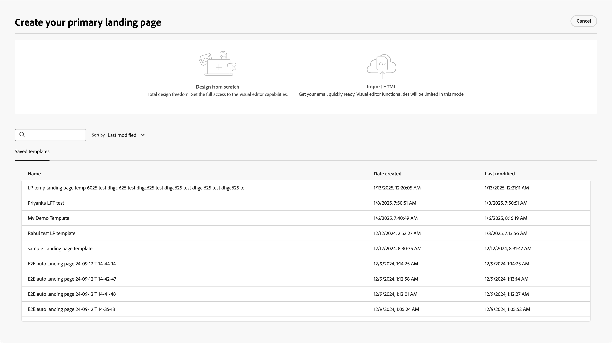
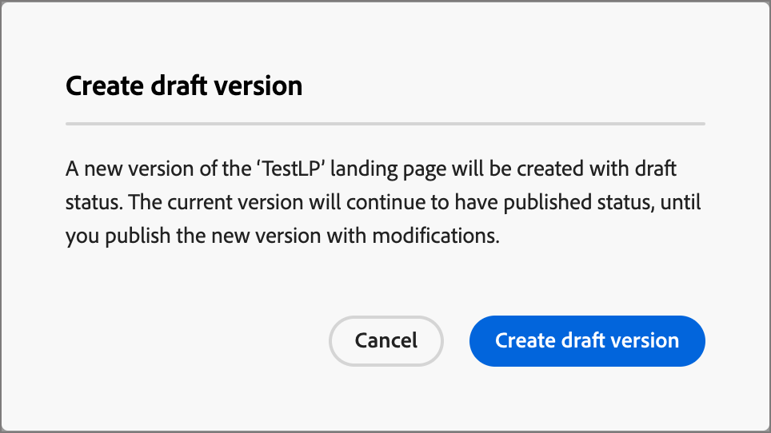

# Pages de destination

Une page de destination est une page web autonome où vous pouvez diriger les contacts et les clients après qu&#39;ils ont cliqué sur un élément lié dans un e-mail, un SMS ou tout emplacement numérique. Vous pouvez incorporer ces pages dans les parcours de votre compte pour que vos prospects et clients voient vos messages sur le web et progressent dans les parcours de votre compte. Vous pouvez créer, personnaliser et prévisualiser des pages de destination dans le Designer Pages de destination.

Pour diriger vos clients vers une page web définie lorsqu’ils cliquent sur un lien spécifique, créez une page de destination dans Journey Optimizer B2B edition.

* Création de la page
* Concevoir la page de destination et créer du contenu
* Tester la page
* Publish de la page
* Lien vers la page à partir du contenu de votre parcours

Par exemple, vous pouvez créer et concevoir des pages de destination pour diriger vos utilisateurs vers des informations en ligne. La page peut inclure un formulaire dans lequel ils peuvent s’inscrire ou refuser de recevoir vos communications. Il peut également s’agir d’une opportunité de s’abonner à des communications récurrentes, telles qu’une newsletter.

Vous pouvez créer, personnaliser et prévisualiser des pages de destination dans le concepteur visuel.
<!-- 
For the Beta phase, you can only design landing pages from scratch and publish your landing pages. The landing pages will be served on adobe hosted domain for the Beta phase. The capability to define your branded domains for hosting will be delivered in a future release. -->

## Accéder aux pages de destination et les gérer

Pour accéder aux pages de destination dans Adobe Journey Optimizer B2B edition, accédez au volet de navigation de gauche et cliquez sur **[!UICONTROL Gestion de contenu]** > **[!UICONTROL Pages de destination]**. Cette action ouvre une page de liste contenant toutes les pages de destination créées dans l’instance répertoriée dans un tableau.

{width="800" zoomable="yes"}

Le tableau est trié selon la colonne _[!UICONTROL Modifié]_, les éléments les plus récemment mis à jour étant en haut par défaut. Cliquez sur le titre de la colonne pour passer d’un ordre croissant à un ordre décroissant.

### Filtrer la liste des landing pages

Pour rechercher une page de destination par nom, saisissez une chaîne de texte dans la barre de recherche pour rechercher une correspondance. Cliquez sur l’icône _Filtrer_ (  ) pour afficher les options de filtre disponibles et modifier les paramètres afin de filtrer les éléments affichés en fonction de vos critères spécifiés.

{width="700" zoomable="yes"}

### Personnalisation de l’affichage des colonnes

Personnalisez les colonnes à afficher dans le tableau en cliquant sur l’icône _Personnaliser le tableau_ (  ) en haut à droite.

Dans la boîte de dialogue, sélectionnez les colonnes à afficher et cliquez sur **[!UICONTROL Appliquer]**.

{width="300"}

### Statut et cycle de vie de la page de destination

Le statut de la page de destination détermine sa disponibilité pour la liaison dans le contenu de votre e-mail et de votre SMS, ainsi que les modifications que vous pouvez y apporter.

| Statut | Description |
| -------------------- | ----------- |
| Brouillon | Lorsque vous créez une page de destination, elle a le statut de brouillon. Il reste dans ce statut lorsque vous définissez ou modifiez le contenu visuel, et jusqu’à ce que vous le publiiez en tant que page hébergée. Actions disponibles : <ul><li>Modifier le nom ou la description<li>Modifier l&#39;URL du lien<li>Modifier dans le concepteur visuel<li>Publier<li>Dupliquer<li>Supprimer |
| Publié | Lorsque vous publiez une landing page, elle est hébergée sur l&#39;instance Journey Optimizer B2B edition et vous pouvez la lier dans le contenu d&#39;un e-mail ou d&#39;un SMS. Actions disponibles : <ul><li>Modifier le nom ou la description<li>Modifier l&#39;URL du lien<li>Ajouter un lien dans le contenu d’un e-mail ou d’un SMS<li>Créer un brouillon<li>Dupliquer<li>Supprimer |
| Publié avec le brouillon | Lorsque vous créez un brouillon à partir d’une page de destination publiée, la version publiée est conservée et le contenu du brouillon peut être modifié dans le concepteur visuel. Si vous publiez le brouillon, il remplace la version publiée actuelle et le contenu est mis à jour dans la page hébergée. Actions disponibles : <ul><li>Modifier le nom ou la description<li>Modifier l&#39;URL du lien<li>Ajouter un lien dans le contenu d’un e-mail ou d’un SMS<li>Modifier le brouillon dans le concepteur visuel<li>Version brouillon de Publish<li>Dupliquer<li>Supprimer (supprime les deux versions)<li>Ignorer le brouillon (revient à publié) |

{zoomable="yes"}

## Créer une page de destination

Vous pouvez ajouter une nouvelle page de destination dans Journey Optimizer B2B edition en cliquant sur **[!UICONTROL Créer une page de destination]** en haut à droite.

1. Dans la boîte de dialogue _[!UICONTROL Créer une page de destination]_, saisissez un **[!UICONTROL Nom]** et un **[!UICONTROL Description]** utiles (facultatif).

   Exigences relatives aux pages de destination :

   * Nom : 100 caractères maximum, doit être unique et ne pas respecter la casse.

   * Description - 300 caractères maximum

   * Les caractères Alpha, numériques et spéciaux sont autorisés

   * Les caractères réservés ne sont **_pas autorisés_** : `\ / : * ? " < > |`

   {width="400"}

1. Si nécessaire et si plusieurs sous-domaines sont configurés, modifiez le **[!UICONTROL Sous-domaine]** à utiliser pour la page de destination.

1. Cliquez sur **[!UICONTROL Créer]**.

   La page d’accueil _[!UICONTROL Créer votre page de destination principale]_ s’ouvre et propose plusieurs options pour créer la page : _[!UICONTROL Créer en partant de zéro]_, _[!UICONTROL Importer un HTML]_ ou utiliser un modèle enregistré.

   {width="800" zoomable="yes"}

   Après avoir sélectionné la méthode à utiliser pour commencer la conception de la page de destination, utilisez le concepteur visuel pour [ concevoir la page ](./landing-page-design.md).

### Créer en partant de zéro

Utilisez l’éditeur visuel de contenu pour définir la structure du contenu de la page de destination. En ajoutant et en déplaçant des composants structurels à l’aide de simples actions de glisser-déposer, vous pouvez concevoir la forme du contenu de la page en quelques secondes.

1. Sur la page d’accueil _[!UICONTROL Créer votre page de destination principale]_, sélectionnez l’option **[!UICONTROL Créer en partant de zéro]**.

1. [Ajoutez la structure et le contenu](./landing-page-design.md#add-structure-and-content) à la page.

### Importer du contenu HTML

Adobe Journey Optimizer B2B edition vous permet d’importer du contenu HTML pour concevoir vos pages de destination.

{{$include /help/_includes/content-design-import.md}}

{width="500"}

>[!NOTE]
>
>L’utilisation d’une balise `<table>` comme première couche d’un fichier HTML peut entraîner une perte de style, y compris les paramètres d’arrière-plan et de largeur dans la balise de couche supérieure.

Vous pouvez personnaliser le contenu importé selon vos besoins à l’aide du concepteur visuel.

### Sélectionner un modèle enregistré

Vous pouvez choisir parmi les options suivantes :

* **Exemples de modèles**. L’interface de Journey Optimizer propose un ensemble de modèles de page de destination prêts à l’emploi que vous pouvez choisir.

* **Modèles enregistrés**. Utilisez un modèle personnalisé enregistré créé par un membre de votre organisation à l’aide de l’<!-- or the _[!UICONTROL Save as content template]_ option when designing a landing page. --> de menu _[!UICONTROL Modèles]_

Utilisez la section _[!UICONTROL Sélectionner un modèle de conception]_ pour commencer à créer le contenu à partir d’un modèle. Vous pouvez utiliser un modèle type ou un modèle de page de destination personnalisé enregistré à partir de votre instance Journey Optimizer B2B edition.

>[!BEGINTABS]

>[!TAB Modèles enregistrés]

Sur la page d’accueil _Créer votre page de destination principale_, l’onglet _Exemples de modèles_ est sélectionné par défaut. Pour utiliser un modèle personnalisé, sélectionnez l’onglet **[!UICONTROL Modèles enregistrés]**.

La liste de tous les modèles de page de destination enregistrés s’affiche. Vous pouvez les trier par _[!UICONTROL Nom]_, _[!UICONTROL Dernière modification]_ et _[!UICONTROL Dernière création]_.

{width="700" zoomable="yes"}

Sélectionnez le modèle de votre choix dans la liste.

Une fois la sélection effectuée, un aperçu du modèle s’affiche. En mode Aperçu , vous pouvez naviguer entre tous les modèles d’une catégorie (exemple ou modèle enregistré, selon votre sélection) à l’aide des flèches droite et gauche.

{width="800" zoomable="yes"}

Lorsque l’affichage correspond à ce que vous souhaitez utiliser, cliquez sur **[!UICONTROL Utiliser ce modèle]** en haut à droite de la fenêtre d’aperçu.

Cette action copie le contenu dans le concepteur de contenu visuel, où vous pouvez modifier le contenu selon vos besoins.

>[!TAB Exemples de modèles]

Adobe Journey Optimizer B2B edition propose une sélection de modèles de page de destination _prêts à l’emploi_ qui peuvent être utilisés pour créer vos propres pages de destination et modèles de page de destination.

<!-- {width="800" zoomable="yes"} -->

>[!ENDTABS]

<!-- 
>[!NOTE]
>
> Saved templates may have governance (content locking) settings applied to one or more components. The visual designer provides guidelines about locked components when you [author an email from a governed template](./email-authoring-governance.md). -->

## Modification d’une page de destination

Les modifications apportées à une landing page dépendent de son statut actuel :

* Lorsqu’une page de destination a le statut **_Brouillon_**, vous pouvez modifier n’importe quel de ses détails, l’URL et le contenu visuel.
* Lorsqu’une page de destination a le statut **_Publiée_**, vous pouvez modifier sa description, mais pas son nom. Pour modifier le contenu visuel, vous devez créer un brouillon de la page.
* Lorsqu’une page de destination affiche le statut **_Publiée avec le brouillon_**, la modification des détails se limite à la description. Vous pouvez également modifier le contenu visuel de la version brouillon.

>[!BEGINTABS]

>[!TAB Brouillon]

1. Dans la page de liste _[!UICONTROL Pages de destination]_, cliquez sur le nom de la page de destination pour l’ouvrir.

   Un aperçu du contenu visuel s’affiche, avec les détails de la page de destination sur la droite.

1. Modifiez l’un des détails, tels que le nom et la description.

   {width="700" zoomable="yes"}

1. Pour apporter des modifications au contenu dans le concepteur visuel, cliquez sur **[!UICONTROL Modifier la page de destination]**.

   Utilisez les outils du concepteur visuel selon vos besoins :

   * [Ajouter la structure et le contenu](./landing-page-design.md#add-structure-and-content)
   * [Ajout d’Assets](./landing-page-design.md#add-assets)
   * [Parcourir les calques, paramètres et styles](./landing-page-design.md#navigate-the-layers-settings-and-styles)
   * [Personnaliser le contenu](./landing-page-design.md#personalize-content)
   * [Modifier le tracking des URL liées](./landing-page-design.md#edit-linked-url-tracking)

1. Cliquez sur **[!UICONTROL Enregistrer]** ou **[!UICONTROL Enregistrer et fermer]** pour revenir aux détails de la page de destination.

1. Lorsque la page répond à vos critères et que vous souhaitez la rendre disponible pour affichage, cliquez sur **[!UICONTROL Publish]**.

>[!TAB Publié]

1. Dans la page de liste _[!UICONTROL Page de destination]_, cliquez sur le nom de la page pour l’ouvrir.

   Un aperçu du contenu visuel s’affiche, avec les détails de la page de destination sur la droite.

1. Modifiez la description, si nécessaire.

   Pour une page de destination publiée, tous les autres détails ne peuvent pas être modifiés.

1. Si vous souhaitez mettre à jour le contenu, cliquez sur **[!UICONTROL Modifier la page de destination]** à droite.

   Cliquez sur **[!UICONTROL Créer un brouillon]** dans la boîte de dialogue pour ouvrir le brouillon dans le concepteur visuel.

   {width="300"}

   Utilisez les outils du concepteur visuel selon vos besoins :

   * [Ajouter la structure et le contenu](./landing-page-design.md#add-structure-and-content)
   * [Ajout d’Assets](./landing-page-design.md#add-assets)
   * [Parcourir les calques, paramètres et styles](./landing-page-design.md#navigate-the-layers-settings-and-styles)
   * [Personnaliser le contenu](./landing-page-design.md#personalize-content)
   * [Modifier le tracking des URL liées](./landing-page-design.md#edit-linked-url-tracking)

1. Cliquez sur **[!UICONTROL Enregistrer]** ou **[!UICONTROL Enregistrer et fermer]** pour revenir aux détails de la page de destination.

1. Lorsque le brouillon de la page de destination répond à vos critères et que vous souhaitez que les modifications soient disponibles sur la page publiée, cliquez sur **[!UICONTROL Publish]**.

   Lorsque vous publiez le brouillon, il remplace la version publiée actuelle et le contenu est mis à jour pour l’URL de la page.

>[!TAB Publié avec le brouillon]

Lorsque vous ouvrez la page de destination, la version brouillon s’affiche par défaut. Les onglets situés en haut de l’espace d’aperçu vous permettent de basculer l’affichage entre les versions publiées et les brouillons. Les actions de brouillon et les détails s’affichent à droite.

{width="700" zoomable="yes"}

Pour mettre à jour le contenu :

1. Cliquez sur **[!UICONTROL Modifier la page de destination]** en haut à droite. Utilisez les outils du concepteur visuel selon vos besoins :

   * [Ajouter la structure et le contenu](./landing-page-design.md#add-structure-and-content)
   * [Ajout d’Assets](./landing-page-design.md#add-assets)
   * [Parcourir les calques, paramètres et styles](./landing-page-design.md#navigate-the-layers-settings-and-styles)
   * [Personnaliser le contenu](./landing-page-design.md#personalize-content)
   * [Modifier le tracking des URL liées](./landing-page-design.md#edit-linked-url-tracking)

1. Cliquez sur **[!UICONTROL Enregistrer]** ou **[!UICONTROL Enregistrer et fermer]** pour revenir aux détails de la page de destination.

1. Lorsque le brouillon de page répond à vos critères et que vous souhaitez rendre les modifications disponibles, cliquez sur **[!UICONTROL Publish]**.

   Lorsque vous publiez le brouillon, il remplace la version publiée actuelle et le contenu est mis à jour dans la page hébergée.

>[!ENDTABS]

### Vérifier les alertes

Lorsque vous concevez le contenu de votre page de destination, des alertes s’affichent dans l’interface (en haut à droite) lorsque des paramètres clés sont manquants.

{width="250"}

Si ce bouton ne s’affiche pas, aucun problème n’est détecté.

Deux types d’alertes peuvent être détectés :

* **_avertissements_** qui se rapportent aux recommandations et aux bonnes pratiques telles que :

   * `Placeholder links are present in the landing page body` : n’oubliez pas de remplacer les espaces réservés par des liens valides.

   * `Text version of HTML is empty` : n’oubliez pas de définir une version texte du corps de votre page, qui est utilisée lorsque le contenu HTML ne peut pas être affiché.

   * `Empty link is present in page body` : vérifiez que tous les liens de votre page sont corrects.

* **_Erreurs_** qui vous empêchent de tester ou d’activer le parcours/la campagne tant qu’elles ne sont pas corrigées, telles que :

   * `The landing page content is empty` : le contenu de la page est obligatoire.

## Dupliquer une landing page

Vous pouvez dupliquer une page de destination à l’aide de l’une des méthodes suivantes :

* Dans la page de liste _[!UICONTROL Page de destination]_, cliquez sur l’icône _Plus_ (**...**) à côté du nom de la page de destination et sélectionnez **[!UICONTROL Dupliquer]**.
* En haut à droite de la page de détails de la page de destination, cliquez sur **[!UICONTROL ... En plus]** et choisissez **[!UICONTROL Dupliquer]**.

{width="600" zoomable="yes"}

Dans la boîte de dialogue, saisissez un nom utile (unique) et une description (facultatif). Cliquez sur **[!UICONTROL Dupliquer]** pour terminer l’action.

{width="350"}

La page dupliquée (nouvelle) apparaît alors dans la liste _Pages de destination_.

## Suppression d’une landing page

Vous pouvez supprimer une page de destination à l’aide de l’une des méthodes suivantes :

* Dans la page de liste _[!UICONTROL Page de destination]_, cliquez sur l’icône _Plus_ (**...**) à côté du nom de la page de destination et sélectionnez **[!UICONTROL Supprimer]**.
* En haut à droite de la page de détails de la page de destination, cliquez sur **[!UICONTROL ... Plus]** puis choisissez **[!UICONTROL Supprimer]**.

Cette action ouvre une boîte de dialogue de confirmation. Vous pouvez abandonner le processus en cliquant sur **[!UICONTROL Annuler]** ou sur **[!UICONTROL Supprimer]** pour confirmer la suppression.

{width="400"}
