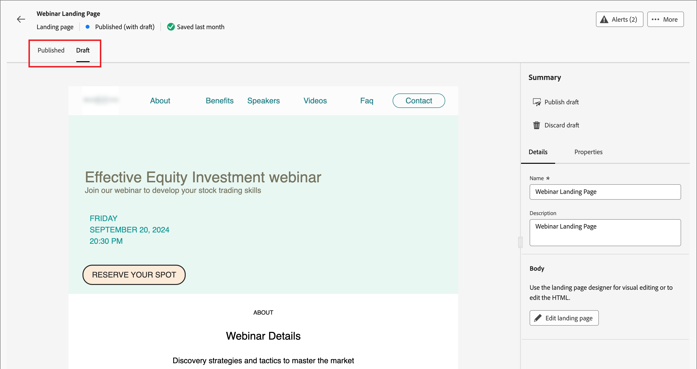
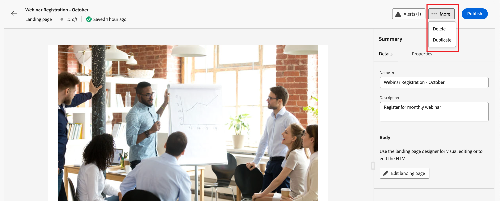

# Pages de destination

Une page de destination est une page web autonome où vous pouvez diriger les contacts et les clients après qu&#39;ils ont cliqué sur un élément lié dans un e-mail, un SMS ou tout emplacement numérique. Vous pouvez incorporer ces pages dans les parcours de votre compte pour que vos prospects et clients voient vos messages sur le web et progressent dans les parcours de votre compte. Vous pouvez créer, personnaliser et prévisualiser des pages de destination dans l’espace de conception visuelle de la page de destination.

Cas d’utilisation courants des pages de destination :

* Fournir des communications marketing ou un service spécifique avec option d’opt-in ou d’opt-out Utiliser un lien dans un e-mail ou une autre communication vers une liste ciblée
* Collectez le consentement avant d’envoyer des communications et envoyez un e-mail de confirmation lors de l’opt-in ou de l’opt-out.
* Capturez ou mettez à jour les données de profil (profilage progressif, préférences, enregistrements et scénarios similaires) à l’aide de formulaires sur les pages de destination.
* Dirigez les personnes vers des informations spécifiques à une campagne conçues pour votre orchestration de parcours.
* Rediriger les personnes vers un formulaire web dédié sans créer de page externe en dehors de Journey Optimizer B2B edition.

## Workflow de la page de destination

Pour diriger les membres d’une audience de parcours vers une page web définie lorsqu’ils cliquent sur un lien spécifique, créez une page de destination dans Journey Optimizer B2B edition :

1. [Créer la page](./landing-pages-create-publish.md) - Sélectionnez un paramètre prédéfini, configurez la page principale et ajoutez les sous-pages requises.
1. [Concevoir le contenu de la page de destination](./landing-page-design.md) - Créez le contenu de la page à l’aide des composants de conception visuelle par glisser-déposer.
1. [Tester et publier la page de destination](./landing-pages-create-publish.md) - Prévisualisez la page, testez le comportement du formulaire, puis publiez-la pour la rendre active.
1. [Lien vers la page à partir de votre parcours &#x200B;](#link-to-a-landing-page) - Ajoutez l’URL de la page de destination à une action de parcours, d’e-mail ou de SMS pour que les destinataires puissent l’atteindre.

Par exemple, vous pouvez créer et concevoir des pages de destination pour diriger vos utilisateurs vers des informations en ligne. La page peut inclure un formulaire dans lequel ils peuvent s’inscrire ou refuser de recevoir vos communications. Il peut également s’agir d’une opportunité de s’abonner à des communications récurrentes, telles qu’une newsletter.

Vous pouvez créer, personnaliser et prévisualiser des pages de destination dans l’espace de conception visuelle.

## Accéder aux pages de destination et les gérer

Pour accéder aux pages de destination dans Journey Optimizer B2B edition, accédez au volet de navigation de gauche et cliquez sur **[!UICONTROL Gestion de contenu]** > **[!UICONTROL Pages de destination]**. Cette action affiche la liste de toutes les pages de destination créées dans l’instance.

{width="800" zoomable="yes"}

La liste est triée en fonction de la colonne _[!UICONTROL Modifié]_, les éléments les plus récemment mis à jour étant en haut. Cliquez sur le titre de la colonne pour passer d’un ordre croissant à un ordre décroissant.

### Filtrer la liste des landing pages

Pour rechercher une page de destination par nom, saisissez une chaîne de texte dans la barre de recherche pour rechercher une correspondance. Cliquez sur l’icône _Filtrer_ (  ) pour afficher les options de filtre disponibles et modifier les paramètres afin de filtrer les éléments affichés en fonction de vos critères spécifiés.

{width="700" zoomable="yes"}

<!-- 
This is going away? ### Customize the column display

Customize the columns that you want to display in the table by clicking the _Customize table_ icon (  ) at the top right. 

In the dialog, select the columns to display and click **[!UICONTROL Apply]**.

{width="300"} 
-->

### Statut et cycle de vie de la page de destination

Le statut de la page de destination détermine sa disponibilité pour la liaison dans le contenu de votre e-mail et de votre SMS, ainsi que les modifications que vous pouvez y apporter.

| Statut | Description |
| -------------------- | ----------- |
| Brouillon | Lorsque vous créez une page de destination, elle a le statut de brouillon. Il reste dans ce statut lorsque vous définissez ou modifiez le contenu visuel, et jusqu’à ce que vous le publiiez en tant que page hébergée. Actions disponibles : <ul><li>Modifier le nom ou la description<li>Modifier l&#39;URL du lien<li>Modification dans l’espace de conception visuelle<li>Publier<li>Dupliquer<li>Supprimer |
| Publié | Lorsque vous publiez une landing page, elle est hébergée sur l&#39;instance Journey Optimizer B2B edition et vous pouvez la lier dans le contenu d&#39;un e-mail ou d&#39;un SMS. Actions disponibles : <ul><li>Modifier le nom ou la description<li>Modifier l&#39;URL du lien<li>Ajouter un lien dans le contenu d’un e-mail ou d’un SMS<li>Créer une version brouillon<li>Dupliquer<li>Supprimer |
| Publié avec le brouillon | Lorsque vous créez un brouillon à partir d’une page de destination publiée, la version publiée est conservée et le contenu du brouillon peut être modifié dans l’espace de conception visuelle. Si vous publiez le brouillon, il remplace la version publiée actuelle et le contenu est mis à jour dans la page hébergée. Actions disponibles : <ul><li>Modifier le nom ou la description<li>Modifier l&#39;URL du lien<li>Ajouter un lien dans le contenu d’un e-mail ou d’un SMS<li>Modifier le brouillon dans l’espace de conception visuelle<li>Publier le brouillon<li>Dupliquer<li>Supprimer (supprime les deux versions)<li>Ignorer le brouillon (revient au statut publié) |

{zoomable="yes"}

## Modification d’une page de destination

Les modifications apportées à une landing page dépendent de son statut actuel :

* Lorsqu’une page de destination a le statut **_Brouillon_**, vous pouvez modifier n’importe quel de ses détails, l’URL et le contenu visuel.
* Lorsqu’une page de destination a le statut **_Publiée_**, vous pouvez modifier sa description, mais pas son nom. Pour modifier le contenu visuel, vous devez créer un brouillon de la page.
* Lorsqu’une page de destination affiche le statut **_Publiée avec le brouillon_**, la modification des détails se limite à la description. Vous pouvez également modifier le contenu visuel de la version brouillon.

>[!BEGINTABS]

>[!TAB Brouillon]

1. Dans la page de liste _[!UICONTROL Pages de destination]_, cliquez sur le nom de la page de destination pour l’ouvrir.

   Un aperçu du contenu visuel s’affiche, avec les détails de la page de destination sur la droite.

1. Modifiez l’un des détails, tels que le nom et la description.

   {width="700" zoomable="yes"}

1. Pour apporter des modifications au contenu de l’espace de conception visuelle, cliquez sur **[!UICONTROL Modifier la page de destination]**.

   Utilisez les outils de conception visuelle selon vos besoins :

   * [Ajouter la structure et le contenu](./landing-page-design.md#structure-content-landing-page)
   * [Ajout d’Assets](./landing-page-design.md#add-assets)
   * [Parcourir les calques, paramètres et styles](./landing-page-design.md#navigate-the-layers-settings-and-styles)
   * [Personnaliser le contenu](./landing-page-design.md#personalize-content)
   * [Modifier le tracking des URL liées](./landing-page-design.md#edit-linked-url-tracking)

1. Cliquez sur **[!UICONTROL Enregistrer]** ou **[!UICONTROL Enregistrer et fermer]** pour revenir aux détails de la page de destination.

1. Lorsque la page répond à vos critères et que vous souhaitez la rendre disponible pour affichage, cliquez sur **[!UICONTROL Publier]**.

>[!TAB Publié]

1. Dans la page de liste _[!UICONTROL Pages de destination]_, cliquez sur le nom de la page pour l’ouvrir.

   Un aperçu du contenu visuel s’affiche, avec les détails de la page de destination sur la droite.

1. Modifiez la description, si nécessaire.

   Pour une page de destination publiée, tous les autres détails ne peuvent pas être modifiés.

1. Si vous souhaitez mettre à jour le contenu, cliquez sur **[!UICONTROL Modifier la page de destination]** à droite.

   Cliquez sur **[!UICONTROL Créer un brouillon]** dans la boîte de dialogue pour ouvrir le brouillon dans l’espace de conception visuelle.

   {width="300"}

   Utilisez les outils de conception visuelle selon vos besoins :

   * [Ajouter la structure et le contenu](./landing-page-design.md#structure-content-landing-page)
   * [Ajout d’Assets](./landing-page-design.md#add-assets)
   * [Parcourir les calques, paramètres et styles](./landing-page-design.md#navigate-the-layers-settings-and-styles)
   * [Personnaliser le contenu](./landing-page-design.md#personalize-content)
   * [Modifier le tracking des URL liées](./landing-page-design.md#edit-linked-url-tracking)

1. Cliquez sur **[!UICONTROL Enregistrer]** ou **[!UICONTROL Enregistrer et fermer]** pour revenir aux détails de la page de destination.

1. Lorsque le brouillon de la page de destination répond à vos critères et que vous souhaitez que les modifications soient disponibles sur la page publiée, cliquez sur **[!UICONTROL Publier]**.

   Lorsque vous publiez le brouillon, il remplace la version publiée actuelle et le contenu est mis à jour pour l’URL de la page.

>[!TAB Publié avec le brouillon]

Lorsque vous ouvrez la page de destination, le brouillon s’affiche. Les onglets situés en haut de l’espace d’aperçu vous permettent de basculer l’affichage entre les versions publiées et les brouillons. Les actions de brouillon et les détails s’affichent à droite.

{width="700" zoomable="yes"}

Pour mettre à jour le contenu :

1. Cliquez sur **[!UICONTROL Modifier la page de destination]** en haut à droite. Utilisez les outils de conception visuelle selon vos besoins :

   * [Ajouter la structure et le contenu](./landing-page-design.md#structure-content-landing-page)
   * [Ajout d’Assets](./landing-page-design.md#add-assets)
   * [Parcourir les calques, paramètres et styles](./landing-page-design.md#navigate-the-layers-settings-and-styles)
   * [Personnaliser le contenu](./landing-page-design.md#personalize-content)
   * [Modifier le tracking des URL liées](./landing-page-design.md#edit-linked-url-tracking)

1. Cliquez sur **[!UICONTROL Enregistrer]** ou **[!UICONTROL Enregistrer et fermer]** pour revenir aux détails de la page de destination.

1. Lorsque le brouillon de page répond à vos critères et que vous souhaitez rendre les modifications disponibles, cliquez sur **[!UICONTROL Publier]**.

   Lorsque vous publiez le brouillon, il remplace la version publiée actuelle et le contenu est mis à jour dans la page hébergée.

>[!ENDTABS]

## Dupliquer une landing page

Vous pouvez dupliquer une page de destination à l’aide de l’une des méthodes suivantes :

* Sur la page de liste _[!UICONTROL Page de destination]_, cliquez sur l’icône _Plus_ (**...**) en regard du nom de la page de destination et choisissez **[!UICONTROL Dupliquer]**.
* En haut à droite de la page de détails de la page de destination, cliquez sur **[!UICONTROL ... En plus]** et choisissez **[!UICONTROL Dupliquer]**.

{width="600" zoomable="yes"}

Dans la boîte de dialogue, saisissez un nom utile (unique) et une description (facultatif). Cliquez sur **[!UICONTROL Dupliquer]** pour terminer l’action.

{width="350"}

La page dupliquée (nouvelle) apparaît alors dans la liste _Pages de destination_.

## Suppression d’une landing page

Vous pouvez supprimer une page de destination à l’aide de l’une des méthodes suivantes :

* Sur la page de liste _[!UICONTROL Page de destination]_, cliquez sur l’icône _Plus_ (**...**) en regard du nom de la page de destination et choisissez **[!UICONTROL Supprimer]**.
* En haut à droite de la page de détails de la page de destination, cliquez sur **[!UICONTROL ... Plus]** puis choisissez **[!UICONTROL Supprimer]**.

Cette action ouvre une boîte de dialogue de confirmation. Vous pouvez abandonner le processus en cliquant sur **[!UICONTROL Annuler]** ou sur **[!UICONTROL Supprimer]** pour confirmer la suppression.

{width="400"}

## Lien vers une landing page

En tant que marketeur ou Designer qui crée du contenu pour les e-mails, les fragments et les pages, vous pouvez incorporer des liens vers les pages de destination publiées (en direct) qui sont créées dans votre instance Journey Optimizer B2B edition.

1. Lorsque vous travaillez dans l’espace de conception visuelle d’un fragment, d’un e-mail, d’une page de destination ou d’un modèle, sélectionnez un extrait de texte, un composant de bouton ou un composant d’image pour le lien.

   Les options **[!UICONTROL Lien]** s’affichent dans le panneau de droite.

1. Pour l’option **[!UICONTROL Type]**, choisissez **[!UICONTROL Page de destination]**.

   {width="700" zoomable="yes"}

1. Pour l&#39;option **[!UICONTROL Landing page]**, cliquez sur l&#39;icône _Sélectionner une page_ (  ).

1. Dans la boîte de dialogue Sélectionner une page de destination , définissez la **[!UICONTROL Source de la page de destination]** en tant que **[!UICONTROL B2B edition Journey Optimizer]**, cochez la case de la page de destination dans la liste des pages publiées, puis cliquez sur **[!UICONTROL Sélectionner]**.

   {width="600" zoomable="yes"}

1. Pour l’option **[!UICONTROL Cible]**, choisissez le comportement de la cible du lien :

   * **[!UICONTROL Aucune]** - Ouvre le lien à l’aide du comportement par défaut du navigateur.
   * **[!UICONTROL Vide]** - Ouvre le lien dans une nouvelle fenêtre ou un nouvel onglet.
   * **[!UICONTROL Self]** - Ouvre le lien dans le même cadre.
   * **[!UICONTROL Parent]** - Ouvre le lien dans le cadre parent.
   * **[!UICONTROL Haut]** - Ouvre le lien dans le corps complet de la fenêtre.

1. (Lien de texte uniquement) Pour souligner le texte lié, cochez la case **[!UICONTROL Souligner le lien]**.

   Vous pouvez définir un style supplémentaire pour le texte du lien, y compris la couleur du lien, en sélectionnant l’onglet **[!UICONTROL Styles]** dans le panneau de droite.
