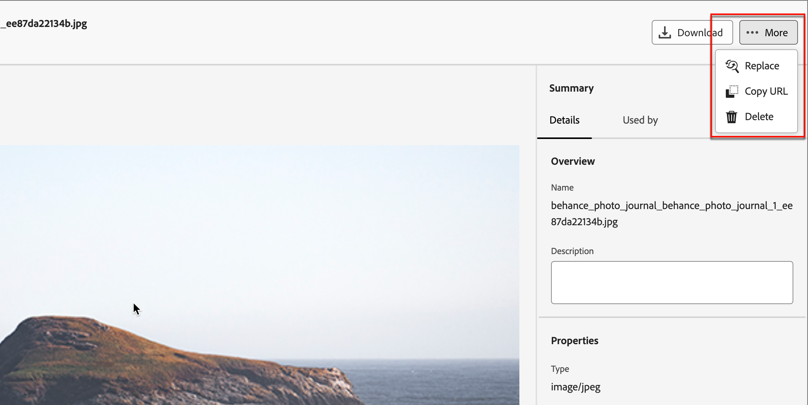

# Utilisation de ressources Marketo Engage

Marketo Engage Design Studio est la source de ressources par défaut de Journey Optimizer B2B edition. Vous pouvez facilement gérer et utiliser les ressources disponibles dans le contenu de vos parcours de compte.

Dans Marketo Engage, les organisations marketing utilisent des espaces de travail pour organiser leurs ressources de contenu et aider les équipes à accéder à la ressource appropriée. Les espaces de travail bien définis sont particulièrement utiles pour les grandes entreprises qui disposent d’un large éventail d’offres de produits ou qui fonctionnent globalement avec des exigences de marketing différentes pour différentes régions.

## Gestion centralisée des ressources

Par défaut, il existe un espace de travail **_[!UICONTROL Journey Optimizer B2B edition]_** que vous pouvez utiliser spécifiquement pour le contenu de votre parcours de compte. Les ressources que vous ajoutez à cet espace de travail ne sont pas visibles ou ne peuvent pas être utilisées dans Marketo Engage. Pour les ressources résidant dans cet espace de travail, vous disposez de l’ensemble des fonctions de gestion des ressources dans Journey Optimizer B2B edition. Ces fonctions incluent :

* Remplacer
* Supprimer
* Déplacer

Assets résidant dans les espaces de travail du Marketo Engage est limité à un accès en lecture seule pour une utilisation dans les emails, les modèles d’email et les fragments. Vous pouvez ajouter de nouvelles ressources à ces espaces de travail et télécharger une copie d’une ressource.

## Exploration et accès aux ressources

Pour accéder aux ressources Adobe Marketo Engage à partir de Journey Optimizer B2B edition, accédez au volet de navigation de gauche et cliquez sur **[!UICONTROL Gestion de contenu]** > **[!UICONTROL Assets]**. Cette action ouvre une page de liste avec toutes les ressources répertoriées.

{width="800" zoomable="yes"}

L’espace de travail Journey Optimizer B2B edition est sélectionné par défaut. Les autres espaces de travail sont répertoriés ci-dessous.

* Pour afficher les ressources par espace de travail et par dossier, ouvrez la structure en cliquant sur l’icône _Afficher les dossiers_ en haut à gauche.

* Pour trier le tableau en fonction de l’une des colonnes, cliquez sur le titre de la colonne. La flèche dans la ligne de titre indique la colonne de tri et l’ordre actuels.

* Pour rechercher une ressource image dans l’espace de travail ou le dossier sélectionné, saisissez une chaîne de texte dans la barre de recherche.

* Pour personnaliser les colonnes affichées dans le tableau, cliquez sur l’icône _Personnaliser le tableau_ (  ) en haut à droite.

  Sélectionnez les colonnes à afficher dans la liste et cliquez sur **[!UICONTROL Appliquer]**.

## Affichage des détails de la ressource

Cliquez sur le nom d’une ressource pour ouvrir la page des détails de la ressource.

{width="700" zoomable="yes"}

## Affichage des références utilisées par la ressource

Dans la page des détails de la ressource, cliquez sur l’onglet **[!UICONTROL Utilisé par]** pour afficher les détails de l’emplacement actuel de la ressource dans Journey Optimizer B2B edition, entre les emails, les modèles d’email et les fragments.

>[!IMPORTANT]
>
>Toute ressource qui est actuellement _EN UTILISATION_ dans l’un des emails, modèles d’email ou fragments **ne peut pas** être supprimée.

Le panneau affiche les références par catégorie : _Email_, _Modèle de courrier électronique_ ou _Fragment_. Les emails dans Journey Optimizer B2B edition sont incorporés et créés dans parcours. Par conséquent, le parcours parent de l’email qui utilise la ressource s’affiche dans les références.

Cliquez sur le lien pour accéder à l’email, au modèle d’email ou au fragment correspondant dans lequel la ressource est utilisée.

{width="700" zoomable="yes"}

## Ajout de ressources

Sur la page de liste Assets, vous pouvez ajouter des ressources d’image à l’espace de travail B2B edition Journey Optimizer ou à un espace de travail Marketo Engage.

1. Cliquez sur **[!UICONTROL Ajouter Assets]** en haut à droite.

1. Dans la boîte de dialogue _[!UICONTROL Ajouter des ressources]_, faites glisser un ou plusieurs fichiers de votre système vers la zone de fichiers.

   {width="500"}

   Vous pouvez également cliquer sur le lien _[!UICONTROL Select a file from your computer]_ (Sélectionner un fichier sur votre ordinateur) pour utiliser votre système de fichiers local pour rechercher et sélectionner des fichiers.

   Vous pouvez charger des ressources à partir de votre système local, jusqu’à 10 fichiers à la fois. La taille de fichier maximale est de 100 Mo.

   Les noms des fichiers des images sélectionnées s’affichent dans la boîte de dialogue. Les noms des fichiers de ressources doivent être uniques (entre les dossiers). Si un fichier portant le nom existe déjà, un message s’affiche. Les noms peuvent contenir, au maximum, 100 caractères et ne peuvent pas contenir de caractères spéciaux (tels que `;`, `:`, `\` et `|`).

1. Sélectionnez l’espace de travail ou le dossier de destination pour le stockage des ressources.

   >[!NOTE]
   >
   >Si vous sélectionnez un emplacement dans l’espace de travail _[!UICONTROL Journey Optimizer B2B edition]_, vous pouvez gérer la ressource dans l’application. Si vous ajoutez la ressource à un espace de travail Marketo Engage, les fonctions de gestion des ressources sont disponibles uniquement dans Marketo Engage Design Studio.

1. Pour remplacer (remplacer) des fichiers lorsque vous téléchargez un ou plusieurs fichiers avec un nom de fichier existant, cochez la case **[!UICONTROL Remplacer les fichiers existants]** .

1. Cliquez sur **[!UICONTROL Ajouter]**.

## Suppression de ressources

Les ressources actuellement utilisées dans l’un des emails, modèles d’email ou fragments ne peuvent pas être supprimées. Vérifiez les références utilisées par avant de lancer la suppression d’une ressource. En outre, une action de suppression ne peut pas être annulée. Vérifiez donc avant de lancer une action de suppression.

Utilisez l’une des méthodes suivantes pour supprimer une ressource résidant dans l’espace de travail _[!UICONTROL Journey Optimizer B2B edition]_ :

* Accédez aux détails de la ressource, cliquez sur **[!UICONTROL ... Plus]** en haut à droite, et sélectionnez **[!UICONTROL Supprimer]** dans les options.

  {width="600" zoomable="yes"}

* Sur la page de liste _[!UICONTROL Assets]_, cliquez sur l’icône _Plus_ (**[!UICONTROL ...]**) en regard de l’élément de ressource et sélectionnez **[!UICONTROL Supprimer]** dans les options.

  {width="600" zoomable="yes"}

  >[!NOTE]
  >
  >Seules les ressources résidant dans l’espace de travail _[!UICONTROL Journey Optimizer B2B edition]_ disposent de fonctions de gestion des ressources disponibles dans le menu _Plus_.

Cette action ouvre une boîte de dialogue de confirmation. Vous pouvez interrompre le processus en cliquant sur **[!UICONTROL Annuler]** ou sur **[!UICONTROL Supprimer]** pour confirmer la suppression.

Si la ressource est en cours d’utilisation, l’action ouvre une boîte de dialogue d’information vous avertissant qu’elle ne peut pas être supprimée. Cliquez sur **[!UICONTROL OK]**, ce qui annule la suppression.

## Remplacement des ressources

Utilisez l’une des méthodes suivantes pour remplacer une ressource résidant dans l’espace de travail _[!UICONTROL Journey Optimizer B2B edition]_ :

* Accédez aux détails de la ressource, cliquez sur **[!UICONTROL ... Plus]** en haut à droite, puis sélectionnez **[!UICONTROL Remplacer]** dans les options.

* Sur la page de liste _[!UICONTROL Assets]_, cliquez sur l’icône _Plus_ (**[!UICONTROL ...]**) en regard de l’élément de ressource et sélectionnez **[!UICONTROL Remplacer]** dans les options.

Dans la boîte de dialogue _[!UICONTROL Remplacer la ressource]_, faites glisser le fichier de remplacement de votre système vers la zone de fichier. Vous pouvez également cliquer sur le lien _[!UICONTROL Select a file from your computer]_ (Sélectionner un fichier sur votre ordinateur) pour utiliser votre système de fichiers local pour sélectionner un fichier. (Si vous sélectionnez plusieurs fichiers dans votre système local, le premier fichier sélectionné est utilisé pour le remplacement.)

{width="500"}

Pour continuer, cliquez sur **[!UICONTROL Remplacer]**. Vous pouvez interrompre le processus en cliquant sur **[!UICONTROL Annuler]**.

Si le fichier à remplacer est en cours d’utilisation, une boîte de dialogue informative vous avertit que le nouveau fichier image remplace l’image à tous les endroits où elle est utilisée (emails, modèles d’email et fragments).

## Téléchargement de ressources

Vous pouvez télécharger une ressource à l’aide de l’une des méthodes suivantes :

* Accédez aux détails de la ressource et cliquez sur **[!UICONTROL Télécharger]** en haut à droite.

* Sur la page de liste _[!UICONTROL Assets]_, cliquez sur l’icône _Ellipsis_ (**[!UICONTROL ...]**) en regard de l’élément de ressource et sélectionnez **[!UICONTROL Télécharger]** dans les options.

Dans la boîte de dialogue de confirmation, cliquez sur **[!UICONTROL Télécharger]** pour lancer le téléchargement de la ressource vers votre système local. Vous pouvez interrompre le processus en cliquant sur **[!UICONTROL Annuler]**.

## Application d’actions en bloc sur des ressources sélectionnées

Sur la page de liste (_[!UICONTROL Gestion de contenu]_ > _[!UICONTROL Assets]_), sélectionnez plusieurs ressources à la fois en cochant chaque case à gauche. Une bannière de message s’affiche en bas lorsque vous sélectionnez plusieurs ressources.

{width="700" zoomable="yes"}

Vous pouvez effectuer les actions en bloc suivantes pour les ressources sélectionnées résidant dans l’espace de travail _[!UICONTROL Journey Optimizer B2B edition]_ :

+++Déplacer des ressources

1. Sur la bannière de sélection, cliquez sur **[!UICONTROL Déplacer]**.

   Cette action ouvre la boîte de dialogue _[!UICONTROL Déplacer Assets]_, qui répertorie les noms des ressources sélectionnées et vous permet de sélectionner le dossier _cible_ dans lequel vous souhaitez déplacer ces ressources.

1. Sélectionnez un dossier.

   Les mises à jour du chemin d’accès en regard de _[!UICONTROL Ressources sélectionnées passeront à :]_.

1. Cliquez sur **[!UICONTROL Déplacer]**.

+++

+++Suppression de ressources

>[!NOTE]
>
>Vous pouvez appliquer une suppression en bloc pour 20 ressources sélectionnées au maximum.

1. Sur la bannière de sélection, cliquez sur **[!UICONTROL Supprimer]**.

1. Dans la boîte de dialogue de confirmation, cliquez sur **[!UICONTROL Supprimer]**.

   Si l’une des ressources sélectionnées est en cours d’utilisation, la suppression de cette ressource est abandonnée et un message d’alerte s’affiche.

+++

## Création d’un dossier

1. Sur la page de liste _[!UICONTROL Assets]_, cliquez sur **[!UICONTROL Créer un dossier]** en haut à droite.

1. Dans la boîte de dialogue, saisissez le nom du dossier et sélectionnez le dossier de destination (parent) du nouveau dossier.

   Les noms de dossier doivent être uniques, avec un maximum de 100 caractères, et ne peuvent pas contenir de caractères spéciaux, tels que `;`, `:`, `\`, `|`.

   {width="500"}

1. Cliquez sur **[!UICONTROL Ajouter]**.

## Application d’actions au niveau du dossier

Dans l’espace de travail _[!UICONTROL Journey Optimizer B2B edition]_, vous pouvez appliquer des actions à un ou plusieurs dossiers du dossier. Cliquez sur l’icône _Plus_ (**...**) en regard du dossier pour afficher les actions que vous pouvez lui appliquer.

{width="700" zoomable="yes"}

Vous pouvez effectuer les actions suivantes au niveau du dossier :

+++Ajout de ressources

1. Sélectionnez **[!UICONTROL Ajouter des ressources]** pour charger des fichiers image dans le dossier.

1. Dans la boîte de dialogue _[!UICONTROL Ajouter des ressources]_, effectuez un glisser-déposer des fichiers de votre système. Vous pouvez également cliquer sur le lien pour utiliser votre système de fichiers afin de sélectionner les fichiers.

   Vous pouvez ajouter jusqu’à 10 fichiers à la fois à des ressources provenant de votre système local. Vous avez la possibilité de remplacer des fichiers lorsque vous téléchargez un ou plusieurs fichiers avec un nom de fichier existant.

   Les noms des fichiers des images sélectionnées s’affichent dans la boîte de dialogue. Les noms des fichiers de ressources doivent être uniques (entre les dossiers) et, si un fichier portant le nom existe déjà, un message d’erreur s’affiche. Les noms peuvent contenir, au maximum, 100 caractères et ne peuvent pas contenir de caractères spéciaux (tels que `;`, `:`, `\` et `|`).

1. Cliquez sur **[!UICONTROL Ajouter]**.

+++

+++Création d’un sous-dossier

1. Sélectionnez **[!UICONTROL Créer un dossier]**.

1. Dans la boîte de dialogue, saisissez le nom du dossier.

   Les noms de dossier doivent être uniques, avec un maximum de 100 caractères, et ne peuvent pas contenir de caractères spéciaux, tels que `;`, `:`, `\`, `|`.

1. Cliquez sur **[!UICONTROL Ajouter]**.

+++

+++Renommer le dossier

1. Sélectionnez **[!UICONTROL Renommer]**.

1. Dans la boîte de dialogue, saisissez le nouveau nom du dossier.

   Les noms de dossier doivent être uniques, avec un maximum de 100 caractères, et ne peuvent pas contenir de caractères spéciaux, tels que `;`, `:`, `\`, `|`.

1. Cliquez sur **[!UICONTROL Enregistrer]**.

+++

+++Déplacer le dossier

1. Pour déplacer le dossier vers un autre dossier parent, choisissez **[!UICONTROL Déplacer]**.

1. Dans la boîte de dialogue, sélectionnez le dossier cible comme nouveau parent pour le sous-dossier.

1. Cliquez sur **[!UICONTROL Déplacer]**.

   Si vous essayez de déplacer un dossier dans l&#39;un de ses propres sous-dossiers (dans la structure du dossier sélectionné), un message d&#39;erreur s&#39;affiche et le déplacement est annulé.

+++

+++Supprimer le dossier

1. Sélectionnez **[!UICONTROL Supprimer]**.

1. Dans la boîte de dialogue de confirmation, cliquez sur **[!UICONTROL Supprimer]**.

Si l’une des ressources du dossier est en cours d’utilisation, l’action ouvre une boîte de dialogue d’alerte pour vous informer qu’elle ne peut pas être supprimée. Cliquez sur **[!UICONTROL OK]**, ce qui annule la suppression.

+++

+++Convertir en dossier d’archive

L’archivage d’un dossier rend les fichiers qu’il contient impossibles à rechercher. Utilisez la fonction d’archivage pour les fichiers de ressources que vous ne souhaitez pas que les membres de votre équipe utilisent à l’avenir, comme un badge promotionnel d’événement obsolète ou du contenu saisonnier. Par la suite, vous pouvez désarchiver un dossier si vous souhaitez que le contenu soit à nouveau disponible.

* Sélectionnez **[!UICONTROL Convertir en dossier d&#39;archive]**. Une bannière de confirmation s’affiche pour confirmer que le dossier passe à l’état archivé.

* Sélectionnez **[!UICONTROL Désarchiver le dossier]**. Une bannière de confirmation s’affiche pour confirmer que l’état du dossier est remplacé par unarchived (Désarchivé).

+++

## Utilisation de ressources dans votre contenu

Assets peut être utilisé dans l’e-mail, le modèle d’e-mail ou la création de fragments visuels de votre équipe à partir de l’éditeur de contenu visuel.

Dans l’interface utilisateur du concepteur visuel, sélectionnez l’icône _Sélecteur de ressources_ (  ) dans la barre latérale gauche.

Cette action modifie le panneau des outils qui affiche une liste structurée des ressources disponibles dans l’espace de travail sélectionné. Sélectionnez l’espace de travail à afficher pour le choix d’une ressource.

{width="700" zoomable="yes"}

Il existe plusieurs méthodes pour ajouter une ressource image à la zone de travail visuelle :

* Faites glisser une miniature d’image à partir du volet de navigation de gauche.

* Ajoutez un composant image à la zone de travail et cliquez sur **[!UICONTROL Parcourir]** pour ouvrir la boîte de dialogue _[!UICONTROL Sélectionner une ressource dans Adobe Marketo Engage]_.

  {width="700" zoomable="yes"}

  Dans la boîte de dialogue, vous pouvez choisir une image dans le référentiel sélectionné. Cliquez sur **[!UICONTROL Sélectionner]** pour ajouter la ressource.

  Des outils sont disponibles pour vous aider à localiser la ressource dont vous avez besoin :

   * Cliquez sur l’icône _Filtrer_ en haut à gauche pour filtrer les éléments affichés en fonction de vos critères.

   * Entrez du texte dans le champ _Rechercher_ pour filtrer les éléments affichés pour qu’ils correspondent au nom de la ressource.

  {width="700" zoomable="yes"}
