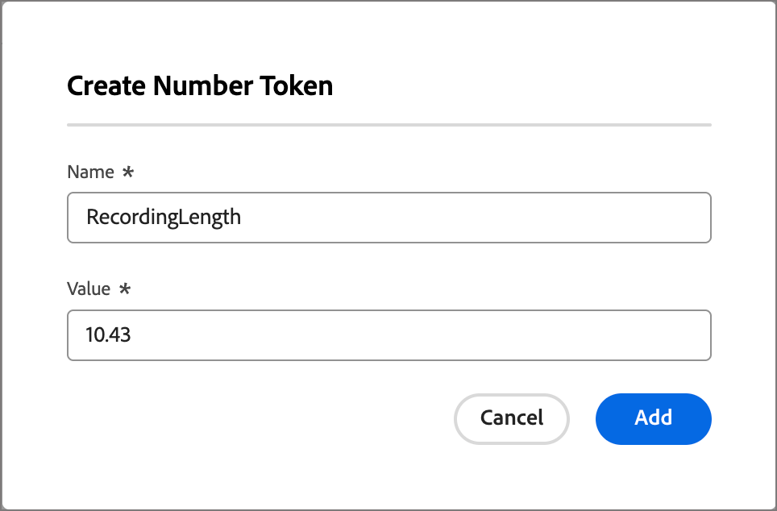

# Jetons personnalisés pour la personnalisation des e-mails

La personnalisation du contenu utilise des jetons comme espaces réservés ou variables qui sont renseignés lorsque l’artefact de contenu est généré. Des jetons de personnalisation standard sont disponibles pour les e-mails, les pages de destination, les fragments et les modèles. Vous pouvez également définir un ensemble de jetons personnalisés avec des valeurs spécifiques au parcours de compte. Cet ensemble de jetons personnalisés est appelé _Mes jetons_ et l’un de ces jetons personnalisés est destiné à la personnalisation lors de la [création d’e-mails de parcours &#x200B;](./email-authoring.md#content-authoring---personalization).

Outre les jetons _Mes jetons_, spécifiques au parcours de compte, vous pouvez utiliser n’importe quel jeton standard (intégré) pour la personnalisation des e-mails.

## Gérer mes jetons {#my-tokens}

Les _Mes jetons_ sont des variables personnalisées que vous créez ou modifiez pour un parcours de compte à l’état de brouillon. Ce jeu de jetons personnalisé prend actuellement en charge les définitions de jeton de texte et de nombre.

Lorsque vous ajoutez un jeton personnalisé à un e-mail, il s’affiche sous la forme `{{my.TokenName}}`. Par exemple, vous pouvez avoir créé des jetons `{{my.EventDate}}` ou `{{my.WebinarSpeaker}}` pour gérer le contenu des e-mails liés aux webinaires à venir.

_Accéder aux jetons personnalisés pour un parcours de compte :_

1. Ouvrez le brouillon de parcours de compte.

1. Cliquez sur le menu **[!UICONTROL Plus...]** en haut à droite et choisissez **[!UICONTROL Mes jetons]**.

   {width="450"}

   La page _Mes jetons_ répertorie tous les jetons personnalisés définis pour le parcours.

   {width="700" zoomable="yes"}

### Créer un jeton

1. Sur la page _[!UICONTROL Mes jetons]_, cliquez sur **[!UICONTROL Créer]** et sélectionnez le type de jeton à définir :

   * **[!UICONTROL Texte]** - Utilisez ce type pour définir un jeton avec une valeur de chaîne de texte de base.

   * **[!UICONTROL Nombre]** - Utilisez ce type pour définir un jeton avec une valeur numérique.

1. Dans la boîte de dialogue, saisissez les **[!UICONTROL Nom]** et **[!UICONTROL Valeur]** du jeton.

   {width="400"}

   Vous ne pouvez pas utiliser d’espaces ni de caractères spéciaux dans le nom du jeton. Vous pouvez utiliser _casse mixte_ comme `EventType`, pour utiliser un nom composé de plusieurs mots faciles à identifier.

   Si vous définissez un jeton _Nombre_, la valeur ne peut contenir que des caractères numériques. Vous pouvez utiliser une valeur décimale.

   {width="400"}

1. Cliquez sur **[!UICONTROL Ajouter]**.

### Modification d’un jeton

Tant que le parcours de compte reste au statut de brouillon, vous pouvez modifier n’importe quel de mes jetons défini.

1. Sur la page _[!UICONTROL Mes jetons]_, cliquez sur l’icône _Autres actions_ (**...**) à côté du nom du jeton et sélectionnez **[!UICONTROL Modifier]**.

   {width="430"}

1. Dans la boîte de dialogue, modifiez les **[!UICONTROL Nom]** et **[!UICONTROL Valeur]** selon les besoins du parcours.

   {width="400"}

1. Cliquez sur **[!UICONTROL Modifier]**.

### Supprimer un jeton

Vous pouvez supprimer un jeton personnalisé de la liste _Mes jetons_, mais vous devez vous assurer qu’il n’est pas actuellement utilisé dans le contenu de votre e-mail de parcours.

1. Sur la page _[!UICONTROL Mes jetons]_, cliquez sur l’icône _Autres actions_ (**...**) à côté du nom du jeton et sélectionnez **[!UICONTROL Supprimer]**.

1. Dans la boîte de dialogue de confirmation, cliquez sur **[!UICONTROL Supprimer]**.

## Utilisation de jetons personnalisés dans votre contenu

Lorsque vous créez du contenu d’e-mail pour le parcours de votre compte, vous pouvez utiliser l’un des jetons de la liste _Mes jetons_ lorsque vous utilisez les outils de personnalisation dans l’espace de conception visuelle.

1. Sélectionnez le composant de texte et cliquez sur l’icône _Ajouter une personnalisation_ (  ) dans la barre d’outils.

   {width="600"}

   Cette action ouvre la boîte de dialogue _Modifier le Personalization_. La boîte de dialogue comprend un dossier _[!UICONTROL Mes jetons]_ dans la bibliothèque _[!UICONTROL Jetons Personalization]_ si des jetons personnalisés sont définis pour le parcours de compte.

1. Développez le dossier **[!UICONTROL Mes jetons]**, puis cliquez sur **+** ou **...** pour ajouter l’un de vos jetons personnalisés à l’espace vide.

   Vous pouvez ajouter du texte statique supplémentaire si nécessaire.

   {width="700" zoomable="yes"}

1. Cliquez sur **[!UICONTROL Enregistrer]**
