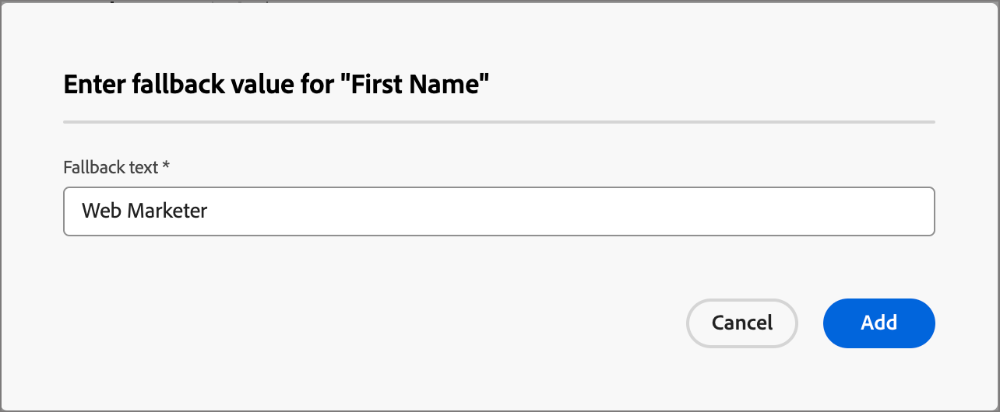
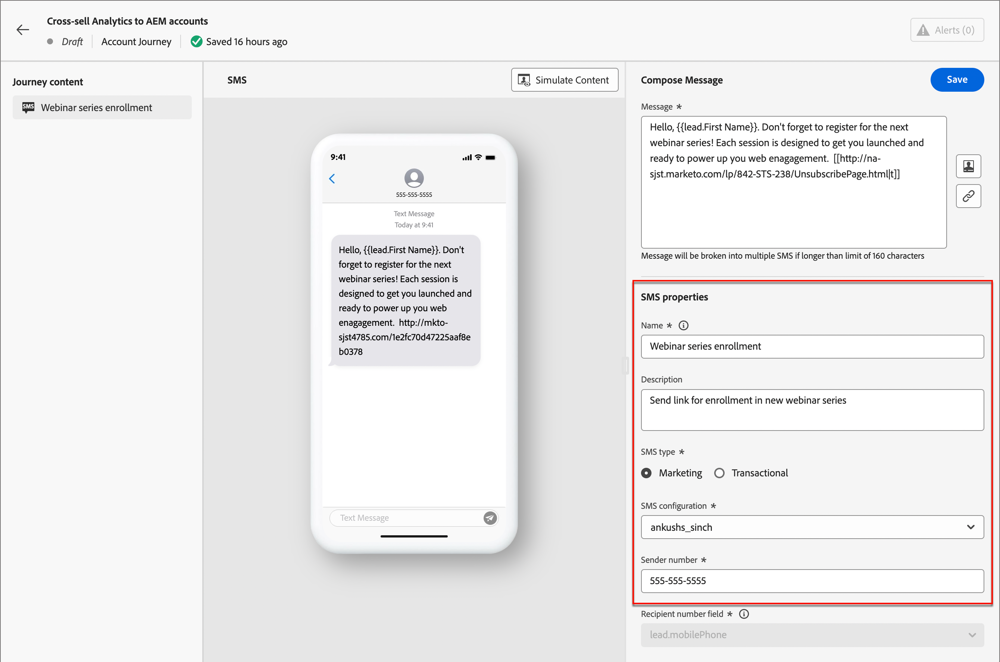

# Création de SMS

Utilisez Adobe Journey Optimizer B2B edition pour envoyer des SMS à vos clients sur leurs appareils mobiles. Vous pouvez créer, personnaliser et prévisualiser des messages au format texte à partir de l’éditeur de SMS.

Avant de créer des SMS pour les parcours de compte, assurez-vous que le [fournisseur de services SMS](../admin/configure-channels-sms.md) est configuré dans les paramètres _[!UICONTROL Administrateur]_.

## Ajout d’une action SMS dans un parcours de compte

Vous pouvez configurer des diffusions de messages texte dans un parcours de compte lorsque vous ajoutez un nœud _[!UICONTROL Agir]_ et que vous effectuez les opérations suivantes :

1. Pour la cible _[!UICONTROL Action sur]_, choisissez **[!UICONTROL Personnes]**.

1. Pour le _[!UICONTROL Action sur les personnes]_, choisissez **[!UICONTROL Envoyer un SMS]**.

   {width="800" zoomable="yes"}

1. Au bas du panneau _[!UICONTROL Effectuer une action]_, cliquez sur **[!UICONTROL Créer un SMS]**.

1. Dans la boîte de dialogue, saisissez un **[!UICONTROL Nom]** unique pour le SMS.

   {width="400"}

1. Cliquez sur **[!UICONTROL Créer]**.

   Le mappage de Parcours __ s’ouvre et vous pouvez créer le message et définir les propriétés SMS pour l’envoi.

### Créer le SMS

>[!IMPORTANT]
>
>**Gestion du consentement des SMS** 
>
>Conformément aux normes et réglementations du secteur, tous les SMS de marketing doivent contenir un moyen permettant aux destinataires de se désabonner facilement. Pour ce faire, les destinataires de SMS peuvent répondre avec des mots-clés d’accord préalable et de droit d’opposition. Tous les mots-clés standard d’opt-in et d’opt-out sont pris en charge et respectés. En outre, tous les mots-clés personnalisés configurés pour votre compte de fournisseur de services SMS sont pris en charge et respectés.

Saisissez le texte à envoyer dans le champ **[!UICONTROL Message]**.

Vous pouvez créer un message de 1 600 caractères maximum, tous les 160 caractères étant considérés comme un seul SMS.

{width="800" zoomable="yes"}

#### Personnaliser le message texte

1. Lors de la création du message texte, cliquez à tout moment sur l’icône _Personnaliser_ (  ) à droite de la zone de message texte.

   La page affichée permet d’accéder à vos jetons de prospect et système Adobe Marketo Engage. Des jetons standard et personnalisés sont inclus. Vous pouvez utiliser la barre _Rechercher_ pour localiser le jeton dont vous avez besoin ou parcourir l’arborescence de dossiers pour rechercher et sélectionner l’un des jetons de prospect/système.

1. Placez le curseur à l’emplacement du message où vous souhaitez ajouter le jeton.

1. Ajoutez un jeton en cliquant sur le symbole plus ( **+** ) situé en regard de celui-ci.

   Si vous souhaitez ajouter un jeton avec un texte de remplacement (valeur par défaut qui s’affiche si ce champ n’est pas disponible pour un prospect), cliquez sur l’icône _Plus_ ( **...** ) et choisissez **[!UICONTROL Insérer avec un texte de remplacement]**.

   {width="700" zoomable="yes"}

1. Dans la boîte de dialogue _[!UICONTROL Saisir la valeur de secours]_, saisissez le texte qui s’affiche en tant que valeur de secours, puis cliquez sur **[!UICONTROL Ajouter]**.

   {width="400"}

1. Une fois vos jetons de personnalisation placés, cliquez sur **[!UICONTROL Enregistrer]** pour enregistrer les modifications et revenir à l’espace de travail principal de création de SMS.

   Vous pouvez continuer à modifier le message avec les jetons selon vos besoins.

#### Ajouter des liens (URL) au message texte

1. Après avoir saisi le texte de votre message, cliquez sur l’icône _Lien_ (  ) à droite de la zone de message texte.

1. Dans la boîte de dialogue, choisissez le type d’URL à lier :

   * **[!UICONTROL Page de destination]** - Sélectionnez cette option pour sélectionner l’une des pages de destination Adobe Marketo Engage approuvées à partir de votre instance Marketo Engage. Sélectionnez l’espace de travail, puis sélectionnez la page de destination.

   * **[!UICONTROL URL externe]** - Il s’agit de toute URL externe que vous saisissez dans la zone de texte.

1. Si vous choisissez d’utiliser une page de destination, définissez les options de suivi.

   * **[!UICONTROL Activer le tracking]** - Cochez cette case pour activer le tracking, ce qui nécessite _raccourcissement_ de l’URL. Pour une landing page, elle utilise le sous-domaine Marketo Engage pour l&#39;URL raccourcie. Un exemple du format d’URL raccourci s’affiche. L’URL réelle est créée lorsque le SMS est envoyé au destinataire.

   * **[!UICONTROL Inclure mkt_tok]** - Cochez cette case pour effectuer le suivi de l’activité par rapport à un utilisateur.

     >[!NOTE]
     >
     >Lorsque vous autorisez le suivi mais désactivez _[!UICONTROL Inclure mkt_tok]_, l’URL de destination n’inclut pas le paramètre de chaîne de requête `mkt_tok` après la redirection. Ce paramètre est utilisé par les pages de destination et Munchkin de Marketo Engage pour s’assurer du suivi des activités des personnes (par exemple lorsqu’une personne se désinscrit d’un e-mail). Ne désactivez pas cette option, sauf si le paramètre entraîne des problèmes sur votre site web. 
     >Pour plus d’informations sur l’utilisation des codes de suivi Munchkin sur votre site web, consultez la documentation de [Marketo Engage](https://experienceleague.adobe.com/fr/docs/marketo/using/product-docs/administration/additional-integrations/add-munchkin-tracking-code-to-your-website){target="_blank"}.

   {width="470"}

1. Une fois les options de lien renseignées, cliquez sur **[!UICONTROL Ajouter]** pour enregistrer les modifications et ajouter le lien URL au SMS.

### Définir les propriétés du SMS

1. Dans la section _[!UICONTROL Propriétés du SMS]_ , saisissez un **[!UICONTROL Nom]** (obligatoire, 100 caractères maximum) et un **[!UICONTROL Description]** (facultatif, 300 caractères maximum) pour votre message.

   Alpha, les chiffres et les caractères spéciaux sont autorisés pour ces champs. Les caractères réservés suivants ne sont **pas autorisés** : `\`, `/`, `:`, `*`, `?`, `"`, `<`, `>` et `|`.

1. Choisissez le **[!UICONTROL Type de SMS]** :

   * Utilisez des `Marketing` pour les SMS promotionnels, qui nécessitent le consentement de l’utilisateur.
   * Utilisez des `Transactional` pour les messages non commerciaux tels que la confirmation de commande, les notifications de réinitialisation de mot de passe ou les informations de diffusion.

1. Pour **[!UICONTROL configuration des SMS]**, choisissez l’une des configurations d’API prédéfinies.

   Ce paramètre détermine le fournisseur et le compte de la passerelle SMS utilisés pour diffuser le message.

1. Saisissez le **[!UICONTROL numéro de l’expéditeur]** &#x200B; que vous souhaitez utiliser pour vos communications.

   {width="700" zoomable="yes"}

   Le numéro du destinataire est toujours mappé sur le champ `Lead.mobilePhone` dans Marketo Engage.

### Simuler le contenu du message texte {#preview-test}

>[!CONTEXTUALHELP]
>id="ajo-b2b_sms_preview_simulate"
>title="Vérifier le rendu de votre contenu"
>abstract="Une fois votre contenu défini, vous pouvez le prévisualiser et vérifier le rendu en fonction du canal que vous utilisez."

Lorsque le contenu de votre message est défini, vous pouvez utiliser des profils de test pour simuler (prévisualiser) son contenu. Si vous avez inséré du contenu personnalisé, vous pouvez vérifier l’affichage de celui-ci dans le message à l’aide des données de profil de test.

>[!IMPORTANT]
>
>Veillez à enregistrer votre SMS avant de procéder à la simulation du message texte.

1. Cliquez sur **[!UICONTROL Simuler du contenu]** en haut de l’espace de travail de création de SMS.

1. Sur la page _[!UICONTROL Simuler du contenu]_, cliquez sur **[!UICONTROL Ajouter des personnes]**.

1. Utilisez la page _Simuler du contenu_ pour gérer les prospects utilisés pour votre profil de test.

   Dans la liste qui s’affiche, vous pouvez rechercher et ajouter n’importe quel prospect (jusqu’à 10 à la fois) de la base de données de prospects Marketo Engage.

   Pour effectuer une recherche, saisissez l’adresse e-mail complète et appuyez sur _Entrée_. Le profil de prospect correspondant est affiché pour la sélection.

   L’aperçu est mis à jour vers les champs de personnalisation du profil sélectionné.

   Tous les prospects ajoutés s’affichent à gauche.

   Vous pouvez gérer cette liste en ajoutant d’autres personnes et en supprimant des prospects individuels de la liste des profils (sans les supprimer de la base de données).

1. Simuler le contenu d’un prospect sélectionné.

   Sélectionnez l’un des prospects répertoriés à gauche. L’aperçu SMS de la page est mis à jour pour le prospect sélectionné.

   Vous pouvez également sélectionner un prospect à partir du sélecteur situé au-dessus de l’espace d’aperçu pour mettre à jour l’aperçu SMS sur la page pour le prospect correspondant.

1. Pour quitter la page _[!UICONTROL Simuler du contenu]_ et revenir à l’espace de travail de création de SMS, cliquez sur **[!UICONTROL Fermer]** en haut à droite.

## Gestion du consentement des SMS

La possibilité pour les destinataires de se désabonner de la réception des communications d’une marque et de respecter leur choix est une exigence légale. Le non-respect de ces réglementations introduit des risques juridiques pour votre marque. Cette fonction vous aide également à éviter d&#39;envoyer des communications non sollicitées à vos destinataires, ce qui pourrait les amener à marquer vos messages comme spam et nuire à votre réputation.

Lorsque vous fournissez cette option, les destinataires de SMS peuvent répondre avec des mots-clés d’opt-in et d’opt-out. Tous les mots-clés standard d&#39;opt-in et d&#39;opt-out sont pris en charge et respectés, ainsi que tous les mots-clés personnalisés configurés chez le fournisseur de services SMS. Une fois désabonnés, les profils sont automatiquement supprimés de l’audience des futurs messages marketing.

Journey Optimizer B2B edition permet de gérer les désinscriptions des SMS à l’aide de la logique suivante :

* Par défaut, si un prospect s’est opposé à la réception des communications de votre part, le profil correspondant est exclu des diffusions SMS suivantes

* Ce consentement de prospect provenant de différentes sources (telles qu’AEP ou le fournisseur de services SMS) est synchronisé avec Journey Optimizer B2B edition. Actuellement, il ne prend en charge qu’un seul état de consentement par prospect au niveau de l’instance (un prospect « John Doe » est abonné ou désabonné de tous les SMS promotionnels de l’instance). Actuellement, il ne prend pas en charge le double opt-in au niveau de la marque/du consentement au niveau de la liste d’abonnements individuelle.
