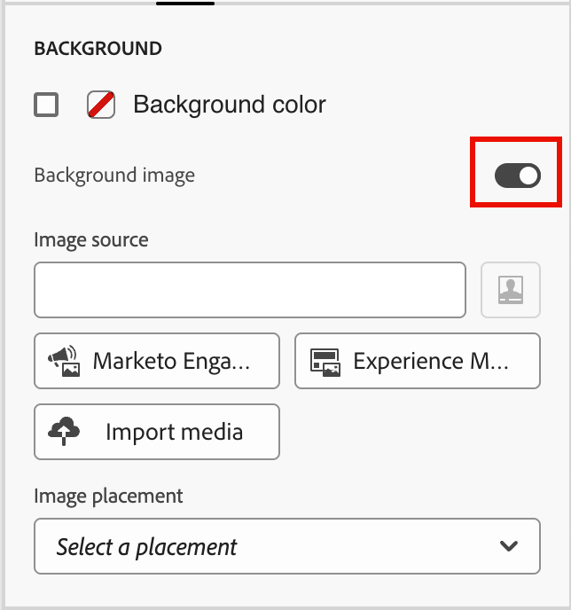

# Composants de structure {#structure-components}

>[!CONTEXTUALHELP]
>id="ajo-b2b_structure_components_email"
>title="À propos des composants de structure"
>abstract="Les composants de structure sont des éléments de mise en page que vous pouvez utiliser pour concevoir la structure d’un e-mail."

>[!CONTEXTUALHELP]
>id="ajo-b2b_structure_components_landing_page"
>title="À propos des composants de structure"
>abstract="Les composants de structure sont des éléments de mise en page que vous pouvez utiliser pour concevoir la structure d’une page."

>[!CONTEXTUALHELP]
>id="ajo-b2b_structure_components_fragment"
>title="À propos des composants de structure"
>abstract="Les composants de structure sont des éléments de mise en page que vous pouvez utiliser pour concevoir la structure d’un fragment."

>[!CONTEXTUALHELP]
>id="ajo-b2b_structure_components_template"
>title="À propos des composants de structure"
>abstract="Les composants de structure sont des éléments de mise en page que vous pouvez utiliser pour concevoir la structure d’un modèle."

Utilisez la _Composants de structure_ dans l’espace de conception visuelle pour définir la structure de votre contenu. En ajoutant et en déplaçant des éléments structurels à l’aide de simples actions de glisser-déposer, vous pouvez rapidement définir la forme de votre disposition de contenu. Chaque composant de structure s’étend sur l’espace horizontal et vous pouvez les empiler pour créer la disposition verticalement. Divisez chaque composant en colonnes afin de former chaque bloc de contenu dont vous avez besoin.

## Bibliothèque de structures

Dans la partie supérieure de la bibliothèque _[!UICONTROL Composants]_, la section **[!UICONTROL Structures]** affiche les composants de structure disponibles :

| Icône | Composant. | Description |
| ----- | ----------- | ----------- |
|  | [!UICONTROL 1:1 colonne] | Conteneur à une seule colonne qui remplit la largeur de l’espace. |
|  | [!UICONTROL 1:2 colonne gauche] | Conteneur à deux colonnes qui utilise un rapport de 1:2 pour remplir la largeur de l’espace. La première colonne (à gauche) occupe un tiers de la largeur et la seconde (à droite) occupe les deux tiers restants. |
|  | [!UICONTROL 1:3 colonne gauche] | Conteneur à deux colonnes qui utilise un rapport de 1:3 pour remplir la largeur de l’espace. La première colonne (à gauche) occupe un quart de la largeur et la seconde (à droite) occupe les trois quarts restants. |
|  | [!UICONTROL 2:1 colonne droite] | Conteneur à deux colonnes qui utilise un rapport de 2:1 pour remplir la largeur de l’espace. La première colonne (à gauche) occupe les deux tiers de la largeur et la seconde (à droite) occupe le tiers restant. |
|  | [!UICONTROL 2:2 colonne] | Conteneur à deux colonnes qui utilise un rapport de 2:2 pour remplir la largeur de l’espace. Les colonnes de gauche et de droite ont la même largeur. |
|  | [!UICONTROL 3:1 colonne droite] | Conteneur à deux colonnes qui utilise un rapport de 3:1 pour remplir la largeur de l’espace. La première colonne (à gauche) occupe les trois quarts (75 %) de la largeur et la seconde (à droite) occupe le quart restant (25 %). |
|  | [!UICONTROL 3:3 colonne] | Conteneur à trois colonnes qui utilise un rapport de 3:3 pour remplir la largeur de l’espace. Les trois colonnes ont la même largeur. |
|  | [!UICONTROL 4:4 colonne] | Conteneur à quatre colonnes qui utilise un rapport de 4:4 pour remplir la largeur de l’espace. Les quatre colonnes ont la même largeur. |
|  | [!UICONTROL n:n colonne] | Structure de colonnes personnalisable qui remplit l’espace en fonction des colonnes que vous définissez. Vous définissez le nombre de colonnes (entre deux et dix) et définissez la largeur de chaque colonne individuellement. [En savoir plus](#change-nn-columns) |

## Ajouter des composants de structure

Lorsque vous concevez le contenu de votre e-mail, page de destination ou fragment, ajoutez chaque composant de structure pour construire la disposition. Faites glisser un élément de la section **[!UICONTROL Structures]** à gauche et déposez-le sur la zone de travail. Vous pouvez utiliser la barre d’outils pour sélectionner une colonne et utiliser les onglets _Paramètres_ et _Styles_ dans le panneau de droite pour définir les paramètres du composant ou de la colonne sélectionné.

{width="800" zoomable="yes"}

### Barre d’outils de composant

La barre d’outils s’affiche dans la zone de travail lorsque vous la sélectionnez. Les outils disponibles permettent de sélectionner facilement une colonne et d’appliquer des fonctions de composant.

{width="150"}

| Outil | Nom | Utilisation |
| ---- | ---- | ----- |
| {width="40"} | Activer le contenu conditionnel | Activez les variantes conditionnelles pour le composant. [En savoir plus](./conditional-content.md) |
| {width="100"} | Sélectionner une colonne | Sélectionnez une colonne par numéro. Lorsque la colonne est sélectionnée, vous pouvez appliquer des paramètres et des styles de colonne. |
| {width="40"} | Dupliquer | Créez une copie du composant et ajoutez-la directement sous . |
| {width="40"} | Supprimer | Supprimez le composant . |

### Paramètres de composant

Après avoir ajouté un composant, il est sélectionné dans l’espace de conception visuelle et ses propriétés s’affichent dans le panneau de droite. L’onglet _[!UICONTROL Paramètres]_ s’affiche par défaut. Vous pouvez également sélectionner un composant de structure à tout moment pour modifier les paramètres.

#### Options d’affichage

Si vous souhaitez exclure le composant de l’affichage du bureau ou de l’appareil mobile, modifiez le paramètre **[!UICONTROL Options d’affichage]**. La valeur par défaut, _[!UICONTROL Afficher sur tous les appareils]_, active l’affichage sur tous les appareils.

{width="400" zoomable="yes"}

Choisissez un autre paramètre pour rendre le composant exclusif par type d’appareil :

* _[!UICONTROL Afficher uniquement sur les appareils de bureau]_ - Sélectionnez ce paramètre lorsque vous souhaitez afficher le composant sur les appareils de bureau et l’exclure pour les appareils mobiles.
* _[!UICONTROL Afficher uniquement sur les appareils mobiles]_ - Sélectionnez ce paramètre lorsque vous souhaitez afficher le composant sur les appareils mobiles, tels que les téléphones et les tablettes, et l’exclure pour les ordinateurs de bureau.

#### En-tête et pied de page

Vous pouvez désigner un composant de structure en tant qu’en-tête ou pied de page HTML dans l’e-mail ou la page de destination. Lorsque le composant de structure est sélectionné dans la zone de travail, cliquez sur l’option **[!UICONTROL En-tête]** ou **[!UICONTROL Pied de page]**. Il ne peut y avoir qu’un seul en-tête ou pied de page et l’option n’est pas disponible si un autre composant est affecté.

{width="600" zoomable="yes"}

Vous pouvez supprimer la désignation d’en-tête ou de pied de page en sélectionnant le composant et en cliquant sur l’option permettant de le supprimer.

### Colonnes empilées

Pour les écrans ou les fenêtres d’affichage plus petits, les colonnes du composant de structure s’affichent comme empilées, sauf si vous modifiez le paramètre par défaut. Lorsque le composant de structure à plusieurs colonnes est sélectionné, modifiez le paramètre **[!UICONTROL Ne pas empiler de colonnes sur un appareil mobile]** en déplaçant le curseur de basculement vers la droite.

{width="250"} mobiles

## Styles de composant

Après avoir ajouté un composant, il est sélectionné dans l’espace de conception visuelle et ses propriétés s’affichent dans le panneau de droite. Vous pouvez également sélectionner un composant à tout moment pour modifier les paramètres et les styles.

### Contexte

Lorsque l’onglet _[!UICONTROL Styles]_ est sélectionné dans le panneau de droite, utilisez la section **[!UICONTROL Arrière-plan]** pour définir la couleur et l’image facultative à utiliser comme arrière-plan pour le composant de structure.

#### [!UICONTROL &#x200B; Couleur d’arrière-plan &#x200B;]

Cochez la case et cliquez sur le carré de couleur pour choisir une couleur dans le sélecteur. Vous pouvez choisir une couleur en entrant une valeur RGB, HSL, HSB ou hexadécimale connue. Vous pouvez également utiliser le curseur de couleur et le champ de couleur pour sélectionner la couleur.

{width="300"}

#### [!UICONTROL Image d’arrière-plan]

Déplacez le sélecteur pour activer les paramètres de l’image d’arrière-plan.

{width="250"}

Sélectionnez le [type de source de ressource](./assets-overview.md) puis sélectionnez le fichier image :

+++[!UICONTROL Ressources Marketo Engage]

{{me-dam}}

+++

+++[!UICONTROL Experience Manager Assets]

{{aem-assets-dam}}

+++

+++[!UICONTROL Importer un média]

{{image-upload}}

+++

Utilisez l’option **[!UICONTROL Emplacement de l’image]** pour choisir le remplissage du composant de structure par l’image. Les paramètres d’emplacement suivent les attributs standard de remplissage et d’alignement des images d’arrière-plan [HTML](https://www.w3schools.com/html/html_images_background.asp){target="_blank"}.

{width="250"}

### Autres styles

Vous pouvez appliquer d’autres styles de composant de structure pour ajuster son affichage dans l’e-mail ou la page de destination.

+++Bord

{{styles-border}}

+++

+++Marge

{{styles-margin}}

+++

+++Advanced

{{styles-advanced}}

+++

## Colonnes

Utilisez l’outil _Sélectionner une colonne_ de la barre d’outils du composant pour sélectionner une colonne. Vous pouvez ensuite utiliser la barre d’outils des colonnes pour modifier la sélection de colonne, supprimer la colonne ou appliquer des variations de contenu conditionnel à la colonne. Les paramètres de la colonne s’affichent dans les onglets _[!UICONTROL Paramètres]_ et _[!UICONTROL Styles]_ à droite.

{width="500"}

| Outil | Nom | Utilisation |
| ---- | ---- | ----- |
| {width="40"} | Effacer la colonne | Effacez le contenu de la colonne. |
| {width="40"} | Activer le contenu conditionnel | Activez les variantes conditionnelles pour la colonne. [En savoir plus](./conditional-content.md) |
| {width="100"} | Sélectionner une colonne | Sélectionnez une colonne par numéro. Lorsque la colonne est sélectionnée, vous pouvez appliquer des paramètres et des styles. |

### Modifier n:n colonnes

Les largeurs des colonnes sont statiques pour la plupart des composants de structure. Lorsque vous ajoutez le composant _[!UICONTROL n:n colonne]_, vous pouvez modifier le nombre de colonnes et le dimensionnement des colonnes. Le composant n:n colonne commence par cinq colonnes de largeur égale (20 %).

>[!NOTE]
>
>La taille de chaque colonne ne peut pas être inférieure à 10 % de la largeur totale du composant de structure. Seules les colonnes vides peuvent être supprimées.

Une fois le composant sélectionné dans la zone de travail, utilisez l’option **[!UICONTROL Nombre de colonnes]** dans le panneau de droite pour modifier le nombre de colonnes. Cliquez sur les icônes fléchées vers le haut et vers le bas pour augmenter ou diminuer le nombre de colonnes, ou saisissez le nombre dans le champ.

{width="650" zoomable="yes"}

Dans la zone de travail, déplacez l’icône de redimensionnement de colonne pour ajuster la largeur de la colonne sélectionnée. À mesure que vous augmentez ou réduisez la largeur, la colonne adjacente s’ajuste également de sorte que toutes les colonnes occupent 100 % de la largeur du composant.

{width="500" zoomable="yes"}

### Styles de colonne

Lorsque la colonne est sélectionnée dans la zone de travail, vous pouvez définir des styles à appliquer à cette colonne.

+++Contexte

* **[!UICONTROL Couleur d’arrière-plan]** - Cochez la case et cliquez sur le carré de couleur pour choisir une couleur dans le sélecteur. Vous pouvez choisir une couleur en entrant une valeur RGB, HSL, HSB ou hexadécimale connue. Vous pouvez également utiliser le curseur de couleur et le champ de couleur pour sélectionner la couleur.

  {width="300"}

* **[!UICONTROL Image d’arrière-plan]** - Déplacez le sélecteur pour activer les paramètres d’image d’arrière-plan.

  {width="250"}

  Choisissez le type de source de la ressource et [sélectionnez un fichier image](#background-image).

+++

+++Bord

{{styles-border}}

+++

+++Alignement

{{styles-alignment-v}}

+++

+++Marge

{{styles-margin}}

+++

+++Advanced

{{styles-advanced}}

+++

## Arborescence de navigation

Dans l’espace de conception visuelle, vous pouvez accéder aux composants structurels, notamment aux colonnes et au contenu, à l’aide de l’arborescence de navigation. Cliquez sur l’icône _[!UICONTROL Arborescence de navigation]_ (  ) à gauche pour afficher l’arborescence.

{width="800" zoomable="yes"}

L’élément _[!UICONTROL Body]_ est la racine de l’arborescence. Cliquez sur l’un des composants ou éléments enfants de colonne de l’arborescence pour le sélectionner sur la zone de travail. Les onglets _[!UICONTROL Paramètres]_ et _[!UICONTROL Styles]_ sur la droite affichent les paramètres de ce composant ou de cette colonne.

{width="800" zoomable="yes"}
