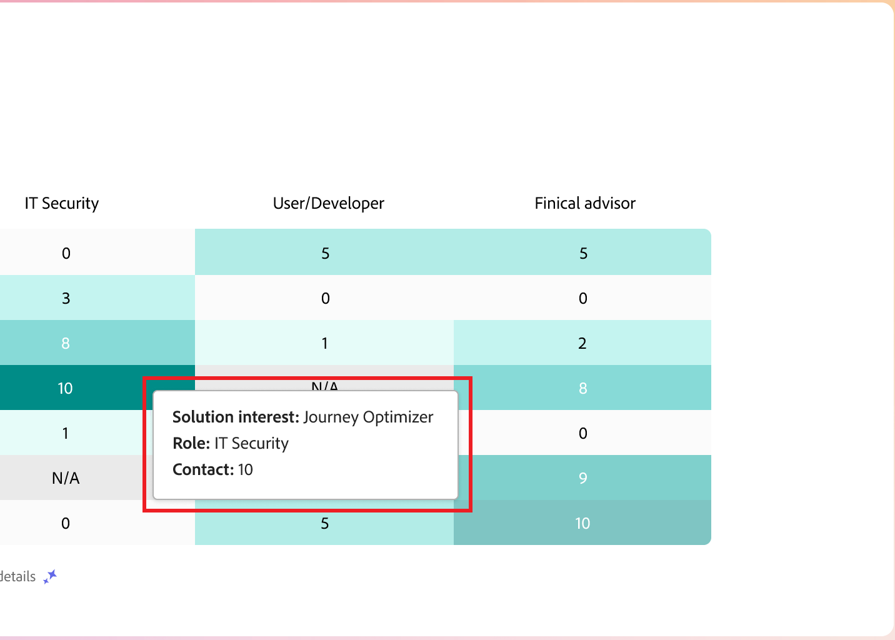

# Tableau de bord intelligent

Le tableau de bord intelligent offre une vue complète des mesures de groupe d’achats et de compte, ce qui vous permet de surveiller et de planifier vos efforts marketing de manière plus efficace.

Pour accéder au _Tableau de bord intelligent_, sélectionnez l’élément **[!UICONTROL Tableau de bord]** dans le volet de navigation de gauche.

{width="800" zoomable="yes"}

Le tableau de bord intelligent permet également d’accéder aux pages de détails du compte et du groupe d’achat qui incluent deux types de fonctionnalités d’IA générative :

* Récapitulatifs des comptes et des groupes d&#39;achats
* Détection d’intention pour la personne, le groupe d’achat et le compte

{{intent-data-note}}

Pour utiliser les informations fournies par le tableau de bord intelligent, votre instance Journey Optimizer B2B edition doit disposer des éléments requis :

| Type | Exigence |
| ---- | ----------- |
| [étapes du groupe d&#39;achat](#buying-group-stages) | Configurez les étapes du groupe d&#39;achats **et** ajoutez-les aux groupes d&#39;achats créés. |
| [Points forts du groupe d’achat](#buying-group-highlights) | Configurez les étapes du groupe d&#39;achats **et** ajoutez-les aux groupes d&#39;achats créés. |
| [Account surge](#surging-accounts) | Un ou plusieurs parcours publiés **ou** ont créé des groupes d&#39;achats. |
| [Principaux comptes](#account-highlights) | Un ou plusieurs parcours publiés **ou** ont créé des groupes d&#39;achats. |
| [Couverture des contacts](#contact-coverage) | Un ou plusieurs groupes d&#39;achats créés (étapes non nécessaires). |
| [Chevauchement des contacts](#contact-overlap) | Un ou plusieurs groupes d&#39;achats créés (étapes non nécessaires). |
| [Page Détails du compte](../accounts/account-details.md) | Un ou plusieurs parcours publiés. |
| [Page Détails du groupe d&#39;achat](../buying-groups/buying-group-details.md) | Un ou plusieurs groupes d&#39;achats créés (étapes non nécessaires). |

## Étapes du groupe d’achat {#buying-group-stages}

>[!CONTEXTUALHELP]
>id="ajo-b2b_intelligent_dashboard_buying_group_stages"
>title="Étapes du groupe d’achat"
>abstract="Ce graphique donne un aperçu de la progression du groupe d&#39;achat à travers différentes étapes en fonction des règles de transition configurées. La première barre indique le nombre de groupes d&#39;achats à une étape spécifique à la première date du délai sélectionné par rapport à la dernière date du délai sélectionné."

Le graphique _[!UICONTROL Étapes du groupe d’achat]_ donne un aperçu de la progression du groupe d’achat à travers différentes étapes ([en fonction des règles de transition configurées par un administrateur](../buying-groups/buying-group-stages.md)).

>[!NOTE]
>
>La disponibilité des étapes du groupe d&#39;achat nécessite la configuration des étapes du groupe d&#39;achat. Voir [Étapes de groupe d’achat](../buying-groups/buying-group-stages.md) pour obtenir des informations détaillées sur les étapes et sur la manière de définir et d’activer des étapes pour les groupes d’achat.

{width="800" zoomable="yes"}

Le graphique utilise les étapes du groupe d&#39;achat de la dernière version publiée du modèle étapes du groupe d&#39;achat. Il y a deux bars pour chaque étage. La première barre indique le nombre de groupes d&#39;achats à la première date de la période sélectionnée. Et le second (en comparaison) est le nombre de groupes d&#39;achat à la dernière date de la période. Vous pouvez pointer sur chaque barre pour voir le nombre de groupes d&#39;achats à chaque étape.

{width="400"}

### Résumé IA générative

Cliquez sur une barre pour afficher un résumé IA générative des groupes d’achats à cette étape pour la période sélectionnée.

{width="500"}

Le résumé généré donne un aperçu de la progression du groupe d&#39;achats à travers différentes étapes en fonction des règles de transition configurées.

### Période {#time-period-stages}

Utilisez le filtre de date en haut à droite pour modifier la période des visualisations de données. Cliquez sur la flèche vers le bas pour définir une période relative ou pour définir des dates de début et de fin personnalisées.

<!-- {width="300"} -->

### Filtre d’attribut {#attribute-filter-stages}

Cliquez sur l’icône _Filtrer_ (  ) en haut à gauche pour filtrer l’affichage des données à l’aide de l’un des attributs suivants :

* Intérêt de la solution
* Compte
* Nom de l’étape

<!-- Add screen when the UI is available {width="500"} -->

## Points forts du groupe d&#39;achat {#buying-group-highlights}

>[!CONTEXTUALHELP]
>id="ajo-b2b_intelligent_dashboard_buying_group_highlights_engagement"
>title="Les 5 meilleurs groupes d’achat par engagement"
>abstract="Meilleurs groupes d’achat engagés en fonction de leur score d’engagement normalisé."

>[!CONTEXTUALHELP]
>id="ajo-b2b_intelligent_dashboard_buying_group_highlights_velocity"
>title="Les 5 groupes d’achat les plus rapides"
>abstract="Groupes d’achat classés selon la rapidité de leur progression à travers les étapes."

>[!CONTEXTUALHELP]
>id="ajo-b2b_intelligent_dashboard_buying_group_highlights_stagnant"
>title="Les 5 groupes d’achat au progrès le plus lent"
>abstract="Groupes d’achat au progrès le plus lent, ne progressant pas à travers les étapes malgré un score d’exhaustivité élevé."

La section _[!UICONTROL Caractéristiques du groupe d&#39;achat]_ est organisée en trois lignes pour afficher des informations sur les groupes d&#39;achat qui intéressent votre organisation.

{width="800" zoomable="yes"}

* **5 premiers groupes d’achats par engagement** - Cette ligne affiche les groupes d’achats les plus engagés en fonction de leur score d’engagement normalisé.
* **Top 5 des groupes d&#39;achats à grande vitesse** - Cette ligne affiche les principaux groupes d&#39;achats en fonction de la vitesse à laquelle ils progressent dans les étapes du groupe d&#39;achats.
* **Top 5 des groupes d&#39;achats stagnants** - Cette ligne affiche les groupes d&#39;achats les plus stagnants qui ne progressent pas par étapes malgré un score d&#39;exhaustivité élevé.

Chaque carte contient les données suivantes :

* **_Nom du groupe d&#39;achat_**. Cliquez sur le nom pour ouvrir la page des détails du groupe d&#39;achats.
* **_Nom du compte_**. Cliquez sur le nom pour ouvrir la page des détails du compte (lien hypertexte vers la page des détails du compte).
* **_Étape actuelle_** pour le groupe d&#39;achat.
* **_score d’engagement_** (normalisé pour tous les groupes d’achat). Si tous les groupes d&#39;achats ont le même score, il affiche le dernier score mis à jour.
* **_Score d&#39;exhaustivité_** (de 1 à 100). Si tous les groupes d&#39;achats ont le même score, il affiche le dernier score mis à jour.
* **_Intention de la catégorie_**. Cliquez sur _[!UICONTROL Afficher les détails]_ pour afficher les données d’intention :

  {width="500" zoomable="yes"}

   * La fenêtre contextuelle des détails affiche le nom de la catégorie avec le niveau d’intention en haut.
   * Les données de chaque ligne sont organisées en colonnes : nom du produit, intensité de l’intention du produit et principaux mots-clés par intensité de l’intention.
   * L’ordre de tri est compris entre haut et bas pour la catégorie, le produit et les mots-clés. Si un ou plusieurs types ont la même intensité d’intention, le tri utilise l’ordre alphabétique.

  {{intent-data-note}}

En haut à droite du panneau _Groupes d’achats en surbrillance_, cliquez sur **[!UICONTROL Afficher tout]** pour accéder à la page de liste Groupes d’achats.

### Filtre d’attribut {#attribute-filter-bg-highlights}

Cliquez sur l’icône _Filtrer_ (  ) en haut à gauche pour filtrer l’affichage des données à l’aide de l’un des attributs suivants :

* Intérêt de la solution
* Groupe d’achat
* Compte

<!-- Add screen when the UI is available {width="500"} -->

### Période {#time-period-bg-highlights}

Utilisez le filtre de date en haut à droite pour modifier la période des visualisations de données. Cliquez sur la flèche vers le bas pour définir une période relative ou pour définir des dates de début et de fin personnalisées.

<!-- {width="300"} -->

## Comptes en forte progression {#account-surge}

>[!CONTEXTUALHELP]
>id="ajo-b2b_intelligent_dashboard_account_surge"
>title="Montée en puissance des comptes"
>abstract="Comptes présentant un changement significatif dans l’élan de l’engagement au cours de la période sélectionnée."

La section _[!UICONTROL Surging des comptes]_ affiche une visualisation des comptes avec un changement significatif de l’élan d’engagement au cours de la période sélectionnée.

>[!NOTE]
>
>Les données sur l’afflux de comptes sont limitées aux comptes ingérés par Journey Optimizer B2B edition dans une audience de compte par le biais de parcours de compte ou de groupes d’achat.

{width="800" zoomable="yes"}

Pointez sur chaque barre pour afficher le nombre de comptes dans chaque catégorie.

{width="400"}

Cliquez sur une barre pour afficher un résumé IA générative des comptes de la catégorie pour la période sélectionnée.

{width="500"}

### Filtre d’attribut {#attribute-filter-acct-surge}

Cliquez sur l’icône _Filtrer_ (  ) en haut à gauche pour filtrer l’affichage des données à l’aide de l’un des attributs suivants :

* Intérêt de la solution
* Secteur industriel
* Région

<!-- Add screen when the UI is available {width="500"} -->

### Période {#time-period-acct-surge}

Utilisez le filtre de date en haut à droite pour modifier la période des visualisations de données. Cliquez sur la flèche vers le bas pour définir une période relative ou pour définir des dates de début et de fin personnalisées.

<!-- {width="300"} -->

## Principales caractéristiques du compte {#account-highlights}

>[!CONTEXTUALHELP]
>id="ajo-b2b_intelligent_dashboard_account_highlights_surging"
>title="Comptes en forte progression"
>abstract="Comptes présentant une augmentation significative de l’élan de l’engagement au cours de la période sélectionnée. "

>[!CONTEXTUALHELP]
>id="ajo-b2b_intelligent_dashboard_account_highlights_at_risk"
>title="Comptes à risque"
>abstract="Comptes présentant une diminution significative de l’élan de l’engagement au cours de la période sélectionnée."

La section _[!UICONTROL Comptes mis en surbrillance]_ est organisée en deux lignes afin d’afficher des informations sur les comptes qui intéressent votre organisation.

>[!NOTE]
>
>Les données de mise en surbrillance de compte sont limitées aux comptes ingérés par Journey Optimizer B2B edition dans une audience de compte par le biais de parcours de compte ou de groupes d’achat.

{width="800" zoomable="yes"}

* **Augmentation des comptes** - Cette ligne affiche les comptes avec une augmentation significative de l’élan d’engagement au cours de la période sélectionnée.
* **Comptes à risque** - Cette ligne affiche les comptes présentant une diminution significative de l’élan de l’engagement au cours de la période sélectionnée.

Chaque carte contient les données suivantes :

* **_Nom du compte_**. Cliquez sur le nom pour ouvrir la page des détails du compte.
* **_Résumé IA générative_** du compte.
* **_Intention du mot-clé_**. Cliquez sur _[!UICONTROL Afficher les détails]_ pour afficher les données d’intention :

  {width="500" zoomable="yes"}

   * La fenêtre contextuelle des détails affiche le nom de la catégorie avec le niveau d’intention en haut.
   * Les données de chaque ligne sont organisées en colonnes : nom du produit, intensité de l’intention du produit et principaux mots-clés par intensité de l’intention.
   * L’ordre de tri est compris entre haut et bas pour la catégorie, le produit et les mots-clés. Si un ou plusieurs types ont la même intensité d’intention, le tri utilise l’ordre alphabétique.

  {{intent-data-note}}
<!-- 
At the top right of the _Buying group highlights_ panel, click **[!UICONTROL View All]** to navigate to the Buying groups list page. -->

### Filtre d’attribut {#attribute-filter-acct-highlights}

Cliquez sur l’icône _Filtrer_ (  ) en haut à gauche pour filtrer l’affichage des données à l’aide de l’un des attributs suivants :

* Intérêt de la solution
* Groupe d’achat

<!-- Add screen when the UI is available {width="500"} -->

### Période {#time-period-acct-highlights}

Utilisez le filtre de date en haut à droite pour modifier la période des visualisations de données. Cliquez sur la flèche vers le bas pour définir une période relative ou pour définir des dates de début et de fin personnalisées.

<!-- {width="300"} -->

## Couverture des contacts {#contact-coverage}

>[!CONTEXTUALHELP]
>id="ajo-b2b_intelligent_dashboard_contact_coverage"
>title="Couverture des contacts"
>abstract="Affiche le nombre de contacts ayant un rôle spécifique associé à un intérêt pour une solution. L’affectation des rôles et de l’intérêt pour une solution est basée sur le modèle de groupe d’achat."

La section _[!UICONTROL Couverture des contacts]_ affiche une visualisation du nombre de contacts ayant un rôle spécifique associé à un intérêt pour la solution. L’affectation des rôles et de l’intérêt pour une solution est basée sur le modèle de groupe d’achat.

>[!NOTE]
>
>Les données de couverture des contacts sont basées sur les groupes d’achats créés dans l’instance Journey Optimizer B2B edition.

{width="800" zoomable="yes"}

Pointez sur chaque cellule pour afficher le nombre de contacts présentant un intérêt pour le rôle/la solution.

{width="400"}

Cliquez sur une cellule pour afficher des informations détaillées sur les contacts qui présentent un intérêt en termes de rôle/solution.

{width="700" zoomable="yes"}

### Filtre d’attribut {#attribute-filter-contact-coverage}

Cliquez sur l’icône _Filtrer_ (  ) en haut à gauche pour filtrer l’affichage des données à l’aide de l’un des attributs suivants :

* Intérêt de la solution
* Comptes

<!-- Add screen when the UI is available {width="500"} -->

## Chevauchement des contacts {#contact-overlap}

>[!CONTEXTUALHELP]
>id="ajo-b2b_intelligent_dashboard_contact_overlap"
>title="Chevauchement des contacts"
>abstract="Liste de contacts qui font partie de plusieurs groupes d’achat suite à leur association avec plusieurs centres d’intérêt pour les solutions."

La section _[!UICONTROL Chevauchement des contacts]_ affiche une liste de contacts qui font partie de plusieurs groupes d’achat parce qu’ils sont associés à plusieurs centres d’intérêt pour les solutions.

>[!NOTE]
>
>Les données de chevauchement des contacts sont basées sur les groupes d’achat créés dans l’instance B2B edition de Journey Optimizer.

{width="800" zoomable="yes"}

Cliquez sur l&#39;icône _Informations_ (  ) pour afficher un tableau contenant les détails suivants :

* Nom du groupe d&#39;achat (cliquez sur le nom pour ouvrir la page des détails du groupe d&#39;achat)
* Rôle
* Intérêt de la solution
* Intention du produit
* Produit

{width="600" zoomable="yes"}

### Filtre d’attribut {#attribute-filter-contact-overage}

Cliquez sur l’icône _Filtrer_ (  ) en haut à gauche pour filtrer l’affichage des données à l’aide de l’un des attributs suivants :

* Intérêt de la solution
* Rôles
* Comptes

<!-- Add screen when the UI is available {width="500"} -->
