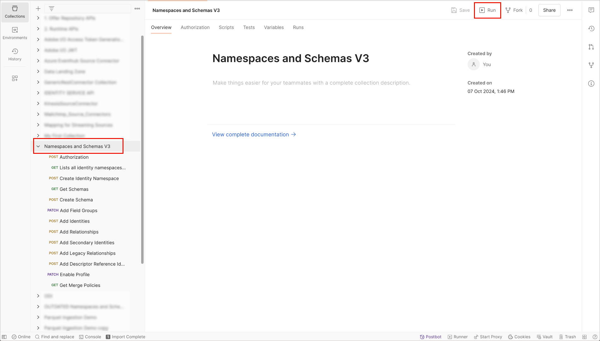

# Espaces de noms et schémas B2B

La configuration de Journey Optimizer B2B edition sur l’architecture simplifiée inclut la configuration des espaces de noms et des schémas Experience Platform utilisés avec les sources B2B. L’utilitaire d’automatisation Postman est nécessaire pour générer des espaces de noms et des schémas B2B.

>[!AVAILABILITY]
>
>- Vous devez avoir accès à [Adobe Real-Time Customer Data Platform B2B edition](https://experienceleague.adobe.com/fr/docs/experience-platform/rtcdp/intro/rtcdpb2b-intro/b2b-overview){target="_blank"} pour que vos schémas B2B soient qualifiés dans [Real-Time Customer Profile](https://experienceleague.adobe.com/fr/docs/experience-platform/profile/home){target="_blank"}.
>
>- Vos entités B2B Experience Platform doivent utiliser les relations standard décrites dans le guide [ Espaces de noms et schémas B2B ](https://experienceleague.adobe.com/fr/docs/experience-platform/rtcdp/schemas/b2b){target="_blank"}.

Consultez les informations suivantes sur la configuration sous-jacente des espaces de noms et des schémas à utiliser avec les sources B2B. Elle fournit également des détails sur la configuration de votre utilitaire d’automatisation Postman, qui est nécessaire pour générer des espaces de noms et des schémas B2B.

## Configuration de l’utilitaire de génération automatique

Consultez les ressources suivantes pour connaître les conditions préalables et des informations détaillées sur la configuration de votre environnement [!DNL Postman] pour prendre en charge l’utilitaire de génération automatique d’espace de noms B2B et de schéma .

- Téléchargez l’environnement et la collection d’utilitaires de génération automatique de schémas et d’espaces de noms à partir du [référentiel GitHub](https://github.com/adobe/experience-platform-postman-samples/tree/master/Postman%20Collections/CDP%20Namespaces%20and%20Schemas%20Utility){target="_blank"}.
- Pour plus d’informations sur l’utilisation des API Experience Platform, notamment sur la collecte des valeurs des en-têtes requis et la lecture d’exemples d’appels API, voir [_Prise en main des API Adobe Experience Platform_](https://experienceleague.adobe.com/fr/docs/experience-platform/landing/platform-apis/api-guide){target="_blank"}.
- Pour plus d’informations sur la génération de vos informations d’identification pour les API Experience Platform, voir [_Authentification et accès aux API Experience Platform_](https://experienceleague.adobe.com/fr/docs/experience-platform/landing/platform-apis/api-authentication){target="_blank"}.
- Pour plus d’informations sur la configuration des [!DNL Postman] pour les API Experience Platform, voir [_[!DNL Postman] dans Adobe Experience Platform _](https://experienceleague.adobe.com/fr/docs/experience-platform/landing/platform-apis/postman){target="_blank"}.

### Valeurs d’environnement

Avec une Developer Console et une configuration [!DNL Postman] d’Experience Platform, vous pouvez appliquer les valeurs d’environnement appropriées à votre environnement [!DNL Postman]. Le tableau suivant fournit des exemples de valeurs et des informations supplémentaires sur le remplissage de votre environnement [!DNL Postman] :

| Variable | Description | Exemple |
| --- | --- | --- |
| `CLIENT_SECRET` | Identifiant unique utilisé pour générer votre `{ACCESS_TOKEN}`. | `{CLIENT_SECRET}` |
| `API_KEY` | Identifiant unique utilisé pour authentifier les appels aux API Experience Platform. | `c8d9a2f5c1e03789bd22e8efdd1bdc1b` |
| `ACCESS_TOKEN` | Jeton d’autorisation requis pour effectuer des appels vers les API Experience Platform. | `Bearer {ACCESS_TOKEN}` |
| `META_SCOPE` | En ce qui concerne [!DNL Journey Optimizer B2B] et [!DNL Marketo Engage], cette valeur est fixe et est toujours définie sur : `ent_dataservices_sdk`. | `ent_dataservices_sdk` |
| `CONTAINER_ID` | Le conteneur `global` contient toutes les classes, groupes de champs de schéma, types de données et schémas fournis par les partenaires standard d’Adobe et d’Experience Platform. En ce qui concerne [!DNL Marketo], cette valeur est fixe et est toujours définie sur `global`. | `global` |
| `TECHNICAL_ACCOUNT_ID` | Informations d’identification utilisées pour intégrer à Adobe I/O. | `D42AEVJZTTJC6LZADUBVPA15@techacct.adobe.com` |
| `IMS` | Le système Identity Management (IMS) fournit la structure pour l’authentification aux services Adobe. En ce qui concerne [!DNL Journey Optimizer B2B] et [!DNL Marketo Engage], cette valeur est fixe et est toujours définie sur : `ims-na1.adobelogin.com`. | `ims-na1.adobelogin.com` |
| `IMS_ORG` | Entité d’entreprise pouvant posséder des produits et services ou en obtenir la licence et permettre l’accès à ses membres. | `ABCEH0D9KX6A7WA7ATQE0TE@adobeOrg` |
| `SANDBOX_NAME` | Nom de la partition de sandbox virtuelle que vous utilisez. | `prod` |
| `TENANT_ID` | Identifiant utilisé pour s’assurer que les ressources que vous créez ont un espace de noms correct et sont contenues dans votre organisation. | `b2bcdpproductiontest` |
| `PLATFORM_URL` | Point d’entrée de l’URL vers lequel vous effectuez des appels API. Cette valeur est fixe et est toujours définie sur : `http://platform.adobe.io/`. | `http://platform.adobe.io/` |

{style="table-layout:auto"}

### Exécution des scripts

Une fois les valeurs d’environnement en place, utilisez l’interface [!DNL Postman] pour exécuter le script de création des espaces de noms et des schémas. Sélectionnez le dossier racine de l’utilitaire de génération automatique, puis sélectionnez **[!DNL Run]** dans l’en-tête supérieur.

{width="500" zoomable="yes"}

L’interface [!DNL Runner] s’affiche. À partir de là, assurez-vous que toutes les cases à cocher sont sélectionnées, puis sélectionnez **[!DNL Run Namespaces and Schemas Autogeneration Utility]**.

{width="800" zoomable="yes"}

Une requête réussie crée les espaces de noms et les schémas B2B requis.

## Espaces de noms B2B

Les espaces de noms d’identité sont des composants d’Experience Platform [[!DNL Identity Service]](https://experienceleague.adobe.com/fr/docs/experience-platform/identity/home){target="_blank"} qui servent à distinguer le contexte d’une identité. Une identité complète comprend une valeur d’identité et un espace de noms. Consultez [ Présentation des espaces de noms ](https://experienceleague.adobe.com/fr/docs/experience-platform/identity/features/namespaces){target="_blank"} pour plus d’informations.

Les espaces de noms B2B sont utilisés dans l’identité principale de l’entité.

| Nom d’affichage | Symbole d’identité | Type d’identité |
| --- | --- | --- |
| Personne B2B | `b2b_person` | `CROSS_DEVICE` |
| Compte B2B | `b2b_account` | `B2B_ACCOUNT` |
| Opportunité B2B | `b2b_opportunity` | `B2B_OPPORTUNITY` |
| Relation de la personne avec l’opportunité B2B | `b2b_opportunity_person_relation` | `B2B_OPPORTUNITY_PERSON` |
| Campagne B2B | `b2b_campaign` | `B2B_CAMPAIGN` |
| Membre de la campagne B2B | `b2b_campaign_member` | `B2B_CAMPAIGN_MEMBER` |
| Liste marketing B2B | `b2b_marketing_list` | `B2B_MARKETING_LIST` |
| Membre de la liste marketing B2B | `b2b_marketing_list_member` | `B2B_MARKETING_LIST_MEMBER` |
| Relation avec la personne du compte B2B | `b2b_account_person_relation` | `B2B_ACCOUNT_PERSON` |

{style="table-layout:auto"}

## Schémas B2B

Experience Platform utilise des schémas pour décrire la structure des données de manière cohérente et réutilisable. En définissant les données de manière cohérente sur l’ensemble des systèmes, il est plus simple de leur donner du sens et donc d’en tirer profit.

Avant qu’Experience Platform puisse ingérer des données, un schéma doit décrire la structure des données et fournir des contraintes au type de données pouvant être contenu dans chaque champ. Les schémas se composent d’une classe de base et de zéro ou plusieurs groupes de champs.

Pour plus d’informations sur le modèle de composition de schémas, y compris sur les principes de conception et les bonnes pratiques, voir [_Principes de base de la composition de schémas_](https://experienceleague.adobe.com/fr/docs/experience-platform/xdm/schema/composition){target="_blank"}.

+++ Compte B2B

<table>
    <tr>
        <td style="width: 30%;">Classe de base</td>
        <td style="width: 70%;"><a href="https://experienceleague.adobe.com/fr/docs/experience-platform/xdm/classes/b2b/business-account" target="_blank">Compte professionnel XDM</a></td>
    </tr>
    <tr>
        <td>Groupes de champs</td>
        <td>Détails du compte professionnel XDM</td>
    </tr>
    <tr>
        <td>[!DNL Profile] dans le schéma</td>
        <td>Activé</td>
    </tr>
    <tr>
        <td>Identité principale</td>
        <td><code>accountKey.sourceKey</code> dans la classe de base</td>
    </tr>
    <tr>
        <td>Espace de noms d’identité principal</td>
        <td>Compte B2B</td>
    </tr>
    <tr>
        <td>identité Secondaire</td>
        <td><code>extSourceSystemAudit.externalKey.sourceKey</code> dans la classe de base</td>
    </tr>
    <tr>
        <td>Espace de noms d’identité Secondaire</td>
        <td>Compte B2B</td>
    </tr>
    <tr>
        <td>Relations</td>
        <td><ul><li><code>accountParentKey.sourceKey</code> dans le groupe de champs Détails du compte professionnel XDM .</li><li>Propriété de destination : <code>/accountKey/sourceKey</code></li><li>Type : un à un</li><li>Schéma de référence : compte B2B</li><li>Espace De Noms : Compte B2B</li></ul> </td>
    </tr>
</table>

+++

+++ Personne B2B

<table>
    <tr>
        <td style="width: 30%;">Classe de base</td>
        <td style="width: 70%;"><a href="https://experienceleague.adobe.com/fr/docs/experience-platform/xdm/classes/individual-profile">Profil individuel XDM</a>{target=« _blank »}</td>
    </tr>
    <tr>
        <td>Groupes de champs</td>
        <td><ul><li>Détails de professionnel XDM</li><li>Composants de professionnel XDM</li><li>IdentityMap</li><li>Détails relatifs au consentement et aux préférences</li></ul> </td>
    </tr>
    <tr>
        <td>[!DNL Profile] dans le schéma</td>
        <td>Activé</td>
    </tr>
    <tr>
        <td>Identité principale</td>
        <td><code>b2b.personKey.sourceKey</code> dans le groupe de champs Détails professionnels XDM .</td>
    </tr>
    <tr>
        <td>Espace de noms d’identité principal</td>
        <td>Personne B2B</td>
    </tr>
    <tr>
        <td>identité Secondaire</td>
        <td><ol><li><code>extSourceSystemAudit.externalKey.sourceKey</code> du groupe de champs Détails professionnels XDM</li><li><code>workEmail.address</code> du groupe de champs Détails professionnels XDM</li></ol></td>
    </tr>
    <tr>
        <td>Espace de noms d’identité Secondaire</td>
        <td><ol><li>Personne B2B</li><li>E-mail</li></ol></td>
    </tr>
    <tr>
        <td>Relations</td>
        <td><ul><li><code>personComponents.sourceAccountKey.sourceKey</code> du groupe de champs Composants professionnels XDM .</li><li>Type : plusieurs à un</li><li>Schéma De Référence : Compte B2B</li><li>Espace De Noms : Compte B2B</li><li>Propriété de destination : accountKey.sourceKey</li><li>Nom de la relation à partir du schéma actuel : Compte</li><li>Nom de la relation du schéma de référence : Personnes</li></ul> </td>
    </tr>
</table>

+++

<!--

+++B2B Opportunity

<table>
    <tr>
        <td style="width: 30%;">Base class</td>
        <td style="width: 70%;"><a href="https://experienceleague.adobe.com/fr/docs/experience-platform/xdm/classes/b2b/business-opportunity">XDM Business Opportunity</a>{target="_blank"}</td>
    </tr>
    <tr>
        <td>Field groups</td>
        <td>XDM Business Opportunity Details</td>
    </tr>
    <tr>
        <td>[!DNL Profile] in Schema</td>
        <td>Enabled</td>
    </tr>
    <tr>
        <td>Primary identity</td>
        <td><code>opportunityKey.sourceKey</code> in the base class</td>
    </tr>
    <tr>
        <td>Primary identity namespace</td>
        <td>B2B Opportunity</td>
    </tr>
    <tr>
        <td>Secondary identity</td>
        <td><code>extSourceSystemAudit.externalKey.sourceKey</code> in the base class</td>
    </tr>
    </tr>
    <tr>
        <td>Secondary identity namespace</td>
        <td>B2B Opportunity</td>
    </tr>
    <tr>
        <td>Relationship</td>
        <td><ul><li><code>accountKey.sourceKey</code> in the base class</li><li>Type: Many-to-one</li><li>Reference Schema: B2B Account</li><li>Namespace: B2B Account</li><li>Destination property: <code>accountKey.sourceKey</code></li><li>Relationship name from current schema: Account</li><li>Relationship name from reference schema: Opportunities</li></ul></td>
    </tr>
</table>

+++

+++B2B Opportunity Person Relation

<table>
    <tr>
        <td style="width: 30%;">Base class</td>
        <td style="width: 70%;"><a href="https://experienceleague.adobe.com/fr/docs/experience-platform/xdm/classes/b2b/business-opportunity-person-relation">XDM Business Opportunity Person Relation</a>{target="_blank"}</td>
    </tr>
    <tr>
        <td>Field groups</td>
        <td>None</td>
    </tr>
    <tr>
        <td>[!DNL Profile] in Schema</td>
        <td>Enabled</td>
    </tr>
    <tr>
        <td>Primary identity</td>
        <td><code>opportunityPersonKey.sourceKey</code> in the base class</td>
    </tr>
    <tr>
        <td>Primary identity namespace</td>
        <td>B2B Opportunity Person Relation</td>
    </tr>
    <tr>
        <td>Secondary identity</td>
        <td>None</td>
    </tr>
    </tr>
    <tr>
        <td>Secondary identity namespace</td>
        <td>None</td>
    </tr>
    <tr>
        <td>Relationship</td>
        <td> **First relationship**<ul><li><code>personKey.sourceKey</code> in the base class</li><li>Type: Many-to-one</li><li>Reference Schema: B2B Person</li><li>Namespace: B2B Person</li><li>Destination property: <code>b2b.personKey.sourceKey</code></li><li>Relationship name from current schema: Person</li><li>Relationship name from reference schema: Opportunities</li></ul>**Second relationship**<ul><li><code>opportunityKey.sourceKey</code> in the base class</li><li>Type: Many-to-one</li><li>Reference Schema: B2B Opportunity </li><li>Namespace: B2B Opportunity </li><li>Destination property: <code>opportunityKey.sourceKey</code></li><li>Relationship name from current schema: Opportunity</li><li>Relationship name from reference schema: People</li></ul> </td>
    </tr>
</table>

+++

+++B2B Campaign

<table>
    <tr>
        <td style="width: 30%;">Base class</td>
        <td style="width: 70%;"><a href="https://experienceleague.adobe.com/fr/docs/experience-platform/xdm/classes/b2b/business-campaign">XDM Business Campaign</a>{target="_blank"}</td>
    </tr>
    <tr>
        <td>Field groups</td>
        <td>XDM Business Campaign Details</td>
    </tr>
    <tr>
        <td>[!DNL Profile] in Schema</td>
        <td>Enabled</td>
    </tr>
    <tr>
        <td>Primary identity</td>
        <td><code>campaignKey.sourceKey</code> in the base class</td>
    </tr>
    <tr>
        <td>Primary identity namespace</td>
        <td>B2B Campaign</td>
    </tr>
    <tr>
        <td>Secondary identity</td>
        <td>None</td>
    </tr>
    </tr>
    <tr>
        <td>Secondary identity namespace</td>
        <td>None</td>
    </tr>
    <tr>
        <td>Relationship</td>
        <td>None</td>
    </tr>
</table>

+++

+++B2B Campaign Member

<table>
    <tr>
        <td style="width: 30%;">Base class</td>
        <td style="width: 70%;"><a href="https://experienceleague.adobe.com/fr/docs/experience-platform/xdm/classes/b2b/business-campaign-members">XDM Business Campaign Members</a>{target="_blank"}</td>
    </tr>
    <tr>
        <td>Field groups</td>
        <td>XDM Business Campaign Member Details</td>
    </tr>
    <tr>
        <td>[!DNL Profile] in Schema</td>
        <td>Enabled</td>
    </tr>
    <tr>
        <td>Primary identity</td>
        <td><code>campaignMemberKey.sourceKey</code> in the base class</td>
    </tr>
    <tr>
        <td>Primary identity namespace</td>
        <td>B2B Campaign Member</td>
    </tr>
    <tr>
        <td>Secondary identity</td>
        <td>None</td>
    </tr>
    </tr>
    <tr>
        <td>Secondary identity namespace</td>
        <td>None</td>
    </tr>
    <tr>
        <td>Relationship</td>
        <td>**First relationship**<ul><li><code>personKey.sourceKey</code> in the base class</li><li>Type: Many-to-one</li><li>Reference Schema: B2B Person</li><li>Namespace: B2B Person</li><li>Destination property: <code>b2b.personKey.sourceKey</code></li><li>Relationship name from current schema: Person</li><li>Relationship name from reference schema: Campaigns</li></ul>**Second relationship**<ul><li><code>campaignKey.sourceKey</code> in the base class</li><li>Type: Many-to-one</li><li>Reference Schema: B2B Campaign</li><li>Namespace: B2B Campaign</li><li>Destination property: <code>campaignKey.sourceKey</code></li><li>Relationship name from current schema: Campaign</li><li>Relationship name from reference schema: People</li></ul></td>
    </tr>
</table>

+++B2B Marketing List

<table>
    <tr>
        <td style="width: 30%;">Base class</td>
        <td style="width: 70%;"><a href="https://experienceleague.adobe.com/fr/docs/experience-platform/xdm/classes/b2b/business-marketing-list">XDM Business Marketing List</a>{target="_blank"}</td>
    </tr>
    <tr>
        <td>Field groups</td>
        <td>None</td>
    </tr>
    <tr>
        <td>[!DNL Profile] in Schema</td>
        <td>Enabled</td>
    </tr>
    <tr>
        <td>Primary identity</td>
        <td><code>marketingListKey.sourceKey</code> in the base class</td>
    </tr>
    <tr>
        <td>Primary identity namespace</td>
        <td>B2B Marketing List</td>
    </tr>
    <tr>
        <td>Secondary identity</td>
        <td>None</td>
    </tr>
    </tr>
    <tr>
        <td>Secondary identity namespace</td>
        <td>None</td>
    </tr>
    <tr>
        <td>Relationship</td>
        <td>None</td>
    </tr>
</table>

>[!NOTE]
>
>Static List in [!UICONTROL Marketo Engage] is not synced from Salesforce and therefore does not have a secondary identity.

+++

+++B2B Marketing List Member

<table>
    <tr>
        <td style="width: 30%;">Base class</td>
        <td style="width: 70%;"><a href="https://experienceleague.adobe.com/fr/docs/experience-platform/xdm/classes/b2b/business-marketing-list-members">XDM Business Marketing List Members</a>{target="_blank"}</td>
    </tr>
    <tr>
        <td>Field groups</td>
        <td>None</td>
    </tr>
    <tr>
        <td>[!DNL Profile] in Schema</td>
        <td>Enabled</td>
    </tr>
    <tr>
        <td>Primary identity</td>
        <td><code>marketingListMemberKey.sourceKey</code> in the base class</td>
    </tr>
    <tr>
        <td>Primary identity namespace</td>
        <td>B2B Marketing List Member</td>
    </tr>
    <tr>
        <td>Secondary identity</td>
        <td>None</td>
    </tr>
    </tr>
    <tr>
        <td>Secondary identity namespace</td>
        <td>None</td>
    </tr>
    <tr>
        <td>Relationship</td>
        <td>**First relationship**<ul><li><code>personKey.sourceKey</code> in the base class</li><li>Type: Many-to-one</li><li>Reference Schema: B2B Person</li><li>Namespace: B2B Person</li><li>Destination property: <code>b2b.personKey.sourceKey</code></li><li>Relationship name from current schema: Person</li><li>Relationship name from reference schema: Marketing Lists</li></ul>**Second relationship**<ul><li><code>marketingListKey.sourceKey</code> in the base class</li><li>Type: Many-to-one</li><li>Reference Schema: B2B Marketing List</li><li>Namespace: B2B Marketing List</li><li>Destination property: <code>marketingListKey.sourceKey</code></li><li>Relationship name from current schema: Marketing List</li><li>Relationship name from reference schema: People</li></ul></td>
    </tr>
</table>

>[!NOTE]
>
>Static List member in [!UICONTROL Marketo Engage] is not synced from Salesforce and therefore does not have a secondary identity.

+++

+++B2B Account Person Relation

<table>
    <tr>
        <td style="width: 30%;">Base class</td>
        <td style="width: 70%;"><a href="https://experienceleague.adobe.com/fr/docs/experience-platform/xdm/classes/b2b/business-account-person-relation">XDM Business Account Person Relation</a>{target="_blank"}</td>
    </tr>
    <tr>
        <td>Field groups</td>
        <td>Identity Map</td>
    </tr>
    <tr>
        <td>[!DNL Profile] in Schema</td>
        <td>Enabled</td>
    </tr>
    <tr>
        <td>Primary identity</td>
        <td><code>accountPersonKey.sourceKey</code> in the base class</td>
    </tr>
    <tr>
        <td>Primary identity namespace</td>
        <td>B2B Account Person Relation</td>
    </tr>
    <tr>
        <td>Secondary identity</td>
        <td>None</td>
    </tr>
    </tr>
    <tr>
        <td>Secondary identity namespace</td>
        <td>None</td>
    </tr>
    <tr>
        <td>Relationship</td>
        <td>**First relationship**<ul><li><code>personKey.sourceKey</code> in the base class</li><li>Type: Many-to-one</li><li>Reference Schema: B2B Person</li><li>Namespace: B2B Person</li><li>Destination property: <code>b2b.personKey.sourceKey</code></li><li>Relationship name from current schema: People</li><li>Relationship name from reference schema: Account</li></ul>**Second relationship**<ul><li><code>accountKey.sourceKey</code> in the base class</li><li>Type: Many-to-one</li><li>Reference Schema: B2B Account</li><li>Namespace: B2B Account</li><li>Destination property: <code>accountKey.sourceKey</code></li><li>Relationship name from current schema: Account</li><li>Relationship name from reference schema: People</li></ul></td>
    </tr>
</table>

+++
-->
