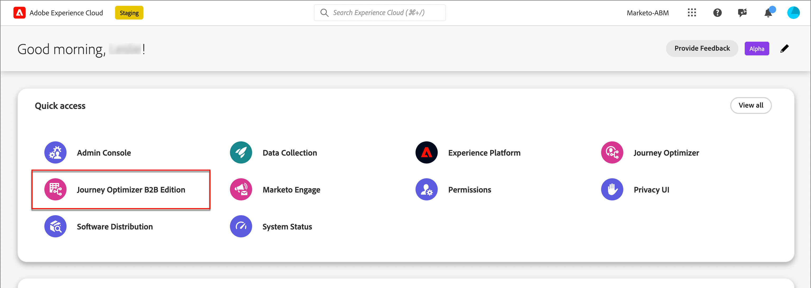

# Connexion et page d’accueil

Avec Adobe Journey Optimizer B2B Edition, vous pouvez orchestrer des parcours de compte et de groupe d’achat à l’aide d’une IA générée intégrée et d’une automatisation de pointe du secteur afin d’optimiser la demande pour des offres spécifiques à l’aide de groupes d’achats qualifiés pour le marketing.

<!-- Requirements?
-->
Pour accéder à [!DNL Adobe Journey Optimizer B2B Edition], connectez-vous à Adobe Experience Cloud avec votre Adobe ID, puis sélectionnez [!DNL Journey Optimizer B2B Edition].

{width="800" zoomable="yes"}

La page d’accueil s’affiche lorsque vous vous connectez à Adobe Experience Platform et sélectionnez l’application Adobe Journey Optimizer B2B Edition. Cette page présente un aperçu de l’état actuel des initiatives Journey Optimizer B2B sous la forme d’informations affinées et d’un accès rapide aux modules appropriés. Il fournit également des informations sur la prochaine action idéale à entreprendre et sur l’emplacement où trouver l’ensemble complet de tutoriels et de documentation.

L’édition B2B de Journey Optimizer comporte deux principaux utilisateurs : un marketeur et un administrateur. Chaque persona possède une page d’accueil spécifique pour différentes phases de maturité (nouvelles ou avancées). Le contenu de la page est basé sur les besoins de chaque persona en termes d’informations et les prochaines actions à entreprendre. Ces pages incluent également l’accès à [l’assistant d’IA](./start/ai-assistant.md), qui permet aux utilisateurs d’obtenir des informations rapides sur les questions ou sujets spécifiques dont ils ont besoin<!-- and to obtain specific recommendations for their challenges or objectives-->.

{width="800" zoomable="yes"}

* **Marketer - nouvel utilisateur** — La page d’accueil _Marketer_ pour un nouvel utilisateur les aide à s’habituer à Journey Optimizer B2B et à ses fonctionnalités. Il comprend une présentation guidée permettant au nouveau marketeur d’obtenir une présentation détaillée sur l’intégration afin qu’il puisse comprendre les nuances du système et devenir efficace dans le développement de stratégies et d’initiatives marketing B2B.
* **Marketer - utilisateur avancé** — La page d’accueil _Marketer_ pour un spécialiste du marketing avancé les aide à obtenir plus d’informations sur l’état d’avancement actuel des initiatives et sur les actions spécifiques, ainsi que sur les prochaines actions à entreprendre et l’accès rapide aux sections pertinentes.
* **Administrateur - nouvel utilisateur** — La page d’accueil _Admin_ d’un nouvel administrateur les aide à s’habituer à l’édition B2B de Journey Optimizer et à ses fonctionnalités. Il comprend une présentation guidée permettant au nouvel administrateur d’obtenir un parcours d’intégration détaillé afin de comprendre les nuances du système et de devenir efficace dans le développement de stratégies et d’initiatives marketing B2B.
* **Administrateur - utilisateur avancé** — La page d’accueil _Admin_ d’un administrateur avancé l’aide à obtenir plus d’informations sur l’état actuel de l’instance et sur les actions spécifiques qui peuvent être entreprises pour la rendre plus efficace et plus efficace pour les marketeurs.

<!-- 

## Marketer - new user

The Marketer home page for a new user consists of three rows that assist the marketer in getting accustomed to Journey Optimizer B2B and its capabilities. It also provides a view of the latest journeys that have been created, which can serve as a starting point for a new user.

The first row consists of a guided walkthrough for the new marketer to obtain an onboarding walkthrough so that they can understand the nuances of the system and become efficient in developing B2B marketing strategies and initiatives.

The second row consists of the recent AJO B2B journeys that have been created across the platform so that the marketer can get inspiration for the best practices to create an account journey.

The third row consists of the learning resources that can help a marketer gain more information on a specific topic.

## Marketer - advanced user

The Marketer home page for an advanced marketer consists of four rows that assists the marketer in obtaining more information on the current progress of the initiatives and on specific actions and on the next best action to be taken along with quick access to relevant sections.

The first row consists of the next set of actions that a B2B marketer can take based on the previous actions taken and the current state of the initiative, which provides a prompt for the user to make the next move that would align to the objective of the initiatives and help them reach the goals quickly.

The second row consists of the most recent assets accessed by the marketer to make it easier for the marketer to locate them and make updates to the same.

The third row consists of the Key Performance Indicators that can help the marketer gauge the overall performance of the marketing initiatives.

The fourth row consists of the learning resources that can help a marketer gain more information on a specific topic.

## Administrator - new user

The _Admin_ home page for a new administrator consists of three rows that assists the administrator in getting accustomed to Journey Optimizer B2B Edition and its capabilities, and provides a view of the latest journeys that have been created that can serve as a starting point for a new user.

The first row consists of a guided walkthrough for the new marketer to obtain a step-by-step onboarding journey to understand the nuances of the system and become efficient in developing B2B marketing strategies and initiatives with AJO B2B.

The second row consists of the recent assets used by the B2B marketers in a single table to make it easier for the administrator to know which assets are currently under focus.

The third row consists of the learning resources that would help an administrator gain more information on a specific topic.

## Administrator - advanced user

The _Admin_ home page for an advanced administrator consists of four rows that assists the administrator in obtaining more information about the current status of the instance and on specific actions that can be taken to make it more efficient and effective for the marketers.

The first row consists of the next set of actions that an administrator can take based on the previous actions taken and the current state of the instance. It serves as a prompt for the administrator to make the necessary updates to the parameters of the instances such as user permissions or any specific module configurations.

The second row consists of the recent assets used by the B2B marketers in a single table to make it easier for the administrator to know which assets are currently under focus.

The third row consists of the Key Performance Indicators that would help the administrators gauge the progress of the instance in terms of operational parameters such as users and usage.

The fourth row consists of the learning resources that would help the administrator gain more information on a specific topic.

-->