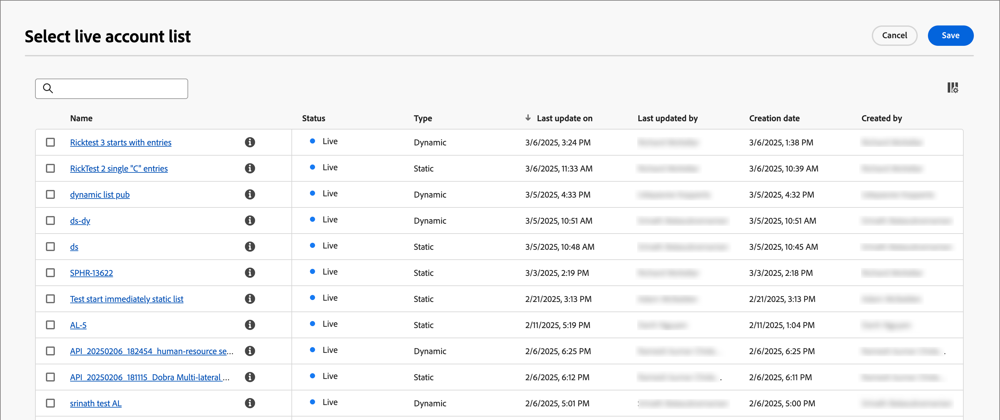

# Nœuds de parcours d’audience de compte

Le nœud d’audience du compte spécifie les comptes qui rejoignent le parcours. Lorsque vous [créez un parcours de compte](./journey-overview.md#create-an-account-journey), le parcours commence toujours par un nœud d’audience de compte qui définit son entrée.

Utilisez l’une des options d’entrée suivantes pour ce nœud de parcours :

* **[Audience du compte](../audiences/account-audience-overview.md)** — L&#39;audience du compte représente l&#39;audience de base qui se synchronise à partir du service de segmentation d&#39;Experience Platform.
* **[Liste des comptes](../accounts/account-lists.md)** — La liste des comptes est un ensemble de comptes nommés que vous utilisez pour l&#39;orchestration ciblée des parcours. Une liste de comptes cible des comptes nommés à l’aide de critères définis, tels que le secteur, l’emplacement ou la taille de l’entreprise.

## Définissez l’audience pour le nœud audience du compte

1. Cliquez sur le nœud **[!UICONTROL Audience du compte]**. Cette action affiche les propriétés du nœud sur la droite.

   {width="700" zoomable="yes"}

1. Choisissez le type de saisie des comptes entrant dans le parcours :

   * **[!UICONTROL Audience du compte]**

     Sélectionnez l’option Audience du compte . Cliquez ensuite sur **[!UICONTROL Ajouter une audience de compte]**.

     Dans la boîte de dialogue _[!UICONTROL Ajouter une audience]_, sélectionnez un segment d’audience créé précédemment. Cliquez ensuite sur **[!UICONTROL Ajouter une audience]**.

     {width="700" zoomable="yes"}

   * **[!UICONTROL Liste des comptes]**

     Sélectionnez l’option Liste des comptes . Cliquez sur **[!UICONTROL Ajouter une liste de comptes]**.

     Dans la boîte de dialogue _[!UICONTROL Sélectionner une liste de comptes actifs]_, sélectionnez une liste de comptes publiés. Cliquez ensuite sur **[!UICONTROL Enregistrer]**.

     {width="700" zoomable="yes"}

     Pour plus d’informations sur la création et la publication de listes de comptes, voir [Listes de comptes](../accounts/account-lists.md).

## Création d’un segment ciblé

1. Dans le volet de navigation de gauche, sélectionnez **[!UICONTROL Comptes]** > **[!UICONTROL Audiences]**.

1. Cliquez sur **[!UICONTROL Créer une audience]** dans le coin supérieur droit.

   {width="800" zoomable="yes"}

1. Suivez les étapes du [Guide de Segmentation Service](https://experienceleague.adobe.com/fr/docs/experience-platform/segmentation/types/account-audiences){target="_blank"}.
