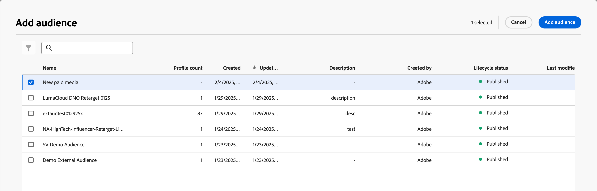
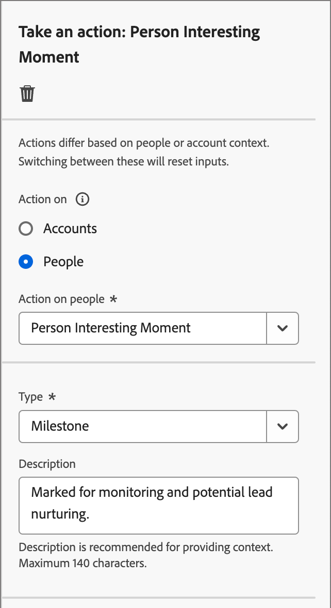

# Entreprendre une action

Dans le parcours de votre compte, vous pouvez ajouter un nœud _[!UICONTROL Prendre une action]_ pour exécuter une action, telle que l’envoi d’un e-mail, la modification d’un score, l’affectation à un groupe d’achats, etc. Les actions sont généralement ce que vous souhaitez qu’il se produise à la suite d’un déclencheur, tel qu’un événement ou une action précédente.

{width="30"} [Regarder la vidéo de présentation](#overview-video)

## Actions du compte

Utilisez une action sur les comptes lorsque vous souhaitez appliquer une modification à toutes les personnes qui font partie des comptes sur le chemin de nœud.

### Actions et contraintes {#account-action-constraints}

| Action | Contraintes |
| ------ | ----------- |
| [!UICONTROL Valeur des données de modification de compte] | Sélectionner l’attribut Nouvelle valeur |
| [!UICONTROL Moment intéressant du compte] | Type (e-mail, jalon ou web) Description (facultatif) |
| [!UICONTROL Activer vers la destination] | Sélectionner une destination |
| [!UICONTROL Ajouter un compte à un (autre) Parcours &#x200B;] | Sélectionner le parcours de compte dynamique |
| [!UICONTROL Ajouter à la liste des comptes] | Sélectionner la liste de comptes statiques actifs |
| [!UICONTROL Supprimer un compte du Parcours &#x200B;] | Sélectionner le parcours de compte dynamique |
| [!UICONTROL Supprimer de la liste des comptes] | Sélectionner une liste de comptes statiques actifs |
| [!UICONTROL Envoyer une alerte de vente] | Sélectionner la solution qui vous intéresse Envoyer un e-mail à |
| [!UICONTROL Mettre à jour l&#39;étape du groupe d&#39;achat] | Sélectionner l&#39;intérêt de la solution Sélectionner l&#39;étape du groupe d&#39;achat |
| [!UICONTROL Mettre à jour le statut du groupe d&#39;achat] | Sélectionnez le statut   la solution (obligatoire, 50 caractères max.). |

### Ajout d’une action basée sur un compte

1. Accédez à la carte du parcours.

1. Cliquez sur l’icône plus ( **+** ) d’un chemin d’accès et choisissez **[!UICONTROL Effectuer une action]**.

   {width="400"}

1. Dans les propriétés de nœud sur la droite, choisissez **[!UICONTROL Comptes]** pour l’action.

1. Sélectionnez une action dans la liste et définissez ses valeurs.

   {width="700" zoomable="yes"}

## Actions de personne

Utilisez une action sur les personnes lorsque vous souhaitez appliquer une modification à toutes les personnes sur le chemin de nœud. Ce type de nœud peut être utilisé dans le chemin de division par personnes ou dans le chemin de division par comptes.

### Actions et contraintes {#people-action-constraints}

| Contexte | Action | Contraintes |
| ------- | ------ | ----------- |
| [Journey Optimizer B2B](#journey-optimizer-b2b-actions) | [!UICONTROL Ajouter à une audience client externe] | Sélectionner une audience externe dédiée à la clientèle |
| | [!UICONTROL Affecter au groupe d&#39;achat] | Sélectionner l’intérêt de la solution Sélectionner le rôle |
| | [!UICONTROL Modifier la valeur des données] | Sélectionner l’attribut de personne Définir une nouvelle valeur |
| | [!UICONTROL Modifier le score] | Nom du score Modification du score |
| | [!UICONTROL Moment intéressant] | Type Description |
| | [!UICONTROL Supprimer du groupe d&#39;achat] | Sélectionner l’intérêt de la solution |
| | [!UICONTROL Envoyer un e-mail] | Créer un e-mail sélectionner un e-mail à partir de Marketo Engage |
| | [!UICONTROL Envoyer SMS] | Créer un SMS |
| [Marketo Engage](#marketo-engage-actions) | [!UICONTROL Ajouter à la liste &#x200B;] | Sélectionner le nom de la liste espace de travail Marketo Engage |
| | [!UICONTROL Ajouter à la campagne de demande Marketo Engage] | Sélectionner l’espace de travail Marketo Engage Sélectionner la campagne de demande |
| | [!UICONTROL Modifier la partition des personnes dans Marketo Engage] | Nouvelle répartition |
| | [!UICONTROL Supprimer de la liste] | Sélectionner le nom de la liste espace de travail Marketo Engage |

### Ajouter une action basée sur les personnes

1. Accédez à la carte du parcours.

1. Cliquez sur l’icône plus ( **+** ) d’un chemin d’accès et choisissez **[!UICONTROL Effectuer une action]**.

1. Dans les propriétés de nœud sur la droite, choisissez **[!UICONTROL Personnes]** pour l’action.

1. Sélectionnez une action dans la liste et définissez ses valeurs.

{width="700" zoomable="yes"}

### Actions B2B de Journey Optimizer

Les actions basées sur les personnes B2B de Journey Optimizer sont conçues pour gérer les communications par le biais des canaux configurés et gérer la catégorisation des personnes au sein de vos groupes d’achats et comptes. Le parcours applique l’action lorsqu’un compte qualifié avec des profils de personnes atteint le nœud .

+++[!UICONTROL Ajouter à une audience client externe]

Utilisez cette action pour pousser les personnes vers une audience externe qui peut être activée sur un canal média payant afin de cibler davantage les membres des groupes d&#39;achats. Cette action est exécutée via l’édition B2B/P de Real-Time CDP.

>[!NOTE]
>
>Lorsqu’un compte qualifié avec des profils de personne atteint le nœud _Ajouter à l’audience externe du client_ dans un parcours publié, l’alimentation de ces profils dans l’audience externe peut prendre jusqu’à 48 heures.

{width="300"}

Lorsque vous sélectionnez cette action basée sur les personnes, vous pouvez créer une audience externe ou en sélectionner une existante. Pour les audiences existantes, vous pouvez choisir parmi les audiences de clients externes qui ont été créées dans Journey Optimizer B2B edition uniquement. Lorsque vous créez une audience et que vous l’utilisez pour cette action de parcours, veillez à connecter la destination. Pour plus d’informations, consultez [Création d’une connexion de destination](https://experienceleague.adobe.com/fr/docs/experience-platform/destinations/ui/connect-destination){target="_blank"} et [Présentation de l’activation](https://experienceleague.adobe.com/fr/docs/experience-platform/destinations/ui/activate/activation-overview#activate-audiences-from-the-destinations-catalog){target="_blank"} dans la documentation d’Experience Platform.

{width="30"} [Regardez une présentation vidéo pour l’orchestration de médias payants](../data/linkedin-account-matched-audiences.md#orchestrate-paid-media-engagement)

_Pour créer une audience externe :_

1. Choisissez **[!UICONTROL Créer]**.

1. Cliquez sur **[!UICONTROL Créer une audience client externe]**.

1. Saisissez un **[!UICONTROL Nom]** (obligatoire) et un **[!UICONTROL Description]** (facultatif) pour la nouvelle audience externe.

   {width="300"}

1. Cliquez sur **[!UICONTROL Créer]**.

   Le système crée l’audience et affiche un message de confirmation. Vous pouvez ensuite l’utiliser comme audience existante pour l’action de nœud.

   >[!NOTE]
   >
   >Lorsqu’une nouvelle audience de client externe est créée à partir de Journey Optimizer B2B edition, elle est alimentée avec un enregistrement factice (`test@email.com`). Cet enregistrement est remplacé dès que le premier profil réel est ajouté à l’audience externe à partir du parcours.

_Pour utiliser une audience existante :_

1. Cliquez sur **[!UICONTROL Sélectionner une audience de client externe]**.

1. Dans la boîte de dialogue, sélectionnez l’audience à utiliser.

   {width="700" zoomable="yes"}

1. Cliquez sur **[!UICONTROL Ajouter une audience]**.

+++

+++[!UICONTROL Affecter au groupe d&#39;achat]

Utilisez cette action pour ajouter des profils de personnes à un [groupe d&#39;achat](../buying-groups/buying-groups-overview.md) en fonction du rôle et du centre d&#39;intérêt de la solution sélectionnée.

{width="300"}

+++

+++[!UICONTROL Modifier la valeur des données]

Utilisez cette action pour modifier la valeur d’un [attribut de profil de personne](../data/field-mapping.md#xdm-business-person-attributes). Sélectionnez l’attribut, puis définissez la nouvelle valeur.

{width="300"}

+++

+++[!UICONTROL Modifier le score]

Utilisez cette action pour modifier le score de personne dans Marketo Engage. [En savoir plus](https://experienceleague.adobe.com/fr/docs/marketo-learn/tutorials/lead-and-data-management/lead-scoring-learn){target="_blank"}

{width="300"}

+++

+++[!UICONTROL Moment intéressant]

Utilisez cette action pour consigner un moment intéressant pour les personnes. Choisissez un type (E-mail, Jalon ou Web) et ajoutez une description (facultatif).

{width="300"}

+++

+++[!UICONTROL Supprimer du groupe d&#39;achat]

Utilisez cette action pour supprimer des profils de personnes d&#39;un [groupe d&#39;achat](../buying-groups/buying-groups-overview.md) en fonction d&#39;un intérêt de solution sélectionné.

{width="300"}

+++

+++[!UICONTROL Envoyer un e-mail]

Utilisez cette action pour envoyer un e-mail. Après avoir [créé l’e-mail](../content/add-email.md#add-an-email-to-your-journey) pour le nœud , vous pouvez concevoir, personnaliser et prévisualiser des e-mails dans l’espace de conception d’e-mail (voir [Création d’e-mail](../content/email-authoring.md)). Vous pouvez également envoyer un [e-mail à partir de Marketo Engage](https://experienceleague.adobe.com/fr/docs/marketo/using/product-docs/email-marketing/general/creating-an-email/create-an-email){target="_blank"}. Sélectionnez l’espace de travail Marketo Engage , puis l’e-mail à envoyer.

{width="300"}

+++

+++[!UICONTROL Envoyer SMS]

Utilisez cette action pour envoyer un SMS. Vous pouvez créer, personnaliser et prévisualiser des messages SMS dans l’espace de conception visuelle (voir [Création de SMS](../content/sms-authoring.md)).

{width="300"}

+++

### Actions de Marketo Engage

Les actions basées sur les personnes de Marketo Engage sont conçues pour coordonner votre orchestration marketing basée sur les comptes dans Journey Optimizer B2B edition avec vos efforts marketing basés sur les prospects dans Marketo Engage. Utilisez ces actions pour orchestrer l’appartenance à une liste, les partitions de personnes et les campagnes de demandes.

+++[!UICONTROL Ajouter à la liste]

Utilisez cette action pour ajouter des personnes à une [liste statique](https://experienceleague.adobe.com/fr/docs/marketo/using/product-docs/core-marketo-concepts/smart-lists-and-static-lists/static-lists/understanding-static-lists){target="_blank"} dans Marketo Engage.

Sélectionnez d’abord l’espace de travail dans l’instance Marketo Engage connectée. Sélectionnez ensuite le nom de la liste.

{width="300"}

+++

+++[!UICONTROL Ajouter à la campagne de demande Marketo]

Utilisez cette action pour ajouter des profils de personnes à une [campagne de demande](https://experienceleague.adobe.com/fr/docs/marketo/using/product-docs/core-marketo-concepts/smart-campaigns/flow-actions/request-campaign){target="_blank"} dans Marketo Engage.

Sélectionnez d’abord l’espace de travail dans l’instance Marketo Engage connectée. Sélectionnez ensuite le nom de la campagne de requête.

{width="300"}

+++

+++[!UICONTROL Modifier la partition des personnes dans Marketo Engage]

Utilisez cette action pour modifier la partition [personne](https://experienceleague.adobe.com/fr/docs/marketo/using/product-docs/administration/workspaces-and-person-partitions/understanding-workspaces-and-person-partitions#person-partitions){target="_blank"} dans Marketo Engage.

{width="300"}

+++

+++[!UICONTROL Supprimer de la liste]

Utilisez cette action pour supprimer des personnes d’une [liste statique](https://experienceleague.adobe.com/fr/docs/marketo/using/product-docs/core-marketo-concepts/smart-lists-and-static-lists/static-lists/understanding-static-lists){target="_blank"} dans Marketo Engage. Sélectionnez d’abord l’espace de travail dans l’instance Marketo Engage connectée. Sélectionnez ensuite le nom de la liste.

{width="300"}

Si le profil de la personne n’était pas membre de la liste dynamique, l’action est ignorée.

+++

## Vidéo de présentation

>[!VIDEO](https://video.tv.adobe.com/v/3443247/?captions=fre_fr&learn=on)
