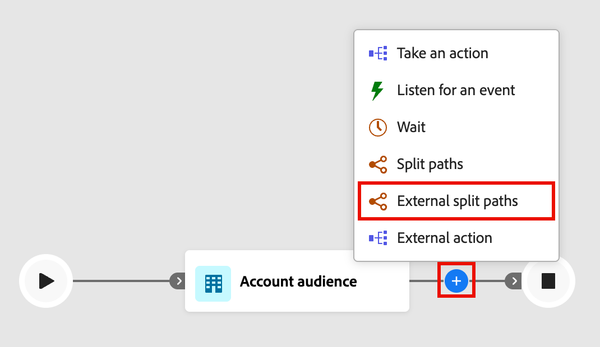

# Nœuds externes

Utilisez des nœuds externes pour connecter votre parcours de compte à un service externe. Lorsqu’une audience de compte atteint l’un de ces nœuds, Journey Optimizer B2B edition envoie de manière asynchrone les données d’attribut d’audience au service externe. Le service traite les données et répond à l’aide d’un rappel , renvoyant les informations et les métadonnées de l’audience que le parcours utilise pour continuer.

>[!NOTE]
>
>Les nœuds d’action externe sont disponibles uniquement dans les parcours de compte. Ils ne sont pas pris en charge dans les parcours en personne.
>
>Un administrateur doit [configurer et activer l’action externe](../admin/configure-external-actions.md) avant que les spécialistes marketing n’ajoutent et n’implémentent ces nœuds dans un parcours.

Il existe deux types de nœuds d’action externe :

* **[Action externe](#external-action)** - Appelle un service externe et continue le long d’un seul chemin sortant. Utilisez ce nœud lorsque vous souhaitez déclencher un processus externe sans logique de branchement, comme la mise à jour d’un enregistrement dans un système externe ou l’envoi d’un signal à un service en aval.
* **[Chemins de partage externes](#external-split-paths)** - Appelle un service externe et évalue la réponse pour acheminer les comptes le long de l’un des chemins définis. Utilisez ce nœud lorsque le service externe renvoie une valeur, telle qu’une note, un niveau ou une classification, qui détermine l’étape suivante du parcours.

## Nœud d&#39;action externe {#external-action}

Le nœud _Action externe_ appelle un service externe et continue le long d’un seul chemin sortant, quel que soit le contenu de la réponse. Utilisez-le pour les intégrations pour lesquelles aucun embranchement n’est nécessaire après l’appel externe.

1. Accédez au mappage du parcours de compte.

1. Cliquez sur l’icône plus ( **+** ) sur un chemin d’accès et choisissez **[!UICONTROL Action externe]**.

   {width="400"}

1. Dans les propriétés de nœud à droite, définissez le contexte **[!UICONTROL Action sur]** de l’action externe :

   * Choisissez **[!UICONTROL Comptes]** lorsque vous souhaitez appliquer l’action externe à toutes les personnes qui font partie des comptes sur le chemin du nœud.
   * Choisissez **[!UICONTROL Personnes]** lorsque vous souhaitez appliquer une modification à toutes les personnes sur le chemin du nœud.

1. Sélectionnez le **[!UICONTROL nom du service]** externe.

   {width="600" zoomable="yes"}

   La liste comprend toutes les actions externes configurées qui sont actives et désignées pour le type _Action externe_ et le contexte.

1. Si le service possède des attributs globaux, saisissez les valeurs requises dans les champs affichés sous le nom du service.

1. Continuez à créer le parcours à partir des chemins sortants du nœud.

   Le chemin _[!UICONTROL Temporisation ou erreur]_ est automatiquement créé. Si le délai d’expiration (tel que configuré dans le service) expire avant la réception d’une réponse, le compte ou la personne emprunte ce chemin. Il en va de même si une réponse d’erreur est reçue. Vous pouvez ajouter des nœuds de parcours à ce chemin d’accès pour gérer ces scénarios, ou les extrémités de parcours pour le membre de l’audience.

## Nœud de chemins de partage externes {#external-split-paths}

Le nœud Chemins de division externes appelle un service externe et utilise la réponse pour déterminer le chemin d’accès que les comptes doivent emprunter ensuite. Chaque chemin est défini par une condition basée sur une variable (accesseur) renvoyée par le service externe. Le parcours évalue la réponse par rapport aux conditions de chemin définies et achemine chaque compte le long du premier chemin correspondant. Les conditions de chemin sont évaluées dans l’ordre décroissant. Chaque compte suit le premier chemin dont la condition correspond à la valeur renvoyée par le service externe.

1. Accédez au mappage du parcours de compte.

1. Cliquez sur l’icône plus ( **+** ) sur un chemin d’accès et choisissez **[!UICONTROL Chemins de partage externes]**.

   {width="400"}

1. Dans les propriétés de nœud sur la droite, choisissez un type **[!UICONTROL Fractionner les chemins par]** :

   * **[!UICONTROL Comptes]** - Pour les chemins de division par comptes, vous pouvez ajouter des nœuds de compte et de personne dans les chemins définis.
   * **[!UICONTROL Personnes]** - Pour les chemins partagés par personnes, vous ne pouvez ajouter que des nœuds d’action de personnes dans les chemins définis. Une division basée sur les personnes est automatiquement fermée avec un nœud _[!UICONTROL Fusionner les chemins]_ afin que toutes les personnes puissent passer à l’étape suivante sans perdre le contexte de leur compte.

1. Sélectionnez le **[!UICONTROL Nom du service]**.

1. Si la configuration de service comporte des _attributs globaux_, saisissez les valeurs requises dans les champs qui s’affichent sous le nom du service.

1. Pour _[!UICONTROL Chemin 1]_, définissez la condition d’embranchement :

   * Pour **[!UICONTROL Libellé]**, remplacez la valeur par défaut par un libellé plus explicite.
   * Pour **[!UICONTROL Sélectionner la variable]**, choisissez un accesseur. Les accesseurs sont des valeurs renvoyées par le service externe et sont définis lors de la configuration de l’action.
   * Pour **[!UICONTROL Sélectionner l’opérateur]**, choisissez l’opérateur .
   * Pour **[!UICONTROL Saisir des valeurs]**, saisissez la valeur à comparer.

   {width="600" zoomable="yes"}

   >[!NOTE]
   >
   >Les variables de condition disponibles et le contexte de parcours pris en charge (_Compte_, _Personnes_ ou _Personnes dans le compte_) sont déterminés par la configuration de l’action externe. Contactez votre administrateur si le service ou les variables attendus ne sont pas disponibles.

1. Pour ajouter d’autres chemins d’accès, cliquez sur **[!UICONTROL Ajouter un chemin d’accès]** et définissez une condition pour chacun d’eux dont vous avez besoin.

1. Continuez à créer le parcours à partir de chaque chemin sortant du nœud.

   Le chemin _[!UICONTROL Temporisation ou erreur]_ est automatiquement créé. Si le délai d’expiration (tel que configuré dans le service) expire avant la réception d’une réponse, le compte ou la personne emprunte ce chemin. Il en va de même si une réponse d’erreur est reçue. Vous pouvez ajouter des nœuds de parcours à ce chemin d’accès pour gérer ces scénarios, ou les extrémités de parcours pour le membre de l’audience.

1. Pour _Fractionner par comptes_, vous pouvez ajouter un nœud [Fusionner les chemins](./split-merge-paths-nodes.md#merge-paths) afin de combiner deux chemins ou plus si nécessaire.
