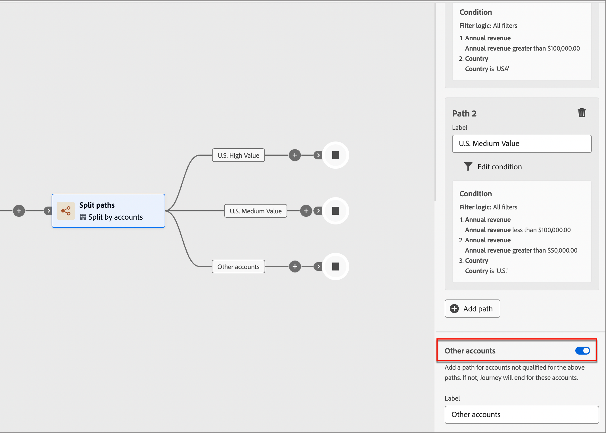

# Noeuds de Parcours de compte

Après avoir [créé un parcours de compte](journey-overview.md#create-an-account-journey) et [ajouté l’audience](journey-overview.md#add-the-account-audience-for-your-journey), construisez le parcours à l’aide de noeuds.

## Types de noeuds

| Type de noeud | Fonction |
| --------- | ------- |
| [Audience du compte](journey-overview.md#add-the-account-audience-for-your-journey) | Audience du compte d’entrée pour le parcours. Ce noeud est toujours le premier et est automatiquement créé par défaut. |
| [Action sur les personnes](#add-a-people-action) | Envoyer un e-mail |
| | Modifier évaluation |
| | Affecter une personne à un groupe d’achat |
| | Supprimer une personne du groupe d’achat |
| | Ajouter à la campagne Marketo |
| | Créer un moment intéressant pour les pistes |
| [Action sur les comptes](#add-an-account-action) | Modifier la valeur des données |
| | Supprimer le compte du Parcours (actuel) |
| | Ajouter un compte à (autre) Parcours |
| | Créer un moment intéressant pour le compte |
| | Ajouter à la liste des comptes Marketo (implicite) |
| [Événements pour les personnes](#add-a-people-event) | Modifications valeur des données |
| | Modification de l&#39;évaluation |
| | Ouvre l&#39;e-mail |
| | Clique sur un lien dans un e-mail |
| | Clique sur le lien de la page Web |
| | Affecté à un groupe d’achat |
| | Supprimé du groupe d’achat |
| [Événements pour les comptes](#add-an-account-event) | Modification de la valeur des données du compte |
| | Un moment intéressant |
| [Partage par personnes](#add-a-split-path-by-people-node) | Attributs de lead |
| | Valeur de données modifiée (par exemple, filtre sur l’historique des activités) |
| | E-mail ouvert |
| | Lien cliqué dans l&#39;e-mail |
| | Lien ayant fait l’objet d’un clic sur page web |
| | A eu un moment intéressant |
| | Membre du groupe d’achat |
| [Partage par comptes](#add-a-split-path-by-account-node) | Modification de la valeur des données du compte (par exemple, filtrage par historique des activités) |
| [Wait](#wait) | Disponible au niveau du compte |
| [Merge paths](#merge-paths) | |

## Agir

Exécutez une action telle que l’envoi d’un email, la modification d’un score, etc.

**Action sur les comptes** : l’action est appliquée à toutes les personnes qui font partie de comptes sur ce chemin.

**Action sur les personnes** : l’action est appliquée à toutes les personnes sur ce chemin. Une action sur les personnes peut être utilisée dans le chemin partagé par les personnes ou le chemin partagé par les comptes.

### Ajouter une action de compte

1. Accédez à l’éditeur de parcours.

1. Cliquez sur l’icône plus ( **+** ) sur un chemin et sélectionnez **[!UICONTROL Agir sur une action]**.

   {width="400"}

1. Dans les propriétés du noeud à droite, sélectionnez **[!UICONTROL Comptes]** pour l’action.

1. Sélectionnez une action dans la liste et définissez les valeurs de l’action.

   {width="700" zoomable="yes"}

### Ajout d’une action Personnes

1. Accédez à l’éditeur de parcours.

1. Cliquez sur l’icône plus ( **+** ) sur un chemin et sélectionnez **[!UICONTROL Agir sur une action]**.

1. Dans les propriétés du noeud à droite, sélectionnez **[!UICONTROL People]** pour l’action.

1. Sélectionnez une action dans la liste et définissez les valeurs de l’action.

{width="700" zoomable="yes"}

## Écoute d’un événement

Déplacez votre audience vers l’étape suivante du parcours lorsqu’un événement se produit.

* Vous pouvez également définir la durée pendant laquelle le parcours attend cet événement. Le parcours se termine après un délai d’expiration.
* En outre, vous pouvez choisir d’ajouter d’autres noeuds sur votre chemin d’accès au délai d’expiration.

**Écouter les événements sur les comptes** : si au moins une personne d’un compte déclenche un événement, le compte passe à l’étape suivante du parcours.

**Écouter les événements sur les personnes** : les événements sur les personnes ne peuvent être appliqués que sur un chemin d’accès au compte ; il n’est pas disponible pour un noeud partagé par les personnes.

### Ajout d’un événement de compte

1. Accédez à l’éditeur de parcours.

1. Cliquez sur l’icône plus ( **+** ) sur un chemin d’accès et sélectionnez **[!UICONTROL Listen for an event]**.

1. Dans les propriétés du noeud à droite, sélectionnez **[!UICONTROL Comptes]** pour le type d’événement.

   {width="700" zoomable="yes"}

1. Sélectionnez un événement dans la liste.

1. Cliquez sur **[!UICONTROL Modifier l’événement]** et définissez les détails de l’événement.

### Ajout d’un événement Personnes

1. Accédez à l’éditeur de parcours.

1. Cliquez sur l’icône plus ( **+** ) sur un chemin d’accès et sélectionnez **[!UICONTROL Listen for an event]**.

1. Dans les propriétés du noeud à droite, choisissez **[!UICONTROL People]** pour le type d’événement.

   {width="700" zoomable="yes"}

1. Sélectionnez un événement dans la liste.

1. Cliquez sur **[!UICONTROL Modifier l’événement]** et définissez les détails de l’événement.

### Ajout d’un délai d’expiration à un noeud d’événement

Si nécessaire, définissez la durée pendant laquelle le parcours attend l’événement. Le parcours se termine après expiration.

1. Activez le bouton d’activation/désactivation du délai d’expiration.

1. Sélectionnez la durée pendant laquelle le parcours attend qu’un événement se produise avant de expirer.

   Vous pouvez choisir de terminer le chemin ici ou d’effectuer une autre action en définissant un autre chemin.

1. Pour créer un chemin d’accès dans le parcours où vous pouvez ajouter des actions et des événements applicables aux comptes lorsque l’événement ne se produit pas, cochez la case **[!UICONTROL Définir le chemin d’accès au délai d’expiration]** .

   {width="700" zoomable="yes"}

## Fractionner les chemins

Divisez votre audience en fonction des conditions de filtrage.

**Partage des chemins par comptes** : les chemins fractionnés par comptes peuvent inclure à la fois des actions et des événements de compte et de personne, et ces chemins peuvent être fractionnés plus loin.

_Comment fonctionne un chemin de partage par noeud de comptes ?_

* Lorsque vous ajoutez un noeud de chemin d’accès partagé et choisissez _Compte_, chaque chemin d’accès ajouté inclut un noeud de fin avec la possibilité d’ajouter des noeuds à chaque périphérie.
* Il est possible de fractionner le chemin en plusieurs fois par Comptes, par exemple de manière imbriquée. Un chemin partagé comprend une option permettant de ne pas ajouter le chemin par défaut.
* Les comptes/personnes qui ne remplissent pas les critères de l’un des chemins de division ne sont pas transférés dans le parcours.
* Ces chemins d’accès peuvent être combinés à l’aide d’un noeud de fusion.

{width="700" zoomable="yes"}

**Partage des chemins par personnes** : chemins divisés par des personnes et ne peuvent inclure que des actions de personnes. Ces chemins ne peuvent plus être fractionnés. Les chemins reviennent automatiquement.

_Comment fonctionne un chemin de division par noeud de personnes ?_

* Les chemins d’accès fractionnés par les noeuds de personnes sont des noeuds regroupés. Ils fusionnent automatiquement afin que toutes les personnes de l’audience puissent passer à l’étape suivante sans perdre le contexte des comptes auxquels elles appartiennent.
* Le chemin de division des personnes ne peut pas être imbriqué : vous ne pouvez pas ajouter de chemin de division pour les personnes qui se trouvent dans ce noeud groupé.
* Le chemin de division comprend une option permettant de ne pas ajouter de chemin par défaut. Les comptes/personnes qui ne remplissent pas les critères ne sont pas redirigés dans le Parcours.

{width="700" zoomable="yes"}

>[!NOTE]
>
>25 chemins au maximum sont pris en charge.

### Ajout d’un chemin de division par noeud de compte

1. Accédez à l’éditeur de parcours.

1. Cliquez sur l’icône plus ( **+** ) sur un chemin et sélectionnez **[!UICONTROL Fractionner les chemins]**.

   {width="300"}

1. Dans les propriétés du noeud à droite, sélectionnez **[!UICONTROL Comptes]** pour le partage.

1. Pour définir une condition applicable à _[!UICONTROL Path 1]_, cliquez sur **[!UICONTROL Apply condition]**.

   {width="500"}

1. Dans l’éditeur de conditions, ajoutez un ou plusieurs filtres pour définir le chemin de division.

   * Faites glisser et déposez les attributs de filtre depuis le volet de navigation de gauche et complétez la définition de correspondance.

   * Réglez vos conditions en appliquant la **[!UICONTROL logique de filtre]** en haut. Vous choisissez de correspondre à toutes les conditions d’attribut ou à n’importe quelle condition.

     {width="700" zoomable="yes"}

   * Cliquez sur **[!UICONTROL Terminé]**.

1. Pour ajouter d’autres chemins, cliquez sur **[!UICONTROL Ajouter un chemin]** et répétez les étapes précédentes pour ajouter des conditions applicables à ce chemin.

   Vous pouvez également libeller chaque chemin en fonction de ces conditions ou utiliser les libellés par défaut.

1. (Facultatif) Ajoutez un chemin par défaut pour les comptes non qualifiés pour les autres chemins. Dans le cas contraire, le parcours se termine pour ces comptes.

   {width="700" zoomable="yes"}

### Ajouter un chemin de partage par noeud people

1. Accédez à l’éditeur de parcours.

1. Cliquez sur l’icône plus ( **+** ) sur un chemin et sélectionnez **[!UICONTROL Fractionner les chemins]**.

   {width="300"}

1. Dans les propriétés du noeud à droite, sélectionnez **[!UICONTROL Personnes]** pour la division.

1. Pour définir une condition applicable à _[!UICONTROL Path 1]_, cliquez sur **[!UICONTROL Apply condition]**.

1. Dans l’éditeur de conditions, ajoutez un ou plusieurs filtres pour définir le chemin de division.

   * Faites glisser et déposez les attributs de filtre depuis le volet de navigation de gauche et complétez la définition de correspondance.

   * Réglez vos conditions en appliquant la **[!UICONTROL logique de filtre]** en haut. Vous choisissez de correspondre à toutes les conditions d’attribut ou à n’importe quelle condition.

   * Cliquez sur **[!UICONTROL Terminé]**.

1. Pour ajouter d’autres chemins, cliquez sur **[!UICONTROL Ajouter un chemin]** et répétez les étapes précédentes pour ajouter des conditions applicables à ce chemin.

   Vous pouvez également libeller chaque chemin en fonction de ces conditions ou utiliser les libellés par défaut.

1. Enfin, vous pouvez ajouter un chemin par défaut pour les personnes non qualifiées pour les chemins ci-dessus. Si ce n&#39;est pas le cas, le parcours se termine pour ces gens.

Lorsque des conditions sont définies pour chaque chemin que vous divisez votre audience au niveau des personnes, vous pouvez ajouter des actions que vous souhaitez entreprendre sur les personnes.

>[!NOTE]
>
>Lorsque vous divisez l’audience par des personnes, vous ne pouvez ajouter que des actions de personnes.

## Attente

Patientez pendant une certaine durée avant de passer à l’étape suivante.

1. Accédez à l’éditeur de parcours.

1. Cliquez sur l’icône plus ( **+** ) sur un chemin et choisissez **[!UICONTROL Attente]**.

1. Dans les propriétés du noeud à droite, définissez la **[!UICONTROL durée]** d’attente avant que le parcours ne passe au noeud suivant du chemin d’accès.

{width="700" zoomable="yes"}

## Fusion des chemins

Différents chemins d’accès de votre parcours peuvent être fusionnés et non fusionnés à l’aide de ce noeud.

1. Accédez à l’éditeur de parcours.

1. Cliquez sur l’icône plus ( **+** ) sur un chemin et sélectionnez **[!UICONTROL Fractionner les chemins]**.

1. Cliquez sur le noeud partagé pour ouvrir ses propriétés à droite.

1. Cliquez sur [!UICONTROL Ajouter un chemin] pour créer trois chemins.

1. Ajoutez une combinaison d’actions et d’événements à chaque chemin.

1. Cliquez sur l’icône plus ( **+** ) pour l’un de ces chemins et sélectionnez **[!UICONTROL Fusionner]** parmi les options affichées.

   {width="400"}

1. Dans les propriétés du noeud de fusion, sélectionnez les chemins à fusionner.

   {width="600" zoomable="yes"}

   Vous devriez maintenant constater que les chemins sont fusionnés afin que les comptes des chemins sélectionnés se combinent en un seul chemin et puissent continuer à progresser dans le parcours.

1. Si nécessaire, vous pouvez annuler la fusion des chemins en revenant aux propriétés du noeud de fusion et en désélectionnant la case correspondant aux chemins que vous souhaitez supprimer.

