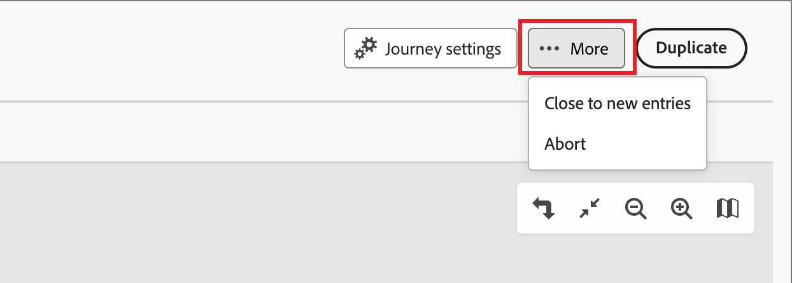

# Parcours de compte

Grâce aux parcours de compte, vous pouvez rationaliser la génération de la demande et la qualification des groupes d’achat afin de stimuler une demande plus qualifiée pour vos programmes d’acquisition, de vente croisée/montée en gamme et de rétention. Paramétrez des parcours personnalisés pour chaque groupe d’achat et membre du groupe d’achat à l’aide d’un engagement automatisé par e-mail, SMS, événement, etc.

Définissez un engagement axé sur les ventes qui inclut des e-mails, des SMS et d’autres parcours de compte internes pour coordonner le marketing entrant avec les activités de vente sortantes pour chaque membre du groupe d’achat.

{width="30"} [Regarder la vidéo de présentation](#overview-video)

## Commencer avec un parcours

Pour commencer avec les parcours de compte :

1. [Créez un parcours](./create-publish-journey.md#create-an-account-journey).
1. [Ajoutez les nœuds](./create-publish-journey.md#add-a-node) et [définissez le flux de parcours](./create-publish-journey.md#add-and-delete-a-path) dans la cartographie du parcours.
1. [Publiez le parcours](./create-publish-journey.md#publish-an-account-journey).

## Accéder aux parcours de compte et les parcourir

Dans le volet de navigation de gauche, cliquez sur **[!UICONTROL Parcours de compte]**.

{width="800" zoomable="yes"}

La page des parcours affichée comprend les colonnes suivantes :

* [!UICONTROL Nom] (cliquer sur le nom pour ouvrir le parcours et le modifier)
* [!UICONTROL Statut]
* [!UICONTROL Description]
* [!UICONTROL Créé par]
* [!UICONTROL Dernière mise à jour à]
* [!UICONTROL Dernière mise à jour par]
* [!UICONTROL Publié sur]
* [!UICONTROL Publié par]

Utilisez l’outil _Recherche_ dans la partie supérieure pour localiser le parcours par nom. Vous pouvez trier la liste par _[!UICONTROL Statut]_ en cliquant sur l’en-tête de colonne.

Vous pouvez personnaliser les colonnes affichées dans le tableau en cliquant sur l’icône _Personnaliser le tableau_ () dans le coin supérieur droit. Cochez ou décochez les cases de la boîte de dialogue, puis cliquez sur **[!UICONTROL Appliquer]**.

{width="800" zoomable="yes"}

## Anatomie d’un parcours de compte

Cliquez sur le nom (affiché sous forme de lien) dans la liste _[!UICONTROL Parcours de compte]_ pour passer en revue les détails, apporter des modifications et effectuer des actions.

{width="800" zoomable="yes"}

L’en-tête de la cartographie du parcours du compte comprend les éléments suivants :

* Nom du parcours
* Accès à la modification du nom du parcours (icône _Modifier_ )
* Statut du parcours

Le statut d’un parcours peut changer en fonction des actions que vous appliquez. En fonction du statut d’un parcours, certaines actions peuvent être disponibles ou non dans l’en-tête.

| Statut | Description | Actions disponibles |
| ------ | ----------- | ----------------- |
| _**Brouillon**_ | Parcours dépublié modifiable. | <ul><li>[Publier](./create-publish-journey.md#publish-an-account-journey)</li><li>Dupliquer </li><li>Supprimer </li></ul> |
| _**Actif**_ | Le statut du parcours passe de Brouillon à Actif lorsqu’un parcours est publié. Dans ce statut, il n’est plus modifiable. | <ul><li>Dupliquer </li><li>Fermer aux nouvelles entrées </li><li>Abandonner </li></ul> |
| _**Fermé aux nouvelles entrées**_ | Le statut du parcours passe de _Actif_ à _Fermé aux nouvelles entrées_ lorsque vous cliquez sur [!UICONTROL Fermer aux nouvelles entrées] dans le volet de navigation supérieur. | <ul><li>Dupliquer </li><li>Abandonner </li></ul> |
| _**Abandonné**_ | Le statut du parcours passe de _Actif_ ou _Fermé aux nouvelles entrées_ lorsque vous abandonnez un parcours. Vous ne pouvez pas redémarrer un parcours abandonné. | <ul><li>Dupliquer </li><li>Supprimer </li></ul> |
| _**Terminé**_ | Lorsque tous les comptes d’un parcours ont terminé le parcours, le statut passe de Actif ou Fermé aux nouvelles entrées à Terminé. | <ul><li>Dupliquer </li><li>Supprimer </li></ul> |

## Gérer les parcours

La liste _Parcours de compte_ comprend tous les parcours de votre instance Journey Optimizer B2B Edition.

### Abandonner le parcours

Si vous abandonnez (arrêtez) un parcours actif ou planifié, les comptes du parcours arrêtent immédiatement leur progression et aucune nouvelle entrée dans le parcours ne peut se produire. Vous ne pouvez pas redémarrer un parcours abandonné.

>[!IMPORTANT]
>
>Lorsque le parcours de compte est utilisé dans un autre parcours à partir d’un nœud _Entreprendre une action_ avec l’action _Ajouter un compte à un (autre) parcours_, l’abandon du parcours bloque cette action à partir de ce parcours.

1. Cliquez sur le nom du parcours pour l’ouvrir.

1. Cliquez sur le menu **[!UICONTROL Plus...]** en haut à droite et choisissez **[!UICONTROL Abandonner]**.

   {width="450"}

1. Dans la boîte de dialogue de confirmation, cliquez sur **[!UICONTROL Abandonner]**.

### Fermer aux nouvelles entrées

Si vous fermez un parcours actif, les comptes actuellement dans le parcours continuent leur chemin et aucune autre entrée dans le parcours ne peut se produire. Vous ne pouvez pas redémarrer un parcours fermé. Vous pouvez dupliquer un parcours fermé.

>[!IMPORTANT]
>
>Lorsque le parcours de compte est utilisé dans un autre parcours à partir d’un nœud _Entreprendre une action_ avec l’action _Ajouter un compte à un (autre) parcours_, la fermeture du parcours bloque cette action à partir de ce parcours.

1. Cliquez sur le nom du parcours pour l’ouvrir.

1. Cliquez sur le menu **[!UICONTROL Plus...]** en haut à droite et choisissez **[!UICONTROL Fermer aux nouvelles entrées]**.

1. Dans la boîte de dialogue de confirmation, cliquez sur **[!UICONTROL Fermer aux nouvelles entrées]**.

### Dupliquer le parcours

Une action de duplication est similaire à une fonction de clonage, mais le parcours dupliqué n’inclut aucune ressource de contenu de parcours créée. Vous pouvez dupliquer les détails du parcours de compte ou simplement un _squelette_ de la structure des flux et des chemins d’accès.

1. Cliquez sur l’icône _Plus_ (**...**) en regard du nom du parcours et choisissez **[!UICONTROL Dupliquer]**.

   {width="450"}

   Selon le statut du parcours de compte, vous pouvez également accéder à l’action de duplication à partir des détails du parcours ou de la cartographie du parcours :

   * Pour un brouillon de parcours, cliquez sur le menu **[!UICONTROL Plus...]** en haut à droite et choisissez **[!UICONTROL Dupliquer]**.

   * Pour tous les autres statuts de parcours, cliquez sur **[!UICONTROL Dupliquer]** en haut à droite.

     {width="450"}

1. Dans la boîte de dialogue _Dupliquer le parcours_, définissez les **[!UICONTROL Nom]** et **[!UICONTROL Description]** du nouveau parcours.

   Par défaut, la boîte de dialogue utilise le nom du parcours dupliqué suivi de __copy_. Saisissez un autre nom unique pour le parcours, le cas échéant.

   {width="400"}

1. Choisissez le **[!UICONTROL type]** de duplication :

   * **[!UICONTROL Duplication partielle du contenu]** : utilisez ce type pour copier tout le contenu du parcours, à l’exclusion des e-mails ou des SMS créés. Les nœuds qui font référence à un e-mail ou un SMS Marketo Engage sont entièrement intacts.

   * **[!UICONTROL Dupliquer sans détails]** : utilisez ce type pour copier uniquement la structure de nœuds et les chemins d’accès. Les paramètres de nœud et conditions de chemin ne sont pas définis (par défaut). Vous pouvez donc réutiliser le flux de base avec différents paramètres d’audience, d’actions et de segmentation de chemin. Tous les nœuds d’_attente_ utilisent la valeur par défaut de cinq jours.

1. Cliquez sur **[!UICONTROL Dupliquer]**.

   Le parcours de compte dupliqué s’ouvre dans la cartographie du parcours, où vous pouvez définir les détails et créer du contenu selon vos besoins.

### Supprimer le parcours

Utilisez une action de suppression pour supprimer définitivement un parcours. Vous ne pouvez pas supprimer un parcours actif ou planifié.

1. Cliquez sur l’icône _Plus_ (**...**) en regard du nom du parcours et choisissez **[!UICONTROL Supprimer]**.

   Selon le statut du parcours de compte, vous pouvez également accéder à l’action de suppression à partir des détails du parcours ou de la cartographie du parcours :

   * Pour un brouillon de parcours, cliquez sur le menu **[!UICONTROL Plus...]** en haut à droite et choisissez **[!UICONTROL Supprimer]**.

   * Pour d’autres statuts de parcours, tels que _Terminé_ ou _Abandonné_, cliquez sur **[!UICONTROL Supprimer]** en haut à droite.

1. Dans la boîte de dialogue de confirmation, cliquez sur **[!UICONTROL Supprimer]**.

## Vidéo de vue d’ensemble

>[!VIDEO](https://video.tv.adobe.com/v/3443209/?learn=on&captions=fre_fr)
