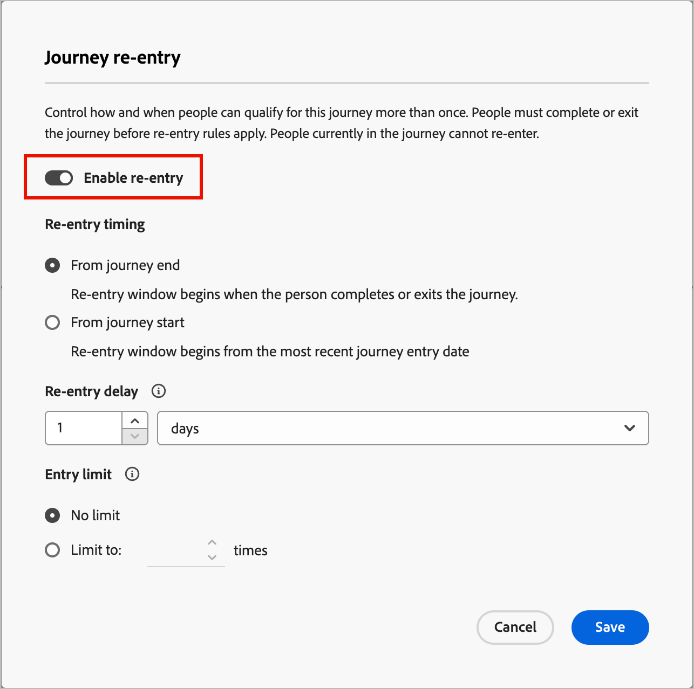

# rentrée de parcours

Lorsque vous activez la reprise d’un parcours, vous pouvez contrôler quand et à quelle fréquence un compte ou une personne peut rejoindre à nouveau le même parcours. Utilisez les paramètres de rentrée pour définir des critères, des limites et des temps d’attente afin que les comptes ou les personnes se qualifient à nouveau pour le parcours de manière contrôlée.

Un compte ou une personne peut se requalifier pour un parcours lorsque les éléments suivants sont vrais :

* Le compte ou la personne est dans le nombre de nouvelles inscriptions autorisées pour le parcours.
* Le compte ou la personne a atteint le seuil de temps d’attente (temps d’attente minimum avant de pouvoir se requalifier).
* Le compte ou la personne ne figure pas actuellement dans le parcours.

## Activer la rentrée pour un parcours

Vous pouvez activer la rentrée et modifier les paramètres de rentrée lorsque le parcours a le statut _Brouillon_.

>[!BEGINTABS]

>[!TAB parcours de compte] 

1. Ouvrez le brouillon de parcours de compte.

1. Cliquez sur le menu **[!UICONTROL Plus...]** en haut à droite et choisissez **[!UICONTROL Rentrée]**.

   {width="450"}

1. Dans la boîte de dialogue _[!UICONTROL Rentrée de Parcours]_, activez l’option **[!UICONTROL Activer la reprise]**.

   Lorsque la fonction est activée, les options de minutage, de délai et de limites s’affichent.

   Boîte de dialogue de rentrée de Parcours {width="450"}

1. Pour **[!UICONTROL Délai de rentrée]**, choisissez le mode de calcul de l’attente :

   * **[!UICONTROL Attente de la fin du parcours]** - La période d’attente commence lorsque le compte se ferme ou termine le parcours. Par exemple, « 30 jours après que le compte a terminé le parcours, il peut saisir à nouveau ».

   * **[!UICONTROL Attente depuis le début du parcours]** - La période d’attente est basée sur la date à laquelle le compte a rejoint le parcours pour la première fois. Par exemple, « 30 jours à partir du moment où le compte a démarré le parcours, il peut saisir à nouveau ».

1. Définissez le **[!UICONTROL délai de reprise]**, qui correspond à la durée d’attente en heures ou en jours.

   Ce paramètre détermine la durée pendant laquelle un compte doit attendre après avoir quitté ou démarré le parcours avant de pouvoir entrer à nouveau.

1. Pour définir le nombre maximal de fois où un compte peut entrer dans le parcours, définissez la **[!UICONTROL limite d’entrée]**.

   Lorsqu’un compte atteint la limite, il n’est plus éligible tant que la limite n’a pas été réinitialisée ou que le parcours n’a pas été republié avec une nouvelle limite.

   Cette limite s’applique par compte pour ce parcours.

1. Cliquez sur **[!UICONTROL Enregistrer]**

>[!TAB parcours Personne] 

1. Ouvrez le brouillon de parcours de personne.

1. Cliquez sur le menu **[!UICONTROL Plus...]** en haut à droite et choisissez **[!UICONTROL Paramètres de rentrée]**.

   {width="450"}

1. Dans la boîte de dialogue _[!UICONTROL Rentrée de Parcours]_, activez l’option **[!UICONTROL Activer la reprise]**.

   Lorsque la fonction est activée, les options de minutage, de délai et de limites s’affichent.

   {width="450"}

1. Pour **[!UICONTROL Délai de rentrée]**, choisissez le mode de calcul de l’attente :

   * **[!UICONTROL Attente de la fin du parcours]** - La période d’attente commence lorsque la personne quitte ou termine le parcours. Par exemple, « 30 jours après que la personne a terminé le parcours, elle peut entrer à nouveau ».

   * **[!UICONTROL Attente depuis le début du parcours]** - La période d’attente est basée sur la date à laquelle la personne a rejoint le parcours pour la première fois. Par exemple, « 30 jours à partir du moment où la personne a commencé le parcours, elle peut entrer à nouveau ».

1. Définissez le **[!UICONTROL délai de reprise]**, qui correspond à la durée d’attente en heures ou en jours.

   Ce paramètre détermine la durée pendant laquelle une personne doit attendre après avoir quitté ou démarré le parcours avant de pouvoir y revenir.

1. Pour définir le nombre maximal de fois qu’une personne est autorisée à entrer dans le parcours, définissez la **[!UICONTROL limite d’entrée]**.

   Lorsqu’une personne atteint le plafond, elle ne peut plus participer tant que le plafond n’a pas été réinitialisé ou que le parcours n’a pas été republié avec un nouveau plafond.

   Cette limite s’applique par personne pour ce parcours.

1. Cliquez sur **[!UICONTROL Enregistrer]**

>[!ENDTABS]

## Progression et activité

Pour un parcours de compte ou de personne publié, la zone de travail de parcours affiche [progression](./journeys-overview.md#review-account-progression) pour les nœuds de parcours. Chaque nœud affiche le nombre de comptes ou de personnes à atteindre et, pour les parcours en direct, le nombre actuel sur ce nœud. Chaque fois qu’un compte ou une personne entre à nouveau dans un parcours, il est comptabilisé comme une entrée distincte.

<!-- 
You can see how many times accounts have entered the journey. ?? 

When you drill in to [account details](../accounts/account-details.md), the account activity shows each time the account entered the journey. It includes explicit activity and a recurrence count so that you can see re-entries clearly.
-->
