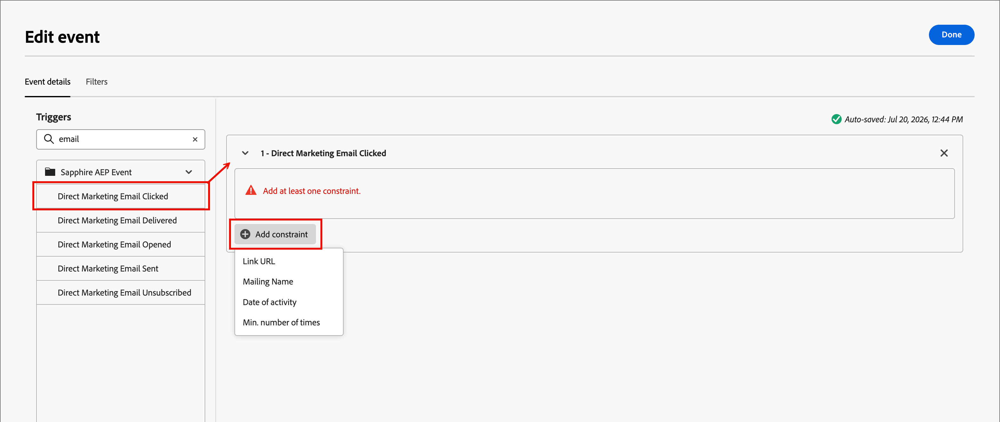

# Écouter un évènement

Pour déplacer l’audience vers l’étape suivante de votre parcours [&#128279;](./journeys-overview.md) lorsqu’un événement se produit, ajoutez le nœud _Écouter pour un événement_. Selon le type de parcours, vous pouvez utiliser ce nœud pour déclencher le nœud suivant dans le parcours en fonction des personnes ou des événements de compte.

<!--
{width="30", vertical-align="middle"} [Watch the overview video](#overview-video)
-->

## Parcours de compte {#account-journeys}

>[!NOTE]
>
>Pour un parcours de compte, vous ne pouvez pas ajouter le type de nœud _[!UICONTROL Écouter un événement]_ sur un chemin de partage par personnes.

1. Ouvrez le canevas du parcours de compte.

1. Cliquez sur l’icône plus ( **+** ) d’un chemin et choisissez **[!UICONTROL Écouter un événement]**.

   {width="400"}

1. Dans les propriétés de nœud sur la droite, utilisez le sélecteur _Type d’événement_ pour choisir entre **[!UICONTROL Comptes]** et **[!UICONTROL Personnes]**.

1. Sélectionnez un événement dans la liste.

   * Pour le type d’événement _Personnes_, choisissez le [événement personnes](#people-events) que vous souhaitez utiliser pour le déclencheur.

     {width="500" zoomable="yes"}

   * Pour le type d’événement _Comptes_, sélectionnez l’événement [compte](#account-events) que vous souhaitez utiliser pour le déclencheur.

     {width="500" zoomable="yes"}

1. Cliquez sur **[!UICONTROL Modifier l’événement]** et définissez les détails de l’événement.

   Selon le type d’événement et l’événement sélectionnés, définissez les critères de correspondance d’événement.

   * [Événements Personnes](#people-events)
   * [Événements de compte](#account-events)

   Vous pouvez également inclure des [filtres](#filters-people-event) pour l’événement.

1. Cliquez sur **[!UICONTROL Terminé]**.

   Les définitions d’événement et de filtre s’affichent dans le nœud et dans les propriétés du nœud.

   {width="500"}

### Événements Personnes pour les parcours de compte {#people-events}

Dans un parcours de compte, vous pouvez écouter un événement basé sur des personnes lorsque vous souhaitez déplacer le compte vers l’avant dans le parcours en fonction des événements déclenchés par l’activité des personnes. Vous pouvez également filtrer les événements en fonction de l’historique des événements et des attributs des personnes.

>[!TIP]
>
>Les événements d’expérience peuvent se produire _avant_ que les personnes n’entrent dans le parcours (par exemple, un clic sur un e-mail précédent ou une interaction web). Pour acheminer des personnes en fonction de ces événements, utilisez le filtre [!UICONTROL Historique des événements] dans un nœud [Fractionner les chemins par les personnes](./split-merge-paths-nodes.md#experience-event-history-filtering).

#### Événements B2B Journey Optimizer {#events-account-people}

| Événement | Contraintes |
| ----- | ----------- |
| [!UICONTROL Affecté au groupe d&#39;achat] | Intérêt de la solution (obligatoire)  contraintes supplémentaires (facultatif) : <li>Rôle</li><li>Date d’activité</li> Délai d’expiration (facultatif) |
| [!UICONTROL Modifications du profil de la personne] | Attribut (obligatoire) Date de l’activité (facultatif) Nouvelle valeur (facultatif) Valeur précédente (facultatif) Raison (facultatif) Source (facultatif) |
| [!UICONTROL Supprimé du groupe d&#39;achat] | Intérêt de la solution (obligatoire) Date de l’activité (facultatif) Délai d’expiration (facultatif) |

1. Définissez la valeur requise pour correspondre à l’événement.

   Si nécessaire, définissez l’opérateur pour l’évaluation.

1. Pour chaque contrainte facultative que vous souhaitez inclure pour la correspondance d’événement, cliquez sur **[!UICONTROL Ajouter une contrainte]** et sélectionnez une contrainte dans la liste.

   {width="700" zoomable="yes"}

1. (Facultatif) Sélectionnez l’onglet **[!UICONTROL Filtres]** pour [ajouter des filtres pour l’événement](#filters-people-event).

1. Cliquez sur **[!UICONTROL Terminé]**.

#### Événements d’expérience {#experience-events-account-people}

>[!PREREQUISITES]
>
>Les administrateurs configurent les [événements d’expérience Adobe Experience Platform (AEP)](https://experienceleague.adobe.com/en/docs/experience-platform/xdm/classes/experienceevent){target="_blank"}, qui permettent aux spécialistes marketing de créer des parcours de compte et de personne qui réagissent aux événements en temps quasi réel.
>
>Pour rendre les événements d’expérience disponibles pour les parcours, un administrateur de produit doit d’abord [ajouter les types d’événements et les champs d’intérêt](../admin/configure-aep-events.md#add-an-event) dans [!DNL Journey Optimizer B2B Edition].

1. Cliquez sur **[!UICONTROL Ajouter une contrainte]** et sélectionnez le champ à utiliser pour la contrainte.

   Les contraintes disponibles sont définies en tant que champs gérés pour la configuration de l&#39;événement.

1. Renseignez la condition de la contrainte.

   Vous pouvez utiliser l’opérateur **[!UICONTROL is]** par défaut pour faire correspondre une ou plusieurs valeurs de champ. Vous pouvez également utiliser l’opérateur **[!UICONTROL n’est pas]** pour faire correspondre sur toutes les valeurs avec l’exclusion d’une ou de plusieurs valeurs spécifiées.

   {width="700" zoomable="yes"}

1. (Facultatif) Sélectionnez l’onglet **[!UICONTROL Filtres]** pour [ajouter des filtres pour l’événement](#filters-people-event).

1. Cliquez sur **[!UICONTROL Terminé]**.

### Événements de compte {#account-events}

Dans un parcours de compte, vous pouvez écouter un événement en fonction du compte lorsque vous souhaitez déplacer le compte vers l’avant dans le parcours en fonction des événements déclenchés par l’activité du compte.

| Événement | Contraintes |
| ----- | ----------- |
| [!UICONTROL Le compte a eu un moment intéressant] | Type (e-mail, jalon ou web) Contraintes supplémentaires (facultatif) : <li>Description</li><li>Source</li><li>Date d’activité</li>  Délai d’expiration (facultatif) |
| [!UICONTROL Modification de la valeur des données du compte] | Attribut Contraintes supplémentaires (facultatif) : <li>Nouvelle valeur</li><li>Valeur précédente</li><li>Date d’activité</li>  Délai d’expiration (facultatif) |
| [!UICONTROL Changement dans l&#39;étape du groupe d&#39;achat] | Intérêt de la solution Contraintes supplémentaires (facultatif) : <li>Nouvelle étape</li><li>Étape précédente</li><li>Date d’activité</li>Délai d’expiration du   (facultatif) |
| [!UICONTROL Changement de statut du groupe d&#39;achat] | Intérêt de la solution Contraintes supplémentaires (facultatif) : <li>Nouveau statut</li><li>Statut précédent</li><li>Date d’activité</li>Délai d’expiration du   (facultatif) |
| [!UICONTROL Modification du score d’exhaustivité] | Intérêt de la solution Contraintes supplémentaires (facultatif) : <li>Nouveau score</li><li>Score précédent</li><li>Date d’activité</li>Délai d’expiration du   (facultatif) |
| [!UICONTROL Modification du score d’engagement] | Intérêt de la solution Contraintes supplémentaires (facultatif) : <li>Nouveau score</li><li>Score précédent</li><li>Date d’activité</li>Délai d’expiration du   (facultatif) |

1. Définissez la contrainte requise pour qu’elle corresponde à l’événement.

1. Pour chaque contrainte facultative à inclure pour la correspondance d’événement, cliquez sur **[!UICONTROL Ajouter une contrainte]** et sélectionnez le champ.

   parcours de compte - Écouter un événement de compte{width="700" zoomable="yes"}

   Définissez l’opérateur et la valeur de l’évaluation.

1. Cliquez sur **[!UICONTROL Terminé]**.

<!--

Removed from AJO B2B people events 

| [!UICONTROL Clicks link in email] | Email  Additional constraints (optional): <li>Link</li><li>Link ID</li><li>Is mobile device</li><li>Device</li><li>Platform</li><li>Browser</li><li>Is predictive content</li><li>Is bot activity</li><li>Bot activity pattern</li><li>Browser</li><li>Date of activity</li><li>Min. number of times</li> Timeout (optional) |
| [!UICONTROL Clicks link in SMS] | Email  Additional constraints (optional): <li>Link</li><li>Device</li><li>Platform</li><li>Date of activity</li><li>Min. number of times</li> Timeout (optional) |
| [!UICONTROL Data value changes] | Person attribute  Additional constraints (optional): <li>New value</li><li>Previous value</li><li>Reason</li><li>Source</li><li>Date of activity</li><li>Min. number of times</li> Timeout (optional) |
| [!UICONTROL Opens email] | Email  Additional constraints (optional): <li>Link</li><li>Link ID</li><li>Is mobile device</li><li>Device</li><li>Platform</li><li>Browser</li><li>Is predictive content</li><li>Is bot activity</li><li>Bot activity pattern</li><li>Browser</li><li>Date of activity</li><li>Min. number of times</li> Timeout (optional) |
| [!UICONTROL Score is changed] | Score name  Additional constraints (optional):<li>Change</li><li>New score</li><li>Urgency</li><li>Priority</li><li>Relative score</li><li>Relative urgency</li><li>Date of activity</li><li>Min. number of times</li> Timeout (optional) |
| [!UICONTROL SMS Bounces]| SMS message  Additional constraints (optional): <li>Date of activity</li><li>Min number of times</li> Timeout (optional) |

### Listen for a Marketo Engage event {#listen-for-marketo-engage-event}

| Marketo Engage | [!UICONTROL Visits Web Page] | Web page   Select one or more Marketo Engage pages to match.   Additional constraints (optional): <li>Querystring</li><li>Client IP address</li><li>Referrer</li><li>User Agent</li><li>Search engine</li><li>Search query</li><li>Token</li><li>Browser</li><li>Platform</li><li>Device</li><li>Date of activity</li> |
| | [!UICONTROL Fills out form] | Form   Select one or more Marketo Engage forms to match.   Additional constraints (optional): <li>Date of activity</li><li>Querystring</li><li>Client IP address</li><li>Referrer</li><li>User agent</li><li>Platform</li><li>Device</li> Timeout (optional) |
| Adobe Experience Platform | [!UICONTROL Event definition] | Event type   Additional constraints (optional): <li>Fields</li>  Additional constraints (not supported): <li>Date of activity</li><li>Min. number of times</li>  Timeout (optional) |

If you have web pages in your connected Marketo Engage instance, you can trigger an event based on a visit/no visit to these web pages, as well as Marketo Engage forms that were/were not filled. 

1. Use the **[!UICONTROL Select people event]** selector and scroll the menu to the **[!UICONTROL Marketo Engage]** section.

1. Select a Marketo Engage activity type:

   * **[!UICONTROL Visits Web Page]**.
   * **[!UICONTROL Fills Out Form]**

   {width="700" zoomable="yes"}

1. Click **[!UICONTROL Edit event]** and define one or more web pages to match and any additional constraints for the event.

   * (Required) In the _[!UICONTROL Edit event]_ dialog, define the **[!UICONTROL Web page]** or **[!UICONTROL Fills out form]** constraint. Use **[!UICONTROL is]** (default) to match on one or more selected pages or forms. Use **[!UICONTROL is not]** to match on all page visits/forms with the exclusion of one or more selected pages/forms. Or, use the **[!UICONTROL is any]** operator to match on any Marketo Engage web page visit or filled form.

   * (Optional) Click **[!UICONTROL Add constraint]** and choose the field that you want to use for the constraint. Set the operator and the value for the field.

     {width="700" zoomable="yes"}

     To include additional field constraints as needed, repeat this action.

   * If needed, select the **[!UICONTROL Filters]** tab to [add filters for the event](#add-a-filter-to-the-people-event).

   * When the constraints and filters are defined, click **[!UICONTROL Done]**.

1. If needed, set the **[!UICONTROL Timeout]** option to limit the time period to listen for the event (see [Add a timeout to an event node](#add-a-timeout-to-an-event-node)). 

1. In the journey canvas, add the next node to execute when the event occurs.

-->

## Parcours de personne {#person-journeys}

1. Ouvrez la zone de travail du parcours de personne.

1. Cliquez sur l’icône plus ( **+** ) d’un chemin et choisissez **[!UICONTROL Écouter un événement]**.

   {width="350"}

1. Dans les propriétés de nœud sur la droite, cliquez sur **[!UICONTROL Ajouter des critères d’événement]**.

   {width="450"}

1. Ajoutez un événement et définissez les contraintes que vous souhaitez faire correspondre au déclencheur.

   Vous pouvez utiliser [Événements d’expérience](#experience-events-person) et [Modifications du profil de la personne](#person-profile-changes) pour définir le déclencheur d’événement.

   Faites glisser et déposez le déclencheur d’événement dans l’espace du créateur et définissez la définition. Cliquez sur **[!UICONTROL Ajouter une contrainte]** pour chaque contrainte que vous souhaitez utiliser pour affiner la correspondance d’événement.

   Vous pouvez ajouter plusieurs événements à faire correspondre. Le premier événement éligible avance le profil de la personne vers l’avant dans le parcours.

1. (Facultatif) Sélectionnez l’onglet **[!UICONTROL Filtres]** pour [ajouter des filtres pour l’événement](#filters-people-event).

1. Cliquez sur **[!UICONTROL Terminé]**.

   Les définitions d’événement et de filtre s’affichent dans le nœud et dans les propriétés du nœud.

   {width="450"}

### Événements d’expérience pour les parcours de personne {#experience-events-person}

>[!PREREQUISITES]
>
>Les administrateurs configurent les [événements d’expérience Adobe Experience Platform (AEP)](https://experienceleague.adobe.com/en/docs/experience-platform/xdm/classes/experienceevent){target="_blank"}, qui permettent aux spécialistes marketing de créer des parcours de compte et de personne qui réagissent aux événements en temps quasi réel.
>
>Pour rendre les événements d’expérience disponibles pour les parcours, un administrateur de produit doit d’abord [ajouter les types d’événements et les champs d’intérêt](../admin/configure-aep-events.md#add-an-event) dans [!DNL Journey Optimizer B2B Edition].

Vous pouvez utiliser des événements d’expérience pour déclencher les parcours du nœud en personne dans la boîte de dialogue _[!UICONTROL Modifier l’événement]_.

1. Développez **[!UICONTROL Événements Sapphire AEP]** dans la liste _[!UICONTROL Triggers]_ sur la gauche.

1. Faites glisser et déposez l’événement d’expérience dans l’espace du créateur correspondant à l’événement.

   Vous pouvez utiliser le champ _Recherche_ pour filtrer un mot-clé dans le nom de l’événement, tel que `email`.

1. Cliquez sur **[!UICONTROL Ajouter une contrainte]** et sélectionnez le champ à utiliser pour affiner la correspondance d’événement.

   Les contraintes disponibles sont définies en tant que champs gérés pour la configuration de l&#39;événement.

   {width="700" zoomable="yes"}

1. Définissez l’opérateur et les valeurs à faire correspondre pour le champ d’événement.

1. (Facultatif) Ajoutez un autre événement d’expérience ou une [modification du profil de la personne](#person-profile-changes).

   Lorsque vous ajoutez plusieurs événements à faire correspondre. Le premier événement éligible avance le profil de la personne vers l’avant dans le parcours.

1. (Facultatif) Sélectionnez l’onglet **[!UICONTROL Filtres]** pour [ajouter des filtres pour l’événement](#filters-people-event).

1. Cliquez sur **[!UICONTROL Terminé]**.

### Modifications du profil de la personne {#person-profile-changes}

Vous pouvez utiliser une modification des attributs de profil de personne B2B pour déclencher les parcours de nœud en personne dans la boîte de dialogue _[!UICONTROL Modifier l’événement]_.

1. **&#x200B; Effectuez un glisser-déposer des modifications du profil de la personne &#x200B;** [!UICONTROL &#x200B; de la liste _[!UICONTROL Triggers]_ vers l]espace du créateur correspondant à l’événement.

1. Cliquez sur **[!UICONTROL Ajouter une contrainte]** et sélectionnez la modification d’attribut à utiliser pour le déclencheur d’événement.

   Définissez la valeur du champ en fonction de la modification que vous souhaitez faire correspondre.

   parcours Personne - Écouter un événement de changement de profil de personne{width="700" zoomable="yes"}

1. (Facultatif) Ajoutez un autre attribut _Modification du profil de personne_ que vous souhaitez utiliser comme déclencheur d’événement ou [Événement d’expérience](#experience-events-person).

   Lorsque vous ajoutez plusieurs événements à faire correspondre. Le premier événement éligible avance le profil de la personne vers l’avant dans le parcours.

1. (Facultatif) Sélectionnez l’onglet **[!UICONTROL Filtres]** pour [ajouter des filtres pour l’événement](#filters-people-event).

1. Cliquez sur **[!UICONTROL Terminé]**.

## Filtres pour les événements {#filters-people-event}

Lorsque vous définissez un [événement personnes dans un parcours de compte](#people-events) ou un [événement dans un parcours de personne](#person-journeys), vous pouvez inclure un filtrage afin de limiter les déclencheurs d’événement correspondants en fonction de divers critères :

| Filtres | Description |
| ------------ | ----------- |
| [!UICONTROL &#x200B; Historique des événements &#x200B;] | Événements d’expérience configurés par un administrateur. Voir _[Sélection des événements d’expérience et des champs](../admin/configure-aep-events.md)_. |
| [!UICONTROL Attributs de personne] | Attributs du profil de personne B2B, notamment : <li>Ville <li>Pays <li>Date de naissance <li>Adresse e-mail <li>E-mail non valide <li>E-mail interrompu <li>Prénom <li>Région déduite<li>Titre du traitement <li>Nom <li>Numéro téléphone mobile <li>Score d’engagement des personnes <li>Numéro de téléphone <li>Code postal <li>État <li>Désabonné ou désabonnée <li>Raison désabonnement |
| [!UICONTROL Attributs de personne] | (parcours de personne uniquement) Valeur d’attribut |
| [!UICONTROL Filtres spéciaux] > [!UICONTROL Membre du groupe d&#39;achat] | La personne est ou n&#39;est pas un membre du groupe d&#39;achats évalué par rapport à un ou plusieurs des critères suivants : <li>Intérêt de la solution</li><li>Statut du groupe d&#39;achat</li><li>Score d&#39;exhaustivité</li><li>Score d’engagement</li><li>Est Supprimé</li><li>Rôle</li> |

<!--
| [!UICONTROL Special filters] > [!UICONTROL Member of List] | The person is or is not a member of one or more Marketo Engage lists. |
| [!UICONTROL Special filters] > [!UICONTROL Member of Program] | The person is or is not a member of one or more Marketo Engage programs. |
-->

1. Après avoir défini le déclencheur d’événement, sélectionnez l’onglet **[!UICONTROL Filtres]** dans la boîte de dialogue _[!UICONTROL Modifier l’événement]_.

   {width="700" zoomable="yes"}

1. Pour filtrer les correspondances de l’événement, ajoutez un ou plusieurs critères de filtre.

   * Faites glisser et déposez l’un des filtres du volet de navigation de gauche et terminez la définition de la correspondance.

     >[!NOTE]
     >
     >Si des champs de personne personnalisés sont définis dans le schéma d’audience du compte dans Experience Platform, ces champs sont également disponibles sous **[!UICONTROL Attributs]** pour être utilisés comme attributs de personne dans les filtres.

   * Affinez votre filtrage en appliquant la **[!UICONTROL logique de filtre]** en haut. Vous pouvez choisir de faire correspondre tous les filtres ou n’importe quel filtre.

     {width="600" zoomable="yes"}

1. Une fois les définitions d’événement et de filtre terminées, cliquez sur **[!UICONTROL Terminé]**.

## Ajouter une temporisation à un nœud d’événement {#timeouts}

Si nécessaire, définissez le temps d’attente du parcours pour l’événement. Le parcours se termine après une temporisation, sauf si vous définissez un chemin de temporisation dans lequel vous pouvez ajouter d’autres nœuds.

Activez l’option **[!UICONTROL Temporisation]** dans les propriétés de nœud pour spécifier une temporisation pour le nœud _Écouter l’événement_.

1. Lorsque les options sont activées, choisissez le _Type_ et spécifiez les paramètres de la temporisation :

   * **[!UICONTROL Durée]** - Utilisez ce type pour spécifier une période pour le déclencheur d’événement. Si l’événement ne se déclenche pas au cours de cette période, la personne ou le compte ne procède pas au parcours.

     Sélectionnez la durée pendant laquelle le parcours attend qu’un événement se produise avant d’expirer. Spécifiez le nombre de minutes, heures, jours, semaines ou mois.

     {width="500" zoomable="yes"}

     Si vous souhaitez que la période se termine un jour spécifique de la semaine, activez l’option **[!UICONTROL Doit se terminer le]**. **[!UICONTROL N’importe quel jour]** est sélectionné par défaut, avec tous les jours sélectionnés. Décochez la case, puis sélectionnez un ou plusieurs jours pour une date de fin. Sélectionnez ensuite les **Heure** et **[!UICONTROL Fuseau horaire]**.

     {width="300"}

   * **[!UICONTROL Date]** - Utilisez ce type pour définir une date d’expiration pour le nœud. Si l’événement ne se déclenche pas à la date/heure spécifiée, la personne ou le compte ne continue pas dans le parcours.

     Cliquez sur l’icône _Calendrier_ pour définir la date et l’heure de la temporisation.

     {width="500" zoomable="yes"}

1. Définissez l’itinéraire de temporisation.

   L’option **[!UICONTROL Définir l’itinéraire de temporisation]** est sélectionnée par défaut. Vous pouvez utiliser ce chemin d’accès pour définir ce qui se passe si le nœud Écouter pour l’événement expire. Vous pouvez ajouter d’autres actions et événements qui s’appliquent aux profils de personnes lorsque l’événement ne se produit pas.

   {width="600" zoomable="yes"}

   Si vous ne souhaitez pas définir le chemin d’accès, vous pouvez décocher la case _[!UICONTROL Définir le chemin d’accès à l’expiration du délai]_.

<!--
 ## Overview video

>[!VIDEO](https://video.tv.adobe.com/v/3443219/?learn=on) 
-->
