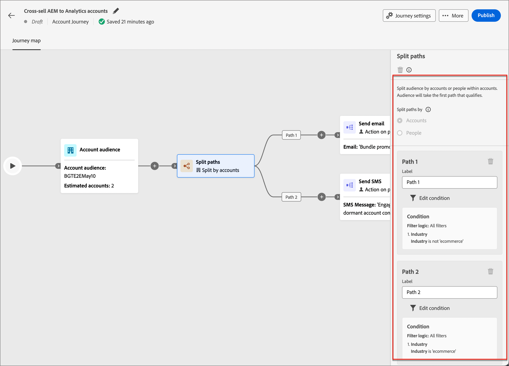
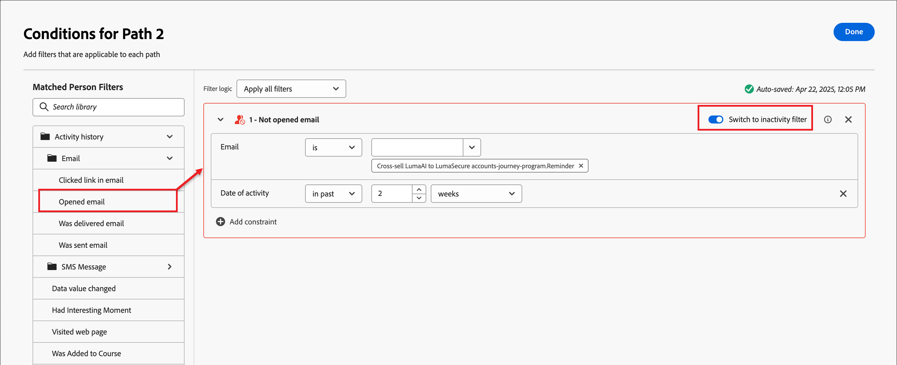

# Fractionner et fusionner les chemins

Utilisez les nœuds de chemin de division et de fusion pour segmenter les personnes ou les comptes en fonction des conditions que vous définissez. Créez des chemins d’accès pour l’audience ou la liste de comptes en fonction de conditions, définissez chaque chemin d’accès avec des nœuds d’action et d’événement pour le segment, puis combinez les chemins d’accès et poursuivez le parcours.

{width="30"} [Regarder la vidéo de présentation](#overview-video)

Un nœud _Chemins partagés_ définit un ou plusieurs chemins segmentés en fonction de filtres de compte ou de personnes **__**. Une division basée sur un filtre de personnes est automatiquement fermée par un nœud de chemins de fusion afin que toutes les personnes puissent passer à l’étape suivante sans perdre le contexte de leur compte.

>[!NOTE]
>
>25 chemins au maximum sont pris en charge.

## Fractionner les chemins par comptes

(parcours de compte uniquement)

Les chemins de division par comptes peuvent inclure des actions et des événements de compte et de personnes. Ces chemins peuvent être divisés davantage.

_&#x200B;**Fonctionnement d’un chemin de division par nœud de comptes**&#x200B;_

* Chaque chemin d’accès que vous ajoutez comprend un nœud d’extrémité avec la possibilité d’ajouter des nœuds à chaque arête.
* Les nœuds Fractionnés par compte peuvent être imbriqués (vous pouvez fractionner le chemin d’accès par comptes à plusieurs reprises).
* L’évaluation de chaque chemin s’effectue de haut en bas. Si un compte correspond pour les premier et deuxième chemins, il continue le long du premier chemin uniquement.
* Plusieurs chemins peuvent être combinés à l’aide d’un nœud de fusion.
* Le nœud prend en charge la définition d’un chemin _[!UICONTROL Autres comptes]_, où vous pouvez ajouter des actions ou des événements pour les comptes qui ne correspondent pas à l’un des segments/chemins définis.

{width="700" zoomable="yes"}

### Conditions de chemin du compte

| Conditions de chemin | Description |
| --------------- | ----------- |
| Attributs du compte | Attributs du profil de compte, notamment : <li>Chiffre d’affaires annuel <li>Ville <li>Pays <li>Nombre d’employés <li>Secteur industriel <li>Nom <li>Code SIC <li>État <li>Dispose de `<relational schema>` (voir [Filtrage des données personnalisé](#custom-data-filtering)) |
| [!UICONTROL Filtres spéciaux] > [!UICONTROL Le compte correspond au groupe d&#39;achats] | Le compte est associé à un ou plusieurs groupes d&#39;achats. Il peut être évalué par rapport à une ou plusieurs des contraintes suivantes pour un groupe d&#39;achat apparié : <li>Intérêt de la solution <li>Étape du groupe d&#39;achat <li>Statut du groupe d&#39;achat <li>Score d’engagement <li>Score d&#39;exhaustivité <li> Nombre de personnes dans le rôle de groupe d’achat |
| [!UICONTROL Filtres spéciaux] > [!UICONTROL A un groupe d&#39;achat] | Le compte a ou n&#39;a pas de membres de groupes d&#39;achat. Il peut également être évalué par rapport à un ou plusieurs des critères suivants : <li>Intérêt de la solution <li>Étape du groupe d&#39;achat <li>Statut du groupe d&#39;achat <li>Score d’engagement <li>Score d&#39;exhaustivité |

>[!NOTE]
>
>Le filtre _[!UICONTROL A un groupe d’achat]_ est marqué pour une obsolescence future. Pour les nouveaux parcours, utilisez le filtre _[!UICONTROL Le compte a apparié le groupe d’achats]_ qui inclut toutes les mêmes contraintes.

### Ajouter un chemin de division par nœud de compte

1. Accédez à la carte du parcours.

1. Cliquez sur l’icône plus ( **+** ) d’un chemin d’accès et choisissez **[!UICONTROL Fractionner les chemins]**.

   {width="300" zoomable="no"}

1. Dans les propriétés de nœud sur la droite, choisissez **[!UICONTROL Comptes]** pour la division.

1. Pour définir une condition applicable à _[!UICONTROL Chemin 1]_, cliquez sur **[!UICONTROL Appliquer la condition]**.

   {width="500" zoomable="yes"}

1. Dans l’éditeur de conditions, ajoutez un ou plusieurs filtres pour définir le chemin de division.

   * Faites glisser et déposez les attributs de filtre à partir du volet de navigation de gauche et terminez la définition de correspondance.

   * Ajustez vos conditions en appliquant la logique **[!UICONTROL Filtre]** en haut. Vous choisissez de faire correspondre tous les filtres ou n’importe quel filtre.

     {width="700" zoomable="yes"}

   * Cliquez sur **[!UICONTROL Terminé]**.

1. Pour ajouter d’autres chemins d’accès, cliquez sur **[!UICONTROL Ajouter un chemin d’accès]** et répétez les étapes précédentes pour ajouter des conditions applicables à ce chemin d’accès.

   Vous pouvez également libeller chaque chemin d’accès en fonction de ces conditions ou utiliser les libellés par défaut.

1. Si nécessaire, réorganisez les chemins en fonction de la priorité que vous souhaitez pour la division.

   Le filtrage des chemins d’accès est évalué dans l’ordre décroissant. Chaque compte suit le premier chemin qui correspond.

   Cliquez sur les flèches vers le haut et vers le bas en haut à droite de chaque carte de chemin pour la déplacer vers le haut ou le bas dans la liste des chemins.

   {width="500" zoomable="yes"}

1. Activez l’option **[!UICONTROL Autres comptes]** pour définir le chemin d’accès par défaut pour les comptes qui ne correspondent pas aux segments/chemins d’accès définis.

   Lorsque cette option n’est pas activée, le parcours se termine pour les comptes qui ne correspondent pas à un segment/chemin d’accès défini dans la division.

### Filtrage des groupes d&#39;achats pour les comptes {#buying-group-filtering-accounts}

Vous pouvez définir un chemin pour les comptes associés aux groupes d&#39;achats et filtrer le chemin à l&#39;aide des critères de groupe d&#39;achats. Utilisez le filtre **[!UICONTROL Le compte a un groupe d’achats apparié]** pour définir le segment de chemin d’accès à l’aide d’un groupe d’achats apparié. Ce filtre inclut également cette option pour identifier les comptes en fonction du nombre de rôles attribués au sein d&#39;un groupe d&#39;achats apparié.

Par exemple, vous pouvez évaluer le niveau de préparation du groupe d’achat en fonction de la profondeur (nombre de personnes) qu’il a dans différents rôles, tels que trois décideurs et deux influenceurs. Dans ce cas, définissez la condition pour cibler les comptes avec un minimum de trois (3) Décideurs et deux (2) Influenceurs dans un groupe d&#39;achat apparié :

1. Cliquez sur **[!UICONTROL Ajouter un filtre]** et choisissez le filtre **[!UICONTROL Nombre de personnes dans le rôle du groupe d&#39;achat]**.

   {width="700" zoomable="yes"}

1. Définissez le premier paramètre de rôle.

   * Définissez l’évaluation du nombre de personnes à `at least` avec une valeur de `3`.
   * Définissez l’évaluation de rôle sur `is` et choisissez `Decision Maker` dans la liste des rôles.

1. Répétez l&#39;étape 1 pour ajouter un autre paramètre de rôle de groupe d&#39;achat.

1. Définissez le deuxième paramètre de rôle.

   * Définissez l’évaluation du nombre de personnes à `at least` avec une valeur de `2`.
   * Définissez l’évaluation de rôle sur `is` et choisissez `Influencer` dans la liste des rôles.

   {width="700" zoomable="yes"}

1. Cliquez sur **[!UICONTROL Terminé]** lorsque toutes les conditions du chemin d’accès sont définies.

Pour les comptes identifiés, vous pouvez ensuite ajouter un nœud d’action dans le chemin d’accès pour mettre à jour le statut du groupe d’achats ou de l’étape, ou pour envoyer un e-mail d’alerte de ventes.

### Filtrage des données personnalisées

[!BADGE Beta]{type=Informative url="/help/user/admin/engagement-score-weighting.md" tooltip="Disponible en version bêta sur l’architecture simplifiée"}

Vous pouvez utiliser des schémas relationnels (classes basées sur des modèles) pour fractionner les chemins d’accès par compte. Les objets personnalisés sont définis dans _schémas relationnels_ et un administrateur de produit peut [configurer des champs de schéma relationnel](../admin/xdm-field-management.md#relational-schemas) dans [!DNL Journey Optimizer B2B Edition]. Les champs de schéma sélectionnés sont disponibles dans l’éditeur de conditions pour une utilisation dans le chemin de partage par nœuds de compte.

{width="700" zoomable="yes"}

<!-- SPHR-23746

Note: These are currently going under Account Attributes folder, which is a bug (SPHR-21734). This will move to Special filters when resolved (January release).

This will also be available for split paths by people (under special filters) for the M 1.5 GA release.
-->

## Fractionner les chemins par personnes

Les chemins fractionnés par personnes ne peuvent inclure que des actions de personnes. Ces chemins ne peuvent pas être fractionnés à nouveau et rejoints automatiquement.

_&#x200B;**Fonctionnement d’un nœud de partage de chemin par personnes**&#x200B;_

* Les nœuds fractionnés par personnes fonctionnent dans une combinaison _nœud groupé_ de division-fusion. Les chemins de division fusionnent automatiquement afin que toutes les personnes puissent passer à l’étape suivante sans perdre le contexte de leur compte.
* Les nœuds Fractionné par personnes ne peuvent pas être imbriqués (vous ne pouvez pas ajouter de chemin de fractionnement pour les personnes sur un chemin qui se trouve dans ce nœud groupé).
* L’évaluation de chaque chemin s’effectue de haut en bas. Si une personne correspond pour le premier et le deuxième chemin, elle continue uniquement le premier chemin.
* Le nœud prend en charge l’utilisation de _relations compte-personne_, qui vous permet de filtrer les personnes en fonction de leur rôle (comme entrepreneur ou employé à temps plein), tel que défini dans la relation.
* Le nœud prend en charge la définition d’un chemin _[!UICONTROL Autres personnes]_, où vous pouvez ajouter des actions ou des événements pour les personnes qui ne correspondent pas à l’un des segments/chemins définis.

{width="700" zoomable="yes"}

### Filtres de chemin d’accès des personnes

| Filtres | Description |
| ------------ | ----------- |
| [!UICONTROL Historique des activités] > [!UICONTROL E-mail] | Les activités d’e-mail basées sur des conditions qui sont évaluées à l’aide d’un ou de plusieurs e-mails sélectionnés plus haut dans le parcours : <li>[!UICONTROL Lien cliqué dans l’e-mail] <li>E-mail ouvert <li>A reçu l’e-mail <li>E-mail envoyé  **[!UICONTROL Passer au filtre d’inactivité&#x200B;]**- Utilisez cette option pour filtrer selon l’absence d’activité (une personne n’avait pas l’activité d’e-mail). |
| [!UICONTROL Historique des activités] > [!UICONTROL Message SMS] | Activités SMS basées sur des conditions qui sont évaluées à l’aide d’un ou de plusieurs messages SMS sélectionnés plus haut dans le parcours : <li>[!UICONTROL Lien cliqué dans le SMS] <li>[!UICONTROL SMS ayant fait l’objet d’un rebond]  **[!UICONTROL Passer au filtre d’inactivité&#x200B;]**- Utilisez cette option pour filtrer par manque d’activité (une personne n’avait pas l’activité SMS). |
| [!UICONTROL Historique des activités] > [!UICONTROL Valeur des données modifiée] | Pour un attribut de personne sélectionné, une modification de valeur s’est produite. Ces types de modifications sont les suivants : <li>Nouvelle valeur<li>Valeur précédente<li>Motif<li>Source<li>Date d’activité<li>Min. nombre de fois  **[!UICONTROL Passer au filtre d’inactivité&#x200B;]**- Utilisez cette option pour filtrer par manque d’activité (une personne n’a pas modifié la valeur de ses données). |
| [!UICONTROL Historique des activités] > [!UICONTROL Moment intéressant] | Activité de moment intéressante définie dans l’instance de [!DNL Marketo Engage] associée. Les contraintes sont les suivantes : <li>Étape<li>E-mail<li>Web  **[!UICONTROL Passer au filtre d’inactivité&#x200B;]**- Utilisez cette option pour filtrer par manque d’activité (une personne n’a pas vécu de moment intéressant). |
| [!UICONTROL Historique des activités] > [!UICONTROL Page web visitée] | Activité de page web qui, pour une ou plusieurs pages web, est gérée par l’instance [!DNL Marketo Engage] associée. Les contraintes sont les suivantes : <li>Page web (obligatoire)<li>Date d’activité<li>Adresse IP du client <li>Chaîne de requête <li>Référent <li>Agent utilisateur <li>Moteur de recherche <li>Requête <li>URL personnalisée <li>Jeton <li>Navigateur <li>Platform <li>Appareil <li>Min. nombre de fois  **[!UICONTROL Passer au filtre d’inactivité&#x200B;]**- Utilisez cette option pour filtrer par manque d’activité (une personne n’a pas visité la page web). |
| [!UICONTROL Attributs de personne] | Attributs du profil de la personne, notamment : <li>Ville <li>Pays <li>Date de naissance <li>Adresse e-mail <li>E-mail non valide <li>E-mail interrompu <li>Prénom <li>Région déduite<li>Titre du traitement <li>Nom <li>Numéro téléphone mobile <li>Score d’engagement de la personne <li>Numéro de téléphone <li>Code postal <li>État <li>Désabonné ou désabonnée <li>Raison désabonnement |
| [!UICONTROL Filtres spéciaux] > [!UICONTROL Membre du groupe d&#39;achat] | La personne est ou n&#39;est pas un membre du groupe d&#39;achats évalué par rapport à un ou plusieurs des critères suivants : <li>Intérêt de la solution</li><li>Statut du groupe d&#39;achat</li><li>Score d&#39;exhaustivité</li><li>Score d’engagement</li><li>Est Supprimé</li><li>Rôle</li> |
| [!UICONTROL Filtres spéciaux] > [!UICONTROL Membre de la liste] | La personne est ou n’est pas membre d’une ou de plusieurs listes [!DNL Marketo Engage]. |
| [!UICONTROL Filtres spéciaux] > [!UICONTROL Membre du programme] | La personne est ou n’est pas membre d’un ou de plusieurs programmes [!DNL Marketo Engage]. |

### Conditions de chemin compte-personne

| Conditions de chemin | Description |
| --------------- | ----------- |
| [!UICONTROL Rôle dans le compte] | Un rôle dans le compte est attribué ou non à la personne. Contraintes facultatives : <li>Nom du rôle |

### Ajouter un nœud de partage de chemin par personnes

>[!NOTE]
>
>Lorsque vous fractionnez des chemins par personnes, un nœud _Fermer les chemins fractionnés_ est automatiquement inséré pour mettre fin à la division. Un chemin d’accès fractionné par personnes permet uniquement d’_effectuer une action_ sur les nœuds de personnes.

1. Accédez à la carte du parcours.

1. Cliquez sur l’icône plus ( **+** ) d’un chemin d’accès et choisissez **[!UICONTROL Fractionner les chemins]**.

   {width="300" zoomable="no"}

1. Dans les propriétés de nœud sur la droite, choisissez **[!UICONTROL Personnes]** pour la division.

1. (parcours de compte uniquement) Définissez la variable **[!UICONTROL Attributs utilisés pour les conditions]**.

   * Choisissez **[!UICONTROL Attributs de personne uniquement]** pour utiliser des conditions liées au profil de personne.
   * Choisissez **[!UICONTROL Attributs de compte-personne uniquement]** pour utiliser des conditions liées à l’appartenance au rôle de la personne au sein d’un compte.

1. Pour définir une condition applicable à _[!UICONTROL Chemin 1]_, cliquez sur **[!UICONTROL Appliquer la condition]**.

1. Dans l’éditeur de conditions, ajoutez un ou plusieurs filtres pour définir le chemin de division.

   * Faites glisser et déposez l’un des filtres de personnes à partir du volet de navigation de gauche et terminez la définition de la correspondance.

     >[!NOTE]
     >
     >Si des champs de personne personnalisés sont définis dans le schéma d’audience du compte dans Experience Platform, ces champs peuvent également être utilisés en tant qu’attributs de personne dans des conditions.

   * Ajustez vos conditions en appliquant la logique **[!UICONTROL Filtre]** en haut. Vous choisissez de faire correspondre toutes les conditions d’attribut ou n’importe quelle condition.

     {width="700" zoomable="yes"}

   * Cliquez sur **[!UICONTROL Terminé]**.

1. Pour ajouter d’autres chemins d’accès, cliquez sur **[!UICONTROL Ajouter un chemin d’accès]** et répétez les étapes précédentes pour ajouter des conditions applicables à ce chemin d’accès.

   Vous pouvez également libeller chaque chemin d’accès en fonction de ces conditions ou utiliser les libellés par défaut.

1. Si nécessaire, réorganisez les chemins en fonction de la priorité que vous souhaitez pour la division.

   Le filtrage des chemins d’accès est évalué dans l’ordre décroissant. Chaque personne suit le premier chemin correspondant.

   Cliquez sur les flèches vers le haut et vers le bas en haut à droite de chaque carte de chemin pour la déplacer vers le haut ou le bas dans la liste des chemins.

   {width="500" zoomable="yes"}

1. Activez l’option **[!UICONTROL Autres personnes]** pour ajouter un chemin par défaut pour les personnes qui ne correspondent pas aux chemins définis.

   Lorsque cette option n’est pas activée, les personnes qui ne correspondent pas à un segment/chemin défini passent au-delà de la division et passent à l’étape suivante du parcours.

   Lorsque des conditions sont définies pour chaque chemin d’accès afin de fractionner votre audience au niveau des personnes, vous pouvez ajouter des actions que vous souhaitez entreprendre sur les personnes.

### Filtrage des activités

Pour un chemin de partage par personnes, vous pouvez définir un chemin en fonction de l&#39;activité de la personne en rapport avec :

* Messages e-mail provenant d’une adresse antérieure dans le parcours
* SMS provenant d’une adresse antérieure dans le parcours
* Modification de la valeur des données dans le profil de personne
* Moment intéressant (suivi en [!DNL Marketo Engage]) associé à un e-mail, une page web ou un jalon
* Visite d’une page web (suivie en [!DNL Marketo Engage])

>[!BEGINSHADEBOX « Filtrage d&#39;inactivité »]

Pour chacun des filtres _[!UICONTROL Historique des activités]_, vous pouvez activer l’option **[!UICONTROL Passer au filtre d’inactivité]**. Cette option transforme le filtre en évaluation d’une absence de ce type d’activité. Par exemple, ajoutez le filtre _[!UICONTROL E-mail]_ > _[!UICONTROL E-mail ouvert]_ pour créer un chemin d’accès pour les personnes qui _&#x200B;**n’ont pas ouvert**&#x200B;_ un e-mail précédemment dans le parcours. Activez l’option d’inactivité et indiquez l’adresse e-mail. Il est recommandé d&#39;utiliser la contrainte _[!UICONTROL Date de l&#39;activité]_ pour définir une période d&#39;inactivité.

{width="700" zoomable="yes"}

>[!ENDSHADEBOX]

### Filtrage des appartenances

La section _[!UICONTROL Filtres spéciaux]_ comporte plusieurs filtres que vous pouvez utiliser pour évaluer l&#39;appartenance d&#39;une personne à un groupe d&#39;achats ou à une liste [!DNL Marketo Engage].

Par exemple, si vous souhaitez créer un chemin d&#39;accès pour les personnes qui sont membres d&#39;un groupe d&#39;achats et auxquelles un rôle particulier est affecté, ajoutez le filtre _[!UICONTROL Filtres spéciaux]_ > _[!UICONTROL Membre du groupe d&#39;achats]_. Pour le filtre, définissez l&#39;appartenance sur _true_, sélectionnez un _[!UICONTROL Intérêt de la solution]_ associé à un ou plusieurs groupes d&#39;achats, puis définissez le _[!UICONTROL Rôle]_ à faire correspondre.

{width="700" zoomable="yes"}

Vous pouvez également inclure d&#39;autres contraintes d&#39;appartenance à un groupe d&#39;achat :

* _[!UICONTROL Étape du groupe d&#39;achat]_
* _[!UICONTROL Statut du groupe d&#39;achat]_
* _[!UICONTROL Score d&#39;exhaustivité]_
* _[!UICONTROL Score d’engagement]_
* _[!UICONTROL Est supprimé]_

>[!TIP]
>
>Pour exclure des membres qui ont été supprimés d&#39;un groupe d&#39;achats, utilisez la contrainte _[!UICONTROL Est supprimé]_ définie sur `false`. Vous pouvez également inclure explicitement des membres supprimés en définissant cette contrainte sur `true`.

>[!BEGINSHADEBOX « liste Marketo Engage et appartenance à un programme »]

Dans [!DNL Marketo Engage], les _campagnes intelligentes_ vérifient l’appartenance aux programmes pour vous assurer que les prospects ne reçoivent pas d’e-mails en double et ne sont pas membres de plusieurs flux d’e-mails en même temps. Dans Journey Optimizer B2B, vous pouvez vérifier l’appartenance à une liste de [!DNL Marketo Engage] comme condition de votre chemin de partage par personnes afin d’éliminer la duplication dans les activités de parcours.

Pour utiliser l’appartenance à une liste dans une condition de partage, développez **[!UICONTROL Filtres spéciaux]** et faites glisser la condition **[!UICONTROL Membre de la liste]** ou **[!UICONTROL Membre du programme]** dans l’espace de filtrage. Renseignez la définition du filtre pour évaluer l’appartenance à une ou plusieurs listes [!DNL Marketo Engage].

![Condition de partage du chemin par personnes pour l’appartenance à [!DNL Marketo Engage] liste](./assets/node-split-paths-conditions-people-member-of-list.png){width="700" zoomable="yes"}

>[!ENDSHADEBOX]

## Fusionner les chemins

Ajoutez un nœud _Fusionner les chemins_ pour combiner différents chemins fractionnés par compte dans votre parcours.

1. Accédez à la carte du parcours.

1. Cliquez sur l’icône plus ( **+** ) d’un chemin d’accès et choisissez **[!UICONTROL Fractionner les chemins]**.

1. Cliquez sur le nœud de partage pour ouvrir ses propriétés sur la droite.

1. Cliquez sur [!UICONTROL Ajouter un chemin] pour créer trois chemins.

1. Ajoutez une combinaison d’actions et d’événements à chaque chemin.

1. Cliquez sur l’icône plus ( **+** ) pour l’un de ces chemins d’accès et choisissez **[!UICONTROL Fusionner]** dans les options affichées.

   {width="400" zoomable="no"}

1. Dans les propriétés du nœud de chemins de fusion, sélectionnez les chemins à fusionner.

   {width="600" zoomable="yes"}

   À ce stade, les chemins d’accès sont fusionnés afin que les comptes des chemins d’accès sélectionnés se combinent pour former un chemin d’accès unique qui peut continuer à progresser dans le parcours.

1. Si nécessaire, vous pouvez annuler la fusion des chemins en revenant aux propriétés du nœud de chemins de fusion et en décochant la case correspondant aux chemins que vous souhaitez supprimer.

## Vidéo de présentation

>[!VIDEO](https://video.tv.adobe.com/v/3443231/?learn=on)
