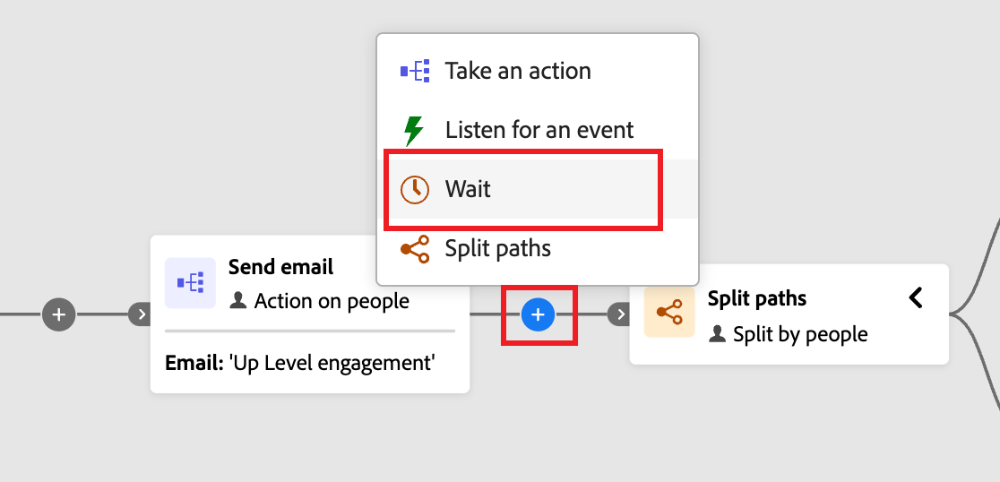

# Nœuds d’attente

Utilisez un nœud _Attente_ lorsque vous souhaitez suspendre la progression du parcours pendant une certaine durée avant de passer à l’étape suivante.

Vous pouvez définir le temps d’attente de deux manières différentes :

* Date spécifique à laquelle vous souhaitez passer au nœud suivant du parcours
* Une durée relative (nombre de minutes, heures, jours, semaines ou mois)

## Ajouter le nœud d’attente

1. Accédez à la carte du parcours.

1. Cliquez sur l’icône plus ( **+** ) d’un chemin d’accès et choisissez **[!UICONTROL Attendre]**.

   {width="440"}

1. Dans les propriétés du nœud sur la droite, définissez le temps d’attente **[!UICONTROL Type]** avant que le parcours ne passe au nœud suivant dans le chemin d’accès.

   * **[!UICONTROL Durée]** - Définissez un nombre spécifique de jours, heures ou minutes entre l’entrée et la sortie du nœud d’attente.
   * **[!UICONTROL Date]** - Spécifiez une date et une heure spécifiques pour la sortie.

   {width="500"}

## Paramètres avancés de l’attente

Activez l’option **[!UICONTROL Doit se terminer le]** pour configurer une _étape d’attente avancée_ et vous assurer que vos messages atteignent les personnes et les membres du compte au moment optimal. Cette configuration vous donne un contrôle précis sur le moment où une personne ou un compte quitte une étape d’attente et passe au nœud suivant dans le parcours. Plutôt qu’un nombre fixe d’heures ou de jours entre l’entrée et la sortie, vous pouvez planifier des actions qui se produisent à des heures spécifiques et à des jours spécifiques de la semaine.

Avec une _étape d’attente avancée_, vous définissez **_quand_** la personne ou le compte doit quitter, et pas seulement combien de temps il doit attendre.

{width="500"}

>[!AVAILABILITY]
>
>Les paramètres d’attente avancés sont disponibles pour les environnements [!DNL Journey Optimizer B2B Edition] configurés sur l’architecture [&#x200B; simplifiée](../simplified-architecture.md).

### Types d’attente

| Type d’attente | Description | Configuration |
| --------- | ----------- | ------------- |
| **Heure spécifique de la journée** | Maintenir jusqu’à une heure spécifique (par exemple, à 9 :00) | Réglez l’heure (heure et minute). Se ferme à l’occurrence suivante de cette heure (pour le fuseau horaire sélectionné). |
| **Jour spécifique de la semaine** | Attendre jusqu’à un jour particulier (tel que le mardi) | Sélectionnez un jour de la semaine. Si aucune heure n’est spécifiée, se ferme à minuit (pour le fuseau horaire sélectionné) le jour correspondant suivant. |
| **Période ou combinaison** | Conservez jusqu’à n’importe quel jour d’une plage (lundi-vendredi, par exemple) ou pendant l’un des jours spécifiés | Sélectionnez vos jours cibles. Si aucune heure n’est spécifiée, se ferme à minuit (pour le fuseau horaire sélectionné) le jour correspondant suivant. |
| **Combinaison Heure + Jour** | Combinez les deux pour une planification précise (par exemple, mardi à 10 :00) | Sélectionnez vos jours cibles et définissez l’heure cible. Quitte à l’occurrence du jour/heure suivant (pour le fuseau horaire sélectionné). |

### Scénarios courants

Les scénarios suivants illustrent la manière dont vous pouvez appliquer des scénarios classiques à la configuration de votre nœud d’attente :

+++Arrivée des e-mails pendant les heures d’ouverture

**Scénario :** vous commercialisez auprès des clients B2B qui lisent des e-mails au travail. Vous souhaitez que tous les e-mails arrivent pendant les heures de bureau.

**Solution :** configurez votre étape d’attente pour libérer les prospects à 9 :00 en semaine (du lundi au vendredi). Quel que soit le moment où un prospect accède au nœud d’attente, il reçoit votre e-mail pendant les heures de bureau.

+++

+++Heures d’envoi cohérentes pour les audiences dynamiques

**Scénario :** votre audience change tous les jours à mesure que de nouveaux comptes ou prospects sont qualifiés. Vous souhaitez que tous les prospects reçoivent le premier e-mail en même temps, quelle que soit la date à laquelle ils remplissent les critères.

**Solution :** définissez l’étape d’attente pour qu’elle se termine à une heure spécifique (par exemple à 10 :00). Tous les prospects, qu’ils se soient qualifiés à minuit ou à midi, sortent ensemble de l’étape d’attente à 10 :00.

+++

+++Tâches de suivi conformes à SLA

**Scénario :** votre équipe des ventes dispose d’un SLA de deux jours ouvrables pour effectuer le suivi des prospects de compte qualifiés pour le marketing. Les week-ends ne comptent pas.

**Solution :** configurez l’étape d’attente pour libérer les prospects uniquement les jours ouvrables. Un prospect qualifié le vendredi est acheminé pour un suivi le lundi ou le mardi, et non le week-end.

+++

### Exemples d’entrée et de sortie

| Configuration de l’attente | Entrées de compte/lead | Sorties de compte/prospect |
| ------------------ | ------------------- | ------------------ |
| 9 :00, n&#39;importe quel jour | Lundi 11:00 | Mardi 9:00 |
| 9 :00, n&#39;importe quel jour | Lundi 7:00 | Lundi 9:00 |
| Mardi, pas d&#39;heure fixée | Vendredi 15:00 | Mardi 12:00 |
| 10 :00, du lundi au vendredi | Samedi 14:00 | Lundi 10:00 |
| 10 :00, du lundi au vendredi | Mercredi 8:00 | Mercredi 10:00 |
