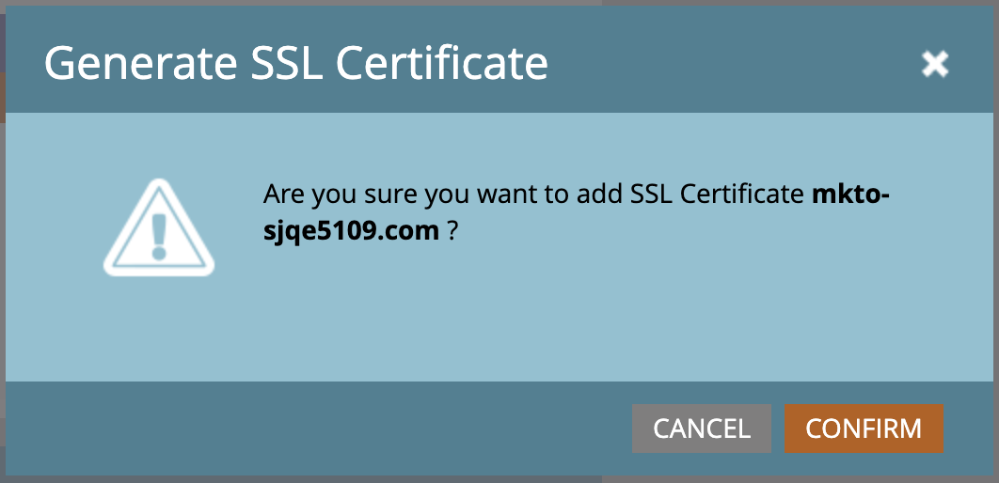

# Configuration des domaines de branding

Un domaine de marque dans Marketo Engage est un sous-domaine personnalisé (tel que `links.yourcompany.com`) utilisé pour réécrire les liens et effectuer le suivi des clics sur les e-mails. Il permet également de s’assurer qu’ils reflètent votre marque plutôt qu’un domaine générique. Chaque domaine de marque agit comme un domaine de suivi des clics pour améliorer la délivrabilité et la confiance en faisant correspondre vos e-mails et liens de page de destination avec votre domaine.

* Il remplace les liens génériques par votre propre marque dans les liens hypertexte des e-mails.
* Lorsqu’un prospect de compte clique sur un lien, il redirige via ce domaine personnalisé afin d’autoriser le suivi des performances tout en semblant légitime aux filtres d’e-mail.
* Si vous disposez de plusieurs marques, vous pouvez configurer des domaines de marque supplémentaires pour prendre en charge différentes unités commerciales ou marques.

>[!BEGINSHADEBOX]

**CNAME uniques pour les liens de suivi**

Les liens de tracking e-mail doivent être nouveaux et uniques pour l’instance Marketo Engage jointe. Si des CNAME existants pour les liens de suivi pointent vers une instance Marketo Engage préexistante (de production), ils ne peuvent pas être réutilisés _en l’état_.

Vous pouvez partager le branding de domaine de chemin de retour entre votre instance Marketo Engage de production et l’instance jointe, mais il s’agit d’une modification du serveur principal. Ouvrez un ticket d’assistance et fournissez votre préfixe Marketo Engage (Munchkin ID) ainsi que votre nouveau préfixe Journey Optimizer B2B edition (Munchkin ID) pour demander le branding de domaine de chemin de retour partagé.

>[!ENDSHADEBOX]

>[!PREREQUISITES]
>
>Avant de modifier ou d’ajouter un domaine dans l’interface utilisateur, vous devez disposer d’un [CNAME mappé à un domaine Marketo Engage fourni par Adobe](https://experienceleague.adobe.com/fr/docs/marketo/using/getting-started/initial-setup/setup-steps#customize-your-landing-page-urls-with-a-cname){target="_blank"}.
>
>Lors de l’ajout d’un domaine, le système vérifie les SSL préexistants, qui peuvent avoir été créés manuellement au préalable. Si vous rencontrez cette validation, créez votre domaine sans sélectionner la création SSL, puis connectez-les comme une procédure distincte.

## Accès aux domaines de branding dans Marketo Engage

1. Accédez à la zone **[!UICONTROL Admin]** de votre instance Marketo Engage et sélectionnez **[!UICONTROL E-mail]**.

1. Faites défiler l’écran jusqu’au panneau **[!UICONTROL Domaines de marque]**.

   {width="700" zoomable="yes"}

   La liste affiche le domaine par défaut de l’instance Marketo Engage.

## Modifier votre domaine de marque par défaut

La première étape de l’utilisation des domaines de marque consiste à modifier le domaine de marque par défaut défini dans votre instance Marketo Engage.

>[!NOTE]
>
>Vous ne pouvez pas définir de domaine de branding supplémentaire tant que vous n’avez pas modifié le domaine par défaut générique.

1. Dans le panneau _[!UICONTROL Domaines de marque]_, sélectionnez le domaine générique et cliquez sur **[!UICONTROL Modifier]** en haut.

   {width="500"}

1. Dans la boîte de dialogue _[!UICONTROL Modifier le domaine de branding]_, saisissez le nom de votre domaine par défaut dans le champ **[!UICONTROL Domaine]**.

   {width="400"}

1. Si plusieurs espaces de travail sont définis pour votre instance Marketo Engage, cliquez sur **[!UICONTROL Suivant]**.

   Sélectionnez chacun des espaces de travail auxquels vous souhaitez appliquer le domaine principal mis à jour.

   {width="400"}

1. Cliquez sur **[!UICONTROL Enregistrer]**

## Définition d’un domaine supplémentaire

Après avoir modifié le domaine par défaut, vous pouvez ajouter un autre domaine de branding lorsque vous souhaitez exécuter plusieurs marques dans votre environnement Journey Optimizer B2B edition, où chacune d’elles possède ses propres liens de suivi de branding. Lorsque vous ajoutez un domaine, vous disposez des options suivantes :

>* _Faire du domaine de Principal_ : faites de ce domaine le domaine principal de l’espace de travail. Lorsque vous sélectionnez cette option, tous les e-mails non envoyés existants sont définis sur le domaine principal par défaut et tous les nouveaux e-mails créés sont automatiquement définis sur ce domaine principal. Les marketeurs peuvent choisir un autre domaine de marque si nécessaire.
>
>* _Générer un certificat SSL_ : créez un protocole SSL (Secure Sockets Layer) avec la création du domaine. Le premier domaine de suivi lance une configuration unique de l’infrastructure qui peut prendre quelques heures. Une fois l’opération terminée, le système envoie une notification.

_Pour ajouter le domaine :_

1. Dans le panneau _[!UICONTROL Domaines de marque]_, cliquez sur **[!UICONTROL Ajouter]** en haut.

   {width="500"}

1. Dans la boîte de dialogue _[!UICONTROL Nouveau domaine de branding]_, saisissez le nom du domaine de branding dans le champ **[!UICONTROL Domaine]**.

1. (Facultatif) Cochez la case **[!UICONTROL Générer un certificat SSL]** pour générer automatiquement un certificat SSL pour le domaine.

   {width="400"}

   Si nécessaire et disponible, vous pouvez également cocher la case _Rendre le domaine de Principal_.

   >[!NOTE]
   >
   >**_SSL personnalisés_** : si vous avez besoin d’un SSL personnalisé, vous pouvez envoyer un ticket de [support](https://nation.marketo.com/t5/support/ct-p/Support){target="_blank"}. N’utilisez pas la case à cocher pour la création SSL.

1. Si plusieurs espaces de travail sont définis pour votre instance Marketo Engage, cliquez sur **[!UICONTROL Suivant]**.

   Si nécessaire, sélectionnez chacun des espaces de travail auxquels vous souhaitez appliquer le nouveau domaine en tant que domaine principal.

   {width="400"}

1. Cliquez sur **[!UICONTROL Enregistrer]**

## Modifier les SSL pour les domaines de branding existants

Pour activer SSL pour vos domaines existants, procédez comme suit.

1. Dans la zone _[!UICONTROL Admin]_, sélectionnez **[!UICONTROL Email]**.

1. Dans le panneau _[!UICONTROL Domaines de branding]_, sélectionnez la ligne de domaine et cliquez sur **[!UICONTROL Ajouter SSL]**.

   {width="500"}

1. Dans la boîte de dialogue, cliquez sur **[!UICONTROL Confirmer]**.

   {width="400"}

## Messages d’erreur

| Erreur | Détails |
| ----- | ------- |
| `Domain already exists.` | Un domaine du même nom existe déjà. |
| `Domain is not mapped to the default domain.` | Le domaine personnalisé n’est pas correctement mappé au domaine par défaut. Vérifiez les paramètres de mappage de domaine et assurez-vous que la configuration DNS pointe vers le domaine par défaut approprié. |
| `SSL certificates could not be issued due to unsupported CAA records. Request your IT to update your CAA records.` | Les enregistrements CAA ne sont pas à jour. Pour les utilisateurs et utilisatrices qui utilisent des certificats SSL gérés par Adobe, les enregistrements CAA doivent être mis à jour vers les certificats recommandés par le fournisseur. |
| `SSL certificate has already been issued.` | Un certificat SSL existe déjà pour ce domaine personnalisé. Aucune autre action n’est nécessaire, sauf si le certificat a expiré ou doit être réémis. |
| `The default domain was not found. Please contact Support for assistance.` | Un problème s’est produit lors de la recherche du domaine par défaut. Contactez l’assistance Adobe pour déclencher une enquête. |
| `Unexpected error encountered while creating a domain. Please contact Support for assistance.` | Une erreur inattendue sʼest produite. Rassemblez les journaux et les détails de l’erreur, puis transmettez le problème à l’assistance Adobe. |

## Suppression d’un domaine de branding

>[!NOTE]
>
>Si vous souhaitez supprimer le domaine de branding principal (dans un ou plusieurs espaces de travail), vous devez d’abord sélectionner un autre domaine de branding comme principal pour chaque espace de travail.
>
>La suppression d’un domaine **_ne_** pasle certificat SSL. Ce mécanisme de sécurisation empêche les erreurs utilisateur qui entraînent la suppression des certificats SSL d’un site web. Si vous souhaitez supprimer les certificats SSL, contactez l’assistance Adobe.

Dans le panneau _[!UICONTROL Domaines de branding]_, sélectionnez le domaine et cliquez sur **[!UICONTROL Supprimer]** en haut.
