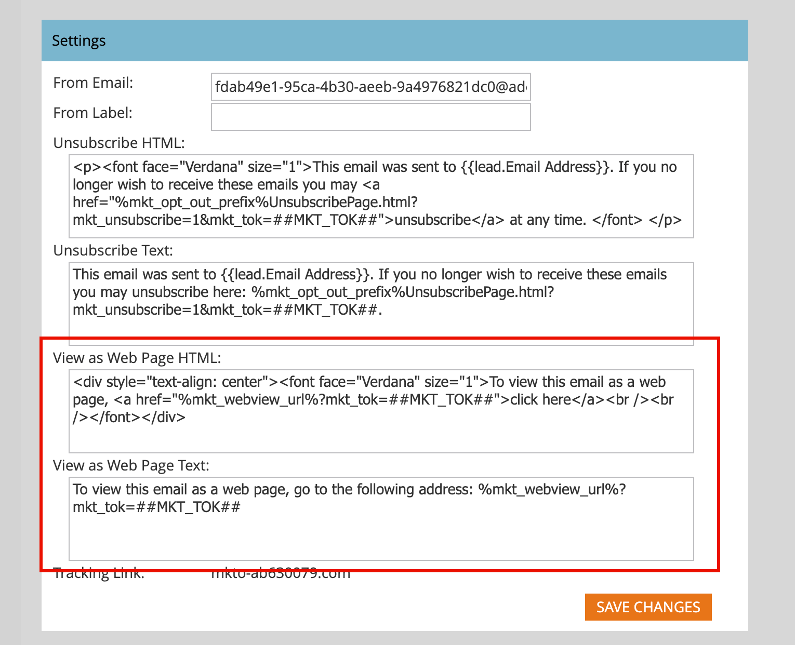

# Configuration des e-mails

Pour prendre en charge l’infrastructure de diffusion par e-mail fournie par l’instance Marketo Engage jointe, définissez les options d’e-mail suivantes. Un administrateur de produit Marketo Engage peut configurer ces paramètres en accédant à la zone **[!UICONTROL Admin]** dans l’instance Marketo Engage et en sélectionnant **[!UICONTROL E-mail]**.

## Paramètres d’e-mail

Pour configurer les valeurs par défaut des e-mails pour l’instance Marketo Engage jointe, modifiez les valeurs configurées afin qu’elles reflètent l’utilisation par votre organisation marketing.

### E-mail et libellé de l’expéditeur

Modifiez les valeurs de l’e-mail et du libellé De afin que les nouveaux e-mails soient automatiquement renseignés avec ces valeurs par défaut.

>[!NOTE]
>
>La modification s’applique uniquement aux e-mails que vous créez et non aux autres utilisateurs de Marketo Engage ou de Journey Optimizer B2B edition.

1. Accédez à la zone **[!UICONTROL Admin]** de l’instance Marketo Engage jointe et sélectionnez **[!UICONTROL E-mail]**.

1. Dans le panneau _[!UICONTROL Paramètres]_, saisissez les valeurs par défaut souhaitées pour **[!UICONTROL E-mail de l’expéditeur]** et **[!UICONTROL Libellé de l’expéditeur]**.

   {width="500"}

1. Cliquez sur **[!UICONTROL Enregistrer les modifications]**.

### Désabonnement des messages

Pour les e-mails marketing non opérationnels, le texte de désabonnement et les liens sont ajoutés en bas. En tant qu’administrateur de produit, vous devez configurer l’HTML et le texte par défaut qui sont renseignés lorsqu’un spécialiste marketing ne marque pas l’e-mail comme opérationnel.

1. Accédez à la zone **[!UICONTROL Admin]** de l’instance Marketo Engage jointe et sélectionnez **[!UICONTROL E-mail]**.

1. Dans le panneau _[!UICONTROL Paramètres]_, saisissez les valeurs par défaut souhaitées pour **[!UICONTROL Désabonner HTML]** et **[!UICONTROL Texte de désabonnement]**.

   >[!TIP]
   >
   >Les spécialistes marketing peuvent modifier la position de l’HTML de désabonnement dans leur e-mail à l’aide de jetons système.

   {width="500"}

   >[!CAUTION]
   >
   >Les variables suivantes sont critiques. **Ne les supprimez pas**
   >
   >* `%mkt_opt_out_prefix%`
   >* `mkt_unsubscribe=1&mkt_tok=##MKT_TOK##`

1. Cliquez sur **[!UICONTROL Enregistrer les modifications]**.

Si vous devez revenir au contenu système par défaut, copiez et collez les éléments suivants :

+++ Texte de désabonnement par défaut du système

```
<p><font face="Verdana" size="1">If you no longer wish to receive these emails, click on the following link: <a href="%mkt_opt_out_prefix%UnsubscribePage.html?mkt_unsubscribe=1&mkt_tok=##MKT_TOK##">Unsubscribe</a><br/></font></p>` [!UICONTROL Unsubscribe Text]:
%mkt_opt_out_prefix%UnsubscribePage.html?mkt_unsubscribe=1&mkt_tok=##MKT_TOK##
```

+++

### Afficher en tant que page web

Le contenu des e-mails présente des fonctionnalités d’affichage limitées (CSS limité et aucun JavaScript ni formulaire). Les marketeurs peuvent utiliser l&#39;option _Afficher en tant que page web_ pour appliquer un cookie au destinataire de l&#39;e-mail à l&#39;aide de Marketo Munchkin. En tant qu’administrateur ou administratrice de produit, vous devez configurer l’HTML et le texte par défaut qui sont renseignés lorsqu’un ou une spécialiste marketing choisit cette option.

1. Accédez à la zone **[!UICONTROL Admin]** de l’instance Marketo Engage jointe et sélectionnez **[!UICONTROL E-mail]**.

1. Dans le panneau _[!UICONTROL Paramètres]_, modifiez le contenu des champs **[!UICONTROL Afficher en tant qu’HTML de page web]** et **[!UICONTROL Afficher en tant que texte de page web]** pour refléter votre ton et votre message.

   {width="500"}

   >[!CAUTION]
   >
   >Les variables suivantes sont critiques. **Ne les supprimez pas**
   >
   >`%mkt_webview_url%?mkt_tok=##MKT_TOK##`
   >
   >La deuxième partie `##MKT_TOK##` le cookie Munchkin de cette personne. Cela garantit que les cookies sont appliqués correctement lorsque le destinataire de l’e-mail clique sur le lien.
   >
   >Veillez à éviter :
   >
   >* Ajout d’URL supplémentaires à l’une des zones HTML
   >* Mise d’HTML dans la version texte

1. Cliquez sur **[!UICONTROL Enregistrer les modifications]**.

Si vous devez revenir au contenu système par défaut, copiez et collez les éléments suivants :

+++ Page web par défaut du système HTML

```
<div style="text-align: center"><font face="Verdana" size="1">To view this email as a web page, <a href="%mkt_webview_url%?mkt_tok=##MKT_TOK##">click here</a></font></div>
```

+++

+++ Texte de la page web par défaut du système

```
To view this email as a web page, go to the following address:
`%mkt_webview_url%?mkt_tok=##MKT_TOK##`
```

+++

## Limites de récupération des objets personnalisés

Si vous utilisez [!DNL Velocity Script] pour afficher des données d’objet personnalisées dans des e-mails, ajustez la limite de récupération de l’objet personnalisé parent. Par défaut, la limite autorise l’accès à 10 objets personnalisés parents à partir du script Velocity. Vous pouvez augmenter cette limite si nécessaire.

[[!DNL Apache Velocity]](https://velocity.apache.org/) est un langage basé sur [!DNL Java] qui est conçu pour créer des modèles et des scripts de contenu HTML. L’infrastructure de messagerie de Marketo Engage prend en charge son utilisation dans le cadre des e-mails par le biais de jetons de script, qui permettent d’accéder aux données stockées dans des objets personnalisés.

Vous pouvez référencer des objets personnalisés parents et enfants directement connectés au prospect ou au contact, mais pas des objets personnalisés de troisième niveau. Pour chaque objet personnalisé, les 10 enregistrements mis à jour le plus récemment par personne/contact sont disponibles au moment de l’exécution et sont triés de la plus récente mise à jour (à `0`) à la plus ancienne mise à jour (à `9`).

_Pour modifier la limite :_

1. Accédez à la zone **[!UICONTROL Admin]** de l’instance Marketo Engage jointe et sélectionnez **[!UICONTROL E-mail]**.

1. Faites défiler l’écran jusqu’au panneau _[!UICONTROL Limites de récupération d’objet personnalisées]_, puis saisissez une nouvelle valeur dans le **[!UICONTROL Limite de récupération du parent]**
champ .

   {width="500"}

   Les valeurs 10 à 100 sont prises en charge. La _[!UICONTROL limite de récupération enfant]_ est définie automatiquement en divisant 1 000 par la limite parent. Par exemple, si vous définissez la limite parente sur 50, la limite enfant est calculée sur 20 (1 000 ÷ 50 = 20).

1. Cliquez sur **[!UICONTROL Enregistrer les modifications]**.

## Options d’en-tête personnalisé

Modifiez les _[!UICONTROL Options d’en-tête personnalisé]_ pour l’e-mail afin de configurer les en-têtes des liens de suivi des e-mails. Activez ces options pour implémenter des liens de suivi sécurisés à l’aide de HTTPS avec Strict Transport.

1. Accédez à la zone **[!UICONTROL Admin]** de l’instance Marketo Engage jointe et sélectionnez **[!UICONTROL E-mail]**.

1. Faites défiler l’écran jusqu’au panneau _[!UICONTROL Options d’en-tête personnalisées]_, puis modifiez le paramètre en fonction de vos politiques de liens de suivi :

   {width="500"}

   * **[!UICONTROL Sécurité de transport stricte]** - Définissez cette option sur Activé pour garantir que les liens de suivi sont toujours diffusés via HTTPS (doit uniquement être défini pour les abonnements dont les liens de suivi sont sécurisés par SSL).
   * **[!UICONTROL Max-age]** - Ce champ prend en charge la directive obligatoire pour spécifier l’heure, en secondes, à laquelle le navigateur doit se rappeler pour accéder uniquement au domaine via HTTPS.
   * **[!UICONTROL IncludeSubDomains]** - Utilisez cette option pour inclure la directive qui applique la politique HSTS à tous les sous-domaines de l&#39;hôte.

   >[!IMPORTANT]
   >
   >Vérifiez ces paramètres avec votre équipe informatique pour vous assurer qu’ils sont conformes à la politique de votre entreprise. Des paramètres incorrects peuvent empêcher certains visiteurs d’accéder à vos liens d’e-mail.

1. Cliquez sur **[!UICONTROL Enregistrer les modifications]**.

## Filtrer l’activité des robots d’e-mail {#filter-email-bots}

L’activité des robots d’e-mail, également appelée interactions non humaines (NHI), peut gonfler les données d’e-mail _ouvertures_ et _clics_, ce qui fausse les mesures d’engagement et déclenche la progression du parcours basée sur un événement. Utilisez le filtrage des robots d’e-mail pour conserver l’intégrité des mesures et des informations d’engagement des clics. Deux méthodes permettent d’identifier une activité de robot suspectée :

* _**[!UICONTROL Correspondance avec la liste de robots IAB]**_ - Les activités qui correspondent à tout ce qui figure dans la [liste de robots interactive Advertising Bureau](https://www.iab.com/guidelines/iab-abc-international-spiders-bots-list/){target="_blank"} (agent utilisateur/adresse IP) sont marquées comme des robots.
* _**[!UICONTROL Correspondance avec le modèle de proximité]**_ - Deux activités ou plus qui se produisent en même temps (dans moins d’une seconde) sont identifiées comme des robots. Les attributs pris en compte lors de la comparaison sont les suivants :
   * ID de lead (doit être le même)
   * Ressource e-mail (doit être la même)
   * Clic sur un lien ou ouverture d’un e-mail

Pour les activités Clic sur les liens d’e-mail et Ouverture de l’e-mail , les attributs sont renseignés avec les valeurs suivantes :

* Activités identifiées comme des robots : _Activité de robot_ = `true` et _Modèle d’activité de robot_ = modèle/méthode identifié.
* Activités identifiées comme n’étant pas des robots - _Activité de robot_ = `false` et _Modèle d’activité de robot_ = `n/a`

### Définir les filtres

1. Accédez à la zone **[!UICONTROL Admin]** de l’instance Marketo Engage jointe et sélectionnez **[!UICONTROL E-mail]**.

1. Sélectionnez l’onglet **[!UICONTROL Activité de robot]**.

   {width="700" zoomable="yes"}

   Le panneau Identification de l’activité des robots affiche deux curseurs que vous pouvez utiliser pour identifier l’activité des robots.

1. Activez le curseur pour activer l’un ou l’autre ou les deux.

   Pour chaque méthode que vous activez, choisissez _[!UICONTROL Enregistrer l’activité de robot]_ ou _[!UICONTROL Filtrer l’activité de robot]_.

   >[!IMPORTANT]
   >
   >Si vous choisissez [!UICONTROL Filtrer l’activité des robots], une baisse des ouvertures d’e-mails et des clics peut s’afficher, car les fausses activités sont éliminées.

   {width="500"}

   Pour _[!UICONTROL Correspondance avec le modèle de proximité]_, vous pouvez également définir le nombre de secondes pour **[!UICONTROL Durée entre les activités]** (la valeur par défaut est `0`, la valeur maximale est `3`).

   >[!NOTE]
   >
   >Avec la _Durée entre les activités_ définie sur `0` secondes, Marketo Engage identifie les activités d’e-mail qui se produisent à cette seconde exacte. Si plusieurs activités de messagerie se produisent dans le nombre de secondes indiqué, elles sont identifiées comme des activités de robots.

   Pour désactiver l’une ou l’autre des méthodes de filtrage, faites glisser le curseur vers la gauche. Si vous le faites, les données ne sont pas réinitialisées.

### IP, Place sur la liste bloquée

Adobe a identifié une liste d’adresses IP responsables de la génération de millions de faux engagements, car ces engagements reçus de l’une des adresses IP suivantes sont automatiquement filtrés et ne sont pas ajoutés à votre instance Marketo Engage. Ce filtrage peut entraîner une réduction des ouvertures d’e-mail, des clics et d’autres activités associées. Cette liste peut être mise à jour périodiquement.

+++ Adresses IP bloquées

* 40.94.34.52
* 40.94.34.86
* 52.34.76.65
* 54.70.53.60
* 54.71.187.124
* 60.28.2.248
* 64.235.150.252
* 64.235.153.10
* 64.235.153.2
* 64.235.154.105
* 64.235.154.109
* 64.235.154.140
* 64.74.215.1
* 64.74.215.100
* 64.74.215.138
* 64.74.215.139
* 64.74.215.142
* 64.74.215.146
* 64.74.215.150
* 64.74.215.154
* 64.74.215.158
* 64.74.215.162
* 64.74.215.164
* 64.74.215.166
* 64.74.215.170
* 64.74.215.174
* 64.74.215.176
* 64.74.215.178
* 64.74.215.51
* 64.74.215.56
* 64.74.215.58
* 64.74.215.59
* 64.74.215.86
* 64.74.215.98
* 65.154.226.101
* 66.249.91.149
* 70.42.131.106
* 74.125.217.116
* 74.217.90.250
* 104.129.41.4
* 104.47.55.126
* 104.47.58.126
* 104.47.70.126
* 104.47.73.126
* 104.47.73.254
* 104.47.74.126
* 128.220.160.1
* 155.70.39.101
* 162.129.251.14
* 162.129.251.42
* 208.52.157.204

>[!NOTE]
>
>Chaque adresse IP est soigneusement analysée et examinée avant d&#39;être incluse dans cette liste, en veillant à ce que seules les adresses IP les plus critiques et les plus dangereuses soient bloquées.

+++
